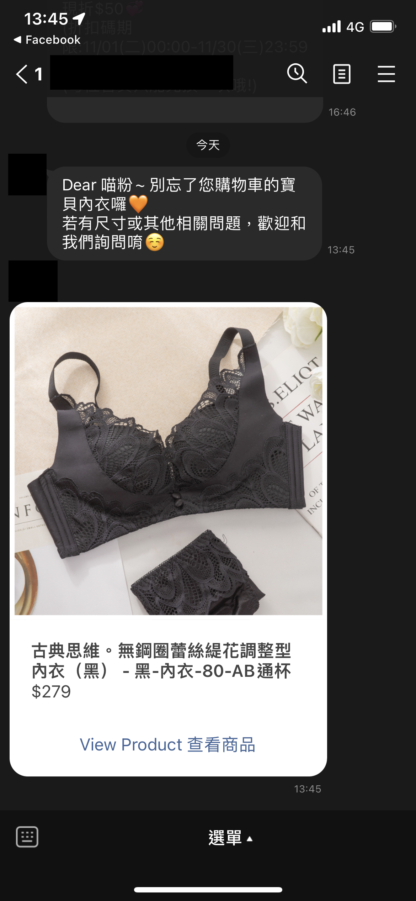
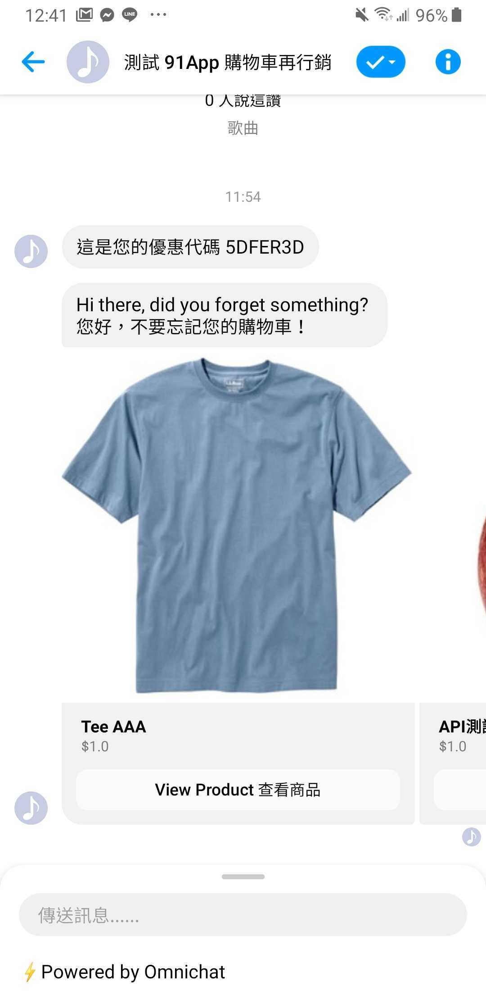
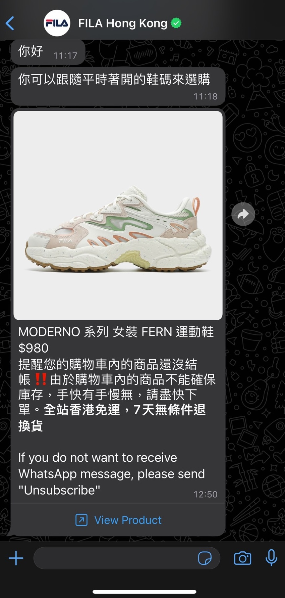

# 購物車訊息發送時機及內容

### 設定 LINE 購物車再行銷訊息發送時機及內容

在 **購物車再行銷設定** 頁面，選擇另一個分頁 **設定購物車行銷訊息**。

<figure><figcaption></figcaption></figure>

請看上圖的綠色標記數字處

1. 開啟 / 關閉某一則購物車再行銷訊息，若關閉了則不會傳送該則訊息
2. 設定客人在將商品加入購物車後多久後發出訊息，可以選擇以日 / 小時 / 分 為單位
3. 設定發送的訊息內容是要使用哪一個機器人模組。\
   按下「編輯模組」，會另開一個分頁進到「自助設計機器人」中的 \
   「Abandoned Cart Messages 購物車再行銷機器人」 的編輯頁面去設定詳細發送訊息的內容

<figure><figcaption></figcaption></figure>


購物車再行銷機器人模組中「文字訊息卡片」、「快速回覆卡片」輸入內容時，內容輸入框的右下方有 \{{...\}} 的按鈕，點擊後選擇【聯絡人名稱】就會在內容中帶入\{{system:customer\_name\}} 參數，請勿調整此參數內容，只需將預發送的內容放置於參數前後即可。


<figure><figcaption>
購物車再行銷機器人模組「文字訊息卡片」、「快速回覆卡片」能夠帶入聯絡人姓名參數
</figcaption></figure>

4. 重啟週期：當最後一則購物車再行銷訊息發送完畢後，如果客人仍未完成結帳，系統將根據設定的時間重啟。重啟後，若客人**再次將商品加入購物車**，則會再次觸發購物車再行銷訊息


重啟完成後，顧客需再次將商品加入購物車，才會再次觸發購物車再行銷訊息


&#x20; 5\. 勿擾模式：可以設定在每天的特定時間，不發送購物車再行銷訊息

ex: 顧客的休息時間（00:00-08:00）設定勿擾模式，可以讓顧客在第一時間就能看見購物車再行銷訊息。


若發送訊息的時間正好重疊到勿擾時間，則此訊息將會延後到勿擾時間結束後發送


&#x20; 6\. 設定完之後記得**按下儲存以更新設定**


Omnichat 支援至多四則購物車再行銷訊息，一般建議依照您的需求可設置 1-2 則進行，請留意，若設定過多的購物車行銷訊息反而會導致轉換率下降



若是設定 Facebook 的購物車再行銷，建議兩則訊息的發算時間都設定在 24 小時之內，以確保在 Facebook 24 小時政策下，顧客能收到購物車再行銷訊息



LINE 與 Facebook 的購物車訊息發送時機與內容設定流程相同，此處以 LINE 的設定為例子做說明


### 設定發送的訊息內容

按下 **發送的機器人模組** 下方的 **編輯模組** 後會開啟一個新的分頁，是機器人模組編輯頁面，在此處你可以客製化購物車再行銷訊息的內容。在初始化購物車再行銷設定之後，Omnichat 會自動幫你新建一預設的 **Abandoned Cart Messages 購物車再行銷** 機器人，在這個機器人中你可以設定你的購物車訊息要發送的內容。

此頁面與一般的機器人設定頁面大致相同，只是多了一種機器人卡片 **未結商品訊息** 此卡片會輪播卡片的形式顯示訪客已經加入購物車但尚未結帳的商品。

未結商品訊息最多只會顯示 10 個商品，若客人有超過十項商品在購物車中，則會顯示最晚加入的 10 個商品。


一個模組裡只能有一個未結商品訊息


## 最後一步，你即將完成購物車再行銷設定

到購物車再行銷設定頁面點選 **啟用**

<figure><figcaption></figcaption></figure>

實際顧客收到的訊息如下圖所示，會包含你所設定的機器人卡片。

<figure><figcaption>
LINE 購物車再行銷訊息
</figcaption></figure>

### 設定 WhatsApp 購物車再行銷訊息發送時機及內容

<figure><figcaption></figcaption></figure>

WhatsApp 的購物車再行銷設定注意事項：


WhatsApp 的未結商品訊息卡片，僅會顯示一張未結商品圖片卡，該圖片會依據顧&#x5BA2;**`最後一項加入購物車`**&#x7684;商品圖片為主。


* WhatsApp 訊息有以下預設的資訊，唯一可以更改的是「自訂訊息」
  * 商品名稱 Product Name
  * 商品價錢 Product Price
  * { 自訂訊息 Custom Message }
  * 取消訂閱方式 Unsubscribe Message
  * 查看產品 View Product
* 模板語言：WhatsApp 可以選擇要送出**英文、繁體中文、簡體中文**的訊息（可自訂選擇其中一種）

<figure><figcaption></figcaption></figure>

<figure><figcaption>
WhatsApp 購物車再行銷訊息
</figcaption></figure>

### 恭喜你完成了購物車再行銷的設定！！接下來就讓我們來看看數據分析的部分


[shu-ju-fen-xi.md](shu-ju-fen-xi.md)

