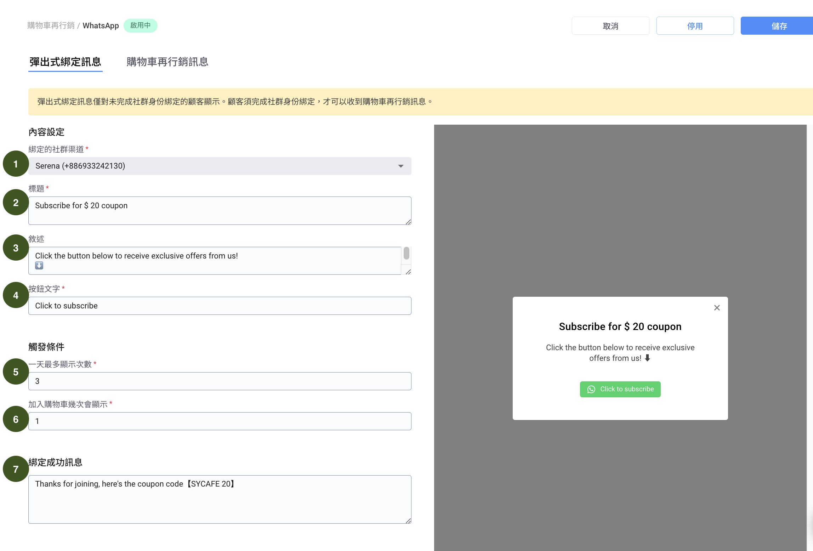

# 設定彈出式綁定訊息

## 為什麼要設定彈出式綁定訊息

Omnichat 是藉由追蹤網頁訪客的購物行為，進而對訪客的 LINE / Facebook  / WhatsApp 發送購物車再行銷訊息。所以 Omnichat 必須要先知道該網頁訪客的 Facebook / LINE / WhatsApp 身份是誰，才有辦法在他將商品加入購物車後，對他發送訊息。藉由此處的 **彈出式綁定訊息**，我們可以將訪客的身份跟 LINE  / Facebook / WhatsApp 的身份做綁&#x5B9A;**。**


彈出式綁定訊息與社群身份綁定按鈕有什麼不同？

兩者的功能類似，但<mark style="color:blue;">**顯示的時機**</mark>以及<mark style="color:blue;">**方式不同**</mark>。**彈出式綁定訊息** 會在 **訪客將商品加入購物車**時，彈出一個視窗詢問訪客是否想要接收到購物車行銷 / 或是收到更多優惠。**社群身份綁定按鈕** 則是可以設定在特定頁面在右下角出現小視窗詢問訪客是否訂閱。



社群身份綁定定義： \
消費者的網站瀏覽身分（cookie）與社群身份（LINE/Facebook/WhatsApp）綁定在一起


## 開啟購物車再行銷設定

我們將一步步開始設定購物車再行銷的功能

左邊側欄 **自動化行銷 -> 購物車再行銷**，會進入 **購物車再行銷總覽頁面**，因為目前尚未有任何數據資料，所以會看到「此平台目前尚未設定」的畫面，點擊藍色按鈕「前往設定」即可開始設定。


此處只是先選擇其中一個通訊渠道 (LINE / Facebook / WhatsApp)，之後若想要使用另一個渠道做購物車再行銷還是可以再作切換。Omnichat 的購物車行銷功能，同時只能啟用一種渠道進行購物車再行銷。


## 設定 LINE 彈出式綁定訊息

<figure><figcaption></figcaption></figure>

在 **購物車再行銷** 頁面，按下 LINE 分頁按鈕，即可進入 LINE 彈出式綁定訊息設定頁面。LINE 的設定頁面與 Facebook 基本相同。

<figure><figcaption></figcaption></figure>

1. **綁定的社群渠道：**&#x6B64;處選擇您將利用官方帳號發出彈出式綁定訊息
2. **標題：**&#x5F48;出式綁定訊息的標題
3. **敘述：**&#x5F48;出式綁定訊息的內文敘述
4. **按鈕文字：**&#x4F60;可以自訂 LINE 按鈕的文字 (Facebook 按鈕文字為 Facebook 本身的限制，所以沒有辦法做更改)
5. **觸發條件 - 一天最多顯示次數：**&#x82E5;訪客直接關閉彈出式綁定訊息，之後再按加入購物車後，還會再一次顯示彈出式綁定訊息，為了防止顯示多次影響訪客的購物體驗，可以設定一天最多出現幾次彈出式綁定訊息
6. **觸發條件 - 加入購物車幾次會顯示：**&#x8A2A;客按多少次加入購物車按鈕後，才第一次顯示彈出式綁定訊息
7. **綁定成功訊息：**&#x8A2A;客按多少次加入購物車按鈕後，才第一次顯示彈出式綁定訊息


此處的 **標題 / 敘述** 建議使用可以吸引訪客點擊的文案，例如優惠碼或促銷活動，以增加訪客的點擊機會，並完成社群身份綁定


## 設定 Facebook 彈出式綁定訊息

<figure><figcaption></figcaption></figure>

在 **購物車再行銷** 頁面，按下 Facebook 分頁按鈕，即可進入 Facebook 彈出式綁定訊息設定頁面。Facebook 的設定頁面與 LINE 基本相同。

1. **連結的粉絲專頁 / 官方帳號：**&#x6B64;處選擇您將利用哪個粉絲專頁 / 官方帳號發送彈出式綁定訊息
2. **標題：**&#x5F48;出式綁定訊息的標題
3. **敘述：**&#x5F48;出式綁定訊息的內文敘述


**按鈕文字：**&#x46;acebook 按鈕文字由於 Meta 官方限制，因此無法進行自訂更改


4. **觸發條件 - 一天最多顯示次數：**&#x82E5;訪客直接關閉彈出式綁定訊息，之後再按加入購物車後，還會再一次顯示彈出式綁定訊息，為了防止顯示多次影響訪客的購物體驗，可以設定一天最多出現幾次彈出式綁定訊息
5. **觸發條件 - 加入購物車幾次會顯示：**&#x8A2A;客按多少次加入購物車按鈕後，才第一次顯示彈出式綁定訊息
6. **綁定成功訊息：**&#x8A2A;客按下「透過 Messenger 接受按鈕」後，要傳送給訪客的綁定成功訊息
7. **儲存：**&#x8A2D;定完後記得按儲存按鈕，以更新設定


此處的 **標題 / 敘述** 建議使用可以吸引訪客點擊的文案，例如優惠碼或是促銷活動，以增加訪客的點擊率


## 設定 WhatsApp 彈出式綁定訊息

在 **購物車再行銷** 頁面，按下 WhatsApp 區塊的 **編輯** 按鈕，即可進入 WhatsApp 彈出式綁定訊息設定頁面。WhatsApp 的彈出式綁定訊息與 LINE / Facebook 基本相同，但設定購物車再行銷的設定有些不同：

<figure><figcaption></figcaption></figure>

1. **綁定的社群渠道：**&#x6B64;處選擇您將利用哪個渠道發送彈出式綁定訊息
2. **標題：**&#x5F48;出式綁定訊息的標題
3. **敘述：**&#x5F48;出式綁定訊息的內文敘述
4. **按鈕文字**：你可以自訂 WhatsApp 按鈕的文字
5. **觸發條件 - 一天最多顯示次數：**&#x82E5;訪客直接關閉彈出式綁定訊息，之後再按加入購物車後，還會再一次顯示彈出式綁定訊息，為了防止顯示多次影響訪客的購物體驗，可以設定一天最多出現幾次彈出式綁定訊息
6. **觸發條件 - 加入購物車幾次會顯示：**&#x8A2A;客按多少次加入購物車按鈕後，才第一次顯示彈出式綁定訊息
7. **綁定成功訊息：**&#x8A2A;客按下按鈕後，要傳送給訪客的綁定成功訊息

### LINE 彈出式綁定訊息顯示時機

若該訪客透過社群訂閱按鈕 / 或是機器人按鈕的方式，已經做了官網身份和 LINE 身份的綁定，LINE 購物車追蹤按鈕 **就不會再顯示了**，因為 Omnichat 已經知道此訪客的 LINE 身份，所以不需要再一次綁定身份。

### Facebook 彈出式綁定訊息顯示時機

與 LINE 不同，若該訪客透過社群訂閱按鈕 / 或是機器人按鈕的方式，已經做了官網身份和 LINE 身份的綁定，Facebook 彈出式綁定訊息 **還是會再顯示**。主要的原因是，Facebook 有 24 小時的政策，若訪客 24 小時內沒有跟你的粉專互動過，則你無法傳送訊息給他。Omnichat 為了確保購物車再行銷訊息能正常發送，所以會顯示彈出式綁定訊息讓訪客去按，按下之後，又會重新開啟 24 小時可以發送訊息的時段。

### LINE 彈出式綁定訊息流程

1. 客人按下 **按鈕**，會出現一個 QRcode 跟六位數號碼。
2. 掃描 QRcode 後 LINE 應用程式會被打開並打開該官方帳號的聊天室，在輸入框會自動出現剛剛的六位數號碼，只要按發送，即可完成綁定

### 何時不會再顯示彈出式綁定訊息

1. 顯示次數已超過一天最多設定的次數
2. 客人已經按下按鈕

## 下一步


[gou-wu-che-xun-xi-fa-song-shi-ji-ji-nei-rong.md](gou-wu-che-xun-xi-fa-song-shi-ji-ji-nei-rong.md)

