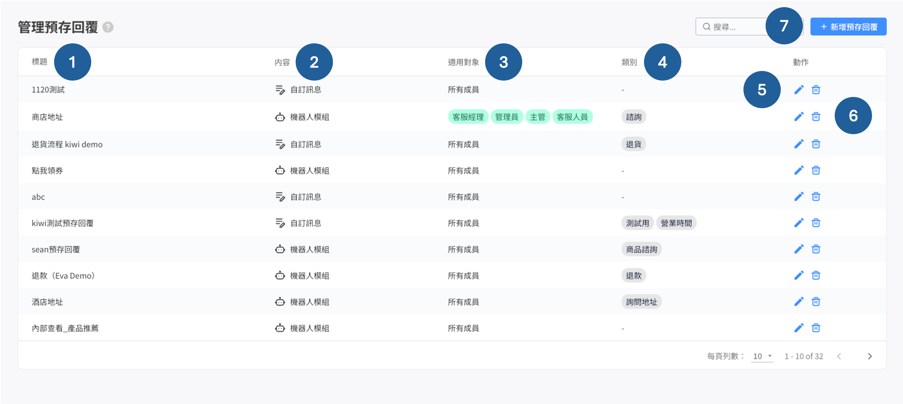

# 管理預存回覆

### 預存回覆列表

1. 預存回覆標題：建立之後可方便搜尋，前台消費者看不到該標題
2.  內容：訊息類型劃分為 自訂訊息、機器人模組兩個部分

    自訂訊息：包含一般文字訊息、圖片、影片、檔案(New)

    1. 所有類型合計上傳最多 5 則
    2. 檔案上傳限制：不限格式，上傳大小限制為 8 MB
    3. 如預存回覆有檔案，僅支援在 Facebook、ＷhatsApp 平台使用 (官方限制)
    4. 上傳的圖片超過 5MB 時，自動壓縮為小於 5MB 的大小上傳圖片

    機器人模組：可選到進階自動化功能 > 自助設計機器人所新增的機器人及模組列表，最多可設定 1 組，但不包含以下的機器人：

    1. 購物車再行銷機器人
    2. 含有「優惠券卡片」的機器人模組
    3. 因為優惠券認列問題，所以專屬於行銷的優惠券，不能直接被當預存回覆發送
    4. 含有「關鍵字自動指派卡片」的機器人模組
3. 適用對象：此指得是 「可以使用」 這則預存回覆的權限角色 ; 而非進到預存管理專區，可 「查看」 該則預存的權限角色（eg. 管理員建立的「適用對象：所有成員」預存回覆，客服權限人員可以在對話事件中 「使用」該則。關於管理預存回覆專區的查閱及編修權限，請參考[此處說明](guan-li-yu-cun-hui-fu.md#bu-tong-jue-se-de-yu-cun-hui-fu-guan-li-quan-xian)。
4. 類別：可以針對預存回覆建立類別，之後根據分類篩選特定的預存回覆
5. 編輯：修改已儲存的預存回覆
6. 刪除：刪除已儲存的預存回覆
7. 建立新的預存回覆


預存回覆以「最後更新時間」為主，也就是最後更新的預存回覆會排在最上方。


### 新增預存回覆教學


預存回覆可支援 1,000 個字元，如內容超過建議拆分為兩個預存回覆。


<figure><figcaption></figcaption></figure>

1. 標題：可以設定好標題，讓之後在對話頁面搜尋時可以用關鍵字進行
2. 可設定 特定分店 / 特定角色 才能使用的預存回覆（分店為使用 OMO 功能客戶才會看到）
3. 標籤可以用在區分預存回覆的種類
   * &#x20;範例 1：退貨 / 換貨 / 一般客服問題
   * 範例 2：可用在有多個 LINE 官方帳號時，要區分不同官方帳號的預存回覆
4. 訊息數：（已經使用的訊息類型數/可以使用的訊息類型數），圖片和文字各算一則，圖片加上文字至多五則
5. 預存回覆可支援 1,000 個字元，如內容超過建議拆分為兩個預存回覆，中文字元算多個字元。


當點擊輸入文字的框框時，在文字輸入框的右下方，點擊 {...} 後點選【聯絡人名稱】可以將聯絡人姓名參數帶入內容中。



OMO 權限角色僅能「新增/編輯」其所屬分店的預存回覆。


<figure><figcaption></figcaption></figure>

&#x20; 6\.   媒體：可直接拖曳檔案上傳，或是點擊「上傳檔案」。**需要將檔案實際拖曳至窗格內**


1. 目前含有影片的預存回覆不適用於 Instagram 對話事件 和 網站對話事件。
2. MOV 影片檔類型無法上傳



媒體格式請參閱：[功能素材尺寸一覽表](https://docs.omnichat.ai/features/gong-neng-su-cai-chi-cun-yi-lan-biao)


###

## **不同角色的預存回覆管理權限**


備註：

1. 權限類型定義：下方表格中所指權限類型，為可以在管理預存回覆專區 「**查看、編輯、刪除**」 該管理預存回覆的權限角色之意。
2. 舉例來說，**管理員**可以 「查看、編輯、刪除」 **全部權限人員**所建立的預存回覆。而**客服經理**則只能 「查看、編輯、刪除」  **自己** 或指定權限為 **客服經理、 客服人員** 所建立的預存回覆。
   * 換句話說，如果今天有一則預存回覆是「管理員」建立的，則「客服經理」無法在管理預存回覆專區「看到」這則預存回覆，更無法編輯預存回覆、或刪除該預存回覆的權限角色。

**`預存回覆包含機器人模組：`**

1. 雖然**客服人員、銷售人員、銷售經理**無法自行設&#x5B9A;**`包含機器人模組`**&#x7684;預存回覆，但在傳送訊息時，**依然可以使用**其他團隊成員所設定且適用對象包含自己的預存回覆。
2. 舉例來說，行銷人員設定：權限類型為「所有成員」的預存回覆，內容類型是機器人模組，**客服人員可以使用此預存回覆。**


| 角色   | 訊息類型      | 權限類型                          | 動作     |
| ---- | --------- | ----------------------------- | ------ |
| 管理員  | 自訂訊息, 機器人 | 全部                            | 編輯, 刪除 |
| 主管   | 自訂訊息, 機器人 | 所有成員、只有自己、指定權限 (排除管理員外的權限皆支援） | 編輯, 刪除 |
| 行銷人員 | 自訂訊息, 機器人 | 所有成員、指定權限 (全部）                | 編輯     |
| 客服經理 | 自訂訊息, 機器人 | 只有自己,、指定權限 (客服經理、 客服人員)       | 編輯, 刪除 |
| 客服人員 | 自訂訊息      | 只有自己                          | 編輯, 刪除 |
| 銷售經理 | 自訂訊息      | 只有自己、指定分店 (綁定的分店)             | 編輯, 刪除 |
| 銷售人員 | 自訂訊息      | 只有自己、指定分店 (綁定的分店)             | 編輯, 刪除 |
