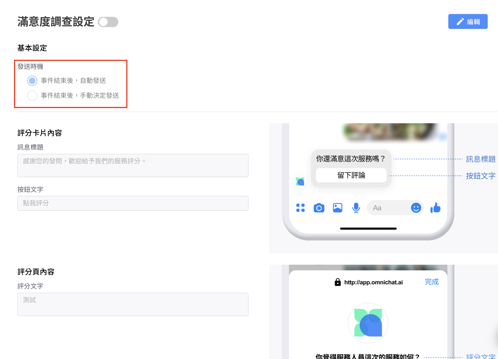

# 滿意度調查設定（加購功能）


1. 此功能適用於所有渠道事件。包含官網插件、Facebook、Instagram、LINE 及 WhatsApp
2. 如有設定官網對話插件的『結束事件自動回覆』功能，請先進行關閉。

&#x20;調整路徑：通訊渠道 >> 網站對話插件 >> [對話插件設定](https://docs.omnichat.ai/features/tong-xun-qu-dao/wang-zhan-dui-hua-cha-jian/webchat-setting)


## 發送時機

1. 事件結束後，自動發送
2. 事件結束後，手動決定發送

<figure><figcaption></figcaption></figure>

<figure><figcaption>
事件結束後，手動決定發送
</figcaption></figure>

#### **滿意度調查（可自訂文字）**

1. 訊息標題
2. 按鈕文字
3. 評分文字

### 步驟一

從 Omnichat 後台的『滿意度調查』→ 『滿意度調查設定』，先將「開啟滿意度調查」調整為開啟狀態，並在訊息標題、按鈕文字及評分文字這三個欄位裡設定文字內容。

### 步驟二：設定完成後按下『儲存』，並開啟開關

<figure><figcaption></figcaption></figure>


此為加購項目，如想了解此項目的收費方式及方案細節，歡迎聯繫 Omnichat

