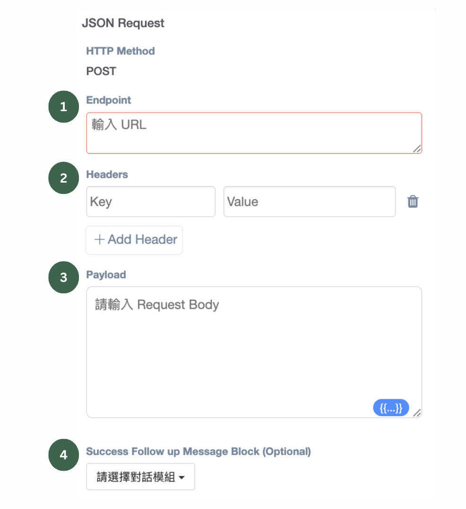
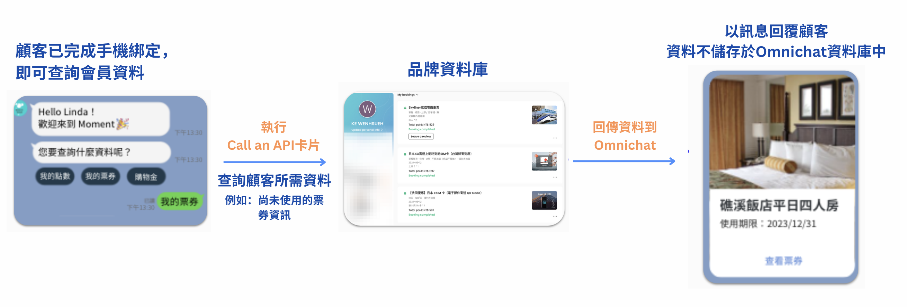
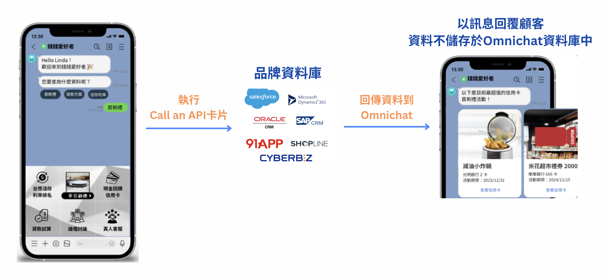
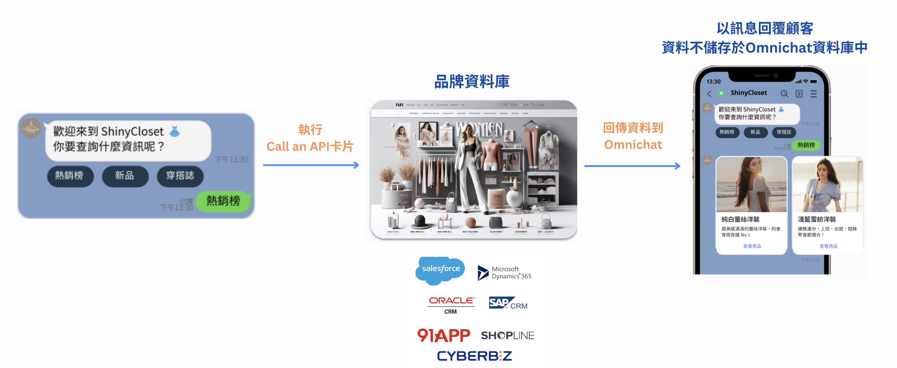
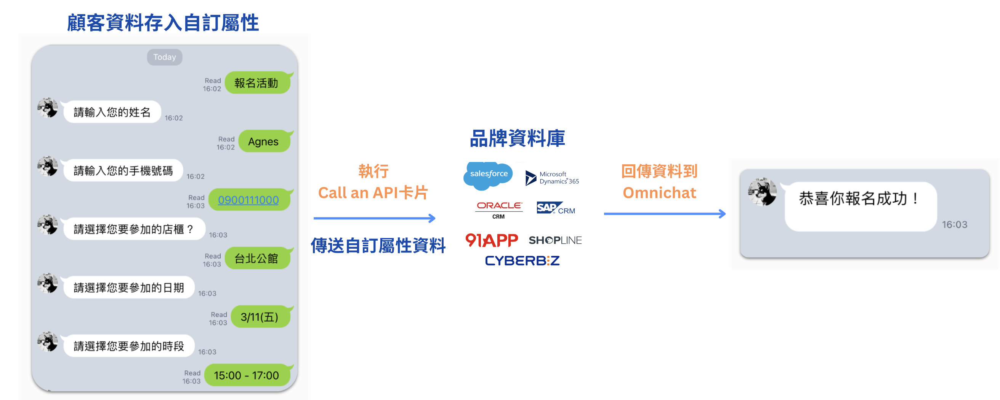

# 機器人Dynamic API（加購功能）

### 卡片介紹

購買 Dynamic API 模組後，您可以在機器人模組中使用 Call an API卡片：

<figure><figcaption></figcaption></figure>

1. Endpoint：品牌的API位址，例如：https://www.example.com/get\_point。
2. Headers：API所需的額外資訊，例如請求的資料格式。
3. Payload：品牌需要查詢的資料，例如會員ID、會員電話號碼或產品/活動資料。
4. Success Follow up Message Block：API 成功傳送資料後，回覆給顧客的對話模組。

### 卡片功能

Call an API卡片可以做到：

✅ **資料查詢**：即時查詢其他資料庫的最新資訊。

✅ **資料傳送**：將顧客輸入的資訊傳送到指定的資料庫中。

資料查詢的功能是根據顧客想要搜尋的資料，透過品牌提供的 API 連接資料庫，將搜尋結果回傳至 Omnichat，Omnichat 再將資料轉換為機器人訊息，發送到顧客的社群渠道。

<figure><figcaption>
利用Call an API卡片查詢資料
</figcaption></figure>


從品牌資料庫回傳的查詢結果，會以訊息的形式呈現給社群渠道好友，但這些資料不會儲存在 Omnichat 的[自訂屬性](https://docs.omnichat.ai/features/she-qun-ke-hu-zi-liao-ping-tai/zi-ding-shu-xing-jia-gou-gong-neng)中。


此外，這張卡片也可以呼叫其他系統執行動作，例如發Email、SMS簡訊、App通知等。

<figure><figcaption>
Call an API卡片也可以呼叫其他系統執行動作
</figcaption></figure>

### 應用情境

#### <mark style="background-color:orange;">資料查詢</mark>

**個人化資訊 - 個人會員資料**

透過已經綁定的顧客資料，可以即時查詢會員資訊，例如個人訂單、出貨進度、兌換券或是旅遊行程等細節。


**情境範例：適用於旅遊產業**

當顧客完成會員身份認證、綁定手機後，即可在 LINE 上查詢會員資料。

顧客點擊「我的票券」，透過Call an API卡片即可查詢未使用的票券資訊。

查詢後，系統會透過預先設定好的 Chatbot 版型自動回覆顧客查詢結果，方便又快速。


<figure><figcaption>
不用客服介入，顧客可立即查詢個人化資料
</figcaption></figure>

#### 非個人化資訊 - 時效資訊

提供的是和個人化無關的即時資料，例如熱銷商品、最新活動或熱門新聞等，不需要先綁定顧客資料，也能直接調用資料給顧客。


**情境範例1：適用於金融媒體**

金融媒體的顧客經常詢問最新的首刷禮活動，由於活動更新頻繁，只要透過 JSON API 卡片，直接從品牌資料庫中獲取最新資料進行回覆，這樣不僅能節省行銷和客服的工作時間，還能確保顧客即時獲取最新資訊。


<figure><figcaption>
顧客與 Chatbot 互動，讓顧客隨時取得最新資訊
</figcaption></figure>


**情境範例2：適用於零售產業**

消費者常會參考熱銷榜來獲取消費靈感，透過 JSON API 卡片，系統能直接從品牌資料庫提取最新資料、自動回覆給顧客，行銷人員不需要手動更新 Chatbot 內容，顧客也能即時收到最新的資訊。


<figure><figcaption>
熱銷產品推薦，不用再手動更新，隨時保持最新資訊
</figcaption></figure>

#### <mark style="background-color:orange;">資料傳送</mark>

當顧客與 Chatbot 互動並輸入資訊（如問卷調查或活動報名）時，可以透過「Call an API」卡片將資料傳送到品牌資料庫，讓系統根據顧客資料即時傳送回應。


**情境範例：適用於顧客填寫問卷、活動資料時使用**

當顧客透過Chatbot提供個人資料（例如姓名、聯絡方式、報名資訊）時，這些資料會儲存在 Omnichat的「自訂屬性」中。

系統會透過 Call an API 卡片，將顧客的自訂屬性資料傳送至品牌的資料庫，資料庫隨後會回傳填寫或報名是否成功的訊息至 Omnichat，最後再以Chatbot訊息通知顧客填寫/報名結果。


<figure><figcaption>
將顧客的個人資料回傳至品牌資料庫
</figcaption></figure>

如果您想要了解更多應用情境，歡迎到[官網首頁](https://www.omnichat.ai/tw/)右下角，點選對話插件詢問Omnichat客服團隊🙌
