# 機器人模組設定

當您選擇使用在單一社群平台的時候，可使用的機器人卡片會有所不同，請見下方連結。

所有平台都有的機器人卡片設計說明可以往下滑獲取說明唷\


[facebook-xian-ding-ji-qi-ren.md](facebook-xian-ding-ji-qi-ren.md)



[line-xian-ding-ji-qi-ren.md](line-xian-ding-ji-qi-ren.md)



[whatsapp-xian-ding-ji-qi-ren.md](whatsapp-xian-ding-ji-qi-ren.md)


## 新增機器人成功後，進入設定機器人，會出現 4 個預設模組

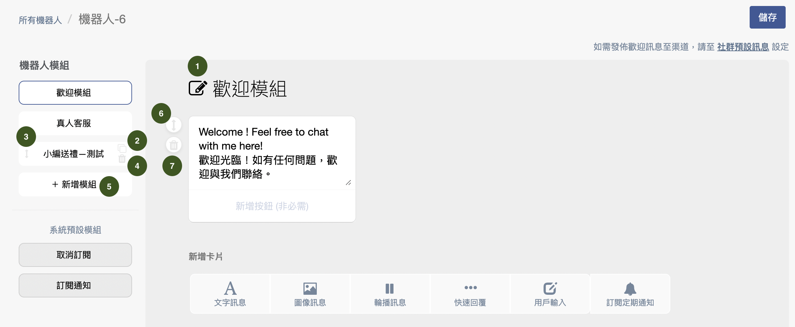

1. 編輯該機器人模組的名稱
2. 可複製已建立的模組
3. 可上下移動已建立好的模組
4. 可刪除已建立好的模組
5. 可再往下新增模組（無上限，但不建議建立過多模組以免找不到）
6. 可移動模組內機器人卡片的順序
7. 可將已建立的機器人卡片刪除

### ㄧ、歡迎模組

這是第一個機器人模組訊息，功能上與其他機器人模組相同。

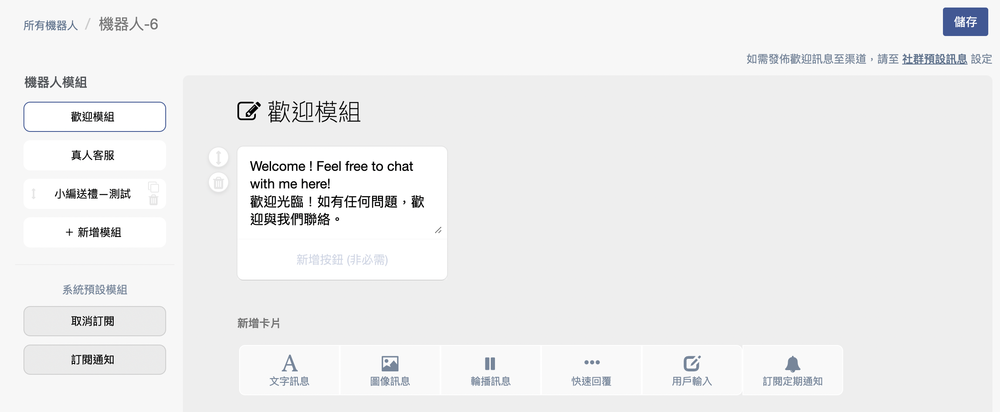

### 二、真人客服

當機器人模組流程來到「 真人客服 」模組時，會變成需要真人跟進的狀態。因為對話事件已經引導到需要真人跟進，該模組無法再新增其他卡片。

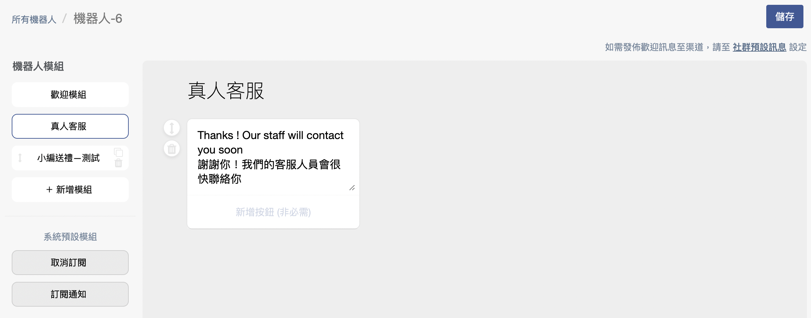

### 三、系統預設模組—『取消訂閱』和『訂閱通知』

當機器人流程中來到『取消訂閱』時，會將該訂閱中的聯絡人狀態更改為『取消訂閱』，反之，如原本已經是取消訂閱的聯絡人，當機器人流程來到『訂閱通知』時，則會將其取消訂閱狀態更改為『訂閱中』。

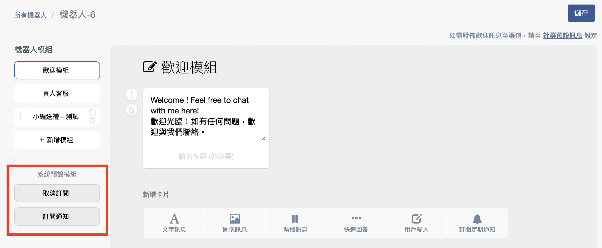

## 自助機器人支援五種不同類型卡片

### 一、文字訊息卡片

全文字訊息，可以支援文字，連結及 Emoji，當在文字下「新增按鈕」，文字訊息便會變成有按鈕的文字按鈕訊息卡片。

若選擇適用於「所有平台」包含Facebook、Instagram、LINE、網站對話插件，以及「僅限於Facebook/Instagram」、「僅限網站對話插件」、「僅限WhatsApp」，文字訊息卡片按鈕至多支援到3個按鈕，若選擇「僅限於LINE」，則無此限制，可新增多於3個按鈕。


### 文字長度：Facebook 最多 640 字元，LINE 建議 2000 字元內


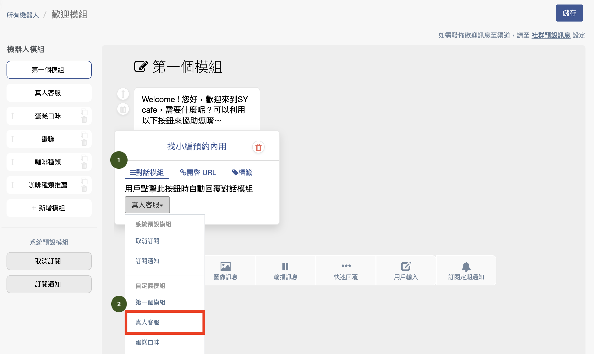

### 「按鈕」支援以下3種特性：

| 對話模組                                | 開啟 URL                                                                  | 標籤                                                    |
| ----------------------------------- | ----------------------------------------------------------------------- | ----------------------------------------------------- |
| 
當客戶按下按鈕時，

會前往左邊對應的對話模組
 | 
當客戶按下按鈕時，

會打開瀏覽器並前往該URL  *無法在 whatsapp 平台上設定按鈕開啟 URL
 | 
當消費者按下按鈕時，

會自動為該名消費者上標籤 （可至多新增 5 個標籤）
 |


1. 對話模組僅能導向同隻機器人的對話模組，無法代入其他隻機器人的對話模組。
2. URL 如果想完成 [**機器人綁定**](../ji-qi-ren-bang-ding-zhan-wai-bang-ding.md)，務必不能使&#x7528;_**短網址**_、_**縮址**_ 和 _**轉址 。**_
3. 按鈕文字數至多為 20 字元
4. 標籤功能目前暫時應用在 Facebook、LINE、Instagram 和 WhatsApp 的聯絡人上，網站機器人暫未支援


#### 機器人URL按鈕貼標籤，在以下情況也能貼標籤到聯絡人

* 按鈕 URL 是短網址
* 按鈕 URL 打開後會立即轉頁
* 按鈕 URL 打開的網站沒有安裝 Omnichat 對話插件
* **註：以上連結會造成無法完成「機器人綁定（站外綁定）」**

### &#x20;二、圖像訊息卡片

支援上傳支援 PNG、JPG 或 JPEG，目前未支援上傳GIF。圖像訊息檔案大小不得超過 10 mb。

.png>)

### 三、輪播訊息卡片（無法在 whatsapp 平台上設定）

可視為文字訊息＋圖像訊息卡片。

<figure>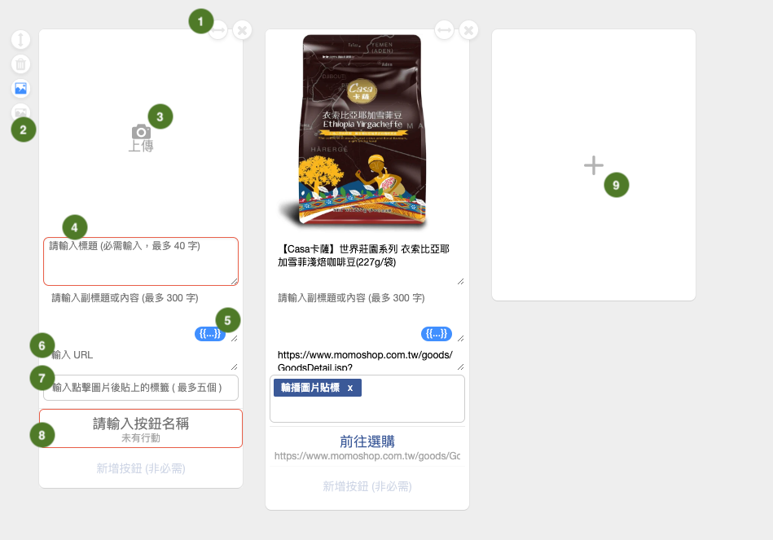<figcaption></figcaption></figure>


請留意，輪播訊息務必完成三項必填設定，才可以完成儲存：圖片、標題文字、第一個按鈕


1. 可以更改左右卡片的順序
2. 可以進行上傳圖片尺寸的調整，支援上傳正方形（1：1）、長方形（詳細尺寸請參考下表）
3. 點擊上傳圖片
4. 可以輸入標題、副標題（若機器人平台是限定網站對話插件，標題字數上限為 80 字元，副標題為 120 字元），其他平台限制請參考下表
5. 點擊後會代入語法，送出後會變成客人的用戶名稱
6. 可以填入 URL，當客人點擊圖片會跳往該網址
7. 當客人點擊圖片後，可以幫客人自動上標（需先填入第 6 點的圖片 URL）
8. 可以新增行動按鈕，最多新增 3 個按鈕（請參考下表），詳情請參考[按鈕特性](./#an-niu-zhi-yuan-yi-xia-3-zhong-te-xing)
9. 可以往右新增輪播卡片，最多新增 10 張

兩個社群渠道的輪播卡片設定差異

| 項目              | Facebook / Instagram        | LINE                        |
| --------------- | --------------------------- | --------------------------- |
| 長方形圖片比例         | 1.91 : 1 (e.g 955\* 500 px) | 1.51 : 1 (e.g 755 x 500 px) |
| 標題長度            | 80 字元                       | 40 字元                       |
| 副標題及內容          | 80 字元                       | 300 字元                      |
| 圖片檔案大小          | 10 mb                       | 10mb                        |
| 每個輪播卡片的按鈕數目必須相同 | N/A                         | Yes                         |


以下兩個狀況可能導致 Facebook 設定的文字在後台無法完整顯示，若想完整查看可進入電腦版 Messager 聊天室頁面中查看：

1. 因不同裝置營幕大小差異，即使設定 80 個字也有可能無法完全顯示
2. 若標題設定較長，也可能會擠壓到副標題的實際顯示長度


輪播卡片 LINE 官方帳號呈現示意圖

<figure>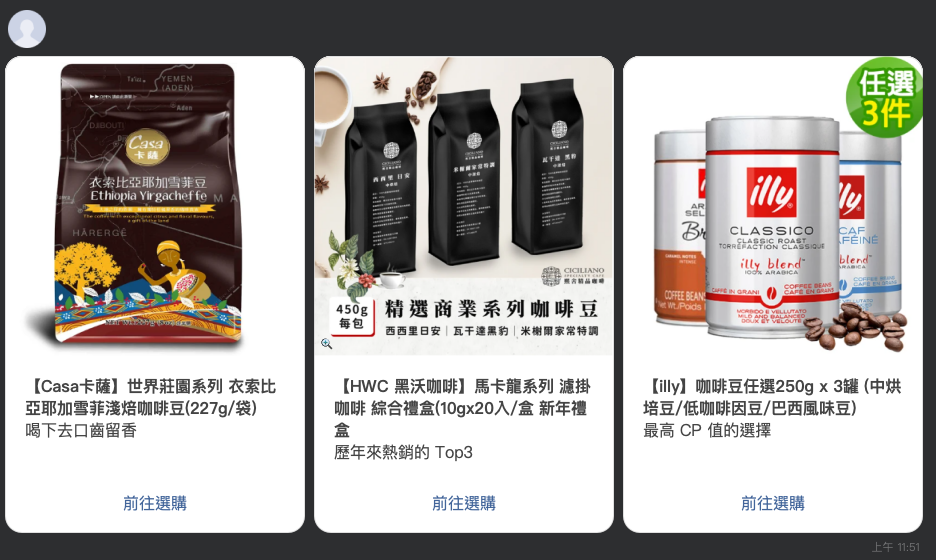<figcaption></figcaption></figure>

### 四、快速回覆卡片（WhatsApp 平台不支援該種類型卡片） 

輸入標題文字，再輸入按鈕名稱。

當消費者按其中按鈕時，前往您指定的對話模組，橫向可增加 10 個按鈕。


1. Instagram 電腦版上不支援快速回覆卡片的選項，因此電腦版不會顯示選項
2. LINE 電腦版現支援顯示快速回覆卡片的選項
3. 該張卡片僅限定放在模組中<mark style="color:red;">**最後一張**</mark>，若排序在其他卡片後面無法正常顯示選項


.png>)

.png>)

### 五、用戶輸入卡片

設定問題讓消費者輸入訊息回覆，消費者輸入訊息回覆後，前往您指定的對話模組。


1. 客人回傳訊息為「**純文字訊息」、「圖片」、「影片」、「貼圖」、「emoji」** 皆能觸發至下一個對話模組
2. 該張卡片僅限定放在模組中<mark style="color:red;">**最後一張**</mark>，若排序在其他卡片後面無法正常顯示選項



若客人超過 1 個小時才進行回覆，會無法正常觸發至下一個對話模組



「快速回覆卡片」 ＆ 「用戶輸入卡片」，不能同時放在同一個對話模組


.png>)

### 六、條件分流卡片（加購項目） 

可依照條件設定(**標籤、會員編號、電話、Email、自訂屬性**)，滿足條件可觸發後續對話模組給消費者。


若要在條件分流卡片裡使用**自訂屬性**作為觸發條件，需另外加購


<figure><figcaption>
舊版自助機器人：條件設定
</figcaption></figure> <figure><figcaption>
自助機器人2.0：條件設定
</figcaption></figure>

條件設定選擇-**「標籤」**&#x7684;設定介面

<figure><figcaption>
舊版自助機器人：標籤條件，選擇(符合任一、符合全部)
</figcaption></figure> <figure><figcaption>
自助機器人2.0：標籤條件，選擇(符合任一、符合全部)
</figcaption></figure>

條件設定選擇-**「會員編號」**&#x7684;設定介面

<figure>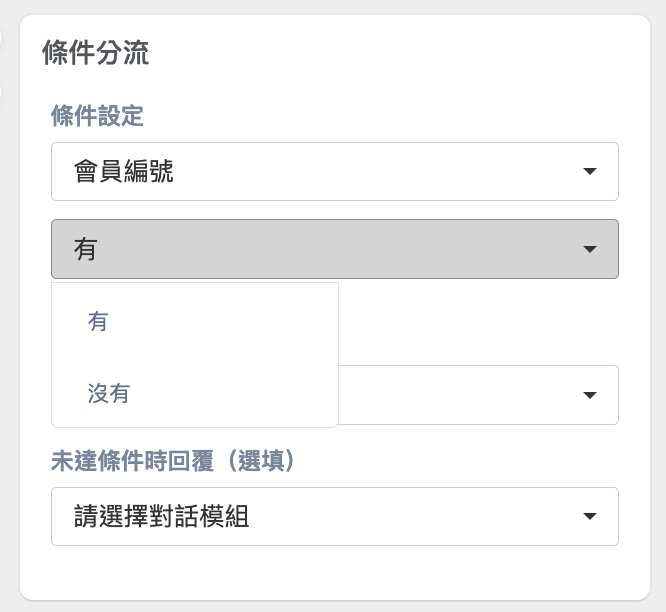<figcaption>
舊版自助機器人：會員編號條件，選擇(有、沒有)
</figcaption></figure> <figure>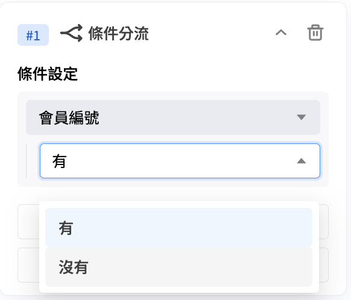<figcaption>
自助機器人2.0：會員編號條件，選擇(有、沒有)
</figcaption></figure>

條件設定選擇-**「電話」**&#x7684;設定介面

<figure>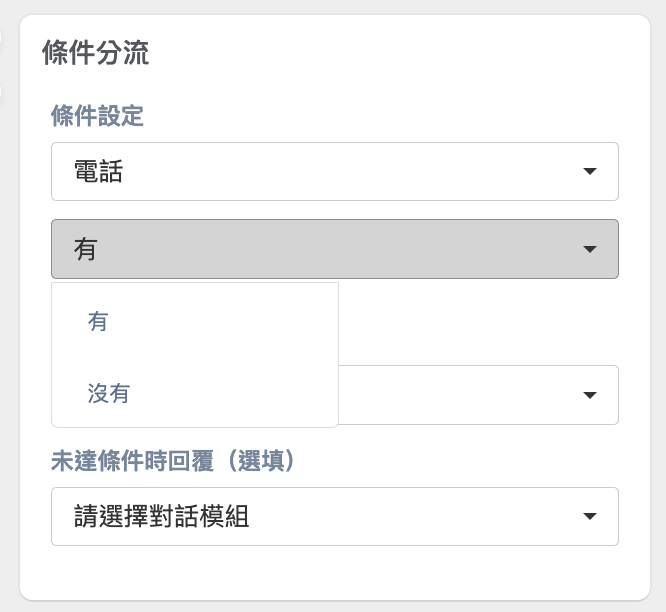<figcaption>
舊版自助機器人：電話條件，選擇(有、沒有)
</figcaption></figure> <figure>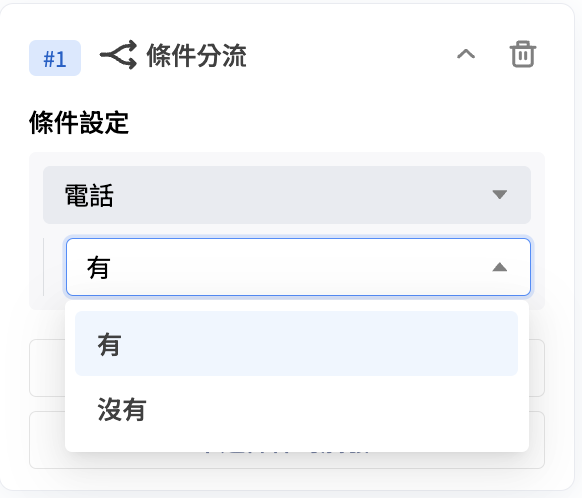<figcaption>
自助機器人2.0：電話條件，選擇(有、沒有）
</figcaption></figure>

條件設定選擇-**「Email」**&#x7684;設定介面

<figure>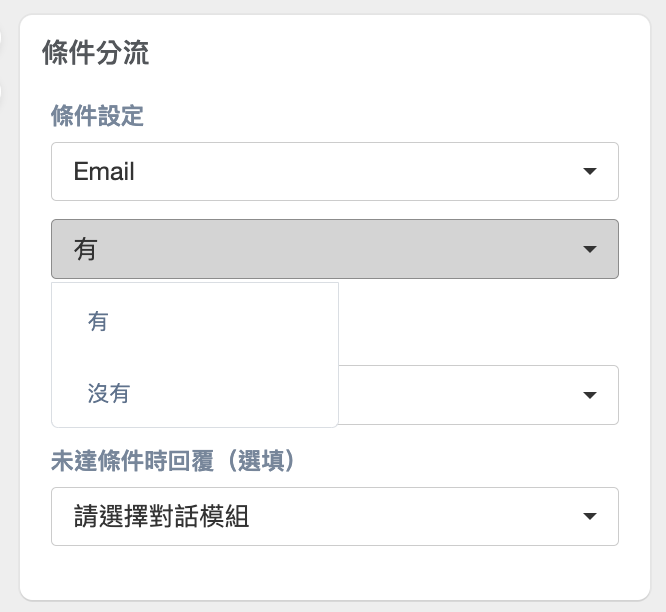<figcaption>
舊版自助機器人：Email條件，選擇(有、沒有)
</figcaption></figure> <figure><figcaption>
自助機器人2.0：Email條件，選擇(有、沒有)
</figcaption></figure>

件設定選擇-**「自訂屬性」**&#x7684;設定介面

<figure><figcaption>
舊版自助機器人：自訂屬性條件下拉選取詳情
</figcaption></figure> <figure><figcaption>
自助機器人2.0：自訂屬性條件下拉選取詳情
</figcaption></figure>

\
條件設定設置好後，可設&#x5B9A;**「滿足條件時觸發」**&#x6216;&#x662F;**「未達條件時觸發」**&#x67D0;對話模組。


自訂屬性只可以設定單一個屬性。\
目前支援所有渠道：網站、Facebook、LINE、Instagram、WhatsApp、WeChat 等使用，但<mark style="color:red;">**尚不支援推播**</mark>\
此「條件分流」卡片功能需額外加購（需購買到進階方案以上，可支援加購)


## 所有的設定變更或是完成後，務必按下右上角的『儲存』。

## 增加聯絡人名稱，當選擇使用平台為單一渠道時

<figure><figcaption></figcaption></figure> <figure><figcaption></figcaption></figure>

當您選擇使用機器人在 Facebook、LINE、Instagram 平台時，可以在機器人卡片上看到藍色插入參數部分，點擊後即可帶入姓名參數。在客人觸發該機器人卡片時，會自動帶入客人社群名稱


Facebook/ Instagram /LINE 機器人卡片:

1. 有按鈕＆無按鈕的文字訊息卡片
2. 用戶輸入卡片
3. 輪播訊息卡片的副標題
4. 快速回覆卡片



WhatsApp&#x20;

1. 有按鈕＆無按鈕的文字訊息卡片
2. 用戶輸入卡片
3. 選項列表卡片中，卡片本身的文字內容以及按鈕中的 Description 欄位


<figure>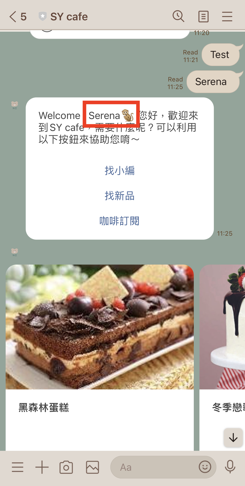<figcaption></figcaption></figure>

#### LINE&#x20;

<figure><figcaption></figcaption></figure>

## 「影片」卡片，當選擇使用平台為單一渠道時 

 

* **目前支援發佈的平台：Facebook、LINE 和 WhatsApp**
* 影片格式只支援 mp4，最大為 10 MB
* LINE 需上傳預覽圖片，長寬需與原生影片相同。若圖片寬於、大於或小於原生影片長寬，則會出現相疊畫面。
* WhatsApp 影像編碼方式只能是 H.264，聲音編碼方式只能是 AAC，支援單聲道或無聲道

.jpg>) 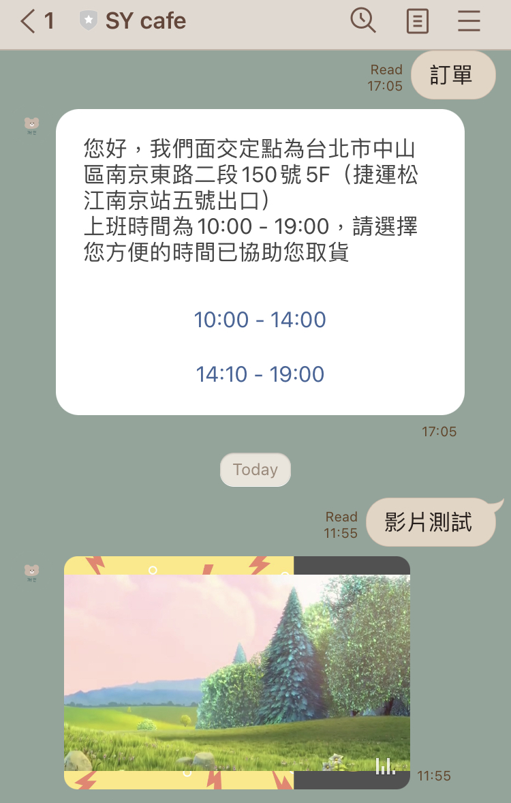 .jpg>)

## 排程回覆卡片，當選擇使用平台為單一渠道時 


1. **目前支援使用的平台：Facebook、LINE、Instagram 和 WhatsApp**
2. 如客人沒有回送訊息時，**在超過 24 小時後**，WhatsApp、Facebook 和 Instagram 延遲回覆卡片無法自動觸發該訊息。


<figure><figcaption></figcaption></figure>

1. 選擇您需要使用的平台機器人後按下「排程回覆」卡片
2. 設定多久時間進行觸發，目前支援「分鐘」計&#x7B97;**（僅支援整數位）**
3. 可設定如果客人過了一定時間後要**自動**觸發的下一個機器人模組
4. 可設定當客人在觸發時間內有進行回覆（包含點擊機器人按鈕或是輸入文字訊息進行互動）時要不要自動觸發下一個機器人模組

