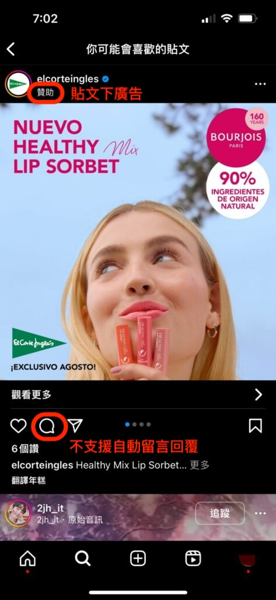

# 常見問題

**Q：**&#x49;nstagram 可以選取排程中的貼文進行設定嗎？

**A：**&#x66AB;時不行，目前是 Instagram 不支援讀取排程的貼文。

\
**Q：**&#x46;acebook / Instagram 有些客人留言會無法出現自動回覆？

**A：** Meta（Facebook / Instagram） 會偵測品牌的留言為機器人自動回覆時，有時會無法出現設定好的自動回覆，此時可以先確認客人是否已經收到私訊（私訊不會被阻擋）。\
另外，Instagram 的隱私權設定高於 Facebook，所以當客人沒有 follow 貴司品牌 Instagram 帳號或是客人端的隱私權有特別設定，也會擋住所設定的自動回覆唷！


Facebook / Instagram 設定多個回覆訊息，系統會隨機選擇其中一個訊息回覆給使用者，避免每次自動回覆的訊息都相同，降低 Facebook/IG 帳號被 Meta 端封鎖的機會。



如果某個特定時段開始留言/私訊都沒有觸發回覆，可能是因為只有設定一組回覆，短時間內回覆過多相同的訊息內容，被Meta誤判為機器人帳號。\
這時可以試試 Facebook / Instagram **設定多個不同版本的回覆訊息**，系統會隨機選擇其中一個訊息回覆給使用者，提高觸發的機率（但很有可能因為帳號正在被Meta監測中，短時間內就算設定多組訊息都還無法觸發任何回覆，請持續觀察一週後是否能正常觸發）。


**Q：**&#x5982;果我們後續將 Instagram 貼文拿來下廣告，請問原本設定的自動留言回覆也會跟進在廣告上嗎？

**A：**&#x76EE;前因 Instagram 官方不支援 IG 廣告跟 IGTV 的貼文，因此自動留言回覆不會跟進在廣告上。也就是說，如果顧客今天是滑到廣告版本得貼文而在底下留言，是不會觸發自動回覆的 ; 但如顧客今天是直接點擊您IG商業檔案，再進到同一篇貼文底下留言，則還是可以觸發自動回覆（因為是一般的貼文形式）。

<figure><figcaption></figcaption></figure> <figure><figcaption></figcaption></figure>


Instagram Live 出現在限時動態部分是會支援的，IG 限時動態（Story）是可以做自動回覆，但這兩個情況無法指定哪一則限時動態。


