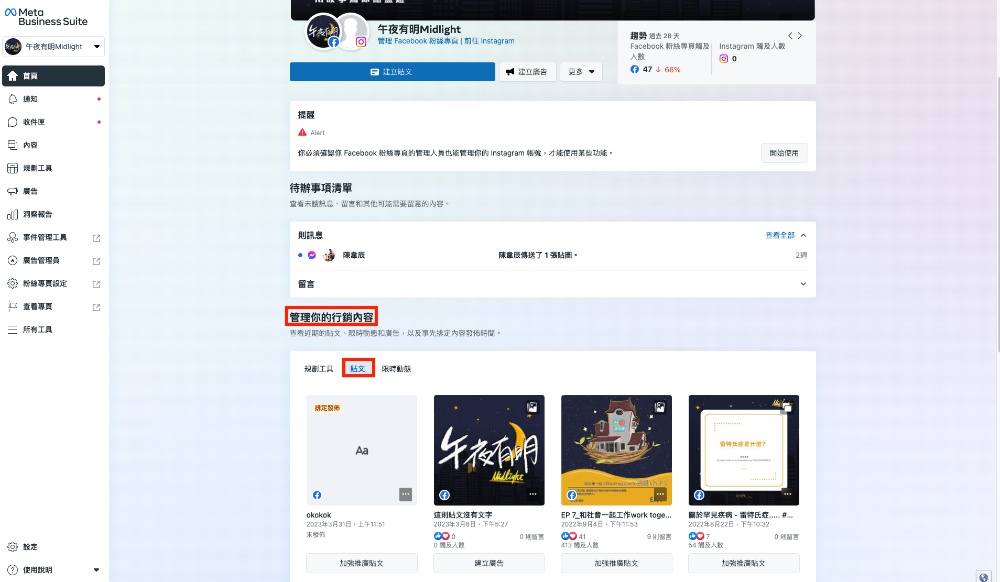
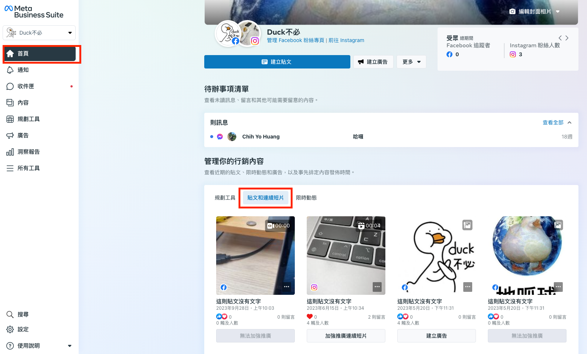
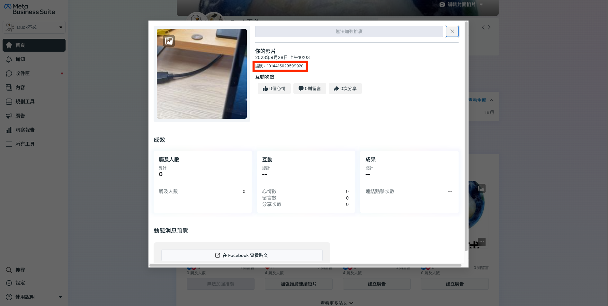

# 如何獲得 Facebook 貼文編號?

## 一般貼文

### 「已發佈貼文」

1. 前往[**Meta Business Suite**](https://business.facebook.com/latest/home?nav_ref=bm_flyout_menu\&entry_exp=jorxqhodyt\&nav_source=flyout_menu\&nav_id=3101504572)

<figure><figcaption></figcaption></figure>

2. 點擊**管理你的行銷內容 > 貼文，**&#x53D6;得貼文 ID

<figure><figcaption></figcaption></figure>

### 「排程貼文」


目前無法取得**排程貼文**的貼文編號。只能等到排程貼文發佈之後，再回到 Meta 後台取得已發佈的貼文編號。可參考「已發佈貼文」取得貼文編號方式


## 影片/直播貼文

如果你想使用 Facebook 貼文回覆在影片/直播貼文，你需要使用以下方法取得正確的貼文編號：

1. 前往[**Meta Business Suite**](https://business.facebook.com/latest/home?nav_ref=bm_flyout_menu\&entry_exp=jorxqhodyt\&nav_source=flyout_menu\&nav_id=3101504572)
2. 貼文和連續短片 > 點擊你的直播貼文

<figure><figcaption></figcaption></figure>

3. 取得貼文編號

<figure><figcaption></figcaption></figure>
