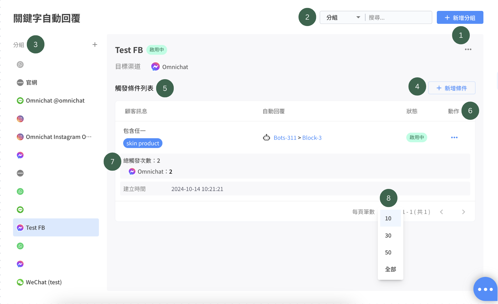
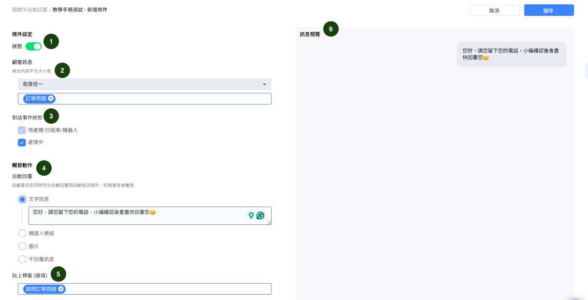
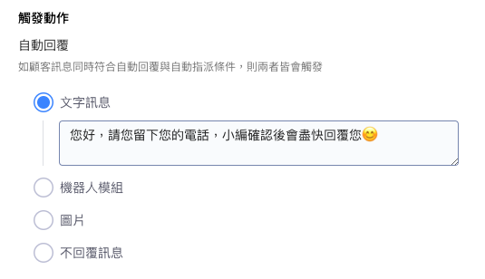
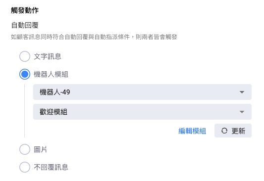
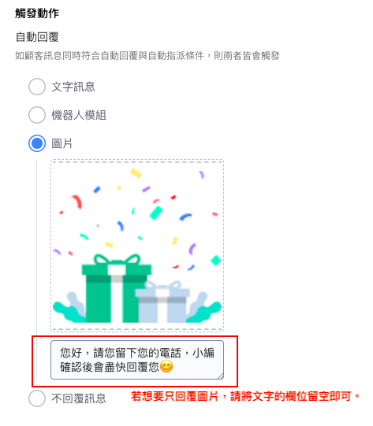
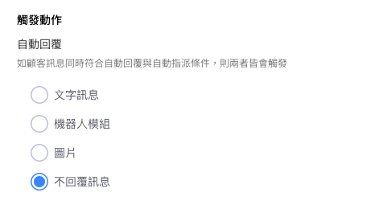
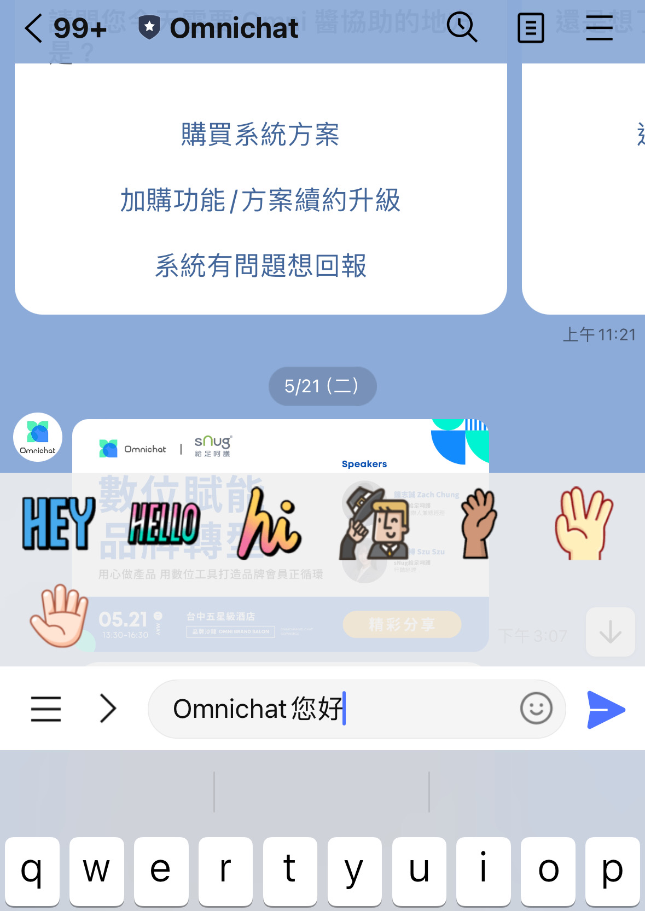
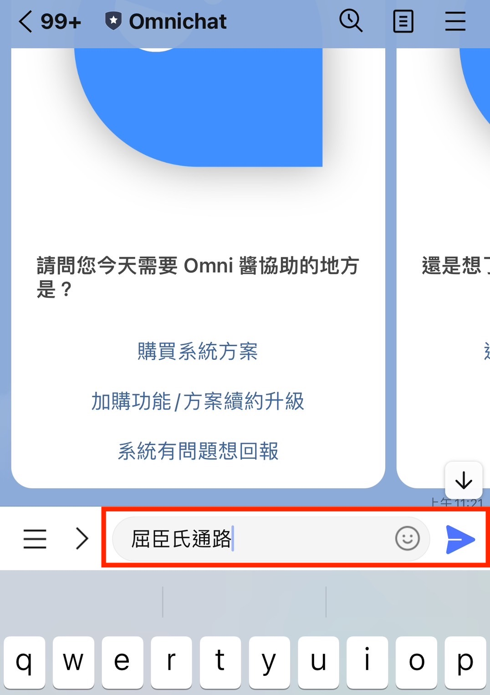

# 關鍵字自動回覆2.0


* 關鍵字自動回覆只有當該對話位於 「待處理」、「機器人」 及 「已結束」 的狀態時才會觸發。
* 「處理中」 的對話我們視為已經由真人接手，除非在設定條件時的『及事件狀態為』有勾選『處理中』，否則不會觸發關鍵字回覆。
* 「關鍵字自動回覆」 如想同時觸發 「關鍵字自動指派」 條件：
  1. 如果自動指派對象是<mark style="color:red;">客服人員</mark>：關鍵字自動回覆+自動指派 都能成功
  2. 如果自動指派對象是<mark style="color:red;">銷售人員</mark>：無法觸發關鍵字自動回覆，只會出現指派成功的綁定訊息！&#x20;



IG 限時動態回覆：當客人回覆品牌限時動態，若訊息內容有符合關鍵字的設定，就會觸發私訊自動回覆。



設定時請留意：英文字母與數字符號的**全形及半形，**&#x5728;系統中均視為不同的字元；大、小寫不區分，均視為相同\
舉例來說：

`情況一：ABC` (半形) ，`ＡＢＣ` (全形) ，兩種為不一樣的關鍵字

情況二：ABC（大寫）、abc（小寫），這兩種為相同的關鍵字

情況三：關鍵字設定為 **`Abc（半形）`**，\
客人打出 **`ABC`** > 這個會觸發關鍵字自動回覆；\
客人打出 **`ＡＢＣ`**（全形）> 不會觸發關鍵字自動回覆


## 顯示列表

<figure><figcaption></figcaption></figure>

1. **+新增分組**：點擊後可以新增關鍵字活動分組。

<figure><figcaption>
點擊 「 +新增分組 」 後的設定畫面
</figcaption></figure>

2. **搜尋功能** ：輸入設定好的 『 分組名稱 』  or  『 關鍵字 』  就可以搜尋出設定。
3. **分組**：建立好的活動分組，會顯示在這個列表上（會顯示渠道）。
4. **新增條件**：針對該活動分組設定自動回覆的條件與內容。
5.  **觸發條件列表**：設定好的觸發條件和內容，會顯示在此列表上。

    * 條件依建立時間排序，如關鍵字相同，則會觸發最新的關鍵字。
    * 若條件為 『 輸入任何內容 』 則會排在最下方。

    \
    **觸發條件列表顯示的內容如下：**


**-顧客訊息**：消費者輸入關鍵字是需要包含的內容。\
-**自動回覆**：消費者所得到的關鍵字自動回覆內容。\
-**狀態**：目前此關鍵字的使用狀態，可分為 『 啟用中 』 或 『 停用中 』。\
-**動作**：點擊 『 ... 』 後可以進行 『 編輯條件』、『啟用條件』、『停用條件』、『刪除條件』、   『產生QR CODE』


<figure><figcaption>
當關鍵字狀態為「啟用中」時，點擊「動作」的畫面
</figcaption></figure> <figure><figcaption>
當關鍵字狀態為「停用中」時，點擊「動作」的畫面
</figcaption></figure>

6. **「動作>... 」** : 點擊後可以進行 『 編輯分組 』、『 複製分組 』、『 統計表 』、『 停用分組 』、『 刪除分組 』：

<figure><figcaption></figcaption></figure>

7.  **觸發次數** :&#x20;

    * 顯示所有渠道的總觸發次數、個別觸發次數
    * 渠道的排序與條件排序相同
    * 如有渠道解除串接，會顯示 「此渠道已被刪除」

8. **觸發條件筆數顯示**：觸發條件以分頁方式顯示，預設顯示 10 筆資料，可選擇顯示 30、50 筆或全部。

## 新增條件的設定畫面 

<figure><figcaption>
點擊 「 新增條件 」 後的設定畫面
</figcaption></figure>

1. **狀態** ：可以『開啟』 或 『關閉』 此關鍵字條件。
2. **顧客訊息**：設定當客戶傳送關鍵字為什麼內容，即可觸發自動回覆。
   1. 關鍵字條件
      * 包含任一
        * 例：
          * 關鍵字： A、 B、 C
          * 收到訊息： 我想買A → 符合條件 ✅
      * 包含全部
        * 例：
          * 關鍵字： 買、 B
          * 收到訊息： 我想買A → 不符合條件 ❌
          * 收到訊息：我想買B→ 符合條件 ✅
      * 內容完全一致
        * 只可以輸入一個關鍵字
        * 例：
          * 關鍵字： 00
          * 收到訊息： 我想買00 → 不符合條件 ❌
          * 收到訊息： 00 → 符合條件 ✅
      * 輸入任何內容
        * 用戶可以輸入任何內容
        * 例：
          * 收到任何文字訊息 → 符合條件 ✅
3. **對話事件狀態**： 主要分為 『 **待處理/已結束/機器人 』** 與  『 **處理中 』** 兩種狀態，預設為 『 **待處理/已結束/機器人』**  狀態，而在此處可決定是否需勾選 『 **處理中 』** 。


若勾選 『 **處理中**』 的事件狀態，則代表當真人客服已經跟進該事件時，設定的關鍵字條件會被觸發，請謹慎評估是否會影響線上客服回覆對話的流程，再進行勾選。


1. &#x20;**觸發動作**：當客戶觸發關鍵字後，將收到什麼回覆內容。\
   可選擇回覆內容類型為：文字訊息、機器人模組、圖片、不回覆訊息。
2. **填上標籤（選填）**：當客戶觸發關鍵字回覆時，即可對客戶貼上次標籤。
3. **訊息預覽**：可以此關鍵字所要設定的自動回覆內容。

## 觸發動作設定畫面

當客戶觸發關鍵字後，將收到什麼回覆內容。

可選擇回覆內容類型為：**文字訊息、機器人模組、圖片、不回覆訊息**。

#### 文字訊息 ：

<figure><figcaption></figcaption></figure>

#### 機器人模組：

<figure><figcaption></figcaption></figure>

#### 圖片：

<figure><figcaption></figcaption></figure>

#### 不回覆訊息：

該動作主要是針對觸發關鍵字活動時可以同步做貼標處理，強調 「貼標籤」 活動

<figure><figcaption></figcaption></figure>

## 統計表

透過統計表能夠查看該分組活動的關鍵字觸發次數。

**步驟一：**&#x9EDE;擊分組動作按鈕的 「 統計表 」&#x20;

<figure><figcaption></figcaption></figure>

**步驟二：**&#x9EDE;擊進入統計表後，就可以查看該關鍵字在不同渠道的觸發次數。

<figure><figcaption></figcaption></figure>

## 關鍵字 QR Code 運用：


請注意！關鍵字 QRCode 僅支援一個關鍵字，如為多個關鍵字無法產生 QRCode。

Instagram不支援使用關鍵字 QRCode 觸發功能（Instagram官方技術不支援第三方廠商運用）。


步驟一：先設計關鍵字條件（需只有包含 「一個 」 關鍵字，才能產生 QRCode)，並且在設定好的關鍵字右側，點擊 「 產生 QR Code 」 。

<figure><figcaption></figcaption></figure>

步驟二：點擊 「 產生QR Code 」後會跳出以下畫面，請接著點擊 「 產生 」 的按鈕。

<figure><figcaption></figcaption></figure>

步驟三：點擊後就會產出該關鍵字的QR Code 或者 Link，產出後點擊 「下載QR Code 」 就能夠使用在行銷活動中。

<figure><figcaption>
可以點擊下載QRCode或複製link來運用在行銷活動上
</figcaption></figure>

步驟四：消費者掃描 QRcode 會在對話輸入框出現設定好的關鍵字詞，當消費者發送關鍵字，就會觸發已經設定好的自動回覆內容。

<figure><figcaption>
消費者掃描後，LINE對話框頁面。
</figcaption></figure>


在FB Message、LINE 關鍵字 QR Code ，若有編輯修改關鍵字或觸發的回應內容後，QR Code 和連結不會變動。


## **QRCode 支援 WhatsApp 原生連結**

* 在 WhatsApp 的關鍵字 QR Code，上方可以選擇原本的固定連結或是 WhatsApp 的原生連結
* _固定連結：_&#x82E5;有修改關鍵字，QR Code 和連結不會跟著變動
* _WhatsApp 原生連結_：若有修改關鍵字， QR Code 和連結會變動，主要提供給 WhatsApp 軟體內 QR Code Scanner 掃描使用

<figure><figcaption></figcaption></figure>

## 活用關鍵字QRCode貼標籤 

#### 情境：針對不同實體通路加入 LINE 官方帳號的消費者貼標籤 

步驟一：先選擇 LINE 官方帳號渠道建立分組，再設計關鍵字條件。可以依據不同的實體通路設計關鍵字，例如針對屈臣氏通路，設計含有屈臣氏相關的關鍵字，針對寶雅通路，設計與寶雅相關的關鍵字，並且設定與不同通路相對應的自動回覆內容。

<figure><figcaption></figcaption></figure>

步驟二：當消費者掃描 QRCode，會進入到 LINE 官方帳號，並且會在對話框中看到設定好的字詞（如以上的範例字詞：屈臣氏通路），當消費者傳送關鍵字後，該名消費者會被貼上標籤。

<figure><figcaption></figcaption></figure>

步驟三：到 「 社群聯絡人2.0 」 LINE 官方帳號列表中，可以看到被貼上標籤的消費者，後續可以篩選出被貼上標籤的聯絡人。

<figure><figcaption></figcaption></figure>

## 關鍵字自動送出功能 

步驟ㄧ：先設定LIFF ID，請參考 [社群身份綁定 - LIFF設定](https://docs.omnichat.ai/features/tong-xun-qu-dao/integrations/line-2.0/she-qun-shen-fen-bang-ding-liff-she-ding)

步驟二：請聯繫您的Omnichat專員，協助開通關鍵字自動送出功能

步驟三：完成

<figure><figcaption></figcaption></figure>

## 其他常見問題

#### 1. 出現錯誤訊息與警示時

* 分組：任一目標渠道被解除串接
* 條件：機器人<mark style="color:red;">**被刪除**</mark> 或 <mark style="color:red;">**內容不符合平台**</mark> 的情況。 \
  e.g. 關鍵字觸發訊息設定為貼圖包，再將 WhatsApp 渠道移除。

<figure><figcaption></figcaption></figure>
