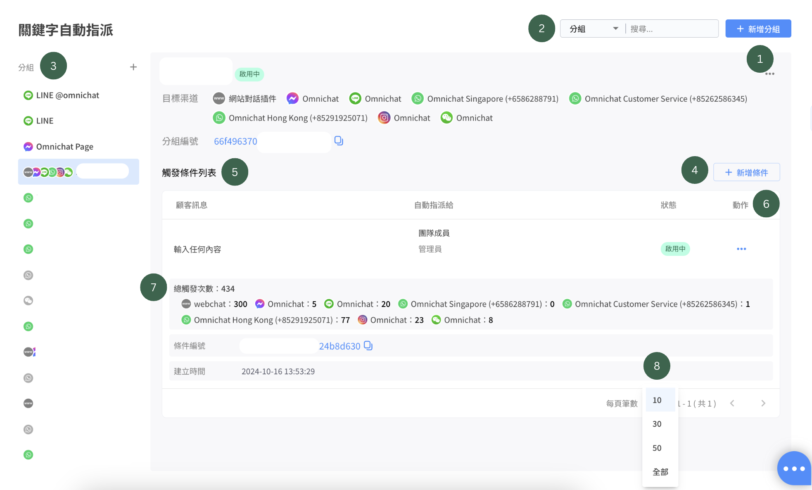

# 關鍵字自動指派2.0


請注意！關鍵字自動指派只有當該對話位於 「待處理」、「機器人」 及 「已結束」 的狀態時才會觸發，「處理中」 的對話我們視為已經由真人接手，所以不會觸發關鍵字自動指派。&#x20;

觸發關鍵自動指派功能時，對話會自動落到指定的團隊成員&#x7684;**「處理中」**&#x5C0D;話列表中。



「關鍵字自動指派」 如想同時觸發 「關鍵字自動回覆」 條件：

1. 如果自動指派對象是<mark style="color:red;">客服人員</mark>：關鍵字自動回覆+自動指派 都能成功
2. 如果自動指派對象是<mark style="color:red;">銷售人員</mark>：無法觸發關鍵字自動回覆，只會出現指派成功的綁定訊息！&#x20;


<figure><figcaption></figcaption></figure>

1. **+新增分組**：點擊後可以新增關鍵字活動分組。

<figure><figcaption></figcaption></figure>

2. **搜尋功能** ：輸入設定好的 『 分組名稱 』 or 『 關鍵字 』 就可以搜尋出設定。
3. **分組**：建立好的活動分組，會顯示在這個列表上（會顯示社群渠道）。
4. **新增條件**：針對該活動分組設定自動回覆的條件與內容。
5. **觸發條件列表**：設定好的觸發條件和內容，會顯示在此列表上。
   * 條件依建立時間排序，如關鍵字相同，則會觸發最新的關鍵字。
   * 若條件為 『 輸入任何內容 』 則會排在最下方。
6. **動作：**&#x9EDE;擊 『 ... 』 後可以進行 『 編輯條件』、『產生QR CODE』、『停用條件』、『刪除條件』
7. **觸發次數** :&#x20;
   * 顯示所有渠道的總觸發次數、個別觸發次數
   * 渠道的排序與條件排序相同
   * 如有渠道解除串接，會顯示 「此渠道已被刪除」
8. **觸發條件筆數顯示**：觸發條件以分頁方式顯示，預設顯示 10 筆資料，可選擇顯示 30、50 筆或全部。

### **觸發條件列表顯示的內容如下：**

1. **顧客訊息**：消費者輸入關鍵字是需要包含的內容。&#x20;
2. **自動指派給**：消費者輸入關鍵字後所特定火指派&#x7684;**「團隊成員」或「指定權限角色」**。&#x20;
3. **狀態**：目前此關鍵字的使用狀態，可分為 『 啟用中 』 或 『 停用中 』。&#x20;

### 新增條件的設定畫面

<figure><figcaption>
點擊 「 新增條件 」 後的設定畫面
</figcaption></figure>

1. **狀態** ：可以『開啟』 或 『關閉』 此關鍵字條件。
2. **顧客訊息**：需要觸發自動指派的關鍵字。
3. **觸發動作**：自動指派條件分&#x70BA;**『團隊成員』**、**『指定客服權限』**、**『指定銷售權限』**。
4. **指派順序**：自動指派順序條件分&#x70BA;**『隨機』**、**『按順序』**。
   1. 『隨機』：隨機指派到其中一位按符合條件的團隊成員，注意有機會分佈不平均。
   2. 『按順序』：新事件會按符合條件的團隊成員的建立時間，順序自動指派。
5. **貼上標籤**（選填）：當消費者輸入文字訊息觸發該關鍵字自動指派時，消費者也同時會被貼上標籤


如果團隊成員將自己的上線狀態改為「**已離線**」，將**不會自動指派**給該位成員



請注意：關鍵字自動指派**不支援以貼圖觸發**


<figure><figcaption>
團隊成員可以在左側選單更改自己的上線狀態
</figcaption></figure>

## 關鍵字條件 

* 包含部分
  * 例：
    * 關鍵字： A、 B、 C
    * 收到訊息： 我想買A → 符合條件 ✅
* 包含所有
  * 例：
    * 關鍵字： 買、 B
    * 收到訊息： 我想買A → 不符合條件 ❌
    * 收到訊息：我想買B→ 符合條件 ✅
* 完全符合
  * 只可以輸入一個關鍵字
  * 例：
    * 關鍵字： 00
    * 收到訊息： 我想買00 → 不符合條件 ❌
    * 收到訊息： 00 → 符合條件 ✅

## 關鍵字 QR Code ＆ URL 運用：


請注意！關鍵字 QRCode 僅支援一個關鍵字，如為多個關鍵字無法產生 QRCode


步驟一：先設計關鍵字條件（需只有包含 「一個 」 關鍵字，才能產生 QRCode)，設定好的關鍵字後於右側，點擊 「 產生 QR Code 」 。

<figure><figcaption></figcaption></figure>

步驟二：點擊 「 產生QR Code 」後會跳出以下畫面，請接著點擊 「 產生 」 的按鈕。

<figure><figcaption></figcaption></figure>

步驟三：點擊後就會產出該關鍵字的QR Code 或者 Link，產出後點擊 「下載QR Code 」 就能夠使用在行銷活動中。

<figure><figcaption></figcaption></figure>

<figure><figcaption>
消費者掃描後，LINE對話框頁面。
</figcaption></figure>


在FB Message、LINE、IG的關鍵字 QR Code ，若有編輯修改關鍵字或觸發的回應內容後，QR Code 和連結不會變動。


### 統計表

透過統計表能夠查看該分組活動的關鍵字觸發次數。

**步驟一：**&#x9EDE;擊分組動作按鈕的 「 統計表 」

<figure><figcaption></figcaption></figure>

**步驟二：**&#x9EDE;擊進入統計表後，就可以查看該關鍵字在不同渠道的觸發次數。

<figure><figcaption></figcaption></figure>
