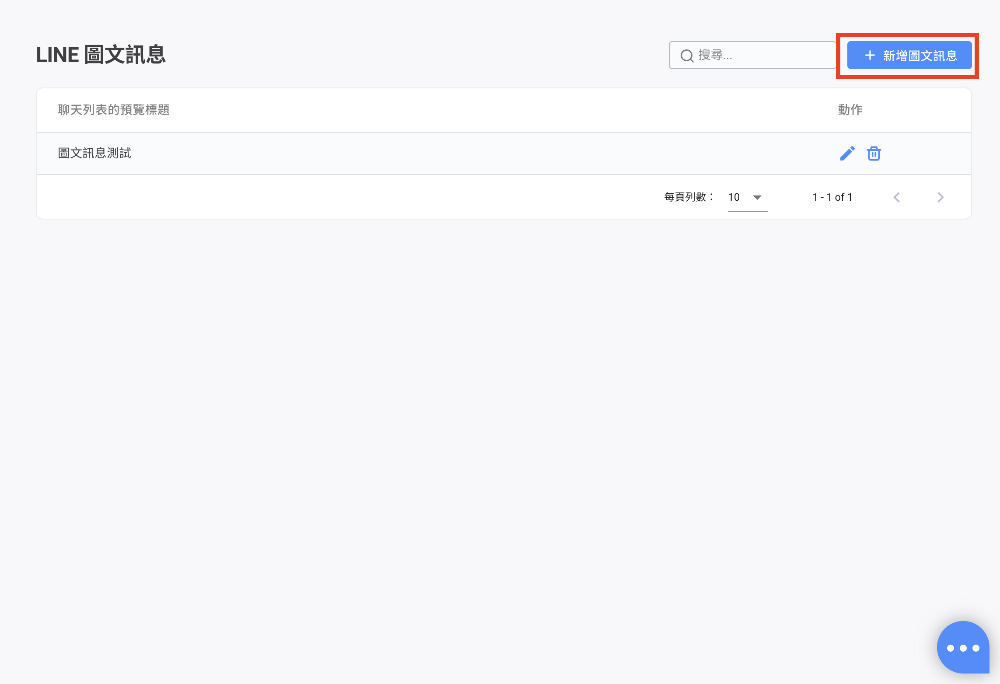
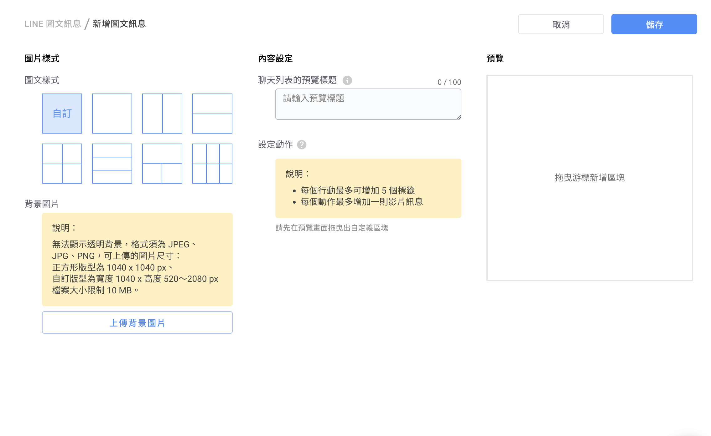
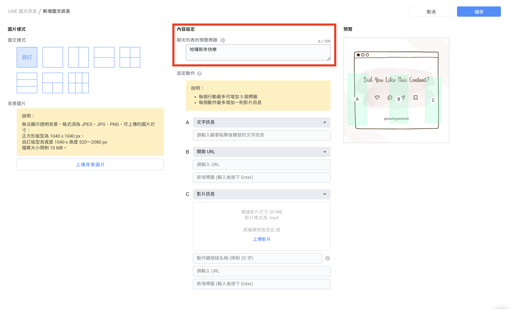
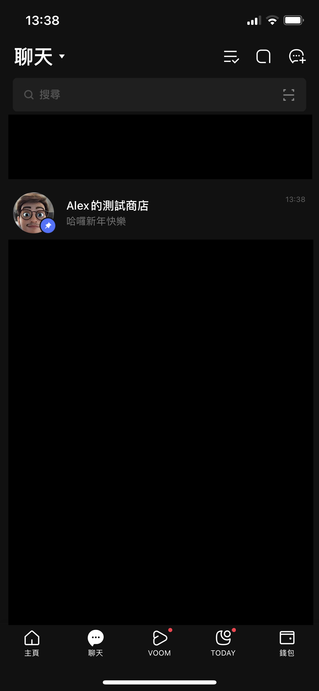

# LINE 圖文訊息


設定完圖文訊息後，請在「 LINE 專用平台機器人」內使用「圖文訊息卡片」\
\
設定步驟可參考：[https://reurl.cc/8q6m9g](https://reurl.cc/8q6m9g)


<figure><figcaption></figcaption></figure>

### **點擊新增圖文訊息後，跟著以下步驟即可設定內容：**

#### 步驟**一**：選擇模板

<figure><figcaption></figcaption></figure>


1. 無法顯示透明背景，格式須為 JPEG、JPG、PNG
2.  可上傳的圖片尺寸：

    正方形版型：1040 x 1040 px

    自訂版型：寬度最寬 1040px；高度最高 3120px

    檔案大小限制 10 MB


#### 步驟二 定義行動：輸入 URL、影片、機器人模組或是文字訊息

若選擇的行動為 URL、影片、機器人模組，可以額外為觸發行動的客人貼上標籤


1. 自動貼標動作若網址為短網址、縮網址、轉網址或網址非帶有 Omnichat 網站插件的網頁時，上述情況**均可做到自動貼標**。
2. **只能有一個行動為影片**，當其中一個動作為影片時，其他行動能選無法擇影片
3. 一則圖文訊息中，機器人模組與影片只能擇一設定，若設定機器人模組，則無法新增影片行動
4. 影片動作可支援：動作鍵顯示文字、連結網址、按下動作後貼上標籤。


1. 文字訊息：設定點擊後送出的訊息內容，可與「[關鍵字自動回覆](keyword-autoreply.md#bu-zhou-si-she-ding-zi-dong-hui-fu-tiao-jian-ji-nei-rong)」搭配使用
2. 開啟 URL：設定 URL 後，客人點擊該動作會引導到站外，**若連結為官網的原網址可完成站外綁定，**&#x8A73;細可參考這裡的[說明](chatbot-builder/ji-qi-ren-bang-ding-zhan-wai-bang-ding.md)
3. 影片
   * 「上傳影片」 按鈕：將影片檔案進行上傳
   * 「動作鍵按鈕名稱」：設定影片按鈕鍵顯示文字
   * 連結網址以及點擊按鈕鍵之後被貼上的標籤，建立標籤時，務必按下「Enter」鍵後，讓原本的文字呈現**藍底白字**，這樣才有成功建立標籤

<figure><figcaption>
影片會顯示在圖文訊息裡，客人點擊後可瀏覽影片
</figcaption></figure>

4. 機器人模組：點擊後會觸發機器人模組
5. 影片檔案大小限制為：200MB、檔案格式必須為：MP4。

#### &#x20;步驟三： 「內容設定」>「聊天列表的預覽標題」

* 用戶可以自訂當客人的 LINE 收到圖文訊息時所顯示的新訊息通知
* 「聊天列表的預覽標題」欄位：字數上限 100 字

<figure><figcaption></figcaption></figure>

#### 步驟四： 按下 「儲存」 按鈕之後，即完成設定！

<figure><figcaption>
客人收到圖文訊息時，聊天列表會出現預覽標題
</figcaption></figure>

###

## 圖文訊息應用-以跳轉機器人模組為例

#### 步驟ㄧ：先建立好不同圖文訊息要使用的空白模組

<figure><figcaption></figcaption></figure>

#### 步驟二：建立好第一層圖文訊息，選擇適合的版型，並在動作選單中使用 「機器人模組」

機器人模組選擇前往對應的空白模組

<figure><figcaption></figcaption></figure>

#### 步驟三：在空白模組中，選擇剛建立好的圖文訊息，並將剩下的圖文訊息設定到對應的模組內

<figure><figcaption></figcaption></figure>

#### 步驟四：當消費者觸發出圖文訊息時，點擊圖片即會觸發相對應的機器人模組內容

<figure><figcaption></figcaption></figure>

