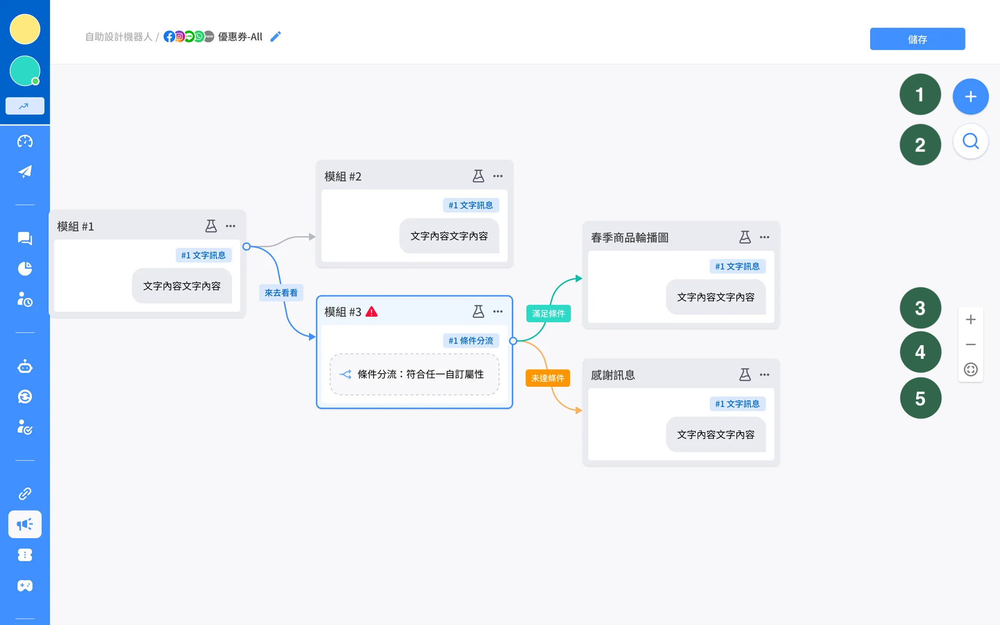
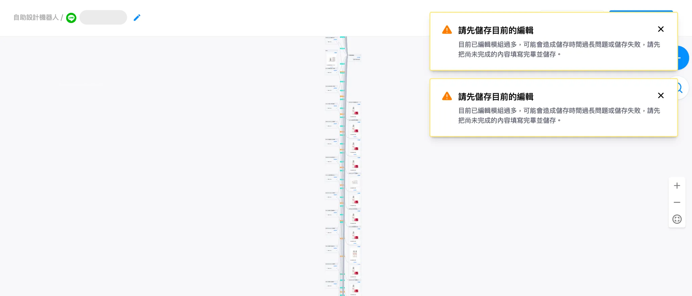

# 編輯頁

### 上方Bar

<figure><figcaption>
上方Bar
</figcaption></figure>

1. 點擊可返回機器人列表
2. 適用平台的icon
3. 這隻機器人的名稱
4. 鉛筆編輯icon
5. 儲存按鈕
   1. 所有關聯圖及模組設定會一起儲存
   2. 有變更後儲存按鈕才可以點選

### 關聯圖

<figure><figcaption>
關聯圖
</figcaption></figure>

新增模組時，預設位置會在可見畫布的正中央，若正中央位置已經有模組 ，會往右下角偏移。

每個模組皆可以拖曳，也會顯示設定好的預覽訊息。

工具列功能：

1. 新增模組
2. 搜尋模組
3. 放大
4. 縮小
5. 流程全貌

### 新增模組

<figure><figcaption>
新增卡片
</figcaption></figure>

1. 新增一般卡片：會顯示此平台支援的卡片清單
2. 新增真人客服卡片：點擊後對話會直接到 「待處理真人客服」。


真人客服模組名稱，不支援更改名稱。

真人客服模組僅有真人客服卡片，不支援新增其他卡片。


<figure><figcaption>
真人客服模組/卡片
</figcaption></figure>

### 編輯模組

<figure><figcaption>
編輯模組
</figcaption></figure>

編輯區塊內容

* 模組名稱：游標移上去會指引可更改模組名稱
* 展開 「更多」：展開/收合所有卡片、複製、刪除、複製模組編號

<figure><figcaption>
展開 「更多」
</figcaption></figure>

卡片設定區塊

* 游標移動到卡片上方，會有小手顯示可拖曳順序
* 右側卡片設定內容：
  * 若游標移到兩個哪片中間，會顯示可新增卡片的圖示，在中間插入新卡片
  * 新卡片設定詳情請見以下各章節詳細說明

<figure><figcaption>
兩張卡片中間可插入新卡片
</figcaption></figure>

### 提示訊息

<figure><figcaption>
提示訊息
</figcaption></figure>

* 當超過 100 個模組未儲存我們會提示通知。
* 若客戶從舊版轉到新版，第一次開啟每個模組都會有新資訊需要去儲存，這時超過 100 個模組，也會提示此訊息。

