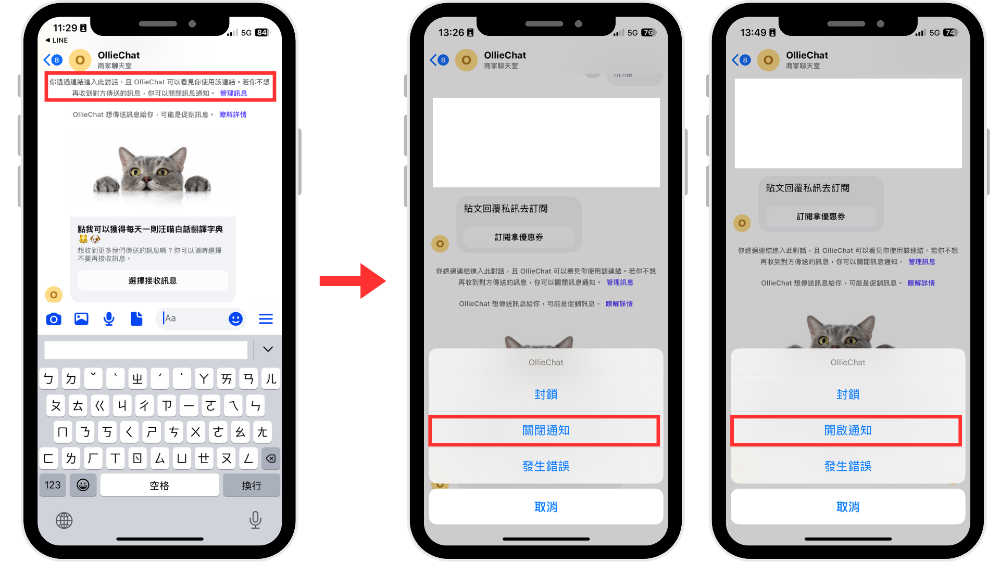

# Facebook 訂閱定期通知（Facebook only）

## Facebook 訂閱定期通知卡片說明 

為什麼會有這個功能？

由於 Facebook 行銷推播內容只限客人跟品牌過去 24 小時內有互動才能成功送出，如過去 24 小時沒有互動過，客人無法從 Facebook 收到品牌的推播訊息。

為了解決此限制，讓客人能訂閱自己想收到的訊息，Facebook 為品牌們提供 Recurring notifications ( 定期通知訊息 )，也就是我們的 **Facebook 訂閱定期通知**。

更多 Facebook 行銷推播限制的詳細說明，可以參考 [此 Facebook 官方文件](https://developers.facebook.com/docs/messenger-platform/send-messages/recurring-notifications/)。

## 新增Facebook 訂閱定期通知卡片

* 若需使用訂閱定期通知卡片，請先重新新增一隻機器人，適用平台選擇 「 **Facebook, Instagram** 」。
* 此卡片僅 Facebook 支援、Instagram 不支援。

<figure><figcaption>
適用平台選擇 「 Facebook, Instagram 」
</figcaption></figure>

## 卡片內容設定

<figure><figcaption>
Facebook 訂閱定期通知卡片內容設定
</figcaption></figure>

1. **上傳圖片（必填）**
   1. 圖片適用格式 .jpg / .jpeg / .png
   2. 圖片顯示尺寸1.92:1，上傳後多餘的部分會自動裁切掉
2. **輸入通知主題（必填）**
   1. 上限 65 個字
   2. 不支援替換參數
3. **點擊 「 接收訊息 」 編輯 4, 5, 6 的按鈕資訊**
4. **按鈕名稱固定為 「 接受訊息 」 四字，無法調整，在聊天視窗顯示時會是 「&#x20;**<mark style="background-color:green;">**選擇接收訊息**</mark>**&#x20;」 六字**
5. **訂閱後回覆（必填）**：點擊 「 接受訊息 」 按鈕後會回覆給客人的機器人模組卡片，不支援任何系統預設模組。
6. **附加動作（非必填）**：為點擊 「 接受訊息 」 按鈕的人貼上所設定的標籤。
7. **卡片預覽**


**注意事項：**

Facebook 訂閱定期通知推播的發送頻率為 「 每日一次（每 24 小時）」，若選擇訂閱，將會持續訂閱，直到客人主動取消為止。


## **活用 Facebook 訂閱定期通知卡片** 

結合 Omnichat 後台相關功能，讓消費者可以看到機器人卡片並按下訂閱。

### **ㄧ、**[**FB Messenger 歡迎模組**](https://docs.omnichat.ai/features/tong-xun-qu-dao/automated-messages/welcome-message)**觸發訂閱定期通知卡片**

設定完 Facebook 訂閱定期通知卡片後，進到 「 通訊渠道 → 社群常用訊息與設定 → Messenger 」 編輯 「 歡迎訊息 」，選擇已設定好的 Facebook 訂閱定期通知卡片。

<figure><figcaption>
FB Messenger 歡迎訊息設定
</figcaption></figure>

<figure><figcaption>
設定 FB Messenger 歡迎訊息觸發訂閱定期通知卡片
</figcaption></figure>

如此一來，消費者按下 「 立即開始 」 按鈕後，可以透過跳出的歡迎模組，來訂閱定期通知訊息，讓客人能訂閱自己想收到的訊息。

<figure><figcaption>
FB Messenger 歡迎訊息觸發訂閱定期通知卡片流程
</figcaption></figure>

### **二、**[**Facebook 主選單（常設功能表）**](https://docs.omnichat.ai/features/tong-xun-qu-dao/automated-messages/chang-she-gong-neng-biao)**觸發訂閱定期通知卡片**

進到 「 通訊渠道 → 社群常用訊息與設定 → Messenger 」 編輯 「 常設功能表 」，點擊新增並輸入按鈕名稱，選擇已設定好的 Facebook 訂閱定期通知卡片。

<figure><figcaption>
FB Messenger 常設功能表設定
</figcaption></figure>

<figure><figcaption></figcaption></figure>

### **三、Facebook 貼文 的 CTA 或 手動輸入 觸發訂閱定期通知卡片**

在 [關鍵字自動回覆](https://docs.omnichat.ai/features/marketing/keyword-autoreply) 先設定關鍵字如：「 我要訂閱 」、「 訂閱 」，然後藉由客戶發送的關鍵字觸發訂閱定期通知卡片。

<figure><figcaption></figcaption></figure>

<figure><figcaption>
CTA 或 手動輸入觸發訂閱定期通知卡片
</figcaption></figure>

### **四、Facebook 貼文留言功能觸發訂閱定期通知卡片**

您可以在 Facebook 粉專上發佈一篇引導客人觸發訂閱定期通知卡片的貼文（如留言拿優惠券、留言拿贈品等等），並使用貼文留言功能給予有完成訂閱的客人回饋。

* 設定完訂閱定期通知的機器人卡片後，多設定一個機器人模組來導向 Facebook 訂閱定期通知卡片。
* **設計導向的對話模組內含有誘因（如訂閱拿優惠券、訂閱拿贈品等等），提高消費者訂閱意願。**
* 將該貼文的 「 回覆設定－私訊回覆 」 設定為剛剛設定好的機器人模組。

<figure><figcaption>
設定貼文留言功能觸發訂閱定期通知卡片
</figcaption></figure>

<figure><figcaption>
貼文留言觸發訂閱定期通知卡片
</figcaption></figure>

## Facebook 「 m.me 連結 」 觸發**訂閱定期通知卡片** 

m.me 連結可以讓使用者 **「 打開粉專 Messenger 」 的同時 「 觸發特定對話模組 」**。讓客人可從外部連結直接導向 Facebook Messenger 的對話模組，也適用於線下活動哦！


關於 Meta 官方說明 m.me 連結設定方式，請參考[此份文件](https://developers.facebook.com/docs/messenger-platform/discovery/m-me-links/?locale=zh_HK)


### 步驟一：設定／組合品牌粉專專屬的 m.me 連結 

依據官方的說明文件表示，m.me 的專屬連結，可以使用 `http://m.me/PAGE-NAME` 此段連結進行設定，其中 **「 PAGE-NAME 」** 為您的 Facebook 粉絲專頁網址後的代碼，取得方式有以下兩種：

1. 搜尋粉專後的網址，以下圖為例，該粉絲專頁的 PAGE-NAME 就是：**「 OllieChat 」**：

<figure><figcaption></figcaption></figure>

2. 或者您也可以到粉絲專頁的設定位置：[https://www.facebook.com/settings/?tab=pages](https://www.facebook.com/settings/?tab=pages)，找到 「 粉絲專頁設定 」、點入 「 姓名 」 欄位，即可看到粉絲專頁的用戶名稱為 「 OllieChat 」

<figure><figcaption></figcaption></figure>

將 `http://m.me/PAGE-NAME` 與 PAGE-NAME 組合後，此粉專的 m.me 連結則為：**http://m.me/OllieChat**

### 步驟二：複製需要導向的機器人模組編號 

進到您想觸發的機器人模組內，點擊要導向的卡片的 「 複製模組編號 」。

如下圖，點擊後會得到這串編號：3b5b5c49-33ca-4b69-a47a-0287515a0de7

<figure><figcaption>
複製機器人模組編號
</figcaption></figure>

### 步驟三：將 m.me 連結 與 機器人模組編號 組合起來 

公式：「 m.me 連結 」＋「 ?ref= 」＋「 機器人模組編號 」 ＝ 完整連結

且中間不可有空白，以上述為例，完整連結為：

<mark style="background-color:green;">http://m.me/OllieChat?ref=3b5b5c49-33ca-4b69-a47a-0287515a0de7</mark>


請注意網址連結請勿使用粗體字體，會影響到連結的跳轉。


### 步驟四：可以將組成好的連結放在 E-mail、EDM、外部網站或是線下活動進行等來做使用 

<figure><figcaption>
活用 m.me 連結
</figcaption></figure>

## **訂閱定期通知卡片**注意事項

#### **1. Facebook 官方有機會會提前發出 「 Continue messages 」 提供給消費者**

#### **2. 客人可以隨時到 Messenger 內點擊 「 管理訊息 」 ，去 「 關閉 」 或 「 開啟 」 訂閱定期通知。**

<figure><figcaption>
客人可以主動 「 關閉 」 或 「 開啟 」 訂閱定期通知
</figcaption></figure>


Facebook 官方於 2022 年推出該功能，關於更詳細的使用相關政策，可參考[此說明網頁](https://developers.facebook.com/docs/messenger-platform/send-messages/recurring-notifications/)


## 對已經點擊接收 Facebook **訂閱定期通知的**客人推播

#### **1. 請留意，雖然可透過訂閱定期通知聯繫消費者，但仍有一定的機會，或其他因素，導致推播訊息時產生失敗的情形。**

#### **舉例來說：若 Facebook 粉絲專頁的互動率（不重複每日活躍用戶）過低時，FB官方針對該情況有相關限制，導致無法成功推播訊息。**

#### **2.** 粉絲專頁可以每24 小時發送一則推播給有訂閱FB定期通知的顧&#x5BA2;**，若您 Facebook 粉絲專頁互動率過低，有機會減少上述所提及的可發送次數。**

#### **3. 推播時，請選擇 「 訂閱 FB 定期通知 」 來篩選是否訂閱的人來做推播。**

<figure><figcaption>
選擇 「 訂閱 FB 定期通知 」 來篩選特定族群做推播
</figcaption></figure>

#### 4. 如您是要對已經訂閱 Facebook 定期通知的客人使用機器人模組來推播，請留意機器人模組內<mark style="background-color:green;">僅能含有一張機器人卡片</mark>。

#### 如您機器人模組內有第二張以上（包含第二張）機器人卡片，文字或是圖片，則會改為一般標準訊息來發送，就會受到 [Facebook 24 政策限制](https://developers.facebook.com/docs/messenger-platform/policy/policy-overview/)
