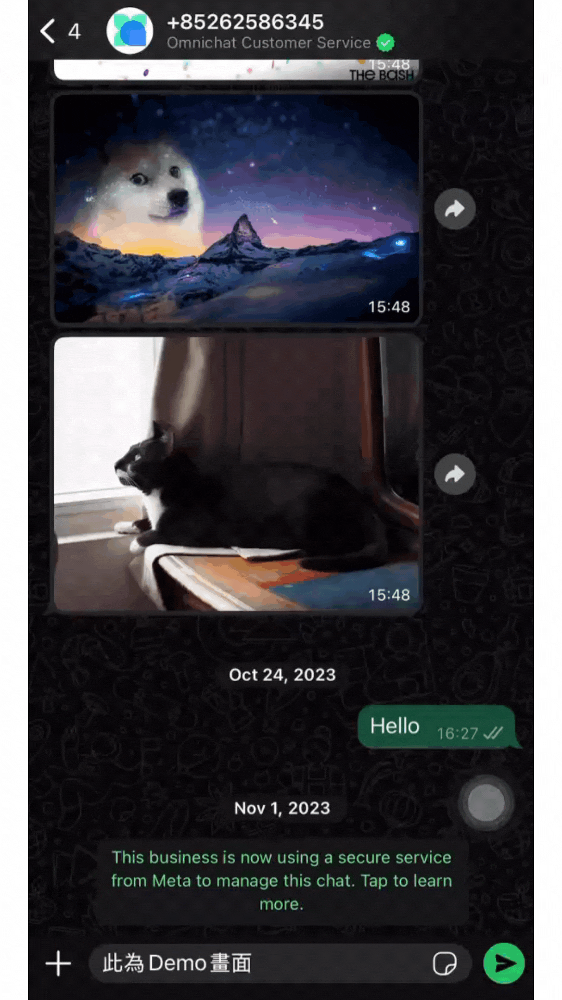
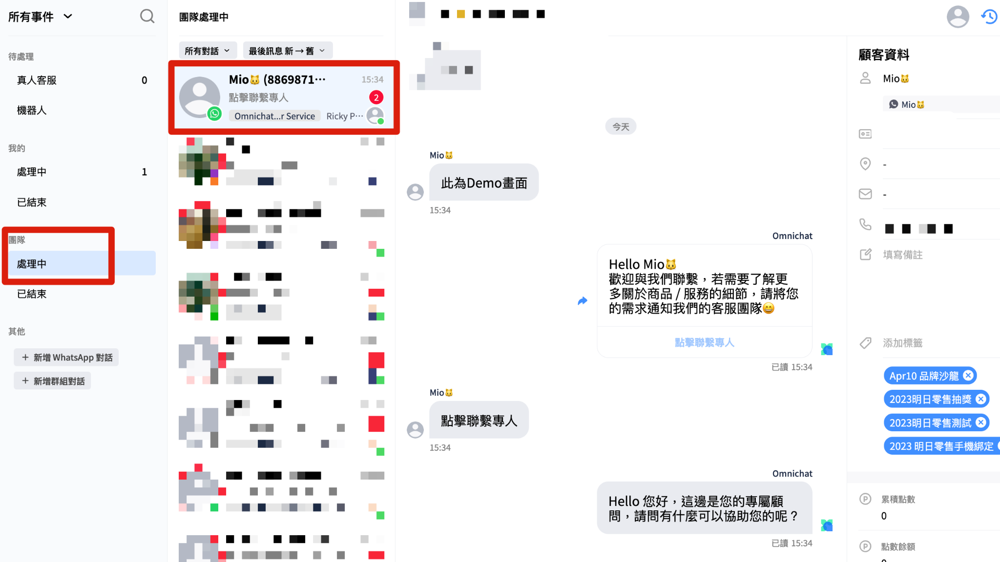

# 關鍵字自動指派（WhatsApp only）


若需要使用該功能，請先洽詢您的 Omnichat 業務 / 專人顧問，我們將協助引導此功能的相關設定


目前該功能僅適用於 WhatsApp 平台中，未來將開放其他社群平台

卡片適用情境：若您希望可以搭配關鍵字自動指派功能，引導您的社群好友在在機器人模組階段時，可透過點選 「機器人按鈕」 的方式，自動將社群好友的對話指派給特定客服人員 / 銷售人員等相關角色，可透過此張卡片實現該情境

以下為設定步驟說明：


注意事項：

1. 開始設定前，請先務必確認您的機器人模組<mark style="color:green;">**適用平台為 「 WhatsApp 」**</mark>，若有包含其他社群平台，此張關鍵字自動指派的卡片則不會顯示。（未來將陸續開放其他社群平台使用）
2. 若需要使用此張卡片，請先至關鍵字自動指派頁面設定好您的分組條件


### 前置作業 請先在關鍵字自動指派頁面完成分組條件設定

若需要查看相關說明，可點選下方頁面參考教學設定


[keyword-auto-assign.md](../keyword-auto-assign.md)


### 步驟 1 新增 WhatsApp 適用平台機器人

在新增 WhatsApp 平台時，介面上會同時呈現可在該平台使用的機器人卡片種類

<figure><figcaption></figcaption></figure>

### 步驟 2 新增關鍵字自動指派卡片

點擊模組中的新增卡片，並選擇 「關鍵字自動指派」 這張卡片

<figure><figcaption></figcaption></figure>

### 步驟 3 選擇您需要觸發的關鍵字自動指派分組與條件

此處會呈現您已經設定好的關鍵字自動指派分組與條件項目，可以點選所需要的內容，或也可以直接點選 「前往新增分組」 ，新增您所需要的條件內容

1. 以下拉式選單呈現目前有的關鍵字自動指派分組
2. 以下拉式選單呈現目前在鎖定的分組當中，存在的關鍵字條件

<figure><figcaption></figcaption></figure>

若依照上述三個步驟設定，這樣就完成了唷！

補充說明，若您不確定需要選擇的關鍵字自動指派的分組 / 條件編號，可以回到關鍵字自動指派頁面查詢，以下圖為例，有一組名為「教學手冊使用」的分組，下方會有該分組的「分組編號」

在此分組當中建立的條件裡，有一組名為 「Omnichat FAQ」 的條件，下方也會有該分組的條件編號

<figure><figcaption></figcaption></figure>

### 模擬使用案例：

若您希望社群好友在點擊特定機器人按鈕時，可以將他的對話自動指派到某位團隊角色身上，那您可以參考以下的做法。

#### 步驟 1 在機器人模組當中選擇新增按鈕

#### 步驟2 在該按鈕當中設定需要觸發動作為觸發回覆模組

#### 步驟3 在回覆模組當中，選擇您設定好的關鍵字自動指派卡片

<figure><figcaption></figcaption></figure>

#### 實際測試畫面：該好友的對話在點擊按鈕後，自動指派給團隊當中的特定角色跟進

<figure><figcaption>
好友前台看到的畫面
</figcaption></figure>

<figure><figcaption>
系統後台畫面
</figcaption></figure>
