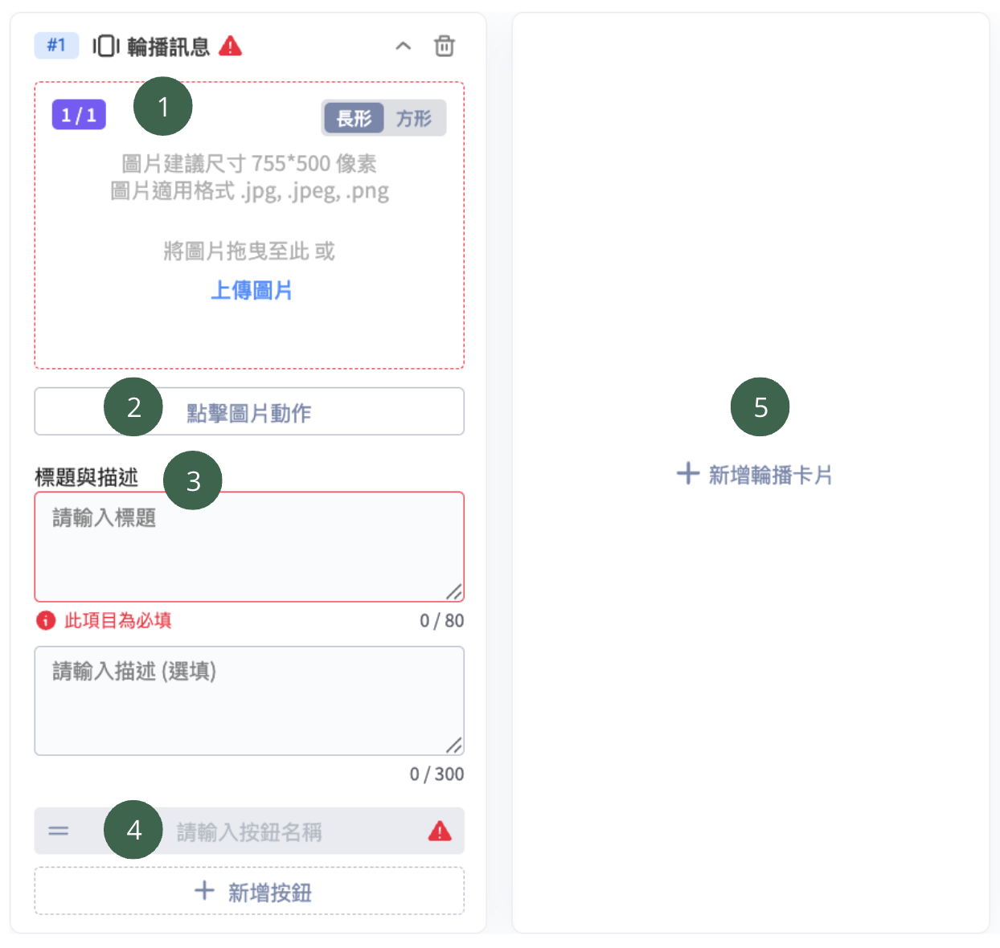
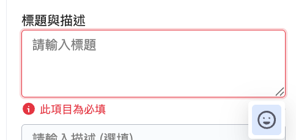
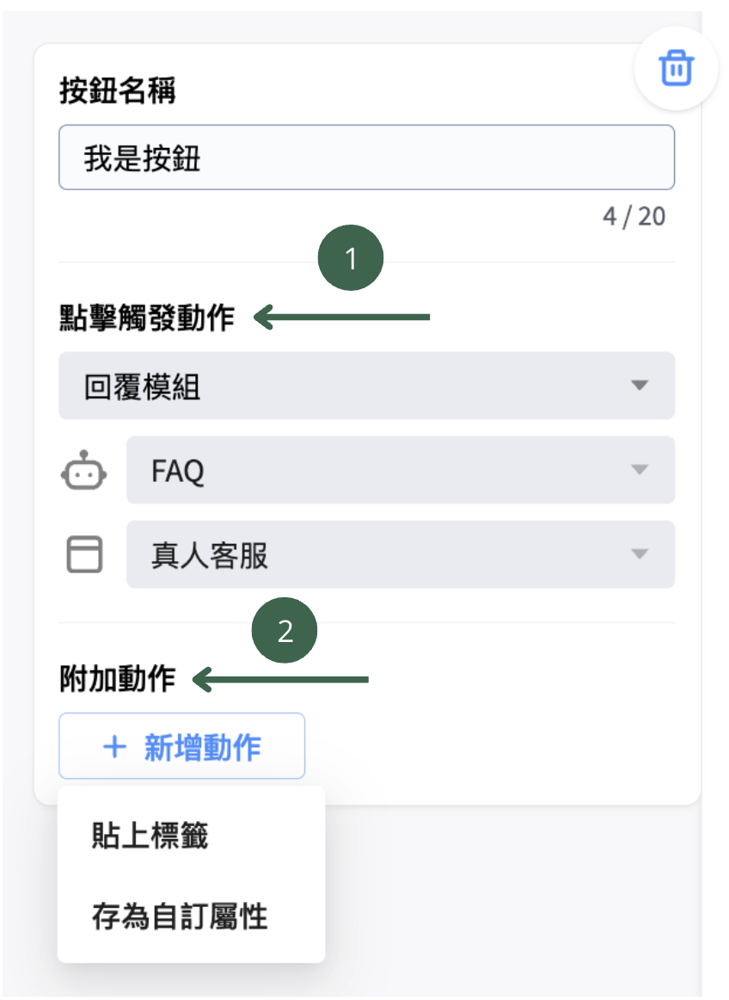
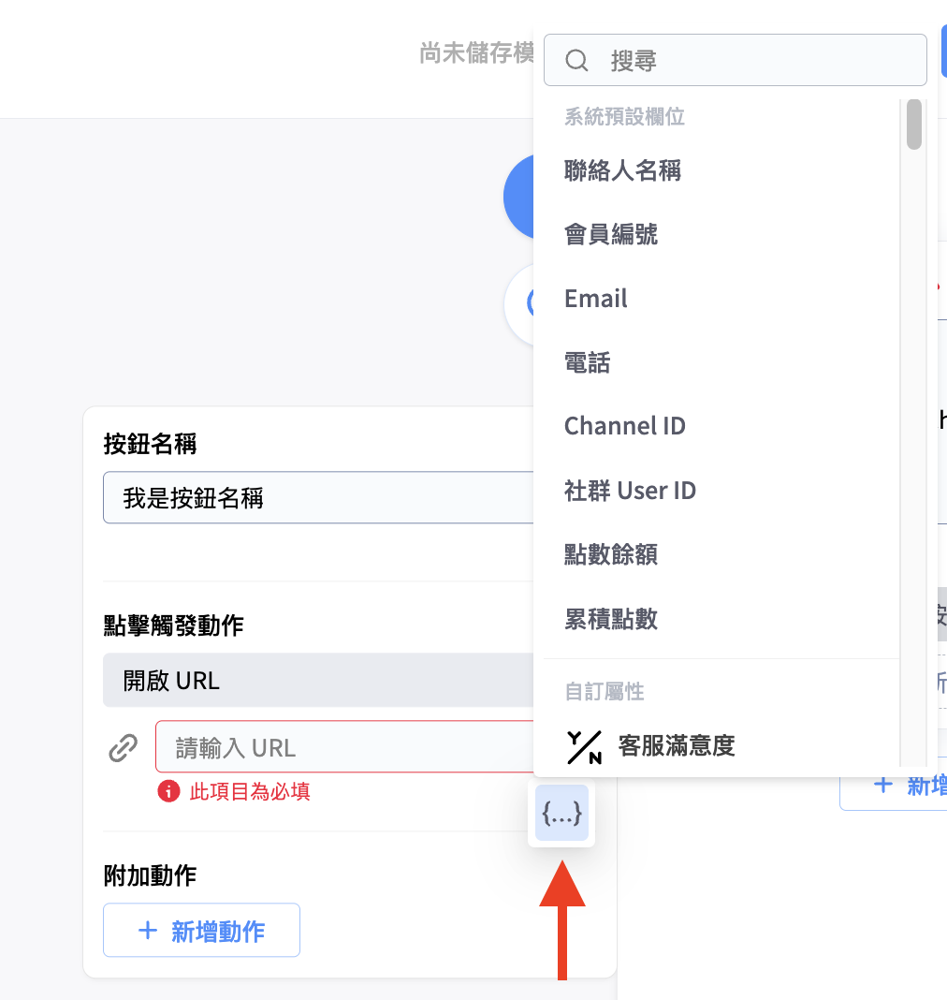
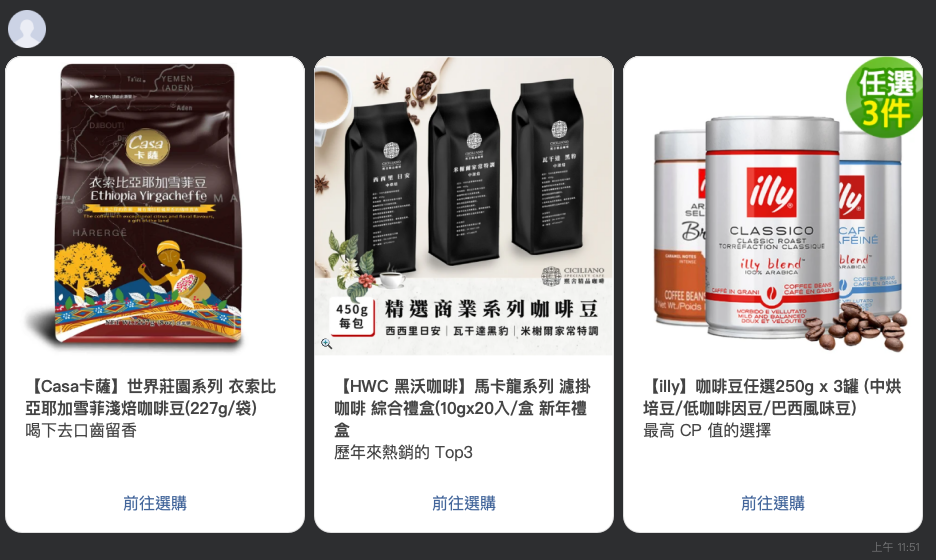

# 輪播訊息

<figure><figcaption>
輪播訊息卡片
</figcaption></figure>

輪播訊息=文字訊息＋圖像訊息卡片，可更改左右卡片的順序，且最多可輪播10張卡片。

輪播訊息卡片包含5個可編輯區塊：

1. [上傳圖片](lun-bo-xun-xi.md#shang-chuan-tu-pian)
2. [點擊圖片動作](lun-bo-xun-xi.md#dian-ji-tu-pian-dong-zuo)
3. [標題與描述](lun-bo-xun-xi.md#biao-ti-yu-xu-shu)
4. [新增按鈕](lun-bo-xun-xi.md#xin-zeng-an-niu)
5. [新增輪播卡片](lun-bo-xun-xi.md#xin-zeng-lun-bo-ka-pian)


請留意，輪播訊息務必完成三項必填設定，才可以完成儲存：上傳圖片、標題文字、第一個按鈕


#### 上傳圖片

圖片適用 .jpg, .jpeg, .png格式，大小為10MB以內。

建議尺寸：

* 長型，支援長方形 1.91 : 1的比例

<table><thead><tr><th width="332.76129150390625">適用平台</th><th width="300.78216552734375">建議尺寸</th></tr></thead><tbody><tr><td>網站對話插件</td><td>圖片建議尺寸 955*500 像素</td></tr><tr><td>Facebook、Instagram</td><td>圖片建議尺寸 955*500 像素</td></tr><tr><td>LINE</td><td>圖片建議尺寸 755*500 像素</td></tr><tr><td>Facebook, Instagram, LINE, 網站對話插件</td><td><ul><li>LINE 圖片建議尺寸 755*500 像素</li><li>其他圖片建議尺寸 955*500 像素</li></ul></td></tr></tbody></table>

* 方型，支援上傳正方形 1：1：建議尺寸 955\*955 像素

#### 點擊圖片動作

此為選填欄位，可設定兩種動作：

1. 點擊後開啟 URL：非必要，可不設定
2. 附加動作：可貼上標籤，但網站對話插件不支援貼標籤

#### 標題與敘述

*   標題：此為必填欄位，各平台最多可輸入80個字（中文字算一個字），右下方有支援Emoji

    
<figure><figcaption>
標題
</figcaption></figure>

* 描述：
  * 此為選填欄位，右下角支援 Emoji。
  * 除網站對話插件外，其他平台皆支援替換參數，但由於多平台包含網站對話插件，因此多平台下亦不支援替換參數。
  * 描述的字數限制如下：

| 適用平台                              | 字數限制（中文字算一個字） |
| --------------------------------- | ------------- |
| 網站對話插件                            | 最多 120 字      |
| Facebook, Instagram               | 最多 80 字       |
| LINE                              | 最多 300 字      |
| Facebook, Instagram, LINE, 網站對話插件 | 最多 80 字       |


以下兩個狀況可能導致 Facebook 設定的文字在後台無法完整顯示，若想完整查看可進入電腦版 Messager 聊天室頁面中查看：

1. 因不同裝置營幕大小差異，即使設定 80 個字也有可能無法完全顯示
2. 若標題設定較長，也可能會擠壓到描述的實際顯示長度


#### 新增按鈕

* 每張卡片至少需有一顆按鈕。
* LINE平台最多可以設置40顆按鈕，且建議每張輪播卡片設置相同數量的按鈕，其他平台最多可設置3顆按鈕。
* 按鈕名稱最多可輸入 20 個字（僅 WhatsApp 的點擊觸發動作設定 「開啟URL」 時，一個中文字會算三個字，其它情況下一個中文字都算一個字），點擊按紐可觸發以下動作：

<figure><figcaption>
點擊按鈕觸發動作
</figcaption></figure>

1. **點擊觸發動作**
   1. **回覆模組：**&#x7576;客人按下按鈕時，會前往對應的對話模組。
   2. **開啟 URL：**
      1. 當客戶按下按鈕時，會打開瀏覽器前往該 URL。
      2. 若要讓客人點選URL的同時，完成[**機器人綁定**](https://docs.omnichat.ai/features/marketing/chatbot-builder/ji-qi-ren-bang-ding-zhan-wai-bang-ding)，URL務必不能使用**短網址、縮址和轉址** 。
      3. 點右下角的icon可替換參數。❗請留意：網站對話插件平台不支援此功能。

<figure><figcaption>
右下角支援替換參數，惟網站對話插件平台不支援此功能
</figcaption></figure>


**向LINE 好友分享機器人訊息：**

您現在可以使用 **Chatbot 2.0** 設定動作，讓顧客能將聊天機器人的訊息分享給他們的 LINE 好友。此功能**僅支援 LINE 平台**，且**僅適用於 Chatbot 2.0**

1. **支援卡片與按鈕類型**\
   以下卡片按鈕可以支援設定此點擊觸發動作「分享給 LINE 好友」 
   * 文字訊息 (包含真人客服卡片)
     * 一般按鈕
   * 輪播訊息
     * 點擊圖片動作
     * 一般按鈕
   * 圖片輪播訊息
     * 點擊圖片動作
     * 一般按鈕
2. **限制**
   1. 以下是可以被分享出去的卡片類型：
      * 文字訊息
      * 圖像訊息
      * 輪播訊息
      * 圖片輪播訊息
      * 圖文訊息
      * 影片
   2. 被分享出去的卡片中，卡片按鈕限制如下：
      * 僅允許使用 「URL 類型」 的按鈕動作，例如：
        * 開啟網址
        * 分享給 LINE 好友
      * 若使用其他類型的動作，將會出現錯誤。
      * 若該區塊包含 LINE 圖文選單，則**不能**使用透明背景。


2. **附加動作（選填項目）**
   1. **貼上標籤：**&#x7576;客人按下按鈕時，會自動為該名客人貼上標籤。
   2. **存為自訂屬性（加購功能）：**
      1. 當客人按下按鈕時，會自動為該名客人貼上自訂屬性，作為會員資料平台的顧客資料。
      2. 使用此功能前，需先至自訂屬性頁面新增屬性資料，教學請見[這裡](https://docs.omnichat.ai/features/she-qun-ke-hu-zi-liao-ping-tai/zi-ding-shu-xing-jia-gou-gong-neng)。

**輪播卡片示範**

<figure><figcaption>
輪播卡片實際呈現的樣子
</figcaption></figure>

#### 新增輪播卡片

往右滑可新增輪播卡片，最多可新增至10張卡片。

<figure><figcaption></figcaption></figure>

#### 調整輪播卡片順序

1. 點右側的編輯模組區塊右側邊，並往左拖曳，即可將編輯模組的區塊放大。
2. 點擊要調整順序的卡片，並往想要的方向拖曳，即可調整卡片的順序。

<figure><figcaption></figcaption></figure>
