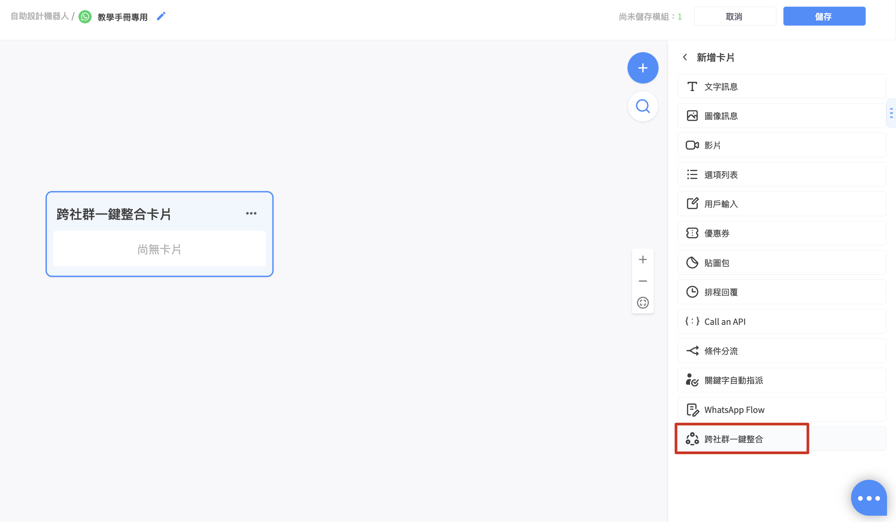
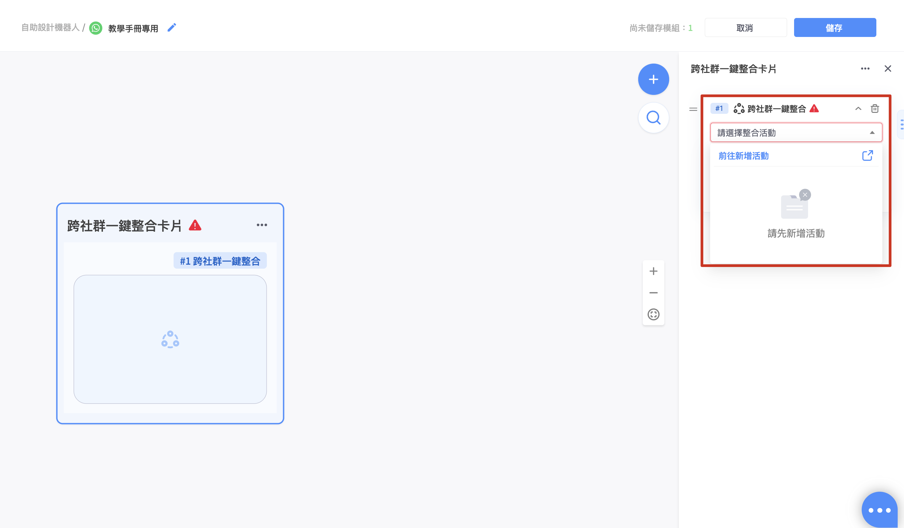
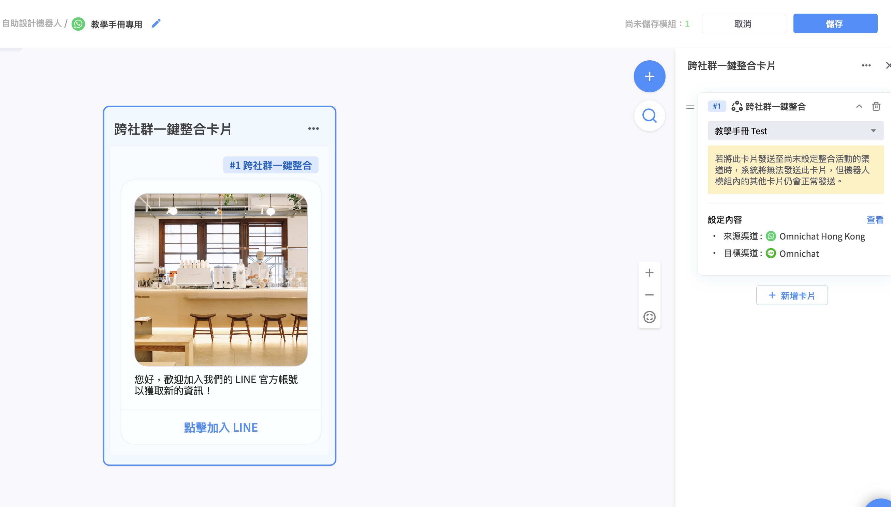

# OmniLink 卡片（加購功能）


若需要使用該功能，請先洽詢您的 Omnichat 業務 / 專人顧問進行加購


此張卡片是為搭配 Social CDP 方案當中的 「跨社群整合 / Omnilink」 功能，若需要設定相關活動細節，您可以參考下方頁面進行更多設定


[kua-she-qun-yi-jian-zheng-he-omnilink-jia-gou-gong-neng](../../she-qun-bang-ding-guan-li/kua-she-qun-yi-jian-zheng-he-omnilink-jia-gou-gong-neng/)


以下為設定步驟說明！

### 步驟 1 在機器人模組頁當中點選 OmniLink 卡片

<figure><figcaption></figcaption></figure>

### 步驟 2 選擇需要對應的整合活動

若先前沒有在 OmniLink 活動頁面建立過相關活動，建議您可先前往新增，後續再來此處進行設定

詳細的設定細節說明，請參考以下頁面


[kua-she-qun-yi-jian-zheng-he-omnilink-jia-gou-gong-neng](../../she-qun-bang-ding-guan-li/kua-she-qun-yi-jian-zheng-he-omnilink-jia-gou-gong-neng/)


<figure><figcaption></figcaption></figure>

若完成相關設定，就會像下圖的設定畫面呈現了唷！在模組當中也會出現在活動設定頁面當中所設定的圖片與文字標題

<figure><figcaption></figcaption></figure>
