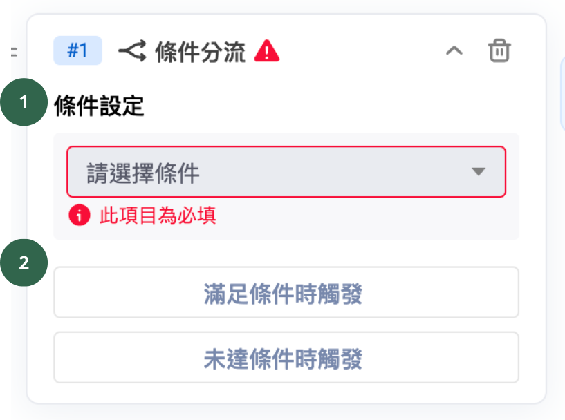

# 條件分流（加購功能）

## 條件分流卡片設定

可依照各種條件設定，滿足條件後觸發後續對話模組給消費者。

<figure><figcaption></figcaption></figure>

1.  **條件設定（必填）**

    條件設定選擇如下：

    1. **標籤**
    2. **會員編號**
    3. **電話**
    4. **Email**
    5. **累積點數**（僅 FB / IG、LINE、WhatsApp 等購物車再行銷平台支援；網站、多平台不支援）
    6. **點數餘額**（僅 FB / IG、LINE、WhatsApp 等購物車再行銷平台支援；網站、多平台不支援）
    7. **自訂屬性**
    8. **手機綁定**（僅 LINE 平台支援；多平台不支援）
    9. **91APP 會員綁定**（僅 LINE 平台支援；多平台不支援）：需要 「 通訊渠道 → 網站對話插件 → 開店平台選擇 「 91APP 平台 」 才會顯示。
2. **滿足條件時觸發 ＆ 未達條件時觸發（選填）：**&#x6EFF;足／未達條件時，回覆給顧客的對話模組。


1) 自訂屬性只可以設定單一個屬性
2) **目前支援所有渠道：**&#x7DB2;站對話插件、Facebook、LINE、Instagram、WhatsApp、WeChat，但**不支援推播**
3) 此 「 條件分流 」 卡片功能需額外加購（需購買到進階方案以上，方可支援加購）

