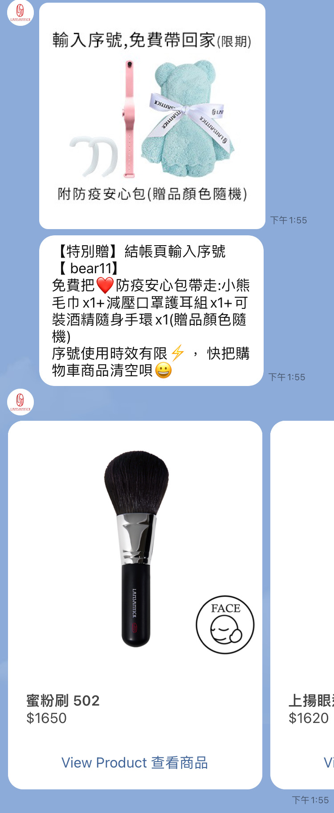

# 未結商品訊息卡片


此張卡片未來即將上線，敬請期待


此卡片僅支援在購物車再行銷功能發送時使用，會針對**已完成社群身份綁定**的社群好友加入購物車但未結帳行為，在此位好友的社群平台中發送商品訊息卡片


此張卡片會以 「產品目錄」 上傳的資料為主呈現在卡片內容當中，因此在使用前請先完成產品目錄的上傳！若您尚未完成，可以參考[此連結](../../she-ding/shang-chuan-chan-pin-mu-lu-product-feed.md)進行相關設定步驟。


以下為設定步驟說明：

### 步驟 1 在機器人頁面當中，點選未結商品訊息卡片

### 步驟 2 可自訂按鈕名稱（選填）

在此部分由於資料是以開店平台的產品目錄 / 您自行上傳的產品目錄資料為主，因此關於卡片當中顯示的產品名稱與產品價格，資料格式會以產品目錄資料為準唷！不需額外設定


按鈕部分僅支援設定一組，若社群好友有同時間將多組產品加入購物車未結帳，則系統會發出對應數量的未結商品訊息卡片，按鈕名稱則都會顯示相同的文案


### 實際發出卡片的案例

#### 以 LINE 平台為例

<figure><figcaption></figcaption></figure>

#### 以 WhatsApp 平台為例

### 補充說明

若您需要參考更多關於未結商品訊息卡片的活用，可以參考 Omnichat Blog 當中的購物車再行銷案例專區，歡迎點[此連結](https://blog.omnichat.ai/tw/?tag=success-cases-tw\&category_name=cart-remarketing-zh-tw)查看

