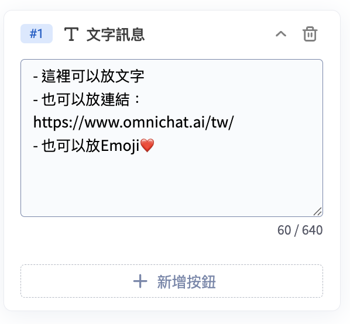
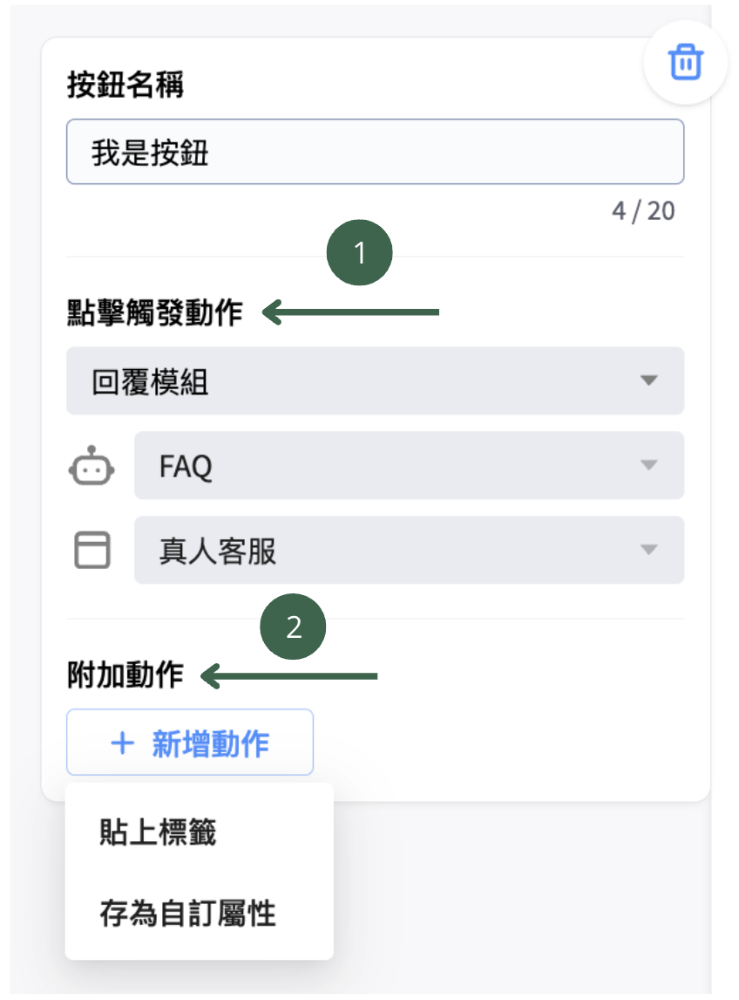

# 文字訊息

文字訊息卡片可用於傳遞訊息、按鈕引導客人進入下一步、跳轉網址，或幫客人貼上標籤。

這張卡片是由[文字](wen-zi-xun-xi.md#wen-zi)以及[按鈕](wen-zi-xun-xi.md#an-niu)所組成的。

文字欄位支援文字、連結、Emoji，也可以添加按鈕，引導客人進入下一步、跳轉至指定網址，或在點擊按鈕時自動貼上標籤。

<figure><figcaption>
文字卡片
</figcaption></figure>

### 文字

各平台的文字字數有以下限制：

| 適用平台                           | 字數限制      |
| ------------------------------ | --------- |
| 網站對話插件、Facebook、Instagram、LINE | 最多 640 字  |
| 網站對話插件                         | 最多 640 字  |
| Facebook、Instagram             | 最多 640 字  |
| LINE                           | 最多 2000 字 |
| WhatsApp                       | 最多 4096 字 |
| 購物車再行銷                         | 最多 160 字  |

### 按鈕

若在文字訊息下新增按鈕，訊息會變成有按鈕的文字按鈕訊息卡片。


<mark style="color:red;">**按鈕文字：**</mark>按鈕文字數至多為 20 字元。（僅 WhatsApp 的點擊觸發動作設定 「開啟URL」 時，一個中文字會算三個字，其它情況下一個中文字都算一個字）

**各平台的**<mark style="color:red;">**按鈕數量**</mark>**有以下限制：**


<table><thead><tr><th width="361.8211669921875">適用平台</th><th width="369.3385009765625">按鈕數量限制</th></tr></thead><tbody><tr><td>Facebook, Instagram, LINE, 網站對話插件</td><td>3顆</td></tr><tr><td>網站對話插件</td><td>3顆</td></tr><tr><td>Facebook、Instagram</td><td>3顆</td></tr><tr><td>LINE</td><td>40顆</td></tr><tr><td>WhatsApp</td><td><ul><li>回覆模組：3 顆</li><li>開啟URL：1 顆</li><li>回覆模組和開啟 URL不能同時使用</li></ul></td></tr><tr><td>購物車再行銷</td><td>3顆</td></tr></tbody></table>

點擊按紐可觸發以下動作：

<figure><figcaption></figcaption></figure>

1.  **點擊觸發動作**

    1. **回覆模組：**&#x7576;客人按下按鈕時，會前往對應的對話模組。
    2.  **開啟URL：**

        1. 當客戶按下按鈕時，會打開瀏覽器前往該URL。
        2. 若要讓客人點選URL的同時，完成[**機器人綁定**](https://docs.omnichat.ai/features/marketing/chatbot-builder/ji-qi-ren-bang-ding-zhan-wai-bang-ding)，URL務必不能使用**短網址、縮址和轉址** 。
        3. 點右下角的icon可替換參數。❗**請留意：網站對話插件平台不支援此功能**。

        
<figure><figcaption>
右下角支援替換參數，惟網站對話插件平台不支援此功能
</figcaption></figure>

    

<strong>向LINE 好友分享機器人訊息：</strong>

您現在可以使用 <strong>Chatbot 2.0</strong> 設定動作，讓顧客能將聊天機器人的訊息分享給他們的 LINE 好友。此功能<strong>僅支援 LINE 平台</strong>，且<strong>僅適用於 Chatbot 2.0</strong>

<ol><li>
<strong>支援卡片與按鈕類型</strong> 以下卡片按鈕可以支援設定此點擊觸發動作「分享給 LINE 好友」 
<ul><li>
文字訊息 (包含真人客服卡片)
<ul><li>一般按鈕</li></ul></li><li>
輪播訊息
<ul><li>點擊圖片動作</li><li>一般按鈕</li></ul></li><li>
圖片輪播訊息
<ul><li>點擊圖片動作</li><li>一般按鈕</li></ul></li></ul></li><li>
<strong>限制</strong>
<ol><li>
以下是可以被分享出去的卡片類型：
<ul><li>文字訊息</li><li>圖像訊息</li><li>輪播訊息</li><li>圖片輪播訊息</li><li>圖文訊息（圖文訊息內容不可含影片訊息）</li><li>影片</li></ul></li><li>
被分享出去的卡片中，卡片按鈕限制如下：
<ul><li>
僅允許使用 「URL 類型」 的按鈕動作，例如：
<ul><li>開啟網址</li><li>分享給 LINE 好友</li></ul></li><li>若使用其他類型的動作，將會出現錯誤。</li><li>若該區塊包含 LINE 圖文選單，則<strong>不能</strong>使用透明背景。</li></ul></li></ol></li></ol>

2. **附加動作（選填項目）**
   1. **貼上標籤：**&#x7576;客人按下按鈕時，會自動為該名客人貼上標籤。
   2. **存為自訂屬性（加購功能）：**
      1. 當客人按下按鈕時，會自動為該名客人貼上自訂屬性，作為會員資料平台的顧客資料。
      2. 使用此功能前，需先至自訂屬性頁面新增屬性資料，教學請見[這裡](https://docs.omnichat.ai/features/she-qun-ke-hu-zi-liao-ping-tai/zi-ding-shu-xing-jia-gou-gong-neng)。


**貼上標籤：**

* 網站對話插件平台不支援URL貼標。
*   機器人URL按鈕貼標籤，在以下情況也能貼標籤到聯絡人：

    * 按鈕 URL 是短網址
    * 按鈕 URL 打開後會立即轉頁
    * 按鈕 URL 打開的網站沒有安裝 Omnichat 對話插件

    ❗**請留意：以上連結會無法完成「機器人綁定（站外綁定）」。**

