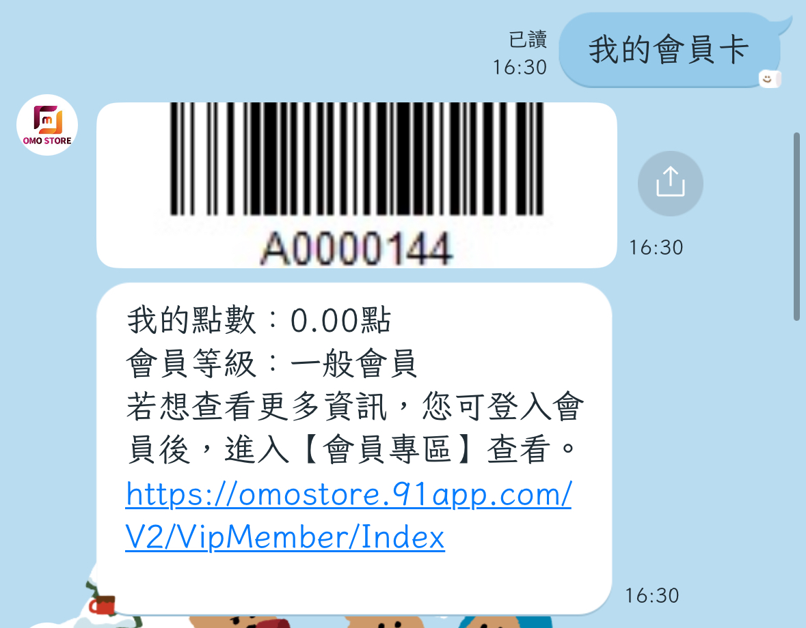
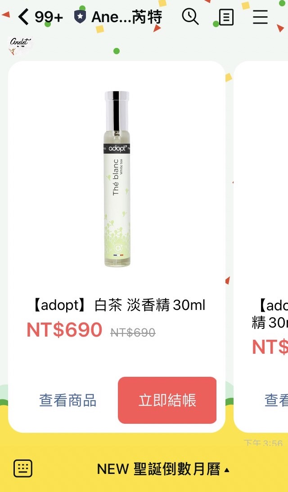

# 系統預設模組 - 91APP 限定模組（LINE only）

### 步驟一：至 91APP 後台將 LINE 相關設定完成

1. 請至 91APP 後台的 Marketing Cloud -> LINE 模組設定。請選擇合作廠商 Omnichat，因為 91APP 與 Omnichat 之間需要拋轉 Webhook URL 並且讓商店在 Omnichat 上面進行聊天機器人的操作。 \
   所以，會有兩個提醒視窗提示，商店必須填入 Omnichat 的 Webhook URL 並且聊天機器人的設定在此頁面會關閉，請至 Omnichat 後台操作。

<figure><figcaption></figcaption></figure>

2\. 因選擇 Omnichat 為合作廠商，因此會多新增一個欄位為 『Webhook URL』。此時請將 Omnichat 的 Webhook URL 複製貼上到此處，確保 91APP 與 Omnichat 之間資料拋轉正常。

可先至 Omnichat 後台的 通訊渠道>> 串接社群通訊渠道 >> LINE 官方帳號整合，複製 Omnichat Webhook URL。

<figure><figcaption>
點擊複製 Webhook 連結
</figcaption></figure>

<figure><figcaption>
貼上 91APP 後台
</figcaption></figure>

3\. 當商店選擇已有合作廠商 Omnichat 的時候，91APP 的聊天機器人功能將關閉，商店需在 Omnichat 後台進行聊天機器人的操作及設定。

<figure><figcaption></figcaption></figure>

### 步驟二：至 『自助設計機器人』 設定觸發 91APP 專屬模組

當機器人模組平台為 「限定 LINE 平台」 時，即可在系統預設模組中看到三個 91APP 限定模組 「我的會員卡」、「出貨進度」、「熱銷商品」，設定觸發這三個模組後，客人點擊按鈕就可以使用 91APP 相關功能。

<figure><figcaption>
補充：按鈕名可自行編輯
</figcaption></figure>

### 步驟三：客人觸發專屬模組

當客人完成 91APP 綁定後，觸發三個專屬模組即可提供對應內容（呈現與說明請往下參考），綁定流程相關說明可以點擊下面連結


[fu-lu-91app-hui-yuan-bang-ding-vs-omnichat-hui-yuan-bang-ding.md](fu-lu-91app-hui-yuan-bang-ding-vs-omnichat-hui-yuan-bang-ding.md)


### 91APP 專屬模組說明


1. 91APP 的三個專屬模組內容都無法在 Omnichat 後台更改
2. 若客人尚未完成 91APP 綁定，在觸發 91APP 專屬模組後，會請客人先完成 91APP 綁定才可觸發


我的會員卡

會抓取即時的會員資料，圖片部分以 91APP 後台設定的內容為主

<figure><figcaption>
我的會員卡 呈現畫面（會因品牌設定而有差異）
</figcaption></figure>

出貨進度

會向 91APP 抓取 「最新一筆」 訂單的出貨進度與資料，內容無法編輯

<figure><figcaption>
出貨進度 呈現畫面
</figcaption></figure>

熱銷商品

* 熱銷商品排行榜的排序是參照 91APP OSM 後台的 『熱銷排行榜顯示設定』  所決定
* 顯示 『熱銷排行榜顯示設定』 Top 12 商品卡片，選購時會走 「快速結帳流程」
* 若未完成 91APP OSM 後台 LIFF 設定，91APP 機器人模組會顯示熱銷排行榜網址（LIFF 設定請洽 91APP AM 協助）

<figure><figcaption>
熱銷商品 呈現畫面
</figcaption></figure>
