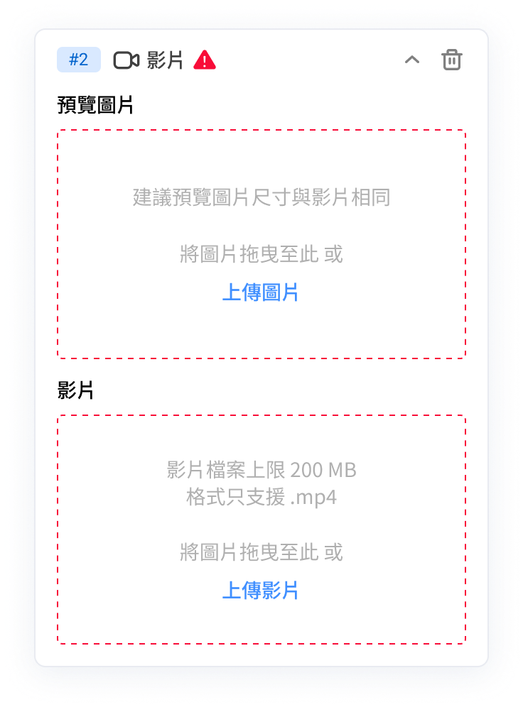
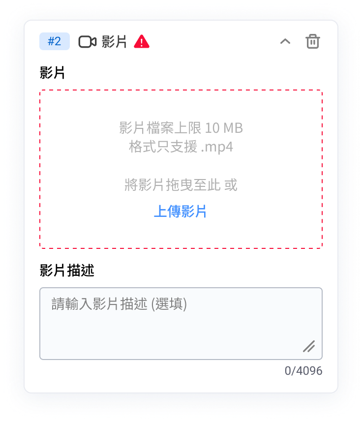
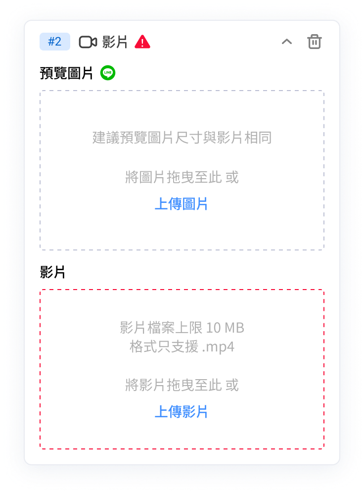

# 影片

影片訊息卡片能增色您的訊息，讓內容更豐富、生動，吸引客人閱讀。

影片卡片可以在以下平台編輯：

* [Facebook](ying-pian.md#facebook)
* [LINE](ying-pian.md#line)
* [WhatsApp](ying-pian.md#whatsapp)
* [購物車再行銷](ying-pian.md#gou-wu-ju-zai-xing-xiao)

#### Facebook

<figure><figcaption>
Facebook平台的影片卡片
</figcaption></figure>

🎥 **影片格式：**&#x5F71;片檔案上限10MB，格式僅支援 .mp4

#### LINE

<figure><figcaption>
LINE平台的影片卡片
</figcaption></figure>

🏞️ **預覽圖片格式：**&#x5EFA;議預覽圖片尺寸與影片相同

🎥 **影片格式：**&#x5F71;片檔案上限200MB，格式僅支援 .mp4

#### WhatsApp

<figure><figcaption>
WhatsApp平台的影片卡片
</figcaption></figure>

🎥 **影片格式：**&#x5F71;片檔案上限10MB，格式只支援 .mp4

🖊️ **影片描述：**&#x6B64;為選填欄位，文字最多可輸入4096 字

#### 購物車再行銷

<figure><figcaption>
購物車再行銷用的影片卡片
</figcaption></figure>

🏞️ **預覽圖片格式：**&#x50C5;支援LINE，建議預覽圖片尺寸與影片相同

🎥 **影片格式：**&#x5F71;片檔案上限10MB，格式僅支援 .mp4
