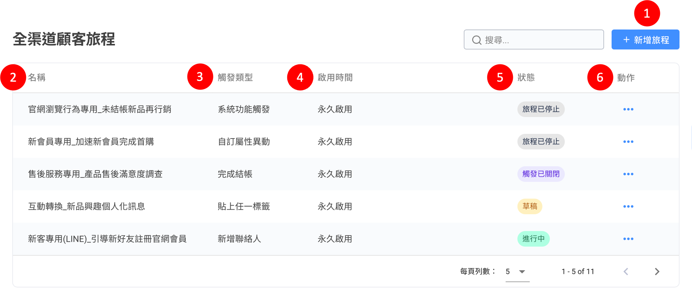

# 全渠道顧客旅程（加購功能）

## 全渠道顧客旅程列表

顯示旅程摘要資訊，如：旅程名稱、觸發類型、啟用時間、狀態等資訊。

<figure><figcaption></figcaption></figure>

1. 新增旅程：建立顧客的個人化旅程。
2. 旅程名稱：設定旅程的名稱。
3. 觸發類型：觸發旅程的條件。
4. 啟用時間：可選擇永久啟用或排程。
5.  旅程狀態：草稿、進行中、排程中、觸發已關閉、旅程停止中、旅程已停止。

    
<figure><figcaption></figcaption></figure>


1) 草稿：尚未正式發佈，可對整個旅程設定進行修改，包含觸發條件和刪除節點。
2) 進行中：旅程啟用中，依照條件執行腳本，在此狀態無法修改目標渠道、啟用時間，但可修改節點內容。
3) 排程中：若有設定啟用時間，則為排程中，在此狀態無法修改目標渠道、啟用時間，但可修改節點內容。
4) 觸發已關閉：停止觸發條件，將不會有新的顧客進入，但正在旅程中的顧客仍會進行，直到執行結束。
5) 旅程停止中：為旅程的暫停狀態，將停止觸發條件，也會將旅程內正在進行中的顧客停止執行。
6) 旅程已停止：旅程處於停止狀態，無法修改「目標渠道」，但可修改節點內容。


6. 動作：針對不同狀態的旅程，可以分別執行不同的動作
   1. 草稿：編輯、複製、刪除 。
   2. 進行中：檢視旅程、關閉觸發、停止旅程、複製 。
   3. 排程中：檢視旅程、停止旅程、複製、刪除。
   4. 觸發已關閉：檢視旅程、停止旅程、複製 。
   5. 旅程停止中：檢視旅程、複製。
   6. 旅程已停止：檢視旅程、複製、刪除。

### 旅程狀態變更原因一覽表：

<table><thead><tr><th width="287.3333333333333">旅程狀態變更原因</th><th width="170">變更後的旅程狀態</th><th>旅程列表提示訊息⚠️</th></tr></thead><tbody><tr><td>發 LINE 訊息時，LINE 訊息費用方案中已無可用訊息則數</td><td>旅程已停止</td><td>LINE 渠道無法發送訊息，官方帳號已無可用訊息則數</td></tr><tr><td>發 Whatsapp 訊息時，預付團隊餘額為 0</td><td>旅程已停止</td><td>WhatsApp 渠道無法發送訊息，預付帳戶餘額為 0</td></tr><tr><td>發 LINE 訊息時，達訊息則數上限</td><td>旅程已停止</td><td>LINE 渠道無法發送訊息，目標渠道訊息量已達上限</td></tr><tr><td>發 Whatsapp 訊息時，達訊息則數上限</td><td>旅程已停止</td><td>WhatsApp 渠道無法發送訊息，目標渠道訊息量已達上限</td></tr><tr><td>機器人模組已刪除</td><td>旅程已停止</td><td>找不到機器人或機器人模組</td></tr><tr><td>WhatsApp 訊息範本已刪除</td><td>旅程已停止</td><td>找不到 WhatsApp 訊息範本</td></tr><tr><td>自訂屬性為封存狀態、自訂屬性資料型態被改變</td><td>旅程已停止</td><td>找不到自訂屬性或被封存、資料型態被改變</td></tr><tr><td>到達旅程觸發次數上限</td><td>觸發已關閉</td><td>旅程觸發次數已達方案上限</td></tr></tbody></table>

## 新增旅程

### 1. 設定顧客旅程的起點

<figure><figcaption></figcaption></figure>

1. 儲存：將建立好的旅程儲存至草稿階段。
2. 發佈：將建立好的旅程發佈、正式上線。
3. 旅程名稱：設定旅程的名稱。
4. 啟用時間：可選擇永久啟用或排程。
5. 排程到期動作：當啟用時間為「排程」時，需設定排程到期時，要「關閉觸發」或是「停止旅程」。
6. 勿擾模式：勿擾時間內顧客不會收到訊息。勿擾時間若跨日，需分兩段設定。\
   ＊設定範例：如欲設定「每晚23:00\~翌日08:00」顧客不會收到旅程訊息，則需設定如下圖▼.png>)\

7. 旅程觸發次數限制：可限制每個顧客最多觸發次數。
8.  觸發條件：當顧客滿足條件就會開始旅程，觸發條件共有五種▼

    * 完成結帳：當顧客完成結帳就會開始旅程，可設定**結帳品項名稱**或**訂單金額**。

    

    * 新增聯絡人：當顧客新加入目標渠道後，就會開始旅程。

    

    * 貼上任一標籤：當顧客被貼上特定標籤時，就會開始旅程。

    

    * 自訂屬性異動：當顧客的自訂屬性更新後，就會開始旅程。

    

    * 系統功能觸發：可以使用其他系統功能觸發旅程，例如官網再行銷。

    

9. 目標渠道：選擇進行旅程的社群渠道。


若目標渠道選擇 「LINE」、「WhatsApp」，可以設定訊息量上限。

.png>).png>)


## 2. 新增旅程節點

支援 3 種節點類型，包含**訊息節點、條件節點（時間延遲、分眾條件）、動作節點（新增/移除標籤、變更自訂屬性、增加/扣除 點數餘額）**。點擊「＋」按鈕開始設定旅程節點。


動作節點：變更自訂屬性、增加/扣除 點數餘額，需加購自訂屬性、社群點數模組方可使用。


<figure><figcaption></figcaption></figure>

### 1. 訊息節點

FB、IG、LINE 可發送機器人模組，WhatsApp 可發送機器人模組、訊息範本。

<figure><figcaption></figcaption></figure>

1. 選擇目標渠道。
2. 選擇訊息類型。
3. 選擇機器人模組。

### 2-1 條件節點：時間延遲

等待時間後觸發下一節點，可設定日、小時、分鐘，需至少填入一欄，且不能為 0。

<figure><figcaption></figcaption></figure>

### 2-2 條件節點：分眾條件

<figure><figcaption></figcaption></figure>


依照下列項目進行分眾條件：

*   **依顧客基本資料**

    標籤、自訂屬性、會員 ID、電話、Email
*   **依互動時間**

    客人最後互動時間、團隊最後互動時間、團隊最後行銷時間、最後完成結帳時間
*   **依綁定狀態**

    社群身份綁定
* 社群點數（🙌🏻 **適用方案**：「社群點數」 模組）
  * 點數餘額：顧客目前可使用的點數
  * 累積點數：顧客取得過的所有點數加總


<figure><figcaption>
分眾條件設定範例
</figcaption></figure>

### 3-1 動作節點：新增/移除標籤

<figure><figcaption></figcaption></figure>


新增與移除，不能填入相同標籤。


### 3-2 動作節點：變更自訂屬性


🙌🏻 適用方案：Social CDP 或另外開通顧客旅程＆自訂屬性


當顧客經過這個旅程節點時，將會自動改變他的自訂屬性資料為指定的值。

* 僅支援變更「文字」型態的自訂屬性資料
* 自訂屬性變更可透過 Webhook 同步至其他系統（需串接 Contact 相關的 Webhook）

<figure><figcaption></figcaption></figure>

實際應用舉例說明：若您有在Omnichat後台透過自訂屬性建立屬於您的會員制度，後續您將可以再次使用此變更自訂屬性節點，依據您的旅程腳本自動調整聯絡人的自訂屬性。\
\
範例：當客人有完成購買特定商品且金額大於一萬元（旅程觸發點），使用此變更自訂屬性節點，將此客人在Omninichat的會員等級(自訂屬性)，調整為「白金會員」(自訂屬性)。

## 旅程總覽數據

旅程發布後，點擊「旅程設定」即可看見旅程總覽數據，包含：

<figure><figcaption></figcaption></figure>

1. 旅程觸發次數：為顧客觸發旅程條件的次數（重複計算）。
2. 營業額：藉由旅程導購所產生的營業額。
3. 訂單數：藉由旅程導購所產生的訂單。
4. 廣告投資報酬率：流量產生營業額 / 推播訊息費用。
5. 旅程完成次數：完成旅程的次數總計。
6. 旅程完成率：旅程完成次數 / 旅程觸發次數。
7. 訊息發送量：此次旅程產生的所有訊息數量。
8. 訊息成本估算：此次旅程產生的估算訊息費用（LINE：NT$0.2/則、WhatsApp：HKD$0.5/則）

## 旅程各節點數據

旅程發布後，點擊「訊息節點」即可看見該節點數據。

<figure><figcaption>
圖中所顯示的數字，為該節點被觸發的次數，且為即時計算。
</figcaption></figure>

### 節點數據依平台呈現不同數據▼

**Facebook、Instagram：**

**LINE：**

**WhatsApp：**


節點數據每小時更新一次。

