# ✨ Omni AI（加購功能）

AI 不再只是趨勢，而是越來越多品牌實際導入客服流程的重要工具，善用 AI 不只能更快回覆顧客問題，也能減少團隊人力負擔、提升整體服務效率，甚至根據顧客需求推薦合適的商品，帶動轉換。

Omnichat 全新推出的 Omni AI，能依據您建立的知識內容，自動回覆顧客常見疑問，協助團隊節省處理重複性問題的時間，將人力投入在更複雜或需要判斷的情境上，也能根據顧客的喜好，智慧推薦商品，提升服務和銷售的整體表現。

本篇文章將教您如何在後台設定 Omni AI，讓它成為您團隊得力的第一線助手！

1. 在 「[知識庫管理](./#zhi-shi-ku-guan-li)」 中上傳知識文件
   * [知識庫管理權限](./#zhi-shi-ku-guan-li-quan-xian)
   * [頁面介紹](./#ye-mian-jie-shao)
2. 在 [Agent Studio](./#agent-studio) 中新增 AI Agent
   * [Agent Studio 使用權限](./#agent-studio-de-shi-yong-quan-xian)
   * [Agent 列表](./#agent-lie-biao)
   * [Agent 類別](./#agent-lei-bie)
     * [客服 Agent](./#ke-fu-agent)
     * [商品推薦 Agent](./#shang-pin-tui-jian-agent)
3. [在機器人2.0中建立 AI Agent 卡片](./#zai-ji-qi-ren-2.0-zhong-jian-li-ai-agent-ka-pian)
   * [第一步：新增 AI Agent 卡片、選擇 AI Agent](./#di-yi-bu-xin-zeng-ai-agent-ka-pian-xuan-ze-ai-agent)
   * [第二步：預覽、調整 AI Agent 卡片內容](./#di-er-bu-yu-lan-diao-zheng-ai-agent-ka-pian-nei-rong)
   * [第三步：依照服務流程，加入前後卡片，串接成完整體驗](./#di-san-bu-yi-zhao-fu-wu-liu-cheng-jia-ru-qian-hou-ka-pian-chuan-jie-cheng-wan-zheng-ti-yan)
   * [AI Agent卡片觸發流程 & AI 對話處理](./#ai-agent-ka-pian-chu-fa-liu-cheng-ai-dui-hua-chu-li)
   * [AI Agent 卡片使用注意事項](./#ai-agent-ka-pian-shi-yong-zhu-yi-shi-xiang)

### 知識庫管理

AI 的回答能力就像人在思考，知識庫就是它的大腦，裡面放的內容，就是它用來回答問題的依據。大腦裡沒有的知識，AI 就無法作答，相反地，資料越完整，它就能幫您回答越多問題，所以建立清楚又完整的知識文件，會直接影響 AI 是否能有效幫上忙喔！

#### 知識庫管理權限

管理員、主管、客服經理、行銷人員

#### 頁面介紹

<figure>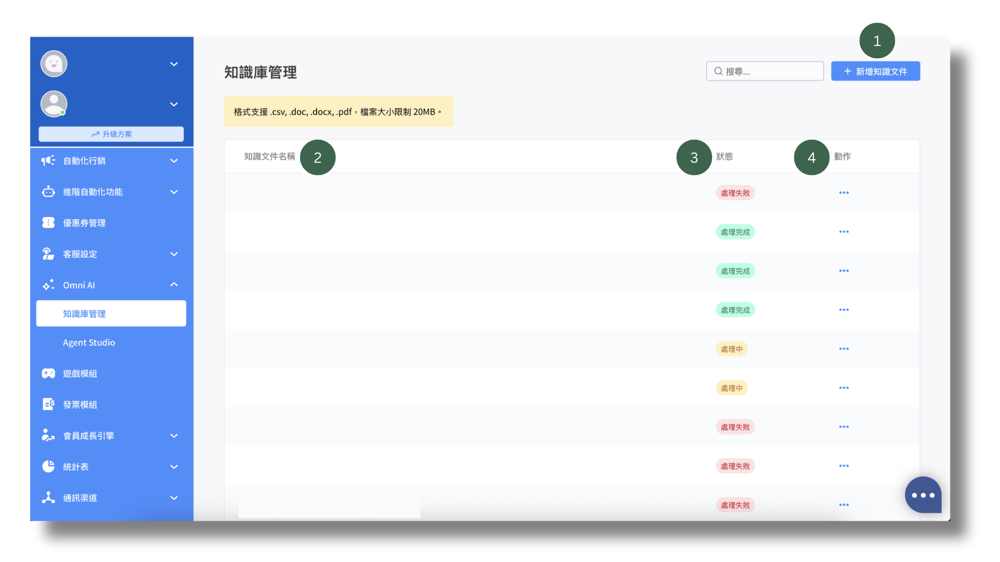<figcaption></figcaption></figure>

1. 新增知識文件：
   * 系統支援上傳的檔案格式包括：CSV、DOC、DOCX 和 PDF，其他格式無法上傳。
   * CSV 檔案的欄位內容無特殊格式限制。
   * 若上傳的檔案名稱（含副檔名）和現有檔案相同，系統會自動取代原有檔案。
     * 若該檔案已被某個 AI Agent 使用，取代後的內容將自動套用，AI 會依新的檔案內容回答。

<figure><figcaption></figcaption></figure>

2. 知識文件列表：知識文件會依更新時間從新到舊，由上而下排列，檔名則會顯示原始名稱+副檔名。
3. 狀態：：
   * 處理完成：AI 已處理完畢，文件可被 AI Agent 使用。
   * 處理中：AI 正在處理文件，還無法被 AI Agent 使用。
   * 處理失敗：AI 處理失敗，無法使用文件。
     * 將滑鼠游標移到狀態上，可查看錯誤原因，請將錯誤資訊提供給客服團隊或顧問確認。
     * 若為系統問題，請待問題修復後，使用「動作」選單中的「重新處理」功能重新上傳。
4. 動作

<figure>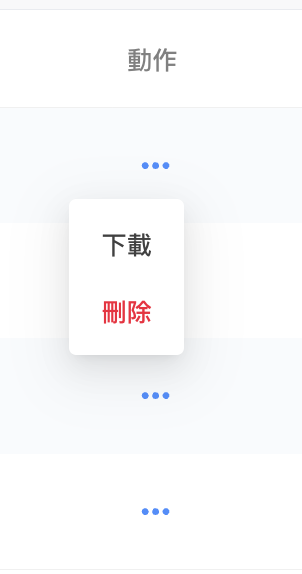<figcaption></figcaption></figure>

* 下載：可下載原始知識文件。
* 刪除：
  * 檔案若已被 AI Agent 使用，將會無法刪除，系統會跳出提示視窗，說明該檔案正在使用中。
  * 提示視窗中會提供超連結，方便您在新分頁開啟 Agent 設定頁面，以便後續調整。

<figure>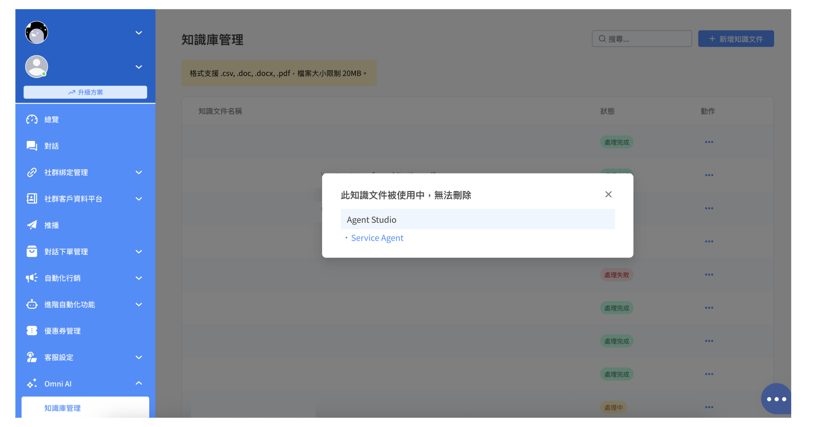<figcaption></figcaption></figure>


#### 知識文件建議使用方式

💡 **客服Agent：**

* 建立 CSV 格式的問答集
  * 第 1 欄：填入常見問題
  * 第 2 欄：填入建議回答內容
  * 後續欄位可自行加上補充資訊，例如問題類別、參考連結等。
* 範例請見下圖。

💡 **商品推薦Agent：**

* 建立 CSV 格式的商品明細：可包含商品名稱、商品圖片（需為網址）、商品描述、售價、賣場網址等。
* 後續欄位可自行加上補充資訊。
* 範例請見下圖。

💡 **上傳知識文件時請注意**：

* 系統目前不支援圖像辨識，僅會擷取文件中的純文字內容。
* 文件內容建議包含足夠的文字資訊，AI 才能有效回應顧客問題，資料越完整，AI 回答就能越準確。


範例：

<figure>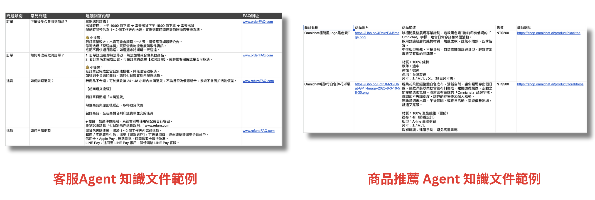<figcaption></figcaption></figure>

### Agent Studio

Agent Studio 是打造 AI Agent 的地方，您可以設定 AI Agent 的語氣和用字風格，透過明確的指令，讓它像您的分身一樣和顧客互動。AI Agent 不會自動知道您希望它怎麼做，您必須透過指令清楚告訴它該做什麼、怎麼說，指令設定得越明確，它的表現就越貼近您的期待。

#### Agent Studio 的使用權限

管理員、主管、客服經理、行銷人員

#### Agent 列表

<figure><figcaption></figcaption></figure>

顯示所有已建立的 Agent，共有兩種類型：客服 Agent 和商品推薦 Agent。

每個 Agent 左上角會標示類別，也可以從 icon 區分不同類別。

#### Agent 類別

<figure>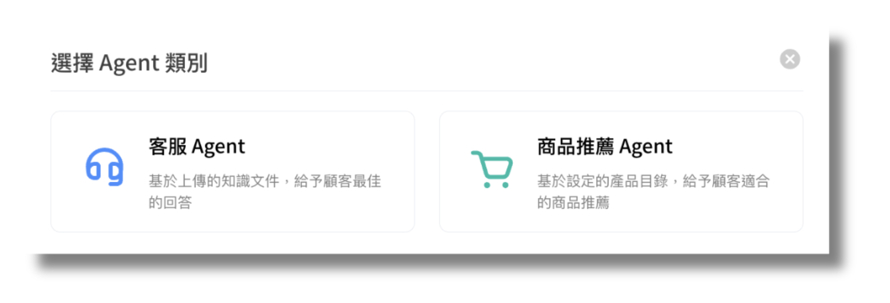<figcaption></figcaption></figure>

#### 客服 Agent

<figure>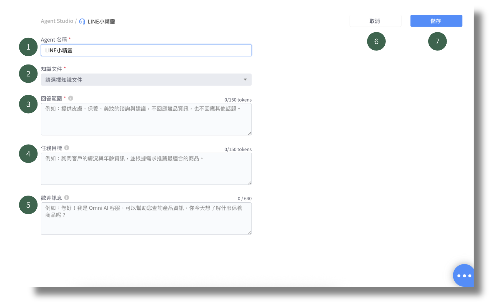<figcaption></figcaption></figure>

1. **Agent 名稱**（必填項目）：名稱會顯示在 Agent Studio 中，方便您區分不同用途的 Agent，也會出現在 AI Agent 卡片上。

<figure>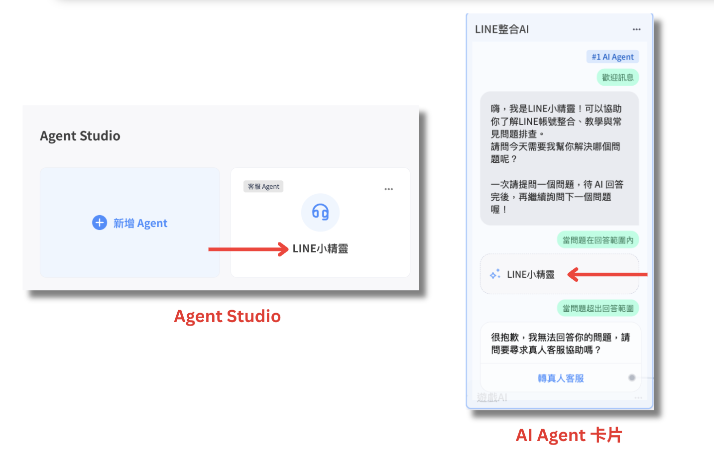<figcaption></figcaption></figure>

2. **知識文件**（必填項目）：
   * 可以從下拉選單中選取已上傳至知識庫的文件，可選取的檔案數量不受限制。
   * 若某個知識文件呈現反灰且無法選取，代表該文件正在處理中或處理失敗。
3. **回答範圍**（必填項目）：設定 Agent 可回應的內容範圍、方向、限制，明確的規範可提升回答準確性。建議可包含以下內容：
   * 角色定位：說明此 Agent 回應的內容主軸，例如：客服人員協助操作設定、技術助理解答錯誤訊息、產品顧問推薦合適商品等。
   * 服務範圍：可回答的內容類型，例如：訂單查詢、設定教學、商品介紹、使用說明等。
   * 限制條件：明確列出不應回答的內容，例如不得提供帳號或個資、不回覆醫療診斷、不代客操作等。
   * 不建議僅輸入「請依照知識文件內容回答」，應補充具體主題和背景資訊，讓回答更聚焦。
   * 範例：
     * 協助回覆顧客在 Omnichat Store 購買 T-shirt 的常見問題，例如商品介紹、訂單狀況、退換貨處理等。
     * 你是保健食品顧問，協助客人根據自身健康狀況和生活型態，推薦合適的保健品，例如營養補充品、腸胃調理、睡眠相關產品等，勿提供醫療診斷或開立治療建議，若客人症狀較嚴重或有用藥相關疑慮，引導其諮詢專業醫師。
4. **任務目標**（選填項目）：設定 Agent 的主要目標，例如幫助顧客選擇合適的方案、回答技術問題，或提供即時客服支援，清晰的目標有助於 Agent 表現出符合期待的互動。建議可包含以下內容：
   * 語氣和用字風格：可指定為禮貌、中性、親切、活潑或專業清楚等風格。
   * 互動策略：說明是否需由 Agent 主動提問，引導客人提供資訊。
   * 特定回覆：若有需要，可指定互動對答中加入固定句子，例如每次 Agent 回覆後，在結尾加上：「希望以上回答有幫助到您。」
   * 範例：
     * 對話中可先詢問客人目前的身體狀況或想改善的問題，再根據回覆內容給予建議，簡要說明推薦產品的作用或適用對象。
     * 用詞應自然流暢，避免出現機器人感，例如避免重複使用制式用語或生硬句式。
     * 每次回覆結束時加入提醒：「若您想結束 AI 客服流程，請在此對話框輸入『找真人客服』，我們將為您轉接至真人客服協助。」
5. **歡迎訊息**（選填項目）：當 AI Agent 卡片被觸發後，AI Agent 接手對話時所發出的第一則訊息。
6. **取消**：點擊取消，系統會跳出提示視窗，提醒您取消後會遺失目前的編輯內容。

<figure><figcaption></figcaption></figure>

7. **儲存**

#### 商品推薦 Agent

<figure>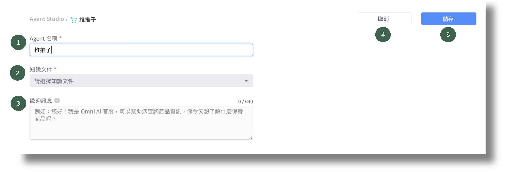<figcaption></figcaption></figure>

1. **Agent 名稱**（必填項目）：名稱會顯示在 Agent Studio 中，方便您區分不同用途的 Agent，也會出現在 AI Agent 卡片上。

<figure>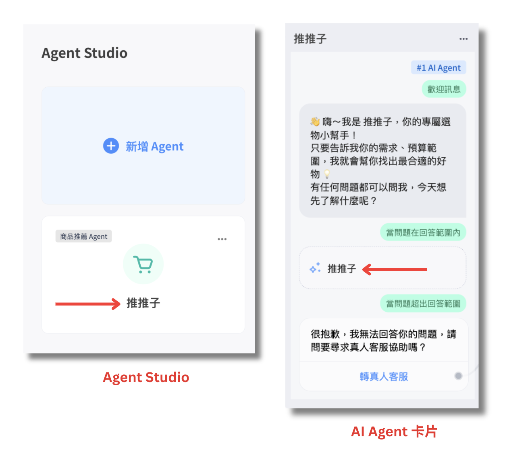<figcaption></figcaption></figure>

2. **知識文件**（必填項目）：
   * 可以從下拉選單中選取已上傳至知識庫的文件，可選取的檔案數量不受限制。
   * 若某個知識文件呈現反灰且無法選取，代表該文件正在處理中或處理失敗。
3. **歡迎訊息**（選填項目）：當 AI Agent 卡片被觸發後，AI Agent 接手對話時所發出的第一則訊息。
4. **取消**：點擊取消，系統會跳出提示視窗，提醒您取消後會遺失目前的編輯內容。

<figure><figcaption></figcaption></figure>

5. **儲存**


目前商品推薦 Agent 不支援設定個人化內容。


### 在[機器人2.0](https://console.omnichat.ai/bot)中建立 AI Agent 卡片

適用渠道：Facebook、Instagram、LINE、WhatsApp、Webchat (coming soon)

#### 第一步：新增 AI Agent 卡片、選擇 AI Agent

新增 AI Agent 卡片

<figure>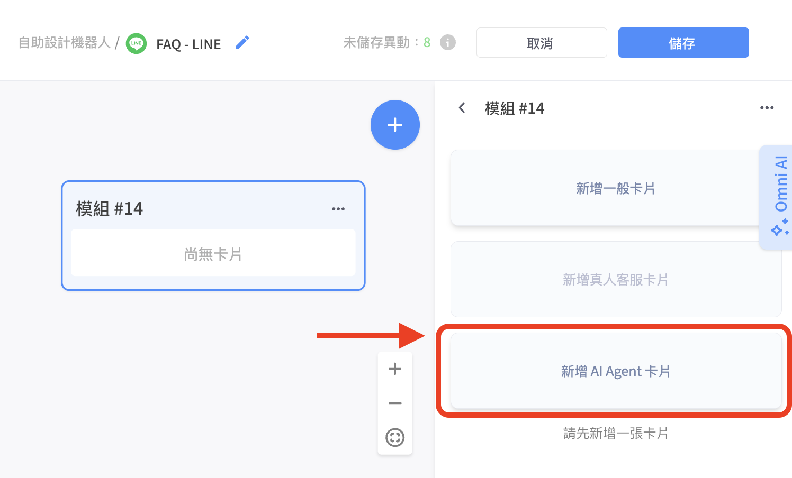<figcaption></figcaption></figure>

在下拉選單中選擇您在 Agent Studio 建立好的 AI Agent

<figure><figcaption></figcaption></figure>

#### 第二步：預覽、調整 AI Agent 卡片內容

<figure>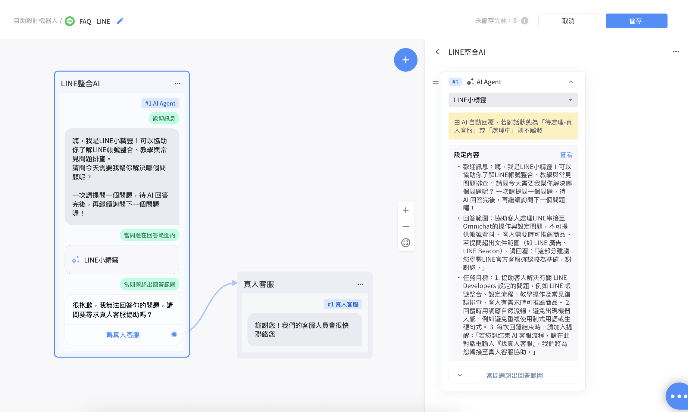<figcaption></figcaption></figure>

AI Agent 卡片共有三個部分：

1. **歡迎訊息**：這裡的歡迎訊息是您在 [Agent Studio](https://console.omnichat.ai/agent-studio/list) 中該張卡片設定的內容，如需修改，可回到該張卡片調整。
2. **當問題在回答範圍內**：
   * 卡片中會顯示您在 Agent Studio 設定的 Agent 名稱。
   * 右側則呈現您在 Agent Studio 中為該 Agent 設定的歡迎訊息、回答範圍和任務目標。
   * 點選右側的 「查看」，系統會帶您到該位 Agent 的設定畫面。
   * 當顧客提出的問題符合設定的回答範圍時，系統會依據知識文件的內容回覆對方。
3. **當問題超出回答範圍**：
   * 此處僅可連接至真人客服卡片。
   * 當顧客的問題不在設定的回答範圍內，或顧客主動要求真人協助時，會自動轉接至真人客服，對話會進入 「待處理 - 真人」 中。

#### 第三步：依照服務流程，將 AI Agent 卡片置於特定模組中，串接成完整體驗

您可以根據實際需求，將 AI Agent 卡片安排在適合的流程節點中，例如放在[歡迎訊息](https://console.omnichat.ai/channel-preset-messages)或[圖文選單](../marketing/line-tu-wen-xuan-dan/)的某個動作內，讓顧客主動點選進入 AI 問答，也可以搭配[關鍵字自動回覆](../marketing/guan-jian-zi-zi-dong-hui-fu.md)來觸發 AI Agent 卡片，靈活設計符合使用情境的互動方式。

#### AI Agent 卡片觸發流程 & AI 對話處理

<figure>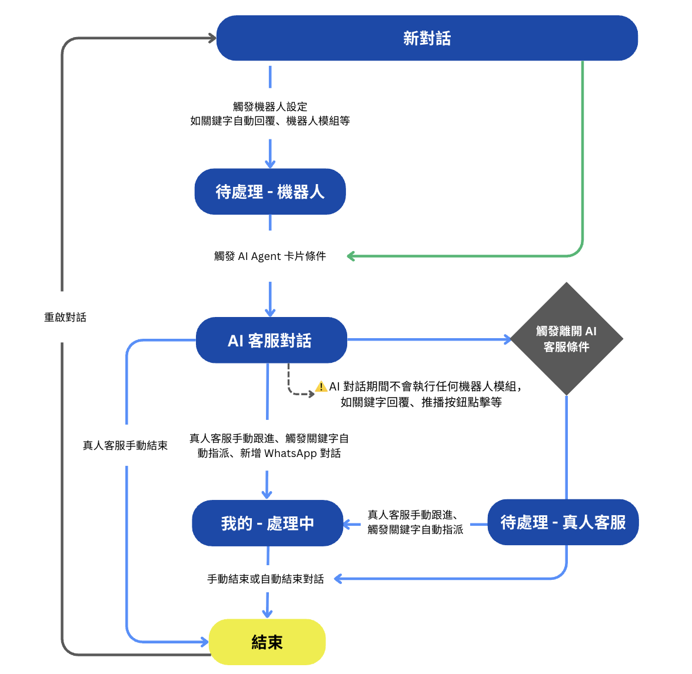<figcaption></figcaption></figure>

1. **如何觸發 AI Agent？**
   * AI Agent 只能透過 AI Agent 卡片觸發。
   * 當 AI Agent 卡片被觸發，且對話未進入真人處理狀態，會進入 「AI 客服對話」 中，系統會依照設定的 AI 內容自動回覆。
   * 若對話狀態為 「待處理 - 真人客服」 或 「我的 - 處理中」，即使已設定 AI Agent 卡片，也無法觸發，對話會維持原狀。
     * 由於「我的 - 處理中」狀態的對話無法觸發 AI Agent 卡片，因此若該對話已綁定 OMO 銷售人員，也同樣無法觸發 AI。
2. **進入 AI 客服對話後的規則**
   * 不會再執行任何機器人模組，例如：關鍵字自動回覆、顧客雖然可收到推播訊息，但點擊推播裡的按鈕不會有反應。
   * 關鍵字自動指派規則仍會正常運作，當符合條件時：
     * 對話會轉為 「我的 - 處理中」。
     * AI Agent 會停止自動回覆。
3. **如何離開 AI 客服對話？**
   * AI 客服對話 → 團隊成員手動結束 → 結束對話。
   * AI 客服對話 → 真人客服接手 / 觸發關鍵字自動指派 / 新增 WhatsApp 對話 → 進入 「我的 - 處理中」 真人處理對話。
   * 若 AI 判斷無法回答問題，系統會自動送出 「是否轉真人客服」 的文字卡片，若顧客選擇轉真人，對話將跳至 「待處理 - 真人客服」。

#### AI Agent 卡片使用注意事項

目前以下功能不支援使用或回覆含有 AI Agent 卡片的內容，請避免在這些模組中加入 AI Agent 卡片，以免卡片無法正確觸發：

<table><thead><tr><th width="219.2265625">功能類別</th><th>設定路徑</th></tr></thead><tbody><tr><td>機器人卡片</td><td>

<ul><li>條件分流</li></ul><ul><li>用戶輸入</li><li>Call an API</li></ul></td></tr><tr><td>社群綁定管理</td><td>

<ul><li>
跨社群一鍵整合 (OmniLink)
<ul><li>
整合成功觸發動作
<ul><li>來源渠道</li><li>目標渠道</li></ul></li><li>整合失敗訊息</li></ul></li><li>社群身份綁定 → 綁定成功後通知顧客的訊息</li><li>
手機綁定 (LINE only) → 編輯
<ul><li>首次綁定完成訊息</li><li>已綁定訊息</li><li>綁定失敗訊息</li></ul></li></ul></td></tr><tr><td>進階自動化</td><td>全渠道顧客旅程 → 訊息節點</td></tr><tr><td>遊戲模組</td><td>獎項 → 領獎自動回覆訊息</td></tr><tr><td>預存回覆</td><td>

<ul><li>編輯時不能設定 AI Agent 卡片</li><li>在對話頁面無法發送含 AI Agent 卡片的預存回覆</li></ul></td></tr><tr><td>自動結束對話的提醒訊息</td><td>客服設定 → 對話設定 → 自動結束對話 → 發送提醒訊息</td></tr><tr><td>OMO設定</td><td>

<ul><li>
分店管理
<ul><li>自動結束對話 > 分店自訂</li><li>綁定訊息設定 > 綁定成功附加訊息 > 分店設定</li></ul></li><li>OMO 綁定設定 > 綁定店員成功訊息 > 附加訊息</li></ul></td></tr><tr><td>Facebook常設功能表</td><td>通訊渠道 → 社群常用訊息與設定 → Facebook 常設功能表</td></tr><tr><td>FB/IG私訊回覆</td><td>FB/IG 留言回覆 → 回覆設定 → 私訊回覆</td></tr></tbody></table>
