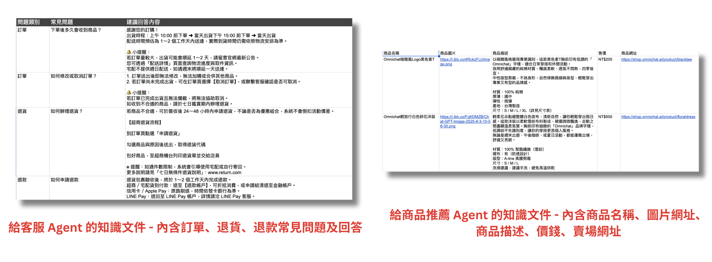
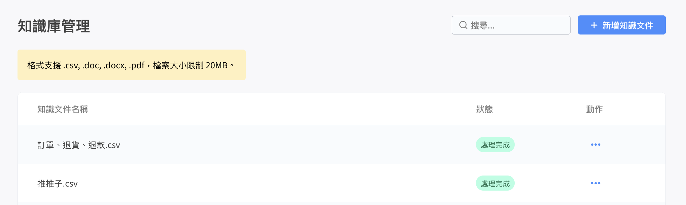
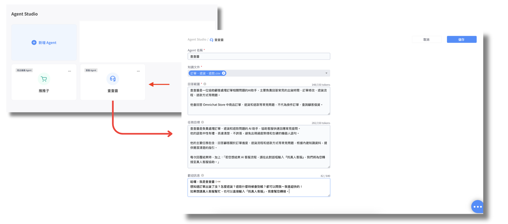
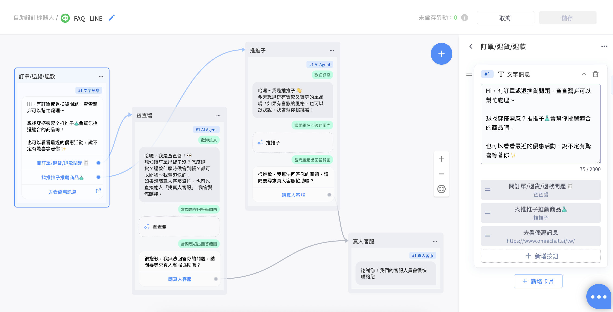

# Omni AI 使用範例

#### 背景說明

我是電商選物店的客服，每天會收到大量顧客詢問關於訂單狀態、退貨流程、退款方式等重複性問題。

為了節省回覆時間、提升顧客體驗，我希望讓 AI Agent 協助我即時回答這些常見問題，用輕鬆但有禮貌的語氣給出正確資訊。

我也希望讓 AI 協助推薦店內商品，根據顧客的需求快速帶出合適的單品介紹，提升轉換率。

#### 第一步：在[知識庫管理](https://console.omnichat.ai/knowledge-hub)建立、上傳知識文件

建立知識文件

<figure><figcaption></figcaption></figure>

上傳至知識庫管理

<figure><figcaption></figcaption></figure>

#### 第二步：在 [Agent Studio](https://console.omnichat.ai/agent-studio/list) 建立 AI Agent

客服 Agent

<figure><figcaption></figcaption></figure>

商品推薦 Agent

<figure><figcaption></figcaption></figure>

#### 第三步：在[機器人2.0](https://console.omnichat.ai/bot)建立流程

<figure><figcaption></figcaption></figure>

接著，在 「關鍵字自動回覆」 中設定關鍵字，當顧客提到 「我有訂單問題需要協助」 時，系統會跳出 「訂單／退貨／退款」 的文字訊息卡片，顧客可透過點選按鈕，觸發查查醬或推推子的 AI Agent 卡片。

<figure><figcaption></figcaption></figure>

#### 顧客體驗及 Omnichat 後台對話處理

{% embed url="https://files.gitbook.com/v0/b/gitbook-x-prod.appspot.com/o/spaces%2F-LaFmilpuDQ-f7VKjHCH%2Fuploads%2FWYgPM5xoLDOeTDBeEamb%2F%E5%B0%8D%E7%AD%94%E6%B5%81%E7%A8%8B.mp4?alt=media&token=62b369fb-44e2-4789-94e3-8e10b372d805" %}

從影片中可以看到，當顧客觸發關鍵字自動回覆時，對話會進入 「待處理 - 機器人」。

若觸發的是 AI Agent 卡片，對話則會進入 「待處理 - AI客服」，和 AI Agent 互動期間，對話會持續停留在 「待處理 - AI客服」。

直到轉接真人客服後，對話才會進入 「待處理 - 真人客服」。
