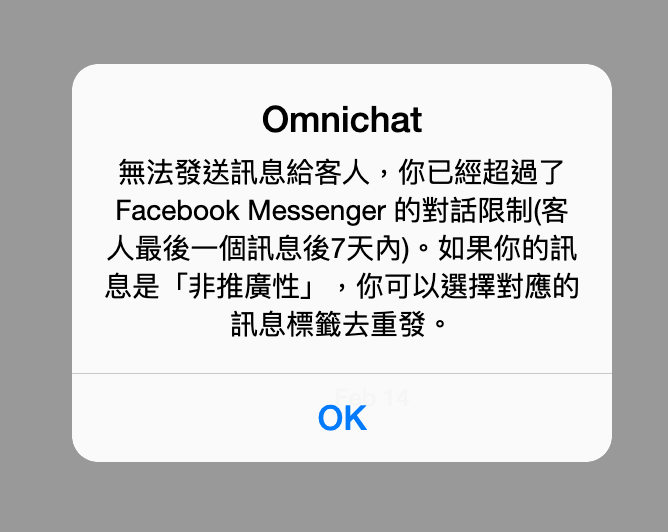
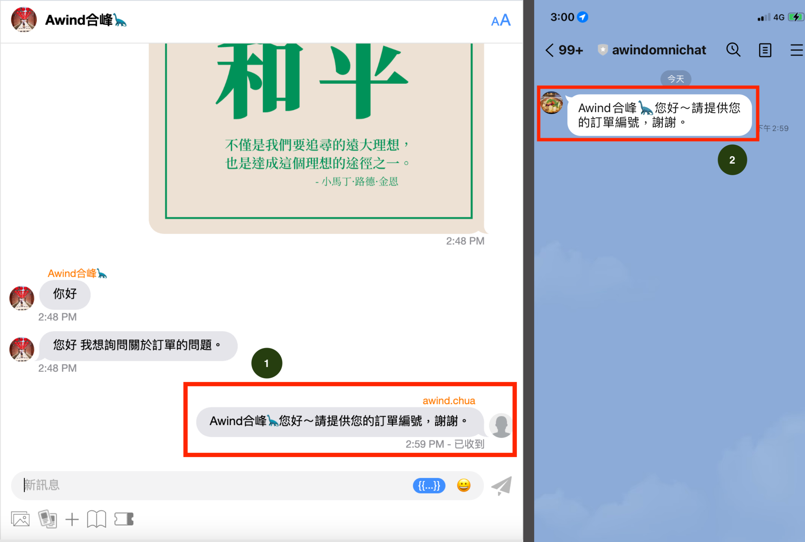
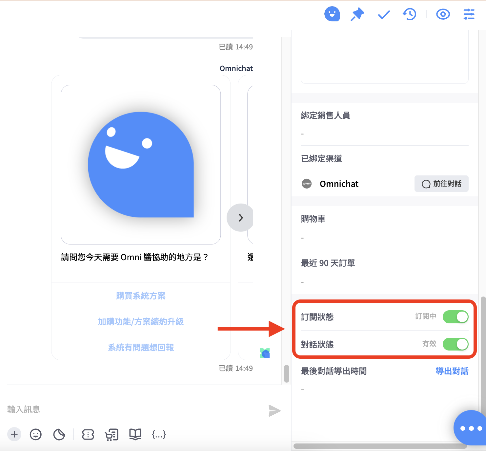
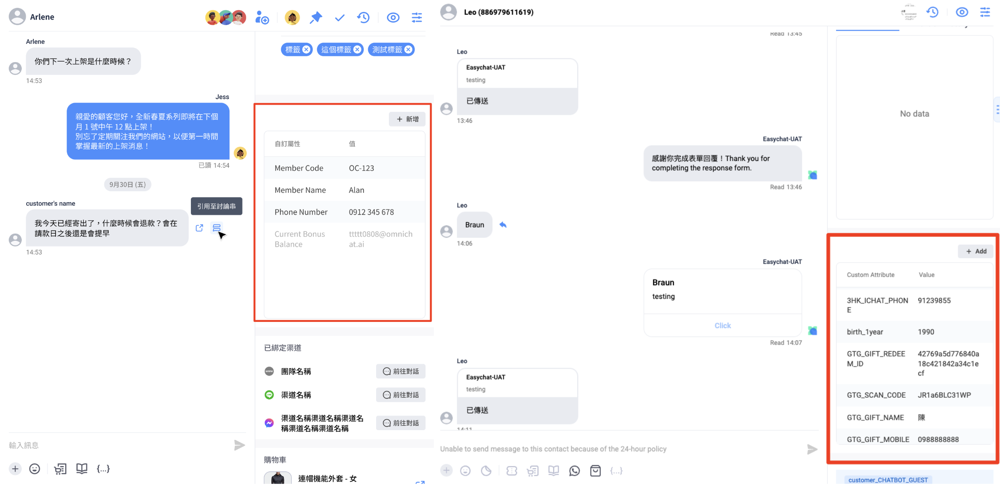
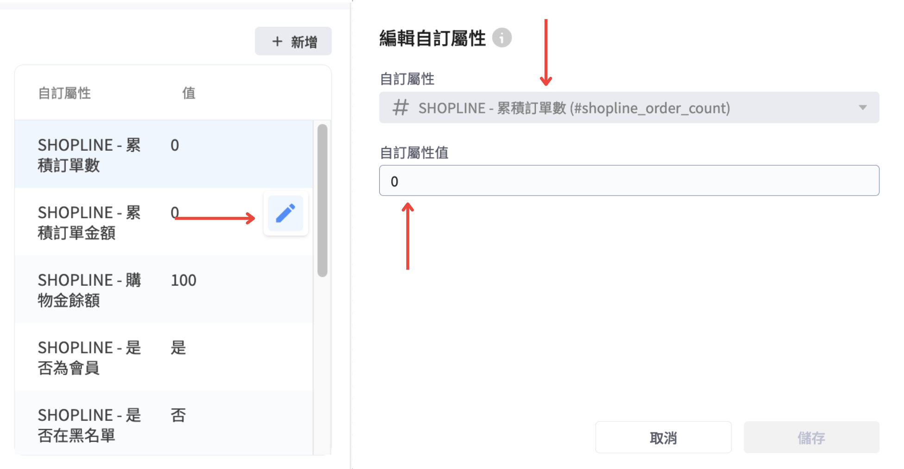

# 對話進階功能

訊息標籤（Message Tags）

[對話頁面顯示](dui-hua-jin-jie-gong-neng.md#dui-hua-ye-mian-xian-shi)

[對話頁面訊息回覆-加入聯絡人姓名參數](dui-hua-jin-jie-gong-neng.md#dui-hua-ye-mian-xun-xi-hui-fu-jia-ru-lian-luo-ren-xing-ming-can-shu)

[釘選對話功能](dui-hua-jin-jie-gong-neng.md#ding-xuan-dui-hua-gong-neng)

[新增 WhatsApp 對話](dui-hua-jin-jie-gong-neng.md#xin-zeng-whatsapp-dui-hua)

[連線中斷警示訊息](dui-hua-jin-jie-gong-neng.md#lian-xian-zhong-duan-jing-shi-xun-xi)

[團隊成員名稱不可包含 「LINE」字樣](dui-hua-jin-jie-gong-neng.md#tuan-dui-cheng-yuan-ming-cheng-bu-ke-bao-han-line-zi-yang)

## 訊息標籤 (Message tags)

* 訊息標籤（Message Tags）
* [對話頁面顯示](dui-hua-jin-jie-gong-neng.md#dui-hua-ye-mian-xian-shi)
* [對話頁面訊息回覆 - 加入聯絡人姓名參數](dui-hua-jin-jie-gong-neng.md#dui-hua-ye-mian-xun-xi-hui-fu-jia-ru-lian-luo-ren-xing-ming-can-shu)
* [釘選對話功能](dui-hua-jin-jie-gong-neng.md#ding-xuan-dui-hua-gong-neng)
* [新增WhatsApp對話](dui-hua-jin-jie-gong-neng.md#xin-zeng-whatsapp-dui-hua)
* [WhatsApp 對話支援指定回覆](dui-hua-jin-jie-gong-neng.md#whatsapp-dui-hua-zhi-yuan-zhi-ding-hui-fu)
* [連線中斷警示訊息](dui-hua-jin-jie-gong-neng.md#lian-xian-zhong-duan-jing-shi-xun)
* [新增、編輯顧客自訂屬性](dui-hua-jin-jie-gong-neng.md#xin-zeng-bian-ji-gu-ke-zi-ding-shu-xing)

### 訊息標籤（Message Tags）


&#x20;此為 FB Messenger 私訊事件限定


在對話頁面回覆 **Facebook Messenger** 訊息，Omnichat 會自動加上「HUMAN\_AGENT」的標籤，用戶將有 7 天時間可以回覆客人的私訊訊息。

若是超過 7 天回覆 FB Messenger 的事件，發送訊息後會出現以下提示，提醒用戶因為超過 7 天時限而無法送出訊息：

若是客人傳送最後一則訊息後已經超過七天，而仍須回覆客人，建議先回到 FB 粉專收件匣進行回覆，當客人有再傳送新訊息後，回覆時效會再重新計算，這時 Omnichat 用戶即可再回到 Omnichat 後台回覆客人訊息。

更多關於 FB 24 政策與訊息標籤的資訊，歡迎詳閱 Omnichat 部落格文章：\
[FB 臉書新規則 (2020更新) MESSENGER 24+1 政策掰掰，只有新聞粉專才有訂閱訊息資格](https://blog.omnichat.ai/tw/facebook-messenger-policy-updated-aug-29-2019/)

如有任何問題，歡迎與 Omnichat 線上顧問聯繫！

## 對話頁面顯示

當消費者透過 WhatsApp / Instagram / Facebook 之社群渠道使用回覆特定訊息的功能，在 Omnichat 也會同步顯示這些回覆的訊息。 \
點擊回覆的區塊，若原訊息已載入，聊天室會直接向上跳回原訊息，若尚未載入會彈出提示訊息請使用者再向上載入更多訊息

## 對話頁面訊息回覆-加入聯絡人姓名參數

當客服人員跟進對話事件後，回覆客人訊息時能夠帶入客人的姓名參數。

<figure><figcaption></figcaption></figure>

在Omnichat後台的對話頁面中，點選訊息輸入框下方的 \{{...\}} 按鈕，選擇【聯絡人姓名】。

<figure><figcaption></figcaption></figure>

點選【聯絡人姓名】後，訊息輸入框將會出現 \{{system:customer\_name\}} 的姓名參數，請勿修改此參數內容，只需將要回覆的內容輸在參數前後即可發送。

<figure><figcaption>
訊息回覆後，呈現的實際畫面
</figcaption></figure>

1.當客服人員將帶有姓名參數的訊息送出後，Omnichat對話訊息會將聯絡人的姓名帶出。

2.當客服人員將帶有姓名參數的訊息送出後，客人收到訊息的會將聯絡人的姓名帶出。


來自官網的對話事件，右側的【客戶資料】中需要有姓名，才能帶入姓名參數。


## 釘選對話功能

當客服人員跟進對話事件，可以將對話事件釘選至上方。

1. 只有『我的跟進事件』中的對話，會有釘選對話 ／取消釘選按鈕。
2. &#x20;被釘選的對話會被置頂在最上方，並且被置頂的對話也會依照最後訊息的時間排序。
3. &#x20;當對話狀態進到結束事件 ; 轉移對話事件給他人或是被其他人員跟進後釘選的狀態就會消失。

## **新增 WhatsApp 對話**

您可以在對話頁面新增WhatsApp 對話與消費者展開互動。

### 使用教學

在對話頁面，點選紅框中的三點圖示，選擇「**新增WhatsApp對話**」。

選擇需要新增WhatsApp對話的帳號

1. 選擇需要新增WhatsApp對話的帳號。
2. 輸入姓名。
3. 選擇"國家/地區"，輸入電話號碼後按"新增"。

.png>)

新增 WhatsApp 對話後，會立刻建立對話事件，並且進入處理中的跟進事件。


完成新增對話後，請使用 WhatsApp 訊息範本與消費者進行互動。



該新增對話事件還在「**處理中」、「已結束」**&#x72C0;態的時候，如果被其他團隊成員重覆新增，系統會彈出通知提醒是否要接手該話事件。

彈出以下通知訊息的埸景為：

場景 1： 客服 A 新增對話後未與消費者進行互動，客服B新增對話。

場景 2：客服 A 新增對話後使用訊息範本與消費者進行互動，客服B新增對話。

場景 3：客服 A 在結束與消費者的對話後，客服 B 新增對話。

**聯絡人姓名以重覆新增對話後為準。**


### WhatsApp對話支援指定回覆

可針對團隊成員/客人回覆的句子，進行指定回覆（reply）的功能，操作方式如下：

將滑鼠游標移動到指定對話旁，會出現「回覆」的圖示，點選之後會出現可輸入對話的頁面。

<figure><figcaption>
此為網頁瀏覽器版本，可以在對話頁面當中針對需要回覆的內容點選「回覆」的 icon 
</figcaption></figure>

<figure><figcaption>
若點選回覆自己所發出的對話，會在對話框當中顯示指定回覆的人與對話前半部訊息
</figcaption></figure>

#### 此為回覆給自己/其他團隊成員所發出的對話，呈現的畫面

<figure><figcaption>
此為實際發送訊息後的畫面
</figcaption></figure>

#### 此為回覆給消費者的指定對話時，呈現的畫面

<figure><figcaption>
此為回覆客人指定對話的畫面
</figcaption></figure>

## 連線中斷警示訊息

### 訂閱狀態與對話狀態

<figure><figcaption></figcaption></figure>

**訂閱狀態：**&#x8A02;閱狀態的開啟/關閉會決定客人是否能接收到您的行銷訊息，例如推播或購物車相關的行銷訊息。如果訂閱狀態被關閉，客人將不會收到您的行銷訊息。

**對話狀態：**&#x5C0D;話狀態的開啟/關閉會決定您是否能接收到客戶傳送的訊息。當對話狀態關閉時，客人還是可以發訊息給您，但您不會收到; 不過您發給客人的訊息，客人仍然能收到。

### 連線中斷警示訊

當連線中斷時：

1. 對話頁面會跳出警示訊息，告知系統斷線
2. 點擊「重新連線」，並成功建立連線後，即可繼續操作與收發訊息

<figure><figcaption></figcaption></figure>


可能導致斷線情境：

1. 閒置時間過長且沒有任何操作，系統將自動斷線
2. 其他主機、網路問題，則可能無法重新連線


## 團隊成員名稱不可包含 「LINE」字樣


依據 LINE 的規定，傳訊者名稱中不得包含「LINE」字樣，且無論大小寫形式（如：LINE、line、LinE 等）皆不允許使用。


若傳訊者名稱中包含「LINE」，傳送訊息後，系統將顯示以下：

「`發送訊息失敗，請檢查客服帳號名稱是否包含不允許的字詞，例如：LINE，請修改後再重新發送。`」

### 新增、編輯顧客自訂屬性

<figure><figcaption>
對話2.0右邊欄位可新增、編輯自訂屬性
</figcaption></figure>


&#x20;**適用於：**

1. 網頁版對話 2.0。
2. 渠道：WhatsApp、LINE、Instagram、Facebook。

**不適用於：**

1. 對話 1.0 和 APP 。
2. 渠道：Webchat、Wechat。


#### 新增自訂屬性

1. 若要為顧客新增自訂屬性，請點擊「新增」，從已建立的自訂屬性列表中新增自訂屬性。
2. 點擊「新增」後，可於下拉選單中輸入「顯示名稱」或「Attribute Key」的關鍵字搜尋。
3. 選單會列出團隊已建立的自訂屬性，不包含已封存的自訂屬性，以及已存在於顧客資料中的自訂屬性。

<figure><figcaption>
於對話2.0頁面中新增自訂屬性資料
</figcaption></figure>


請留意，於對話2.0中：

1. 無法刪除自訂屬性、
2. 亦無法新增未曾建立的自訂屬性，如需刪除、新增，請依照[這裡](https://docs.omnichat.ai/features/she-qun-ke-hu-zi-liao-ping-tai/zi-ding-shu-xing-jia-gou-gong-neng#jian-li-zi-ding-shu-xing)的教學，於自訂屬性管理頁操作。


選單中每個 Icon 對應的類型說明：

<table><thead><tr><th width="195">類型</th><th>Icon</th></tr></thead><tbody><tr><td>文字</td><td></td></tr><tr><td>數字</td><td></td></tr><tr><td>日期</td><td></td></tr><tr><td>日期與時間</td><td></td></tr><tr><td>布林值</td><td></td></tr></tbody></table>

於對話2.0頁面，按鉛筆圖示即可編輯顧客既有的自訂屬性內容，但不可以更換自訂屬性的類型，例如將文字類型改為數字類。\
以下圖為例，按鉛筆圖示後，可編輯自訂屬性值，但不可將數字類型變更為其他類型。

<figure><figcaption>
可編輯自訂屬性內容，但不能更換自訂屬性類型。
</figcaption></figure>

**編輯各類型自訂屬性內容的注意事項：**


自訂屬性須為「啟用中」才可編輯，已封存的屬性不可編輯。


<table><thead><tr><th width="139">類型</th><th>注意事項</th><th>編輯畫面</th></tr></thead><tbody><tr><td>數字</td><td><ul><li>支援正負數及小數。</li><li>點箭頭單位為正負 1。</li><li>數字類型無法儲存開頭為 0 的數字，如 01、011。若要儲存這類數字，請使用文字類型的自訂屬性。</li></ul></td><td></td></tr><tr><td>文字</td><td><ul><li>上限為 1000 字。</li><li>暫不支援換行。</li></ul></td><td></td></tr><tr><td>日期</td><td><ul><li>點擊輸入框會開啟日期選單。</li><li>可鍵盤輸入日期。</li></ul></td><td></td></tr><tr><td>日期及時間</td><td><ul><li>點擊輸入框會開啟日期及時間選單。</li><li>可鍵盤輸入日期及時間。</li></ul></td><td></td></tr><tr><td>布林值</td><td></td><td></td></tr></tbody></table>

若異動的自訂屬性值符合其他功能設定的條件，將會同步觸發相關功能，例如旅程、機器人條件分流卡片、會員卡等。
