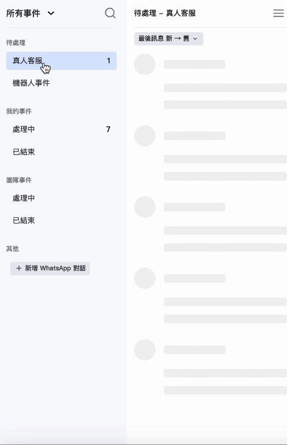
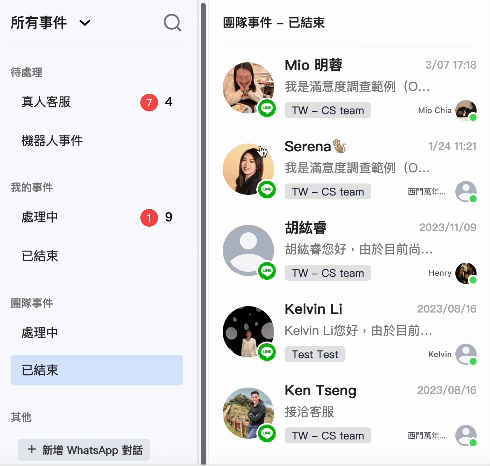
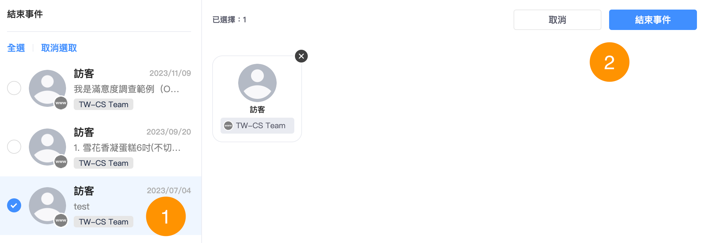

# 對話 2.0

## 對話分類及可視權限

### 對話分類

* 1對1對話：一個顧客與一位客服。
* [協作對話](xie-zuo-dui-hua.md)：一個顧客與多位客服。

### 可視權限

<figure><figcaption></figcaption></figure>

## **對話事件狀態**

對話事件分為「待處理」、「處理中」、「已結束」

| 狀態             |                                                                                                                   |
| -------------- | ----------------------------------------------------------------------------------------------------------------- |
| **待處理**        | <ul><li>當新的客人發問，事件狀態會預設為「待處理」</li><li>如對話事件為「已結束」狀態，客人再次發問，事件狀態會重新回到「待處理」</li></ul>                               |
| **處理中**        | <ul><li>如對話事件為「待處理」狀態，其一位團隊成員點擊「跟進」按鈕，事件狀態會轉為「處理中」</li><li>如對話事件為「已結束」狀態，其一位團隊成員點擊「重啟事件」按鈕，事件狀態會轉為「處理中」</li></ul> |
| **已結束**        | <ul><li>如對話事件為「處理中」狀態，客服跟進完成後，按上方的「✓ 結束事件」圖示，事件狀態會轉為「已結束」</li></ul>                                             |

.png>)

### **待處理**

待處理事件細分為 「真人客服」及 「機器人事件」

| **真人客服**              | 機器人事件                                                                                                                                                                                                                                                                                                                                                                             |
| --------------------- | --------------------------------------------------------------------------------------------------------------------------------------------------------------------------------------------------------------------------------------------------------------------------------------------------------------------------------------------------------------------------------- |
| 所有需要 **真人客服** 跟進的對話事件 | 
當客人送出訊息符合關鍵字或是觸發機器人模組時，該對話事件會落在『機器人』頁面。

 以下狀況，對話會轉移到「真人客服」的狀態：     1. 客人要求「真人客服」或客服人員主動跟進該對話。     2. 客人輸入的訊息<strong>不符合任何的關鍵字</strong>。 關於關鍵字自動回覆的設定請參閱 <a href="../marketing/keyword-autoreply.md"><strong>關鍵字自動回覆</strong></a>

關於如何設定<strong>機器人</strong>請查看<a href="../marketing/chatbot-builder/"><strong>自助聊天機器人 (DIY Chatbot)</strong></a>
 |

### **我的跟進事件/團隊跟進事件**

我的跟進事件/團隊跟進事件 會細分為「處理中」及 「已結束」&#x20;

| 我的跟進事件                              | 團隊跟進事件                        |
| ----------------------------------- | ----------------------------- |
| 
所有屬於當前登入帳號

客服人員的所有跟進事件
 | 
所有其他

客服團隊人員的跟進事件
 |

### 查看過往結束的對話

在左側導航列，點選「已結束」，可以看到自己與團隊結束的事件

## 篩選對話事件

你可以點選左上方「**全部事件**」按鈕查看所有你已經串接的通訊渠道；點選下拉選單其中一個頻道，事件列表就會只顯示該頻道的事件。

## 批量管理事件

面對大量的對話事件，Omnichat支援批量管理，可以輕易地跟進、移轉、結束、刪除、加入黑名單多個對話事件。

### 待處理（真人客服/機器人事件）

支援 **批量跟進/結束/刪除/加入黑名單**

<figure><figcaption></figcaption></figure>

### 我的事件-處理中

支援 **批量跟進/結束/刪除/加入黑名單**

<figure><figcaption></figcaption></figure>

<figure><figcaption>
批量結束
</figcaption></figure> <figure><figcaption>
批量移轉
</figcaption></figure>

<figure><figcaption>
批量刪除
</figcaption></figure> <figure><figcaption>
批量加入黑名單
</figcaption></figure>

**批量移轉** 細節說明

1. 點擊批量動作左方的「圈圈」圖示選擇對話，也可以「全選」選取所有列表中的對話事件。可於右上方 「已選擇」 區塊確認選取的對話事件與數量（圖片中已選取 1 個）。
2. 下方 「可移轉人員」 區塊可以透過搜尋或選擇不同權限來篩選可移轉的成員名單，並選擇欲移轉對話的成員。
3. 點擊右上方 「移轉事件」 後，再點擊確認，則可以批量移轉選取的對話事件。

### 支援的批量動作

<table data-header-hidden><thead><tr><th width="177">事件狀態 / 動作</th><th>跟進事件</th><th>結束事件</th><th>重新開啟事件</th><th>移轉事件</th></tr></thead><tbody><tr><td>事件狀態 / 動作</td><td>跟進事件</td><td>結束事件</td><td>重啟事件</td><td>移轉事件</td></tr><tr><td><strong>待處理</strong></td><td>✔</td><td>✔</td><td>✕</td><td>✕</td></tr><tr><td><strong>我的事件－處理中</strong></td><td>✕</td><td>✔</td><td>✕</td><td>✔</td></tr><tr><td><strong>已結束</strong></td><td>✕</td><td>✕</td><td>✔</td><td>✕</td></tr></tbody></table>


* 角色權限「管理員」、「主管」、「客服人員」、「銷售經理」、「銷售人員」才可以移轉事件
* 移轉事件單次操作**上限為20筆**
* 移轉者會提示**成功**以及**失敗**筆數
* 被移轉者會提示移轉人姓名以及移轉事件筆數


**批量刪除** 細節說明

* 刪除後對話紀錄將一併刪除。

**批量黑名單** 細節說明

* 顧客將同時被封鎖及取消訂閱，聊天記錄也一併刪除，不會再收到來自此顧客的訊息。

## 搜尋對話事件

可透過搜尋功能，依照 **搜尋條件** 查詢所有對話事件（真人客服/機器人/我的事件/團隊事件）。

**搜尋條件** 主要分為以下兩大類：「依客人資料」、「依成員資料搜尋」。

### 1. 依客人資料搜尋

可使用「姓名」、「電話」、「Email」、「備註」、「訊息內容」、「標籤」 進行搜尋。

<figure><figcaption>
依客人資料搜尋
</figcaption></figure>

使用者在「標籤」類別搜尋對話事件時，可以直接選擇已經創建過的標籤。

### 2. 依成員資料搜尋

可使用「權限」、「區域」、「分店」、「成員」 進行搜尋。

<figure><figcaption>
依成員資料搜尋
</figcaption></figure>


* 權限：可選擇管理員、主管、客服經理、客服人員、銷售經理(OMO)、銷售人員(OMO)
* 區域(OMO方案限定)：分店管理所設定的區域
* 分店(OMO方案限定)：分店管理所設定的分店
* 成員：以團隊成員名稱搜尋


## 對話事件管理

### 邀請團隊成員跟進

「我的事件 > 處理中」 的事件，可以點擊右上方的個人圖示將事件移轉給團隊成員，按下後此事件將會移轉到被移轉者的「我的事件」中：

<figure><figcaption>
移轉事件給團隊成員
</figcaption></figure>

### 接手團隊成員跟進中的事件

在 「團隊事件 > 處理中」 的事件，您可以點擊右上方成員圖示 -> 按下「跟進」按鈕後，此事件的主負責人將會轉移成自己，並且會出現在「我的事件」中：

### 結束已處理完的事件

處理中 ->「我的事件」中的事件，按下事件右上角的「✔」圖示，可將此事件結束：

### 對話事件團隊成員頭像顯示

* 如果對話事件 「有客服人員跟進」 or 在<mark style="color:blue;">**「待處理 > 真人客服」**</mark>那麼預設就會顯示 <mark style="color:blue;">**3個團隊成員頭像**</mark>（如團隊成員只有2個，那就會顯示2個）

<figure><figcaption></figcaption></figure>

* 如果對話是 <mark style="color:blue;">**待處理 > 機器人**</mark>，對話事件就會顯示<mark style="color:blue;">**1個頭像**</mark>

<figure><figcaption></figcaption></figure>

### 對話事件顯示顧客等候時間

* 當客人分別已等候30分鐘、1小時、2小時，對話列表的頭像上會顯示不同的樣式

<figure><figcaption></figcaption></figure>

* 對話事件排序

1. 依 **最後訊息** 或 **跟進時間**：新 ➝ 舊 / 舊 ➝ 新
2. 當對話**已超時等候**：預設排序依等候時間 長 ➝ 短
3. 當對話有**未讀訊息**：預設排序依最後訊息 新 ➝ 舊

<figure><figcaption></figcaption></figure>

