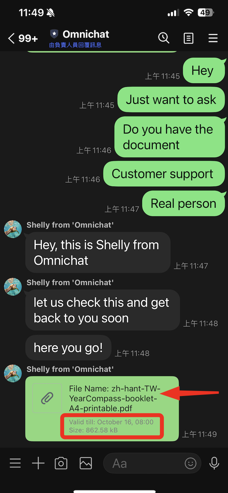
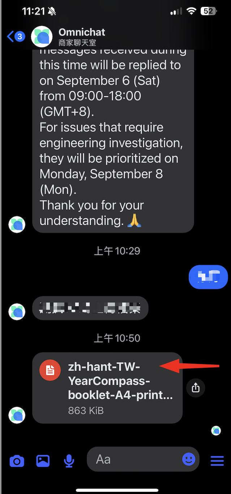

# 傳送圖片／影片／音訊／檔案／貼圖

## 檔案類型支援

目前 Omnichat 客服平台針對各個通訊渠道可傳送的檔案類型支援如下表：

| 通訊渠道          | 圖片          | 影片           | 音訊           | 檔案           | 大小限制       |
| ------------- | ----------- | ------------ | ------------ | ------------ | ---------- |
| **官方網站對話插件**  | ✔           | **✕**        | **✕**        | **✕**        | 10MB       |
| **Facebook**  | ✔           | ✔            | ✔            | ✔            | 8MB        |
| **Instagram** | ✔           | **✕**        | **✕**        | **✕**        |            |
| **LINE**      | ✔           | ✔            | ✔            | ✔ **（64MB)** | 50MB       |
| **WhatsApp**  | ✔**（5 MB）** | ✔**（16 MB）** | ✔**（16 MB）** | ✔            | 依照檔案類型有所不同 |

* Facebook 圖片檔案大小建議小於等於 **1 MB**
* LINE 渠道支援影片類型為 **MOV**、**MP4** 檔 ; 支援常見檔案 e.g: **csv、pdf、txt、excel、psd、ai、ppt、docx、doc** 檔案類型（<mark style="color:red;">不支援 .</mark><mark style="color:red;">**exe**</mark> <mark style="color:red;"></mark><mark style="color:red;">格式檔案</mark> ）
* 官網對話插件/Facebook/LINE/WhatsApp 圖片類型支援 **JPG、JPEG、PNG**

## 使用方法

按下圖箭頭處的 「**＋**」 按鈕即可選擇要傳送的檔案類型（圖片/影片/音訊/檔案）。以下舉 「檔案」 為例：

**LINE上傳檔案**


下載效期限制（LINE限定）：

* 目前只有 1:1 發送有效期限制 ; 預存回覆以及群發則無效期限制。
* 固定為一個月，使用 UTC 時間計算。e.g. 9/15 11:49 上傳，會被視為 UTC 9/16 00:00 上傳。+30 天之後，到期日為 10/16 08:00。


<figure><figcaption>
品牌端上傳檔案
</figcaption></figure> <figure><figcaption>
顧客端收到檔案
</figcaption></figure>

**FB, WhatsApp上傳檔案**

<figure><figcaption>
品牌端上傳檔案
</figcaption></figure> <figure><figcaption>
FB顧客端
</figcaption></figure> <figure><figcaption>
WA顧客端
</figcaption></figure>

## 傳送WhatsApp 貼圖包、LINE官方貼圖


僅限定 WhatsApp、LINE 渠道


<figure><figcaption>
WhatsApp 對話可傳送貼圖<strong>（此功能需加購）</strong>
</figcaption></figure>

<figure><figcaption>
LINE 對話可傳送貼圖<strong>（無需加購）</strong>
</figcaption></figure>

**貼圖使用方法：**

1. 在輸入訊息欄位下方，點擊 「 貼圖 」 按鈕
2. 貼圖視窗底部可切換 「 貼圖包 」 （預設使用第一包貼圖作為選單呈現）
3. 顯示對應的 「 貼圖清單 」，點擊後即可發送貼圖
4. 「 近期發送紀錄 」 會保留該團隊成員，最後發送的 16 張貼圖（限定同裝置、瀏覽器）


* LINE渠道僅支援 「LINE 官方貼圖」；WhatsApp渠道需加購此功能並上傳貼圖包
* LINE貼圖功能無需加購；WhatsApp 貼圖功能需加購


## 無法顯示的貼圖（LINE）

* 在LINE對話框中若看見如下圖的笑臉圖示，此為 <mark style="color:red;">「無法顯示的貼圖」</mark> 的圖示，代表此貼圖尚未支援於Omnichat後台中顯示。
* 目前不支援顯示的貼圖類別：LINE 貼圖拼貼樂。

<figure><figcaption></figcaption></figure>
