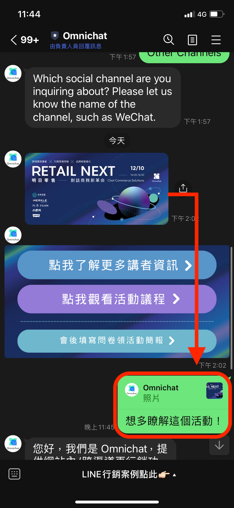
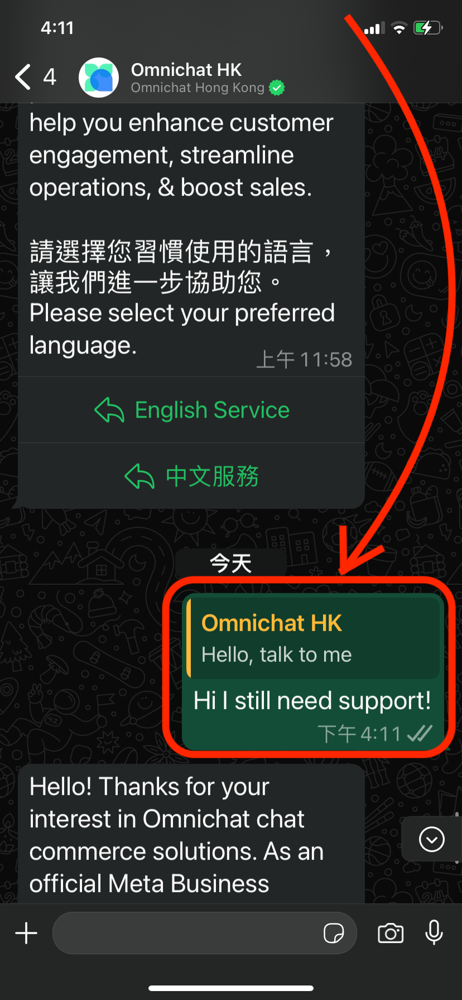

# 對話進階功能

## 「回覆特定訊息」 對話頁面顯示&#x20;

當顧客從 WhatsApp / Instagram / Facebook 等社群渠道針對 「特定訊息回覆」 的功能，在 Omnichat 也會同步顯示這些回覆的訊息。&#x20;

LINE：OC能同步顯示顧客回覆的訊息（被指定的內容不會出現）

<figure><figcaption>
LINE回覆特定訊息
</figcaption></figure> <figure><figcaption>
Omnichat同步顯示訊息（被指定訊息無顯示）
</figcaption></figure>

Facebook：OC能同步顯示顧客回覆的訊息（被指定的內容一併出現）

<figure><figcaption>
FB回覆特定訊息
</figcaption></figure> <figure><figcaption>
Omnichat同步顯示訊息（被指定訊息有顯示）
</figcaption></figure>

<figure><figcaption>
WhatsApp回覆特定訊息
</figcaption></figure> <figure><figcaption>
Omnichat同步顯示訊息（被指定訊息有顯示）
</figcaption></figure>

## 釘選對話功能

當客服人員跟進對話事件，可以將對話事件釘選至上方。

1. 只有 「我的跟進事件」 中的對話，會有釘選對話 ／取消釘選按鈕。
2. 被釘選的對話會被置頂在最上方，並且被置頂的對話也會依照 『最後訊息』 設定的時間排序。
3. 當對話狀態進到結束事件、轉移對話事件給他人或是被其他人員跟進後，釘選的狀態就會消失。

## 訊息標籤（Message Tags）－ FB Messenger 私訊限定

Facebook 串接 Omnichat 等第三方廠商，對第三方廠商設有部分回覆限制。

例如：Omnichat 在對話頁面回覆 Facebook Messenger 訊息，系統會自動加上「HUMAN\_AGENT」 的標籤，將有 7 天時間可以回覆顧客的私訊訊息。

* 時間規則如下（以顧客與您的 **最後一則訊息時間** 起算）：
  * **24小時內：**&#x53EF;1對1自由回覆客人訊息（任何性質訊息，包含推廣訊息。）
  * **超過24小時～7天內：**&#x53EF;1對1回覆客人訊息，但 「不能」傳導購訊息等推廣訊息。\
    對話輸入框提示：「此用戶的訊息已超過24小時，只能傳送 「非推廣性質」 的訊息（如下圖左）
  * **超過7天：**<mark style="color:red;">**不可**</mark> 1對1回覆客人訊息（對話輸入框反灰無法打字）。\
    對話輸入框提示：「無法傳送訊息，你已經超過Facebook的對話限制（客人最後一個訊息後7天內可傳送非推廣興致的訊息）」 （如下圖右）


**「非推廣性質」：**&#x610F;思是指帶有折扣、優惠、品牌推廣等都會被算在內，導購訊息為其中一例。


### 網頁版對話介面

<figure><figcaption>
超過24小時～7天內
</figcaption></figure> <figure><figcaption>
超過7天
</figcaption></figure>

### 手機App對話介面

<figure><figcaption>
24小時 - 7天內
</figcaption></figure> <figure><figcaption>
超過7天
</figcaption></figure>


當客人傳送最後一則訊息後已經超過七天，仍須回覆客人，建議可以**先回到 FB 粉專收件匣進行回覆**，當客人有再傳送新訊息後，回覆時效就會再重新計算，這時Omnichat用戶即可再回到Omnichat後台回覆客人訊息。



更多關於 FB 24 小時政策與訊息標籤的資訊，歡迎詳閱 Omnichat 部落格文章：\
[FB 臉書新規則 (2020更新) MESSENGER 24+1 政策掰掰，只有新聞粉專才有訂閱訊息資格](https://blog.omnichat.ai/tw/facebook-messenger-policy-updated-aug-29-2019/)


## **新增 WhatsApp 對話**

您可以在對話頁面新增WhatsApp 對話與消費者展開互動。

### 使用教學

在對話頁面，選擇 「**新增WhatsApp對話**」。

選擇需要新增WhatsApp對話的帳號

1. 選擇需要新增WhatsApp對話的帳號。
2. 輸入姓名。
3. 選擇"國家/地區"，輸入電話號碼後按"新增"。

新增 WhatsApp 對話後，會立刻建立對話事件，並且進入處理中的跟進事件。

通常新增進來的對話，會出現因用戶最後一次傳訊息給您的時間超過24小時，因此須透過訊息範本與顧客對話（如下圖）。

<figure><figcaption></figcaption></figure>


該新增對話事件還在 「**處理中」 、 「已結束」** 狀態的時候，如果被其他團隊成員重覆新增，系統會彈出通知提醒是否要接手該話事件。

彈出以下通知訊息的埸景為：

場景 1： 客服 A 新增對話後未與消費者進行互動，客服B新增對話。

場景 2：客服 A 新增對話後使用訊息範本與消費者進行互動，客服B新增對話。

場景 3：客服 A 在結束與消費者的對話後，客服 B 新增對話。

**聯絡人姓名以重覆新增對話後為準。**


<figure><figcaption>
重覆新增WhatsApp對話
</figcaption></figure>

### WhatsApp 對話支援指定回覆 


目前僅支援 WhatsApp 平台，其他社群平台（ LINE / Facebook ) 尚未提供支援，將持續開發優化，敬請期待！


可針對團隊成員／顧客回覆的句子，進行指定回覆（reply）的功能，操作方式如下：

1. 將滑鼠游標移動到指定對話旁，會出現 「回覆」 的圖示，點選之後會出現可輸入對話的頁面
2. 點擊後帶入該訊息於 「輸入訊息」 欄位上方
3. 送出帶有 「回覆訊息」 的新訊息後，會呈現該新訊息回覆之舊訊息

<figure><figcaption></figcaption></figure>

#### 此為回覆給自己／其他團隊成員所發出的對話，呈現的畫面

<figure><figcaption>
此為回覆給自己／其他團隊成員所發出的對話畫面
</figcaption></figure>

#### 此為回覆給消費者的指定對話時，呈現的畫面

<figure><figcaption>
此為回覆客人指定對話的畫面
</figcaption></figure>

## 對話頁面訊息回覆 － 加入聯絡人姓名參數

當客服人員跟進對話事件後，回覆客人訊息時能夠帶入顧客的姓名參數。

<figure><figcaption></figcaption></figure>

在Omnichat後台的對話頁面中，點選訊息輸入框下方的 「{...}」按鈕，選擇 【聯絡人名稱】 。

<figure><figcaption></figcaption></figure>

點選 【聯絡人姓名】 後，訊息輸入框將會出現 \{{system:customer\_name\}} 的姓名參數，請勿修改此參數內容，只需將要回覆的內容輸在參數前後即可發送。

<figure><figcaption>
訊息發送後實際畫面
</figcaption></figure>

1. 當客服人員將帶有姓名參數的訊息送出後，Omnichat對話訊息會將聯絡人的姓名帶出。
2. 當客服人員將帶有姓名參數的訊息送出後，客人收到訊息的會將聯絡人的姓名帶出。


來自官網的對話事件，右側的 【客戶資料】 中需要有姓名，才能帶入姓名參數，否則送出後姓名參數部分將不會顯示任何內容（其餘訊息內容可以正常顯示）。


### 警示訊息同步斷線，重新連線機制

當連線中斷時：

1. 對話頁面將跳出警示訊息，告知系統斷線
2. 點擊 「重新連線」 ，並成功建立連線後，即可繼續操作與收發訊息

<figure><figcaption>
Omnichat後台出現 「請嘗試重新連線」 視窗
</figcaption></figure>


可能導致斷線情境：

1. 總連線數過多，將自動從閒置時間最長的開始斷線
2. 閒置時間過長沒有任何操作，系統自動斷線
3. 其他主機、網路問題，則可能無法重新連線


