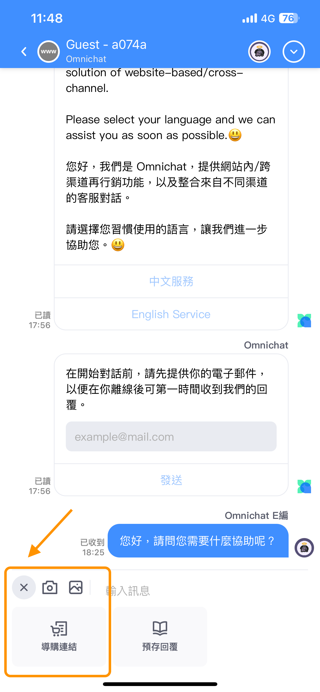
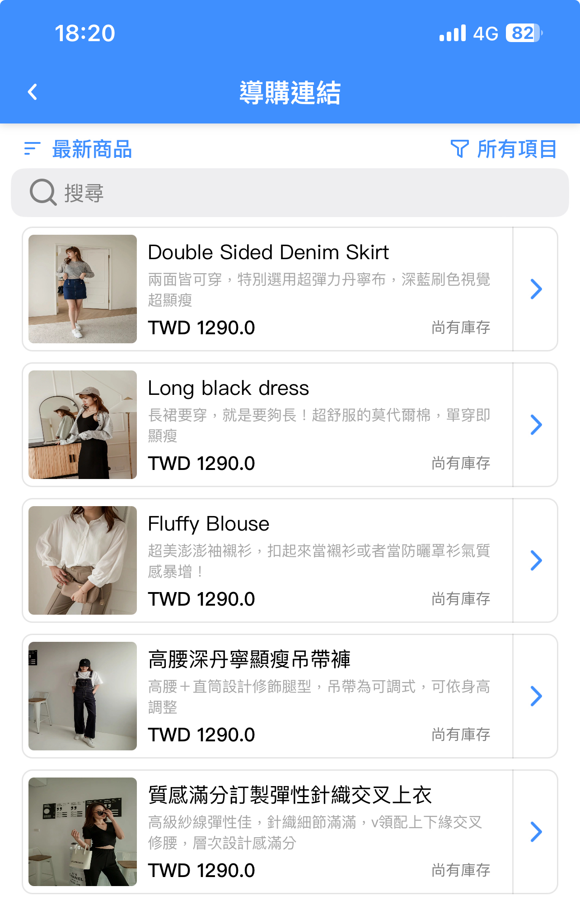
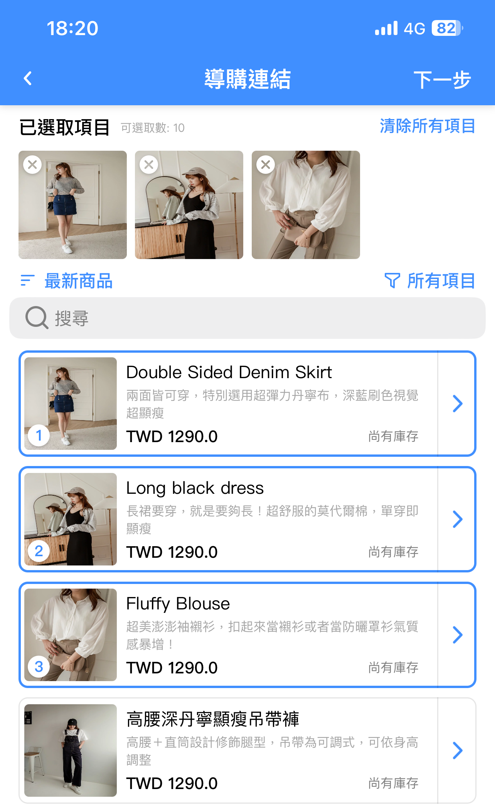
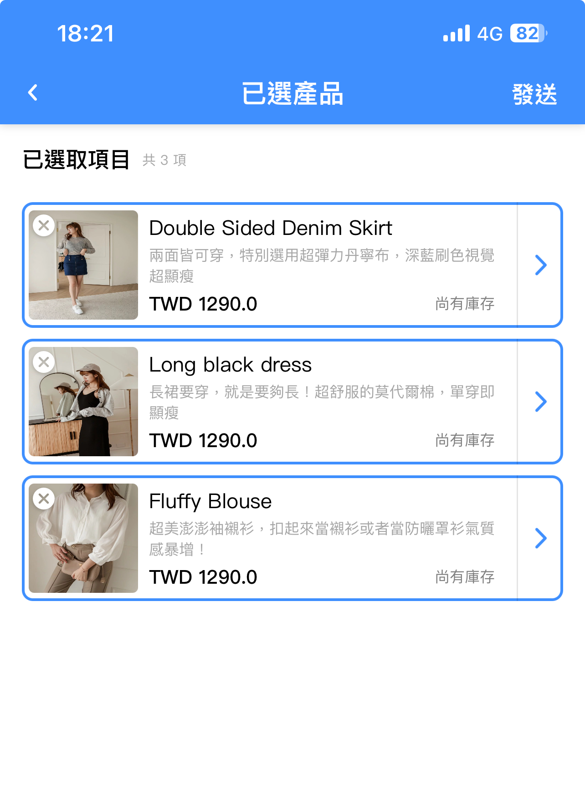

# 導購連結

## 基本說明

1. 網頁版 Omnichat 後台及 Omnichat App，皆有支援 「導購連結」 功能。
2. 網站、Facebook 、LINE、WhatsApp、Instagram 對話，皆可使用導購連結功能。
3. 使用此功能前，須先到 「[產品目錄](../she-ding/shang-chuan-chan-pin-mu-lu-product-feed.md#chan-pin-mu-lu-shi-shen-mo)」 完成產品設定，產品目錄一天會自動更新一次。
4. 若有開啟導購連結功能，客服人員使用導購連結或是手動在後台訊息輸入框裡填入並送出官網商品頁連結，訂單業績皆可認列給發出連結的該客服人員，後續可至[導購連結報表](../tong-ji-biao/product-referral.md)查看數據。
5. 此項功能為部分計畫所支援的，如欲了解詳情，可在 Omnichat 官網或 Omnichat 後台點擊右下方插件與 Omnichat 人員聯繫詢問。

## 網頁版後台 － 操作流程

### **步驟一**

點擊導購連結符號（如下圖）。

### **步驟二**

點擊符號後，會出現彈出視窗讓您選擇商品，**最多選擇 10 件**。

<figure><figcaption>
導購連結選擇畫面
</figcaption></figure>

選擇商品後，彈出視窗左側會顯示 「已選取項目」 及數量 **（最多選擇 10 件）**。

<figure><figcaption>
導購連結選擇畫面
</figcaption></figure>

### **步驟三**

按下 「發送」 ，即會發送該商品的導購連結至事件中。

<figure><figcaption>
導購連結發送後的畫面
</figcaption></figure>

* 官網插件裡的呈現如下圖，客人點擊 「View Product 查看商品」 後，就會打開該商品的商品頁面。

.png>)

* 如果將導購連結發送至 Facebook / LINE 事件，呈現如下圖。

<figure><figcaption>
Facebook導購連結呈現畫面
</figcaption></figure> <figure><figcaption>
LINE導購連結呈現畫面
</figcaption></figure>

* WhatsApp 跟 Instagram 目前可支援商品名稱跟連結。
* 如果發送多個導購連結，客人可往右滑看更多商品。

.gif>)

### **步驟四**

發送導購連結後，若是想要查看相關數據，例如各客服人員的業績、發送的導購連結數目等等，可至 統計表 → 導購連結業績 查看。


**關於 「導購連結業績」 的細節說明，可點以下連結查看更多：**\
[https://docs.omnichat.ai/features/tong-ji-biao/product-referral](https://docs.omnichat.ai/features/tong-ji-biao/product-referral)


## App 操作流程

### **步驟一**

點擊最左側的 「＋」 符號展開更多選項，點擊 「導購連結」 。

### **步驟二**

點擊導購連結符號之後，會開啟 「產品清單」 ，讓用戶選擇商品。

選擇商品後，下方會出現已選取項目及已選擇數量，點選 「下一步」 。

再次預覽已選取項目及已選擇數量，確認後按下 「發送」 ，即會送出導購連結。

<figure><figcaption>
App版本導購連結送出前預覽畫面
</figcaption></figure>

