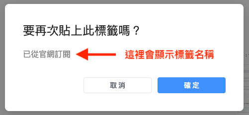
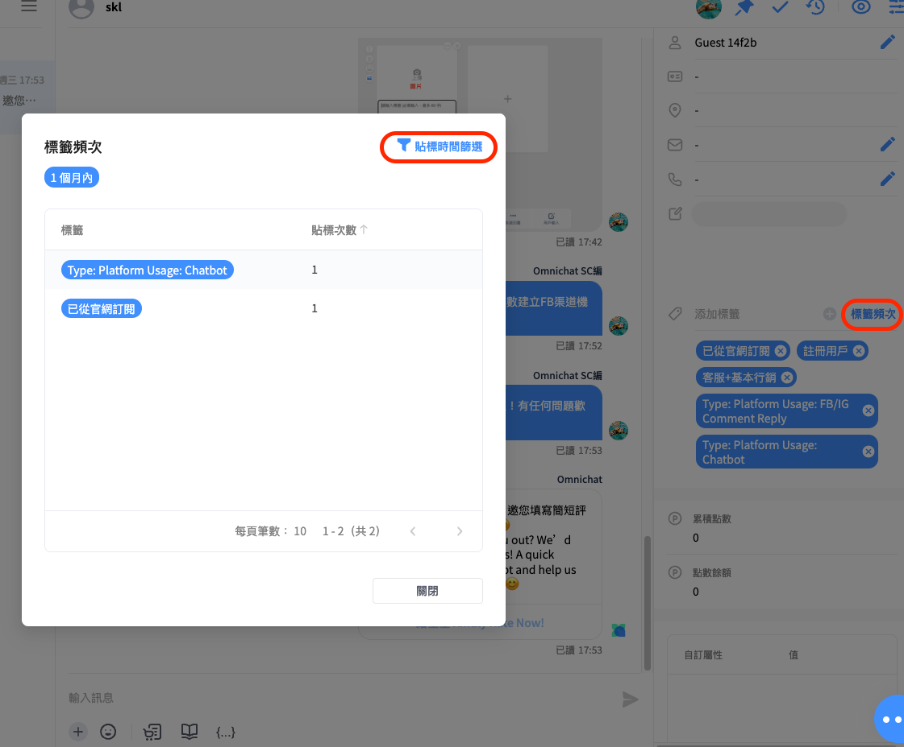
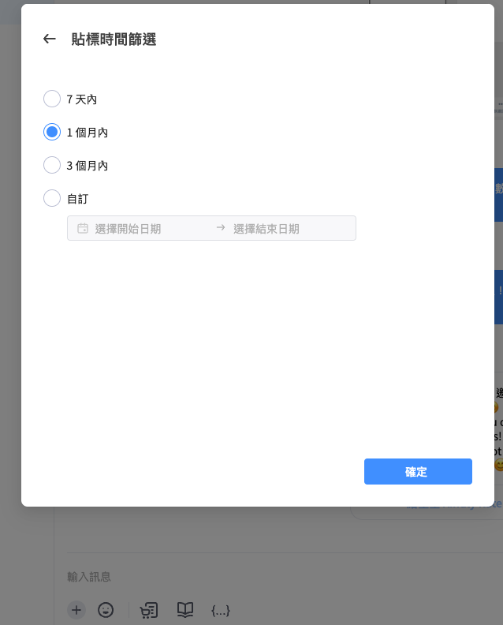
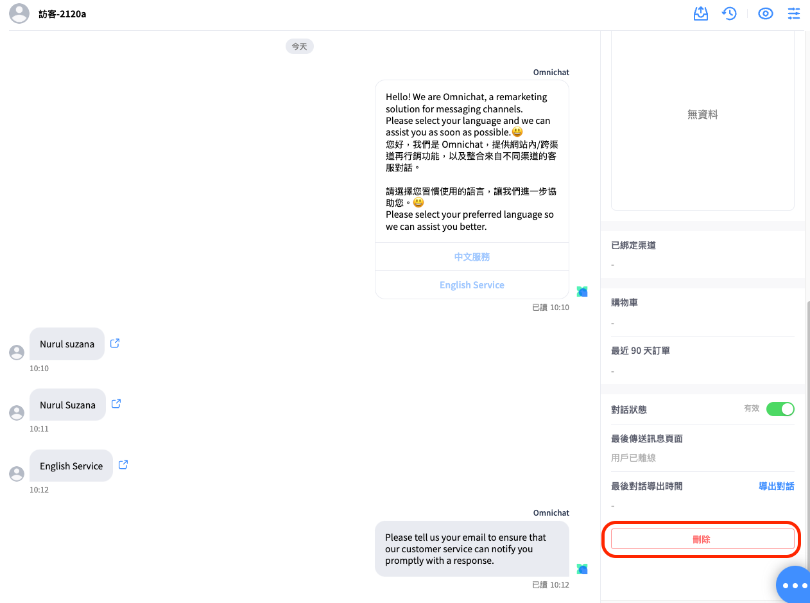

# 客戶資料

## 客戶資料

點選對話事件後，右側版面會顯示客戶資料。\
您可以點擊鉛筆符號，手動編輯 「客人名稱、郵件、電話，亦可以添加備註，記錄客人的其他資料」。


WhatsApp 對話事件會自動帶入客戶電話號碼欄位，**不提供修改電話號碼**。


### 隱藏客戶資料

您可以點擊右上方的眼睛圖示，將客戶資料隱藏，使對話介面更簡潔。

<figure><figcaption></figcaption></figure>


當您所購買的方案含有 Omnichat pixel 追蹤，可以透過 Omnichat pixel 追蹤到會員 ID，也會自動帶入客戶資料欄位 (前提是用戶有登入官網會員操作)


### 事件狀態紀錄

您可以查看到**對話中事件發生的日期、時間，可明確掌握對話歷程與事件負責人員。**

<figure><figcaption>
客戶資料
</figcaption></figure> <figure><figcaption>
點開 「事件狀態紀錄」 後
</figcaption></figure>

### 為客戶貼上標籤

1. 點擊 「添加標籤」 可以直接輸入標籤名稱
   * 當你開始輸入後，下方會出現團隊已建立且符合的標籤，可以直接選擇現有的標籤貼上
   * 輸入完畢按 「Enter」 鍵或右邊的 「**＋**」 圖示，可以把輸入的文字加為標籤，並加到客戶身上
   * 點擊 「X」 圖示，可以移除客人的標籤

<figure><figcaption>
添加標籤
</figcaption></figure>

2. 標籤頻次：
   * 點擊 「標籤頻次」 可依照貼標時間做篩選，查看貼標次數。
   * Omnichat 支援對客戶重複貼標，如貼上已存在的標籤，會跳出提醒  「要再次貼上此標籤嗎？」 以及 「標籤名稱」 ，確認後該標籤次數會 +1。

<figure><figcaption>
重複貼標提醒
</figcaption></figure> <figure><figcaption>
標籤頻次查看
</figcaption></figure> <figure><figcaption>
標籤頻次時間篩選
</figcaption></figure>


「[標籤管理](../she-qun-ke-hu-zi-liao-ping-tai/biao-qian-guan-li.md)」 → **依時間區間篩選：**

* 可以選擇時間區間，並匯出 **貼標統計數據** 或 **貼標逐筆紀錄**（查看每個客人在什麼渠道、透過什麽方式被貼上標籤）
* 目前最多僅能選擇30天的資料匯出


<figure><figcaption>
標籤管理 → <strong>依時間區間篩選</strong>
</figcaption></figure> <figure><figcaption>
匯出 <strong>貼標統計數據</strong> 或 <strong>貼標逐筆紀錄</strong>
</figcaption></figure>

### 客戶資料下半段版面說明

<figure><figcaption></figcaption></figure>

1. **已綁定渠道** 及 **前往對話**：\
   當消費者已完成 「社群身分綁定」 並透過已綁定的社群渠道向您發送對話時，您可以點擊 「其他對話」 切換至同一位消費者的其他社群渠道對話窗來進行回覆。\
   （以此圖 「網站對話渠道」 為例，可知此用戶也綁定過FB粉專及LINE渠道，點擊前往對話，可前往用戶以FB粉專／LINE渠道與您的對話事件中）

<figure><figcaption>
客戶資料：<strong>已綁定渠道</strong> 及 <strong>前往對話</strong>
</figcaption></figure>

2. **購物車及最近90天訂單**
3. **網頁渠道對話：**\
   須同時滿足 「有買Pixel方案＋用戶在登入官網會員下下單」，資料方能匯流至此。
4. **社群渠道對話：**\
   除滿足上述 「有買Pixel方案＋用戶在登入官網會員下下單」 條件外，用戶還必須 「已完成社群身份綁定」，資料方能匯流至此渠道對話事件中。
5. **對話狀態**：\
   如想封鎖特定用戶，不再收到他們訊息，可將 「狀態功能：有效」 關閉。\
   （之後如想收到對方訊息，再次啟用對話狀態即可）

<figure><figcaption>
對話狀態開關
</figcaption></figure> <figure><figcaption>
將對話狀態關閉
</figcaption></figure>

6. **最後傳送訊息頁面**：\
   顧客發問當下來自哪個頁面，且當顧客關閉網頁後，對話紀錄會即時更新成 「用戶已離線」，不會繼續保留先前最後傳送訊息頁面的連結記錄。


目前只有 **官網對話插件** 的對話事件才會顯示。


<figure><figcaption></figcaption></figure> <figure><figcaption></figcaption></figure>

7.  **導出對話** 及 **最後導出時間**：

    * 可針對個別對話，導出成  「CSV檔」 或 「Email」 型式。
    * 最後導出時間會顯示最後一次執行導出對話的時間。

    <figure><figcaption></figcaption></figure>

    * 匯出CSV檔案範例\
      （<mark style="color:red;">**建議使用**</mark> [<mark style="color:blue;">**Google Sheet**</mark>](https://docs.google.com/spreadsheets/) <mark style="color:red;">**開啟 CSV 檔案，避免因非 UTF-8 encoding 版本呈現亂碼的問題**</mark>）

<figure><figcaption></figcaption></figure>

&#x20;              **更多說明：**

&#x20;              **1. 時間：**&#x8A73;細記錄逐條對話的時間軸

&#x20;              **2. 由誰發出的對話：**&#x8209;例來說，機器人自動回覆、客戶、客服

&#x20;              **3. 名字：**&#x91DD;對真人客服部分，更詳細記錄其姓名

&#x20;              **4. 對話內容：**&#x8A73;細顯示該條訊息詳細內容


注意：

* 目前支援操作此功能的角色只有 「管理員」 。
* 針對沒有權限的角色，導出對話按鈕將會隱藏。
* 此功能為特殊設定，如您有需要可與您的專屬顧問或線上客服團隊提出申請。
* APP 不支援該功能。


8. **刪除對話：**\
   如想徹底刪除  「對話事件」 某位用戶與您的所有對話紀錄，則可以點選 「刪除」 按鈕達成。請注意刪除的對話將無法再復原（無法從對話事件庫中搜到）。


刪除動作有權限問題：目前僅有管理員、主管可刪除對話事件 ; 客服經理、客服人員不行刪除對話事件。


<figure><figcaption>
<strong>刪除對話</strong>
</figcaption></figure> <figure><figcaption>
<strong>刪除對話</strong>
</figcaption></figure>

### OMO綁定資訊

* 限 OMO 方案 會顯示
* 限 LINE、WhatsAPP 渠道 會顯示
* 限管理員/主管/銷售人員/銷售經理可以解除綁定

<figure><figcaption>
OMO綁定資訊
</figcaption></figure>

