# LINE群組對話

Omnichat 現在支援LINE群組對話囉！您可以在Omnichat上和客人進行LINE群組對話，不論是多位窗口、客人需要同步溝通，還是團隊協作處理問題，都能讓交流更順暢、訊息不漏接！🙌

以下我們將介紹如何建立LINE群組對話，如何在Omnichat後台管理群組對話，可以使用群組對話功能的角色有哪些，也包含了群組設定方式、訊息功能，以及對話操作流程👇：

* [適用角色](line-qun-zu-dui-hua.md#shi-yong-jue-se)
* [前置作業 - LINE Developers 後台前置設定](line-qun-zu-dui-hua.md#qian-zhi-zuo-ye-line-developers-hou-tai-qian-zhi-she-ding)
* [建立群組](line-qun-zu-dui-hua.md#jian-li-qun-zu)
* [管理群組](line-qun-zu-dui-hua.md#guan-li-qun-zu)
  * [加入群組](line-qun-zu-dui-hua.md#jia-ru-qun-zu)
  * [移除群組成員](line-qun-zu-dui-hua.md#yi-chu-qun-zu-cheng-yuan-bao-han-line-pin-pai-guan-fang-zhang-hao)
* [群組資料&群組名單](line-qun-zu-dui-hua.md#cha-kan-qun-zu-zi-liao-cheng-yuan-ming-dan)
* [群組訊息支援功能](line-qun-zu-dui-hua.md#qun-zu-xun-xi-zhi-yuan-gong-neng)
  * [訊息費用](line-qun-zu-dui-hua.md#xun-xi-fei-yong)
  * [支援的訊息類型](line-qun-zu-dui-hua.md#zhi-yuan-xun-xi-lei-xing)
  * [@提及功能](line-qun-zu-dui-hua.md#xun-xi-ti-ji-gong-neng)
  * [引用回覆功能](line-qun-zu-dui-hua.md#xun-xi-yin-yong-hui-fu-gong-neng)
  * [收回功能](line-qun-zu-dui-hua.md#xun-xi-shou-hui-gong-neng)
* [對話操作](line-qun-zu-dui-hua.md#dui-hua-cao-zuo)
  * [群組對話列表](line-qun-zu-dui-hua.md#qun-zu-dui-hua-lie-biao)
  * [群組對話篩選](line-qun-zu-dui-hua.md#qun-zu-dui-hua-shai-xuan)
  * 群組對話操作流程：[跟進](line-qun-zu-dui-hua.md#gen-jin-dui-hua)、[移轉](line-qun-zu-dui-hua.md#yi-zhuan-dui-hua)、[結束](line-qun-zu-dui-hua.md#jie-shu-dui-hua)、[重啟](line-qun-zu-dui-hua.md#zhong-qi-dui-hua)

### 適用角色

目前管理員、主管、客服經理和客服人員皆可使用此功能，銷售經理與銷售人員則尚未開放。

### 前置作業 - LINE Developers 後台前置設定

若要使用群組對話功能，請先依照以下步驟開啟設定：

1. 先到LINE Developers (開發者控制台) > Message API&#x20;

<figure><figcaption></figcaption></figure>

2. 在頁面中間位置找到「Allow bot to join group chats」，再點選「Edit」

<figure><figcaption></figcaption></figure>

3. 找到「功能切換」，啟用「接受邀請加入群組或多人聊天室」選項

<figure><figcaption></figcaption></figure>

若尚未啟用此設定，當您將官方帳號加入群組時，LINE系統會自動將該帳號移出群組，導致無法正常使用群組對話功能。

### 建立群組


群組需由**個人帳號**建立，無法使用品牌官方帳號建立。\
您可以在建立群組時一併加入官方帳號，或待群組建立完成後，再手動將官方帳號加入群組。


#### 第一步：在個人帳號中開啟LINE，在聊天頁面右上角點選「新增」，點選「群組」。

<figure>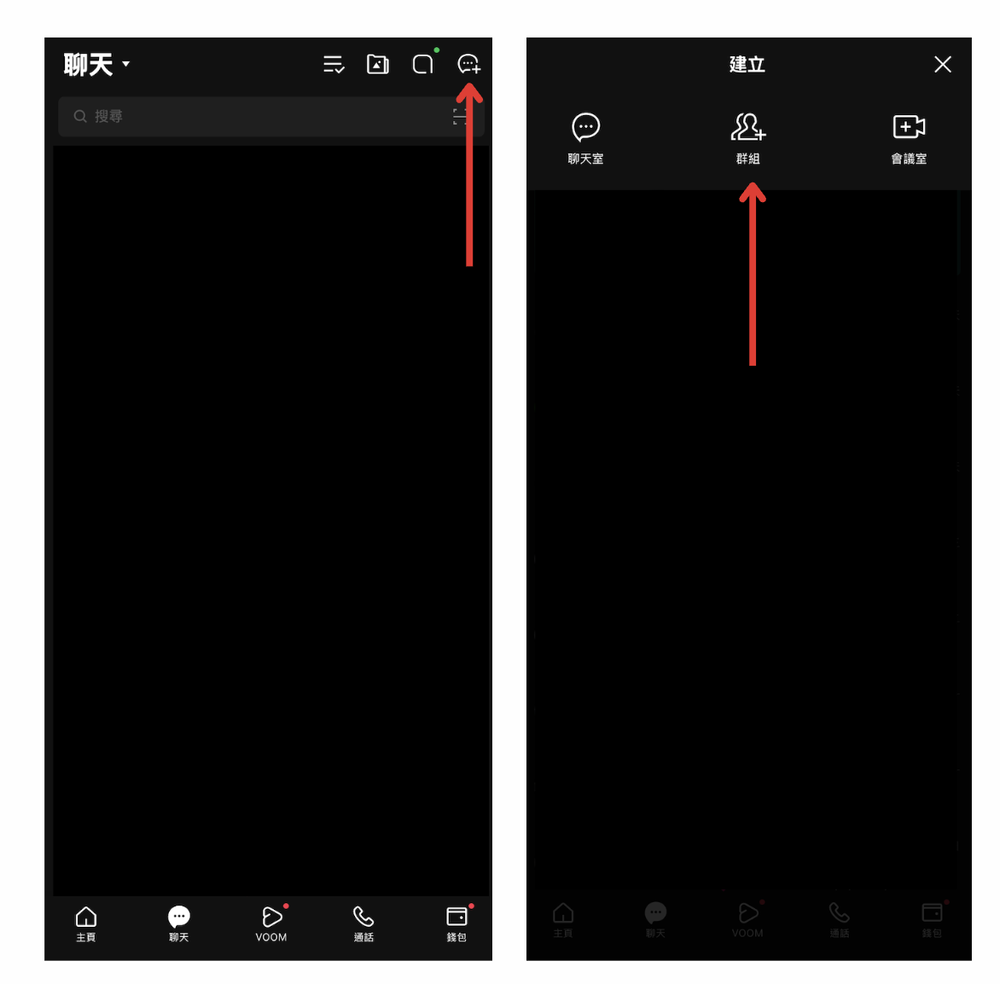<figcaption></figcaption></figure>

也可以從主頁上方，點選「加入好友」，再點選「建立群組」。

<figure>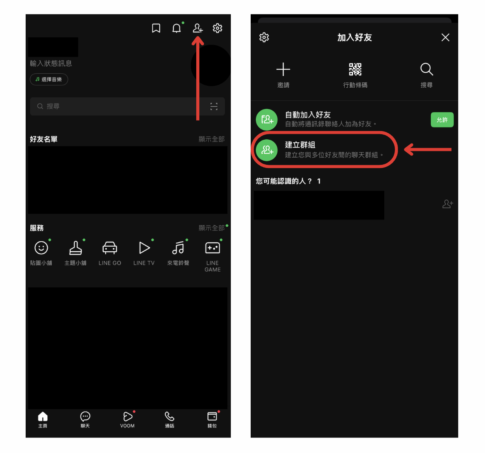<figcaption></figcaption></figure>

#### 第二步：選擇想邀請加入群組的好友，此時您也可以選擇一併勾選品牌的官方帳號，完成選擇後，點選右上角的「下一步」。

<figure>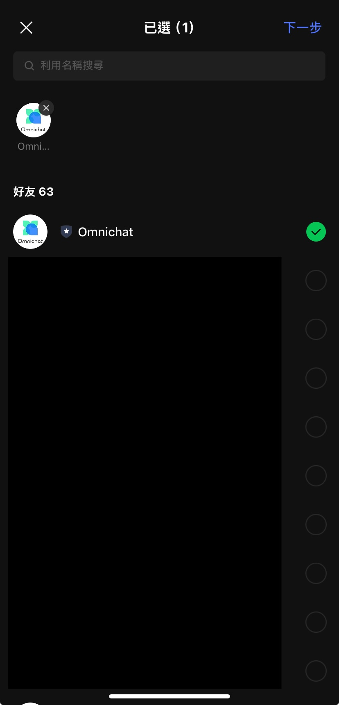<figcaption></figcaption></figure>

#### 第三步：設定群組資訊

<figure>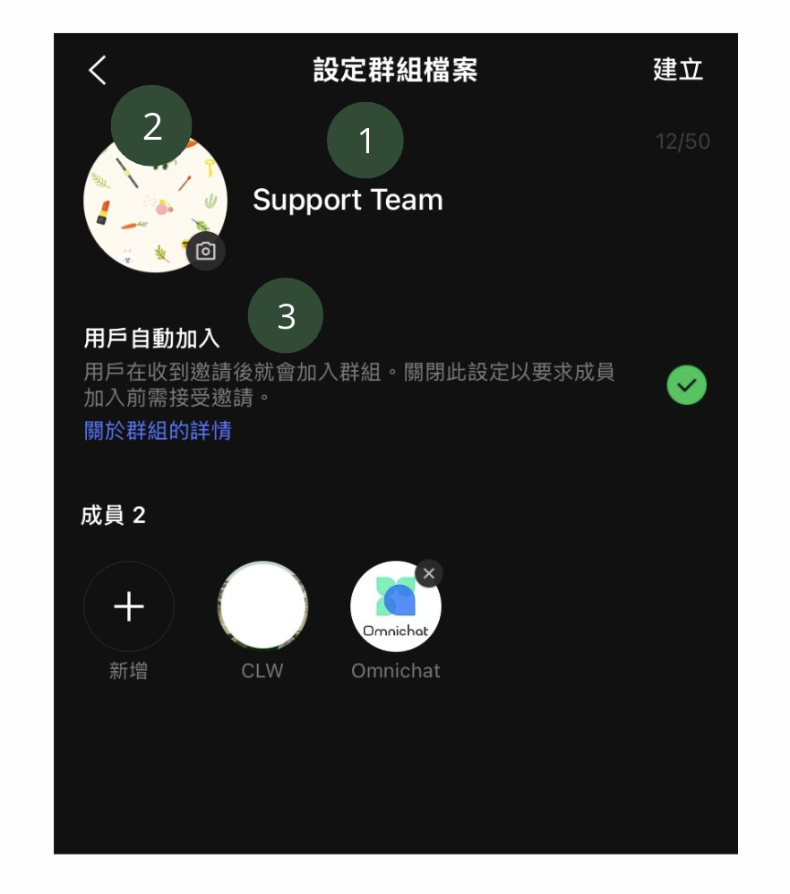<figcaption></figcaption></figure>

請依照下列項目完成群組設定：

1. **群組名稱**：輸入此群組的名稱，此名稱將會顯示在Omnichat後台的對話列表中。
2. **群組大頭貼**：可上傳一張代表群組的圖片，此頭貼將會顯示在Omnichat後台的對話列表中，有助於提高辨識度。
3. **用戶自動加入選項**：請依照需求選擇是否讓被邀請的好友自動加入群組。
   1. **設定為開啟**：被邀請的好友會自動加入群組。
   2. **設定為關閉**：
      * 邀請加入群組的好友將會收到邀請訊息，好友可以從收到的訊息中選擇參與或拒絕。
      * 若選擇拒絕，系統不會通知群組建立者，該好友的狀態會顯示為「受邀中」。


**提醒**：若您在建立群組時選擇關閉「自動新增好友到群組」的功能，之後仍可到群組設定裡修改，但僅限修改一次，修改後將無法再次變更。


<figure><figcaption></figcaption></figure>

### 管理群組

#### 加入群組


* 品牌官方帳號無法主動將其他人加入群組，僅能由現有群組成員，以個人帳號邀請好友/LINE品牌官方帳號加入。
* 一個群組僅能加入一個LINE官方帳號，若嘗試加入第二個LINE官方帳號，系統會自動阻擋。


加入LINE群組的方式可分成以下兩種情境：

1. **群組成員邀請好友加入群組**

在對話頁面點選右上角的圖示，接著點選「邀請」，選擇要加入群組的好友

<figure><figcaption></figcaption></figure>

加入好友後，當群組成員發送訊息，再重新整理頁面，對話頁面右下角的成員列表會自動更新。

<figure><figcaption></figcaption></figure>

2. **群組成員將LINE官方帳號加入群組**

* 您可以選擇在建立群組的同時加入品牌官方帳號，或在群組建立完成後再加入，兩種方式皆可行。
* 一旦品牌官方帳號成功加入群組，群組任一成員傳送訊息後，Omnichat系統會自動建立對話，對話會顯示於Omnichat後台對話的「待處理 - 真人客服」中。
* 需要特別注意的是，群組內的任何成員皆可將LINE官方帳號加入群組，無需品牌方同意。
* 由於系統不會記錄是由哪位成員發出邀請，因此無法查詢是誰將官方帳號加入群組。

<figure><figcaption></figcaption></figure>


若為群組協作對話（適用於有開通協作對話功能的團隊），跟進者可在「我的處理中」的對話裡新增協作成員，新增教學請見[這裡](xie-zuo-dui-hua.md)。


#### 移除群組成員

在LINE群組中，成員被移除的情境可分為以下三種：

1. **由群組內成員在LINE群組中手動移除其他成員**

<figure>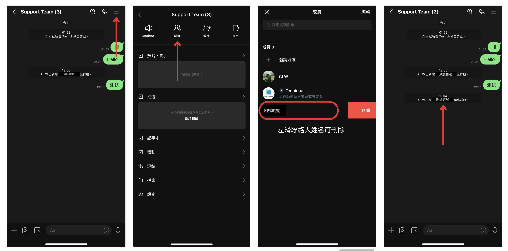<figcaption></figcaption></figure>

從LINE群組移除成員後，當群組有人傳送訊息，再重新整理頁面，您會在Omnichat對話頁面右下角看到該成員已不在名單中。

<figure>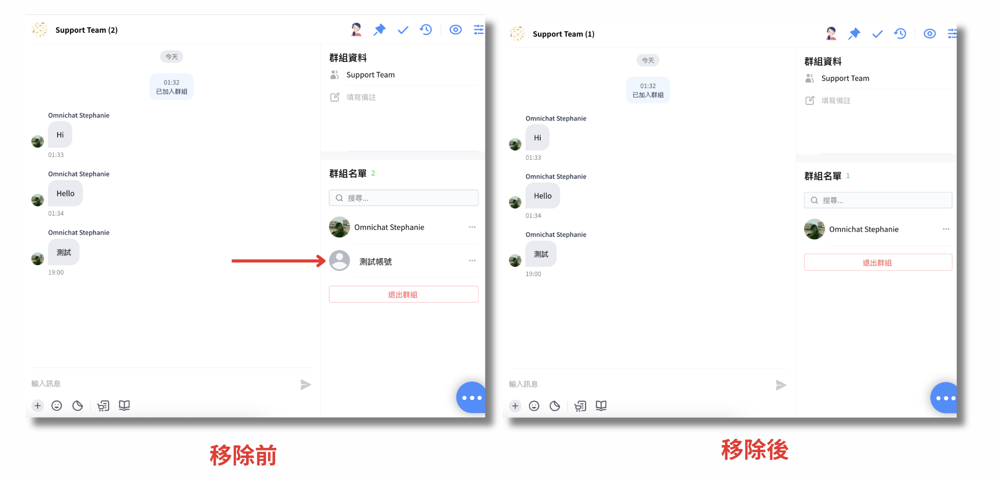<figcaption></figcaption></figure>

2. **品牌官方帳號被移出群組**

在以下兩種情況下，品牌官方帳號會被移出LINE群組：

* 被群組成員移除：當群組中的成員將品牌官方帳號從LINE群組中移除時，若該對話原本處於「待處理」或「處理中」，系統會自動結束該對話。
* 群組成員全部退出：當群組內所有成員皆已退出時，品牌官方帳號會被系統強制退出群組，若對話原本處於「待處理」或「處理中」，系統也會自動結束該對話。

3. **品牌官方帳號自行退出群組**

凡對話在「待處理 - 真人訊息」、「我的處理中」、「我的已結束」、「團隊已結束」狀態下，品牌可自行於對話右下角退出群組。

<figure>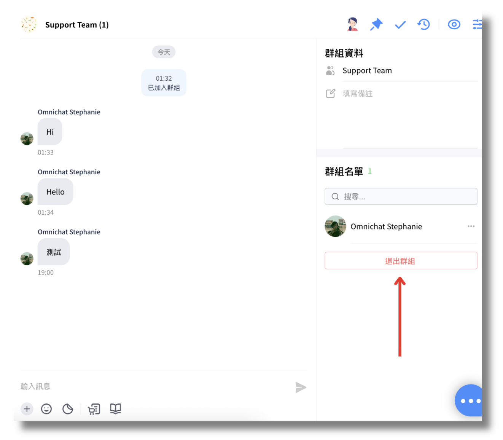<figcaption></figcaption></figure>


若為群組協作對話（適用於有開通協作對話功能的團隊），只有跟進者才能退出群組，協作者無法退出群組。


品牌官方帳號退出後，對話會有以下變動：

* 對話狀態
  * 群組對話會自動轉為「已結束」。
  * 若該對話原本有釘選狀態，會自動解除釘選。
  * 對話無法重啟，也無法再發送訊息。
* 對話內容顯示
  * 群組對話紀錄仍會保留在「已結束」對話列表中。
  * 群組人數會顯示為 0。
  * 若LINE帳號為藍盾或綠盾，將無法查看原本群組的成員名單。

### 查看群組資料&群組名單

#### 群組資料

<figure>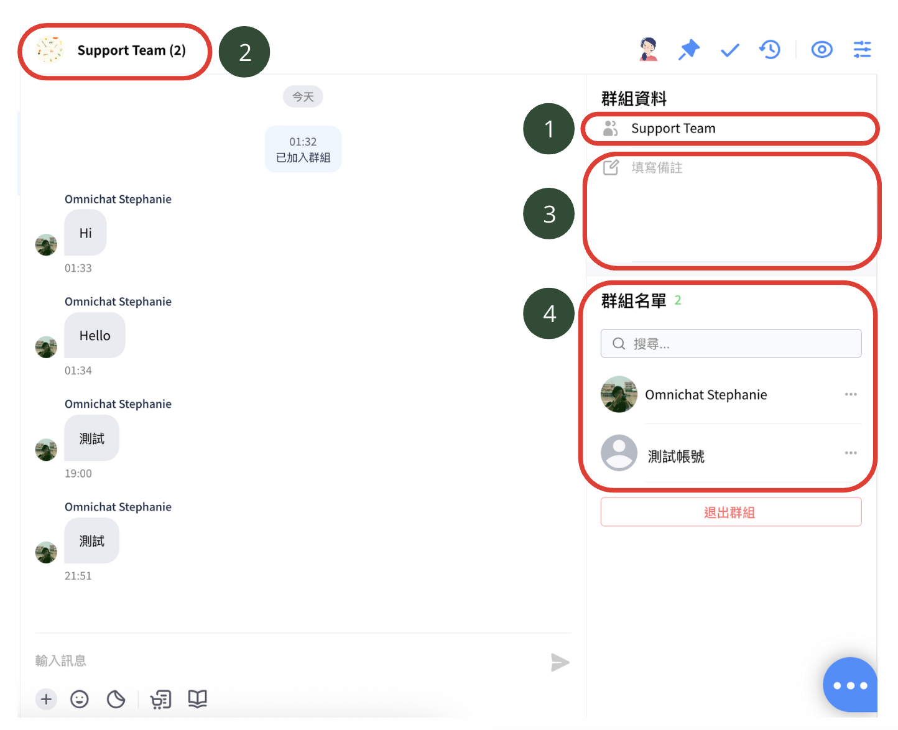<figcaption></figcaption></figure>

1. 群組名稱：
   * 品牌端無法編輯群組名稱，僅能由群組成員端修改。
   * 群組成員端可編輯的群組名稱長度上限為 50 字。
   * 名稱修改後不會立即同步到Omnichat後台，系統會在「有新的群組成員加入或退出」時，才更新顯示的名稱。
2. 群組大頭貼
   * 品牌端無法編輯群組大頭貼，僅能由群組成員端修改。
   * 如果群組成員沒有設定大頭貼，會顯示LINE預設的大頭貼。
   * 更換大頭貼後不會立即同步到Omnichat後台，系統會在「有新的群組成員加入或退出」時才會更新。


群組名稱以及大頭貼可在LINE群組裡修改，步驟如下：

1. 點選LINE聊天頁面右上角三條橫槓
2. 點選「設定」
3. 點選「相機圖示」可更換群組大頭貼，點選「群組名稱」可修改群組名稱


<figure>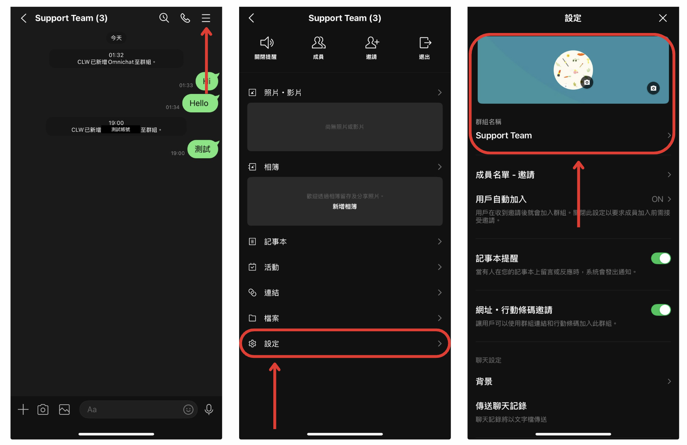<figcaption>
修改群組名稱及大頭貼
</figcaption></figure>

3. 備註
   * 文字上限：最多可輸入 1000 字。
   * 備註內容僅供品牌端在Omnichat後台檢視與編輯。
4. 群組名單：顯示除了品牌官方帳號以外的成員名單。

#### 不同LINE認證類型的群組成員顯示差異

| 藍盾、綠盾帳號                                                   | 灰盾帳號                                                                                                                     |
| --------------------------------------------------------- | ------------------------------------------------------------------------------------------------------------------------ |
| 和LINE品牌官方帳號在同一群組中的成員，不論是已封鎖品牌、尚未成為好友，或已成為好友的客人，皆可顯示其顧客資料。 | <ul><li>可顯示群組人數，但因受到 LINE 官方限制，無法顯示群組成員的顧客資料。</li><li>系統會顯示提示文字：「現有 LINE 方案不支援取得群組成員資料，請先向 LINE 進行驗證或升級為高級帳戶」。</li></ul> |

<figure>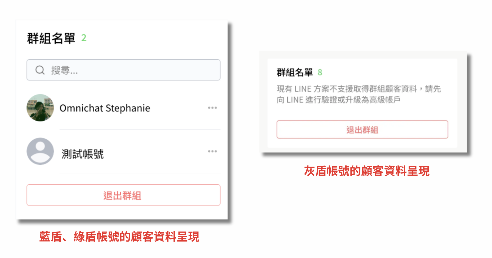<figcaption></figcaption></figure>

#### 群組名單

<figure>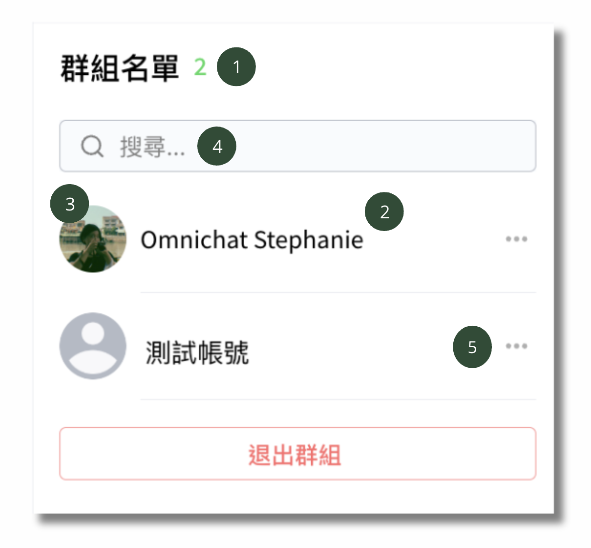<figcaption></figcaption></figure>

1. 群組人數
   * 人數不包含LINE品牌官方帳號。
   * 每個群組中只能加入1個LINE品牌官方帳號，人數上限含品牌官方帳號最多共500位。
2. 成員名稱
   * Omnichat社群聯絡人：顯示Omnichat後台的社群聯絡人姓名。
   * 非Omnchat社群聯絡人：顯示成員於LINE裡自己設定的名稱。
3. 成員大頭貼：若成員更新大頭貼，當群組有成員傳送訊息，再重新整理頁面後，系統會同步更新該成員的大頭貼。
4. 搜尋成員：搜尋群組成員名稱。
5. 點選右側「⋯」圖示後，會根據該成員是否為Omnichat聯絡人顯示不同選項。

<figure>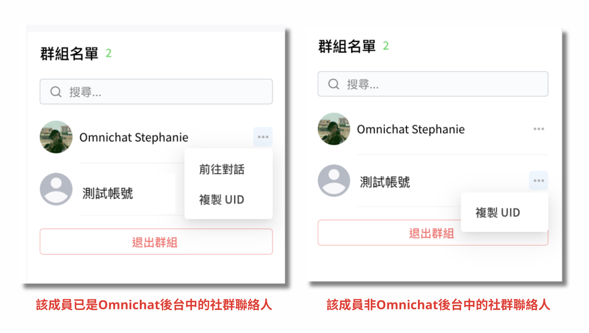<figcaption></figcaption></figure>

* 已是Omnichat社群聯絡人的成員，會顯示以下兩個操作選項：
  * **前往對話**
    * 系統會依據該成員的對話狀態和客服人員的權限，顯示以下三種結果：
      1. **品牌已和成員建立過對話，且客服人員具備查看對話權限**\
         　→ 點選「前往對話」後，會另開頁面，前往該聯絡人的對話畫面。
      2. **品牌已和成員建立過對話，但客服人員無查看對話權限**\
         　→ 點選「前往對話」後，會顯示提示訊息：「沒有權限查看此顧客對話」。
      3. **品牌未曾和成員建立過對話**\
         　→ 點選「前往對話」後，系統會自動建立一筆新對話。
  * **複製 UID**
* 非Omnchat社群聯絡人：由於該成員尚未成為 Omnichat 的社群聯絡人，無法建立對話，因此只有複製 UID 的選項。


名單更新：當群組人數變動（例如有成員加入或退出）時，需待群組成員傳送訊息，再重新整理頁面後，群組總人數與成員名單才會自動更新。


### 群組訊息支援功能

#### 訊息費用

品牌在群組內發送訊息時，系統會依照群組人數計算訊息用量，群組人數以Omnichat後台對話中顯示的數字為準，人數不包含品牌帳號本身。

訊息用量的計算方式為：品牌每發送1則訊息 × 群組人數 = 訊息用量

* 範例：假設某個群組裡有2位成員，每則訊息的費用為0.5元／人：
  * 當品牌發送1則訊息，這則訊息會送給群組裡的2位成員，訊息用量為1 x 2 = 2則訊息，費用為 1 x 2 × 0.5 = 1 元。
  * 當品牌發送10則訊息，每則都會送給這2位成員，訊息用量為10 x 2 = 20，費用為 10 × 2 × 0.5 = 10 元。

#### 支援的訊息類型

| 支援的訊息類型                                                                                                                     | 不支援的訊息類型                                                                 |
| --------------------------------------------------------------------------------------------------------------------------- | ------------------------------------------------------------------------ |
| <ul><li>文字、emoji</li></ul><ul><li>圖片</li><li>影片</li><li>音訊</li><li>預存回覆 - 自訂訊息 (文字、圖片、影片)</li><li>導購連結</li><li>貼圖</li></ul> | 

<ul><li>預存回覆 - 機器人</li><li>優惠券</li><li>檔案</li><li>聯絡人變數</li></ul> |

#### 訊息@提及功能

* 此功能僅限群組成員以個人帳號使用，LINE品牌官方帳號無法使用。
* 群組成員可使用＠提及的情境如下：
  1. 群組成員提及其他成員：可使用 「@成員名稱」 直接標註同群組內的其他成員。
  2. 成員提及群組內所有人：可使用 「@All」 提及整個群組成員。
  3. 成員提及LINE品牌官方帳號：可使用 「@LINE品牌官方帳號」 提及品牌。
     * 若品牌帳號被提及，對話列表中會顯示「您已被標註」的提示訊息，該提示會一直顯示，直到品牌已讀該則訊息為止。
     * 點擊該提示後，系統會直接跳轉到被提及的訊息位置，方便查看上下文內容。

<figure><figcaption></figcaption></figure>


只能在手機版LINE中@LINE官方帳號，網頁版LINE無法@LINE官方帳號。


#### 訊息引用回覆功能

* 此功能僅限群組成員以個人帳號使用，LINE品牌官方帳號無法使用。
* 當群組成員於LINE中使用引用回覆功能時，Omnichat後台會同步顯示其引用訊息。

<figure>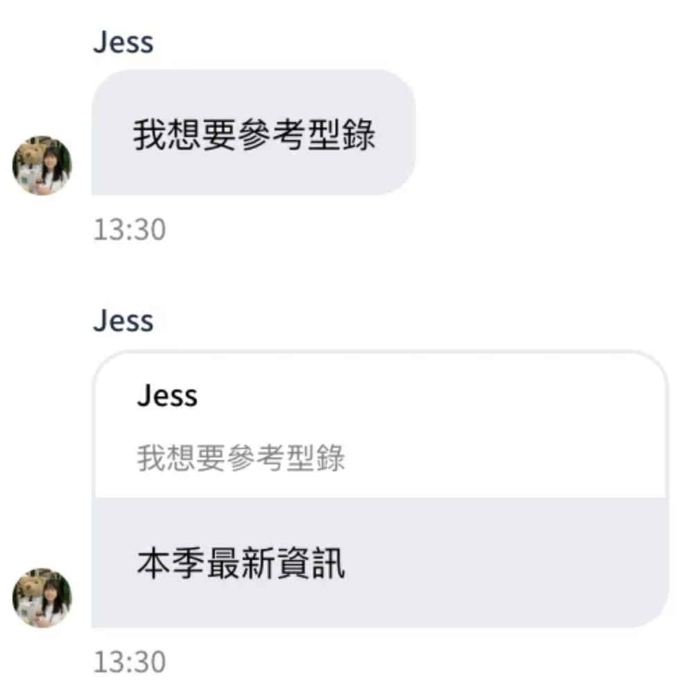<figcaption></figcaption></figure>

#### 訊息收回功能

此功能僅限群組成員以個人帳號使用，基於LINE的限制，品牌官方帳號無法使用收回功能。

當成員在群組中收回訊息時，該則訊息會被系統改為顯示：`已收回一則訊息`

* Omnichat後台會依照系統語系顯示。
* Omnichat不會儲存成員收回前的原訊息內容，一旦收回訊息，將無法查找、還原訊息。

<figure>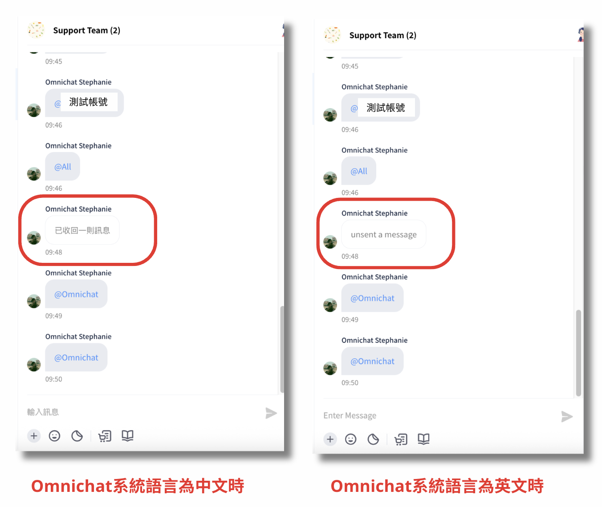<figcaption></figcaption></figure>


#### 訊息收回後的對話預覽顯示

* 若被收回的是最新訊息，預覽內容會自動改為上一則訊息，若對話中沒有其他訊息，預覽會顯示為空白。
* 若被收回的是帶有@提及的訊息，預覽會依下列情況更新：
  * 若還有其他被@提及的訊息，預覽內容會顯示最新（後）一則訊息。
  * 若沒有其他被@提及的訊息，預覽會維持顯示「您已被標註」的提示，直到品牌帳號已讀該訊息為止。


### 對話操作

#### 群組對話列表

<figure><figcaption></figcaption></figure>

1. 群組名稱：顯示群組成員自訂的名稱+群組人數
   * 當群組名稱太長時，系統會隱藏中間名稱，並顯示最後三個字，例如：Omnichat…發群組 (19)
2. 訊息預覽
   * 訊息內容：顯示最新（後）一則訊息內容，如果群組內沒有任何訊息，則不顯示。
   * 訊息時間：顯示最新（後）一則訊息發出的時間，如果群組內沒有任何訊息，則顯示群組建立時間。
3. 未讀訊息：比照 1 對 1 對話邏輯。
4. 釘選及超時等候：比照 1 對 1 對話邏輯。
   * [釘選對話](https://docs.omnichat.ai/features/omnichannel-messenger/dui-hua-jin-jie-gong-neng#ding-xuan-dui-hua-gong-neng)
     * 只有「我的處理中」的對話可以被釘選。
     * 可在對話列表中直接操作釘選。
     * 一旦對話被結束，釘選狀態會自動取消。
   * [超時等候](https://docs.omnichat.ai/features/omnichannel-messenger#dui-hua-shi-jian-xian-shi-gu-ke-deng-hou-shi-jian)支援超時等候功能。


目前尚未支援透過群組名稱搜尋群組對話，此搜尋功能正在開發中。


#### 群組對話篩選

根據對話的處理狀態，使用不同的條件來篩選和排序群組對話，協助您更快速找到需要處理的對話。

<figure><figcaption></figcaption></figure>

1. **待處理對話**

<figure>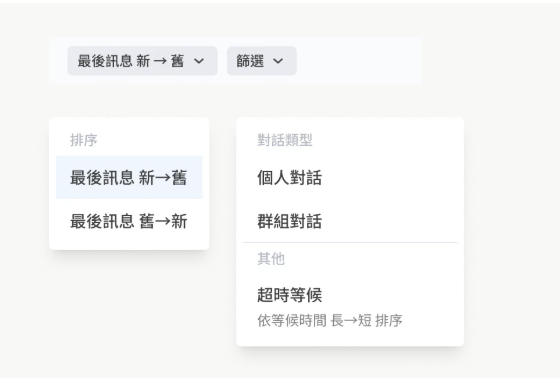<figcaption></figcaption></figure>

* 排序條件
  * 依照最後一則訊息時間排序：由新到舊 / 由舊到新
* 篩選條件
  * 對話類型：系統預設顯示全部對話，可選擇僅顯示個人對話或群組對話。
  * 超時等候時間：由長至短排列

2. **處理中對話**

<figure>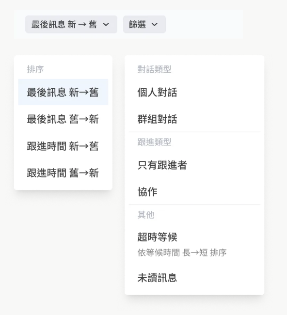<figcaption></figcaption></figure>

* 排序條件
  * 最後訊息時間：由新到舊 / 由舊到新
  * 跟進時間：由新到舊 / 由舊到新
* 篩選條件
  * 對話類型：系統預設顯示全部對話，也可選擇僅顯示個人對話或群組對
  * 跟進類型：系統預設顯示全部由跟進者跟進的對話，也可選擇僅顯示跟進對話或協作對
  * 其他條件：可篩選「超時等候」或「未讀訊息」

3. **已結束對話**：已結束狀態下無排序功能，可依以下條件篩選：

<figure>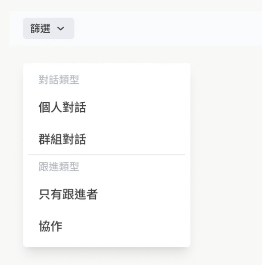<figcaption></figcaption></figure>

* 對話類型：系統預設顯示全部對話，可選擇僅顯示個人對話或群組對。
* 跟進類型：系統預設顯示全部由本人跟進的對話，可選擇僅顯示本人跟進的對話或協作對話

#### 群組對話操作流程：跟進、移轉、結束、重啟

#### 跟進對話

* 從「待處理 - 真人客服」中跟進：
  * 支援批量操作。
  * 可從「待處理 - 真人客服」跟進的角色：管理者、主管、客服經理、客服人員。
* 從「團隊處理中」中跟進：
  * 不支援批量操作。
  * 可從「團隊處理中」跟進的角色：管理者、主管、客服經理。

#### 移轉對話

群組對話在「處理中」狀態時，可由跟進者將對話移轉給其他團隊成員。

* 僅限個別移轉，不支援批次移轉。
* 可使用「移轉」功能的角色：管理者、主管、客服經理、客服人員。

#### 結束對話

群組對話可在「待處理」或「處理中」時結束，有支援批次結束功能。

* 群組內成員再次發送訊息時，對話會重新回到「待處理 - 真人客服」中。
* 可使用「結束」功能的角色：
  * 「待處理」：可由管理者、主管、客服經理、客服人員操作。
  * 「處理中」：僅限跟進者可結束對話。


若為群組協作對話（適用於有開通協作對話功能的團隊），群組內成員再次發送訊息時，對話會回到「處理中」。


#### 重啟對話

* 可批次重啟。
* 可使用「重啟」功能的角色：
  * 對話跟進者可從「我的已結束」中重啟。
  * 管理者、主管、客服經理可從「團隊已結束」中重啟。
