# 群發訊息（OMO限定）


* 限購 OMO 方案可以使用此功能，並僅限 **「銷售經理」、「銷售人員」** 角色可使用。
* 僅能向對話事件狀態為 **「我的事件－處理中」** 事件的消費者使用。



* **群發訊息**：針對 LINE/Facebook/Instagram/WhatsApp 用戶發送（<mark style="color:red;">不支援網頁渠道</mark>）。
* **群發範本訊息**：針對 WhatsApp 用戶發送。


## 群發訊息設定流程（WEB網頁版）

#### 1. 對話頁面 -> 我的事件-處理中-> 點擊右上方選單選擇 「群發訊息」

<figure>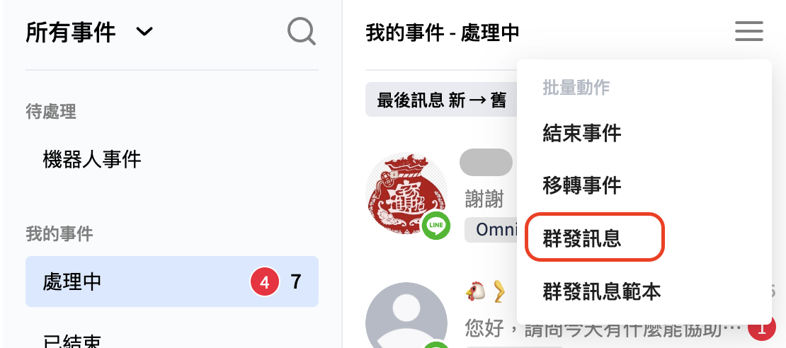<figcaption>
群發訊息位置
</figcaption></figure>

#### 2. 點擊左上方 「全選」 或點擊右上方漏斗進行 「篩選」

<figure>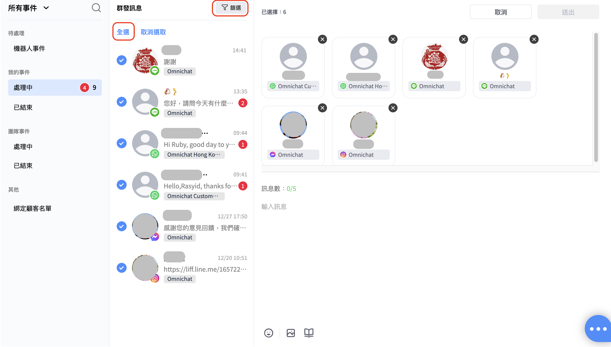<figcaption>
全選or篩選
</figcaption></figure> <figure><figcaption>
篩選詳情
</figcaption></figure>

#### 3. 顧客選取完成後，上傳/輸入群發內容，點擊 「發送」 即可完成群發訊息

<figure>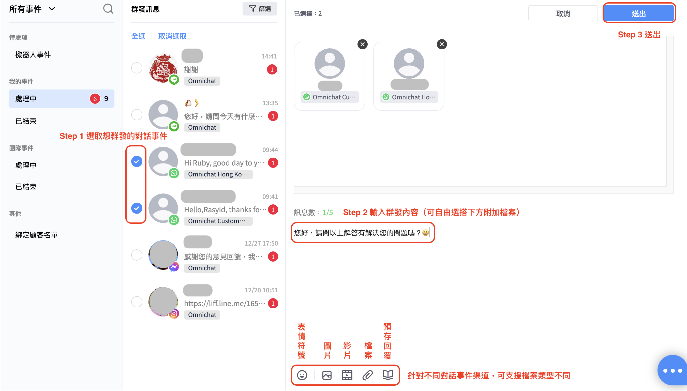<figcaption>
發送群發訊息步驟
</figcaption></figure>


WEB 版群發訊息可發送 「圖片訊息」 與 「文字訊息」 總共五則。&#x20;


#### 針對不同對話事件渠道，支援不同檔案類型如下

<table><thead><tr><th width="155">渠道</th><th width="155" align="center">LINE</th><th width="96">Facebook</th><th width="154">Instagram</th><th>WhatsApp</th></tr></thead><tbody><tr><td>Emoji</td><td align="center">✔</td><td>✔</td><td>✔</td><td>✔</td></tr><tr><td>圖片</td><td align="center">✔</td><td>✔</td><td>✔</td><td>✔</td></tr><tr><td>影片</td><td align="center">✔</td><td>✔</td><td><mark style="color:red;"><strong>✕</strong></mark></td><td>✔</td></tr><tr><td>檔案</td><td align="center"><mark style="color:red;"><strong>✕</strong></mark></td><td>✔</td><td><mark style="color:red;"><strong>✕</strong></mark></td><td>✔</td></tr><tr><td>預存回覆</td><td align="center">✔</td><td>✔</td><td>✔</td><td>✔</td></tr></tbody></table>

## 群發訊息範本設定流程（WEB網頁版）

#### 1. 對話頁面 -> 我的事件-處理中->點擊右上方選單選擇 「群發訊息範本」

<figure>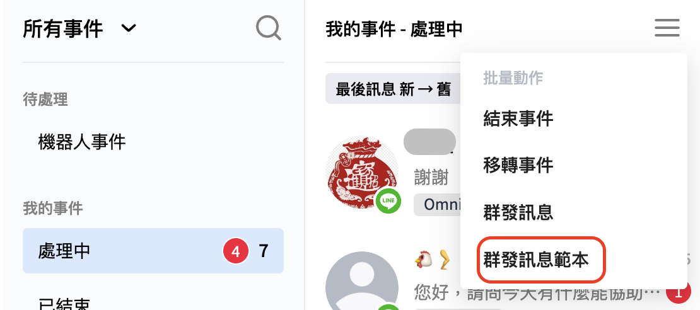<figcaption>
群發訊息範本位置
</figcaption></figure>

#### 2. 點擊左上方 「全選」 或點擊右上方漏斗進行 「篩選」

<figure>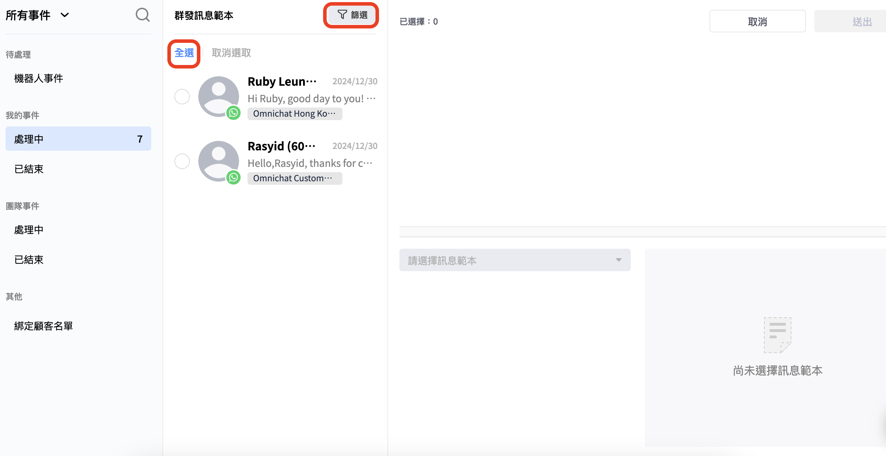<figcaption>
全選or篩選
</figcaption></figure> <figure>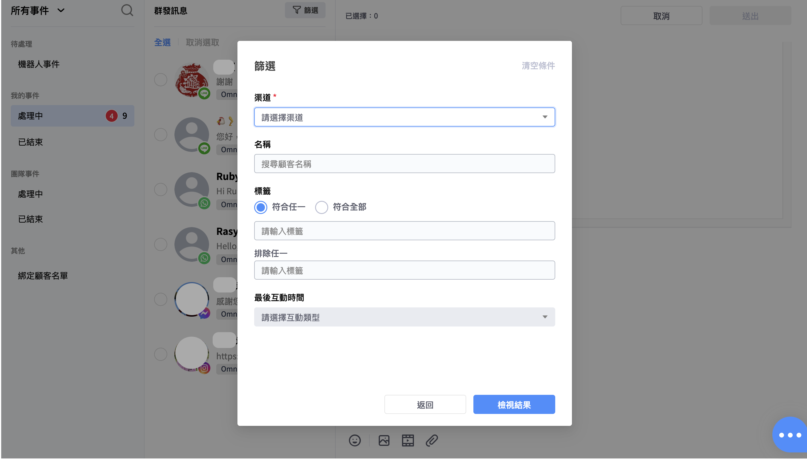<figcaption>
篩選詳情
</figcaption></figure>

#### 群發訊息範本衝突提示


注意：如篩選的對話來自不同 WABA號碼，則會跳出 「請重新選擇對話事件。訊息範本僅支援發送相同WhatsApp商業帳號的顧客」 此一錯誤提示訊息。


<figure>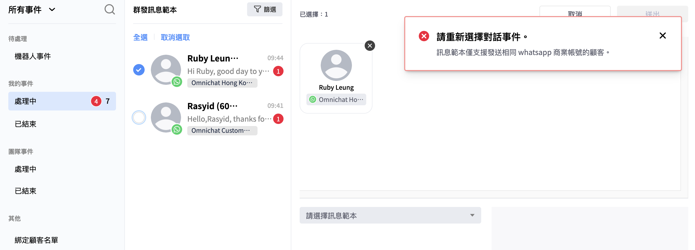<figcaption>
訊息範本衝突提示／錯誤提示
</figcaption></figure>

#### 3. 顧客選取完成後，挑選訊息範本及編輯內容，點擊 「發送」 即可完成群發訊息

您必須事先[建立好WhatsApp範本訊息](../tong-xun-qu-dao/integrations/whatsapp-business-api-zheng-he-dao-omnichat/chuang-jian-whatsapp-fan-ben-xun-xi.md)，此處才可選到該範本及送出群發訊息範本。

<figure><figcaption>
發送群發訊息範本步驟
</figcaption></figure>

## 綁定顧客群發

* 店員可以直接選擇綁定顧客進行群發
* 不能跨渠道（WhatsApp / LINE）發送，只可單渠道發送
* 暫時不能根據對話狀態篩選名單（待處理、處理中、已結束）

<figure>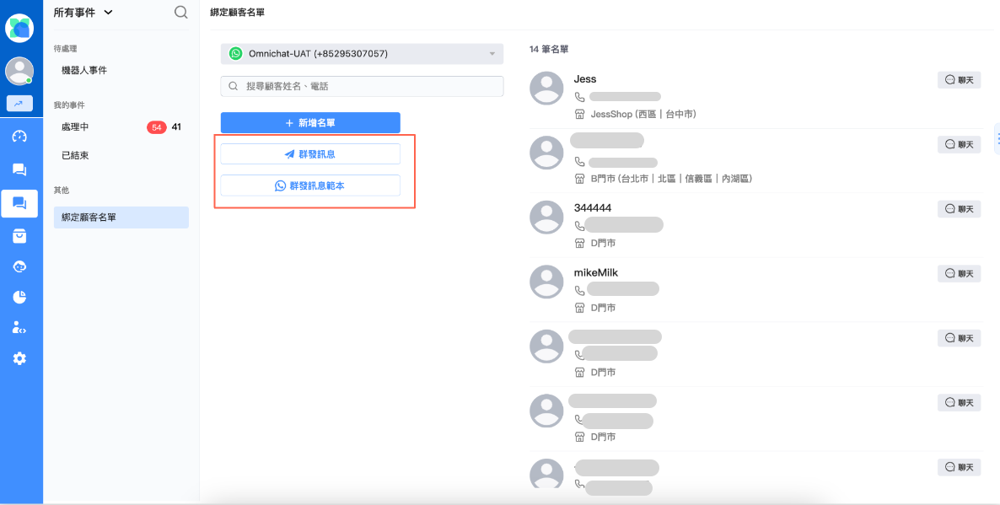<figcaption>
綁定顧客群發
</figcaption></figure>

<figure>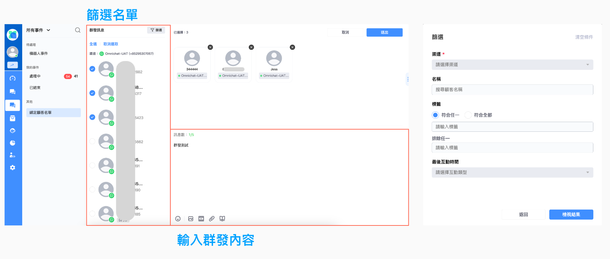<figcaption>
綁定顧客群發
</figcaption></figure>

## 群發訊息設定流程（APP版）

#### 1. 對話頁面 → 我的事件－處理中 → 點擊右上方選單選擇 「群發訊息」

<figure>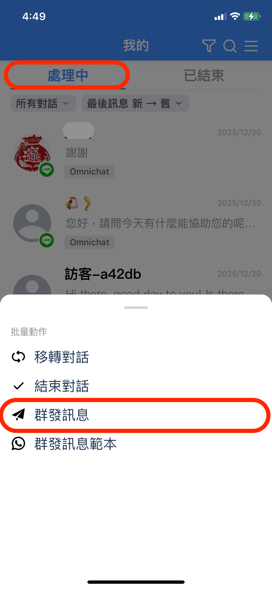<figcaption></figcaption></figure>

#### 2. 點擊左上方 「全選」 或點擊右上方漏斗進行 「篩選」

<figure><figcaption>
全選或篩選
</figcaption></figure> <figure><figcaption>
篩選詳情
</figcaption></figure>

#### 3. 顧客選取完成後，挑選訊息範本及編輯內容，點擊 「發送」 即可完成群發訊息

<figure><figcaption>
挑選媒體
</figcaption></figure> <figure><figcaption>
輸入文字後可發送
</figcaption></figure>

#### 針對不同對話事件渠道，支援不同檔案類型如下

* 因手機打字可直接輸入Emoji，因此App介面皆不提供Emoji選項。

<table><thead><tr><th width="142">渠道</th><th width="93" align="center">LINE</th><th width="156">Facebook</th><th width="154">Instagram</th><th>WhatsApp</th></tr></thead><tbody><tr><td>圖片</td><td align="center">✔</td><td>✔</td><td>✔</td><td>✔</td></tr><tr><td>影片</td><td align="center">✔</td><td>✔</td><td>✔（WEB不支援）</td><td>✔</td></tr><tr><td>檔案</td><td align="center"><mark style="color:red;"><strong>✕</strong></mark></td><td>✔（WEB不支援）</td><td>✔（WEB不支援）</td><td>✔</td></tr><tr><td>預存回覆</td><td align="center">✔</td><td>✔</td><td>✔</td><td>✔</td></tr></tbody></table>


1. 群發訊息數量會計算於 「[導購連結報表>總訊息數目](../tong-ji-biao/product-referral.md#shang-pai-shu-ju-zong-lan)」 中。
2. 若群發訊息內容帶有官網連結，會記錄於 「[導購連結報表>導購連結數量](../tong-ji-biao/product-referral.md#shang-pai-shu-ju-zong-lan)」 中。
3. 若群發訊息內容帶有非官網連結，會記錄於 「[導購連結報表>導購連結數量](../tong-ji-biao/product-referral.md#shang-pai-shu-ju-zong-lan)」 中。


## 群發訊息範本設定流程（APP版）

#### 1. 對話頁面 → 我的事件－處理中 → 點擊右上方選單選擇 「群發訊息範本」

<figure>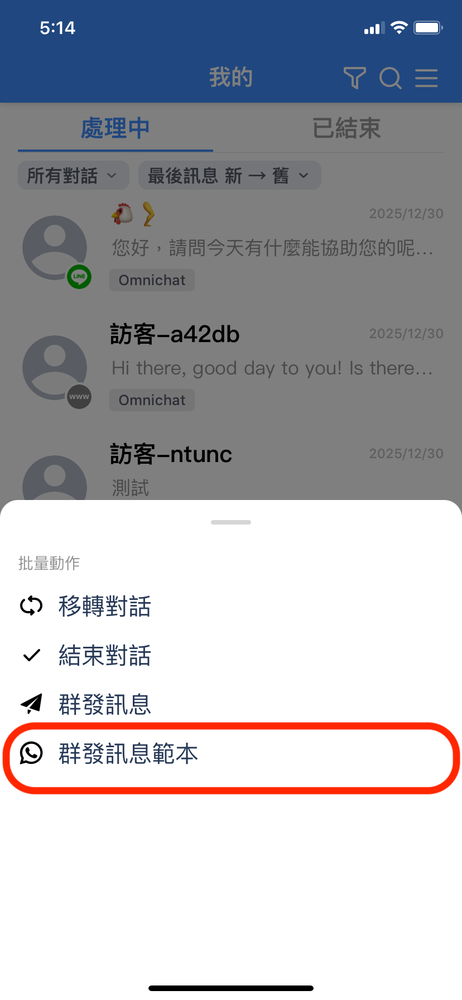<figcaption></figcaption></figure>

#### 2. 點擊左上方 「全選」 或點擊右上方漏斗進行 「篩選」

<figure><figcaption>
全選或篩選
</figcaption></figure> <figure><figcaption>
篩選詳情
</figcaption></figure>

#### 3. 顧客選取完成後，挑選訊息範本及編輯內容，點擊 「發送」 即可完成群發訊息

<figure>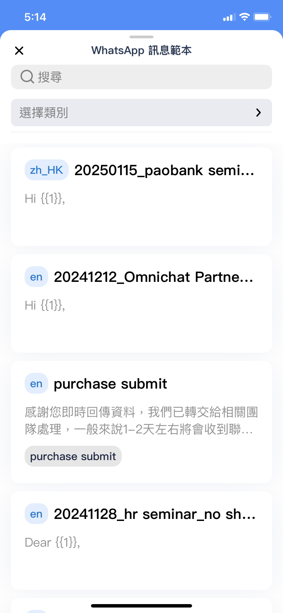<figcaption>
挑選範本訊息
</figcaption></figure> <figure>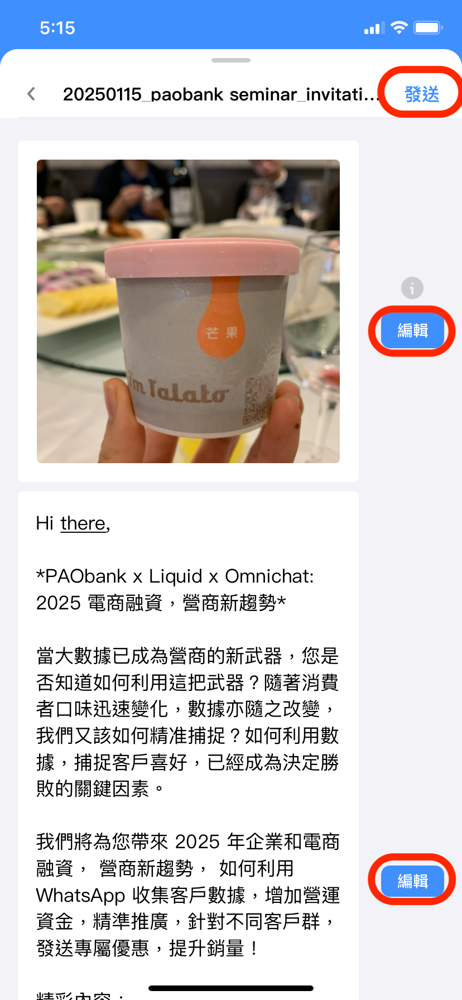<figcaption>
編輯內容後可發送
</figcaption></figure>

