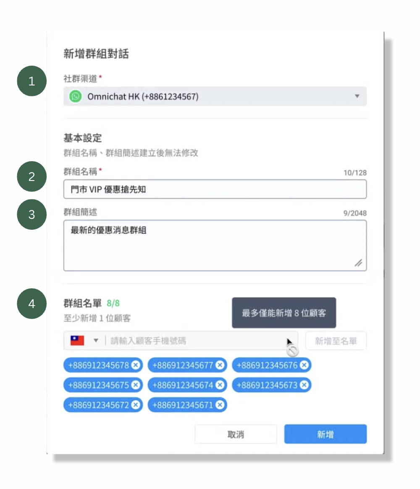
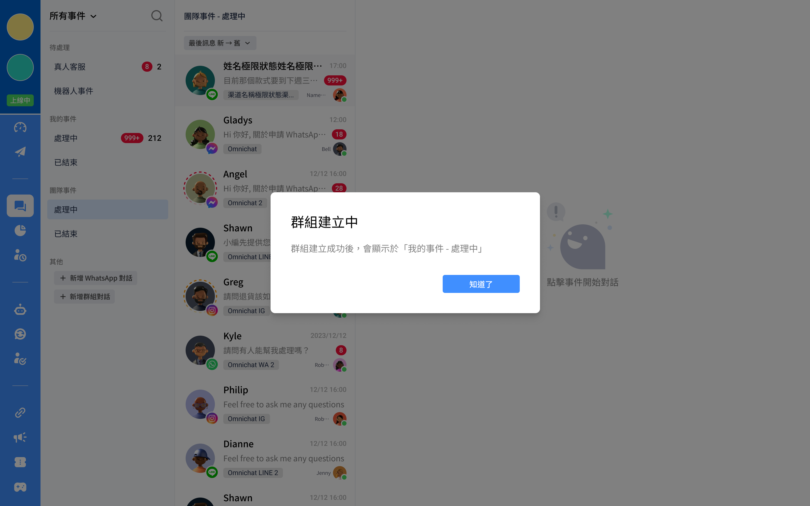
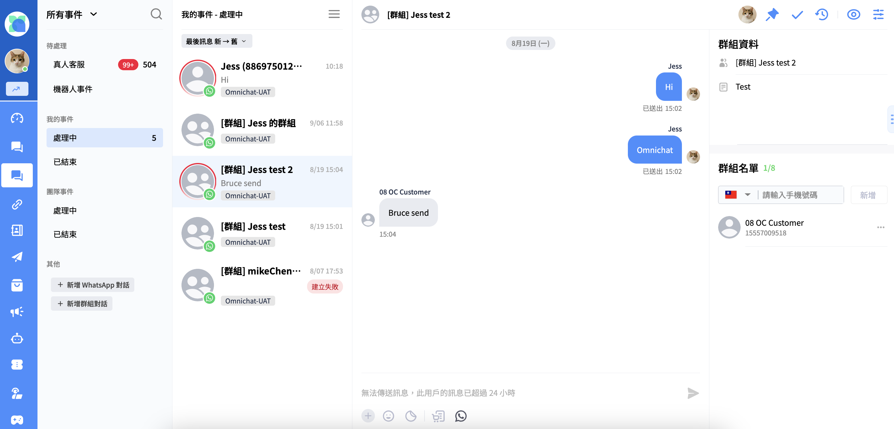
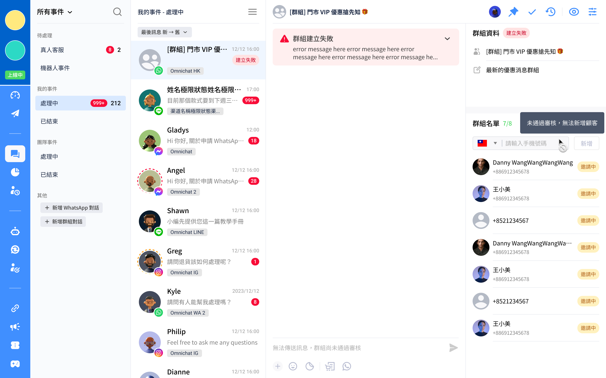

# 群組對話（WhatsApp限定）

功能說明

[建立群組](qun-zu-dui-hua-whatsapp-xian-ding.md#jian-li-qun-zu)

[群組對話狀態](qun-zu-dui-hua-whatsapp-xian-ding.md#qun-zu-dui-hua-zhuang-tai)

[新增、刪除、查看群組顧客名單](qun-zu-dui-hua-whatsapp-xian-ding.md#xin-zeng-shan-chu-cha-kan-qun-zu-gu-ke-ming-dan)

[對話建立移轉、跟進、結束、重啟規則](qun-zu-dui-hua-whatsapp-xian-ding.md#dui-hua-jian-li-yi-zhuan-gen-jin-jie-shu-zhong-qi-gui-ze)

[訊息發送類型與限制規範](qun-zu-dui-hua-whatsapp-xian-ding.md#dui-hua-fa-song-lei-xing-yu-xian-zhi-gui-fan)

## 功能說明

此功能提供更靈活的溝通管理，讓您在同一對話中最多新增 8 組手機號碼，方便與多位成員同時互動，隨時掌握顧客訊息，避免因間接傳達導致資訊錯誤，幫助您更全面地回應每一位顧客的需求，提升服務效率與準確性。


* 目前此功能支援的平台及版本包括：
  * Web 對話 2.0 版本（不支援1.0版本）
  * iOS APP
  * Android APP
* 有權限使用此功能的角色包括：
  * 管理員
  * 主管
  * 客服經理
  * 客服人員
  * 行銷客服
* 如需啟用此功能，可聯繫您的專屬顧問，或是從Omnichat後台右下角對話插件聯繫支援團隊。


## 建立群組

### 第一步：於對話頁面中，點選 「新增群組」 按鈕

<figure><figcaption>
新增群組對話
</figcaption></figure>

### 第二步：建立/編輯群組對話資訊

<figure><figcaption>
建立/編輯群組資訊 
</figcaption></figure>

1.  **社群渠道**

    包含團隊所有已串接之社群渠道及網頁渠道，並以選擇的帳號作為建立群組帳號。
2. **基本設定 － 群組名稱**
   1. 此欄為必填欄位。
   2. 字數限制 ≤ 128 byte（byte 計算方式見下方說明）。
   3. 不支援以 emoji 方式呈現群組名稱。
3. **基本設定 － 群組簡述**
   1. 此欄為選填欄位。
   2. 字數限制 ≤ 2,048 byte。
   3. 不支援以 emoji 方式呈現內容。
4. **群組名單**
   1. 此欄為必填欄位。
   2. 需輸入至少 1 組、最多 8 組手機號碼。
   3. 可移除已輸入的手機號碼。


byte 計算方式說明：

* 英文：1 byte
* 中文：3 byte 或 4 byte
* 數字：1 byte
* 空格：1 byte
* Emoji: 依照各個 emoji 而定


## 群組對話狀態

新增群組皆必須經過 WhatsApp 的審核，群組建立共分為三種狀態：**審核中**、**建立成功**、**建立失敗**。

### 審核中

群組對話建立後，不管是否成功，皆會顯示 「建立中」 對話框。

<figure><figcaption>
群組對話建立中
</figcaption></figure>

群組對話建立後，若沒有馬上在對話列表看到建立的群組，是由 於WhatApp 尚未回傳建立結果 Webhook，待回傳且群組建立成功後，對話會顯示在 <mark style="color:red;">**「我的事件 － 處理中」**</mark> 。

### 建立成功

建立成功的群組會顯示 **\[群組] 您設定的群組名稱**於對話列表中，例如： \[群組] Jess的群組。

<figure><figcaption>
建立成功的群組對話
</figcaption></figure>

* 目前群組的頭像為系統預設，無法自行更換。
* 若群組內未發送過任何訊息，訊息預覽為空白，最後訊息的時間顯示則為 「群組建立時間」。
* 此外，只要群組內有任一成員的最後一則訊息在 24 小時內發出，便可以繼續在群組中傳送訊息；若所有成員的訊息皆已超過 24 小時，群組會顯示 「無法傳送訊息，此用戶的訊息已超過 24 小時」，此時僅能發送訊息範本。

### 建立失敗

當群組建立失敗時，系統會在對話列表中標示 「建立失敗」，並在對話中顯示錯誤訊息。

<figure><figcaption>
建立失敗的群組對話
</figcaption></figure>

* 建立失敗的群組也會顯示 \[`群組]群組名稱` 於對話列表中。e.g. \[群組] Omnichat HK
* 建立失敗的群組無法發送訊息或修改群組名單，聊天室的訊息輸入框將顯示提示 「無法傳送訊息，群組未通過審核」，提醒無法傳送訊息。

## 查看、新增、刪除群組顧客名單

### 查看名單

有權限使用群組對話功能的角色皆可查看群組顧客名單：管理員、主管、客服經理、客服人員、行銷客服。

### 新增、刪除名單

* 只有<mark style="color:red;">**跟進者**</mark>才擁有新增或移除群組成員的權限，即使是管理員，但非跟進者，也無法進行此操作。
* 只有在 <mark style="color:red;">**「我的事件 － 處理中」**</mark> 以及 <mark style="color:red;">**「我的事件 － 已結束」**</mark> 可以新增、刪除顧客名單，其他事件皆不可新增、刪除名單。
* 建立群組對話後，您仍可以在對話中直接新增顧客手機號碼。
* 新增的顧客名稱預設為 「手機號碼」，但如果是系統中已有的聯絡人，則會顯示對應的姓名；頭像則預設為 「系統預設圖示」，已有的聯絡人會顯示其原本的頭像。

### 成員狀態

<table><thead><tr><th width="157">狀態</th><th>說明</th><th>圖示</th></tr></thead><tbody><tr><td>邀請中</td><td><ul><li>等待成員同意邀請中，一般 WhatsApp顧客會直接被加入群組，不會有此狀態。</li><li>可移除邀請中成員。</li></ul></td><td></td></tr><tr><td>邀請/新增成功</td><td><ul><li>不顯示任何提示。</li><li>可移除成功加入的成員。</li></ul></td><td></td></tr><tr><td>新增失敗</td><td><ul><li>成員拒絕加入群組或者API 錯誤。</li><li>點選右邊三個點點可移除新增失敗的成員。</li><li>也可查看失敗原因。</li></ul></td><td></td></tr><tr><td>移除成功</td><td>移除成功後，成員即不再顯示於群組內。</td><td></td></tr><tr><td>等待移除</td><td>移除成員，正等待 Meta API 回傳狀態。</td><td></td></tr><tr><td>移除失敗</td><td><ul><li>Meta API 回傳錯誤。</li><li>點選右邊三個點點可再次移除移除失敗的成員。</li><li>也可查看失敗原因。</li></ul></td><td></td></tr></tbody></table>

## 對話建立、移轉、跟進、結束、重啟規則

<table><thead><tr><th width="220">對話狀態</th><th>處理規則</th></tr></thead><tbody><tr><td>建立</td><td><ul><li>群組建立成功後，建立的團隊成員預設為 「跟進者」。</li><li>群組對話狀態預設狀態為 「處理中」。</li></ul></td></tr><tr><td>移轉</td><td><ul><li>對話跟進人可將對話移轉給其他角色。</li><li>不可移轉給銷售經理、銷售人員。</li><li>不可批次移轉群組對話。</li></ul></td></tr><tr><td>跟進</td><td><ul><li>管理員、主管、客服經理、行銷客服可於團隊事件跟進群組對話。</li><li>待處理事件可以批次跟進群組對話。</li></ul></td></tr><tr><td>結束</td><td><ul><li>只有對話跟進者可以將對話結束。</li><li>可以批次結束群組對話。</li><li>已結束的群組對話如果客人再次發訊息，群組對話會進到待處理-真人客服。</li></ul></td></tr><tr><td>重啟</td><td><ul><li>對話跟進者、管理員、主管、客服經理、行銷客服可於團隊事件重啟群組對話。</li><li>可以批次重啟對話。</li></ul></td></tr></tbody></table>

## 對話發送類型與限制規範

對話操作行為比照一對一對話事件，不僅能在訊息發送失敗時查看警示及錯誤訊息，還可以回覆指定的訊息。

### 以下是可發送與不可發送的訊息類型：

| 可發送訊息類型                                                                                                                                           | 不可發送訊息類型                                                                                                         |
| ------------------------------------------------------------------------------------------------------------------------------------------------- | ---------------------------------------------------------------------------------------------------------------- |
| <ul><li>文字 / emoji 訊息</li><li>圖片訊息</li><li>影片訊息</li><li>檔案訊息</li><li>導購連結</li><li>
訊息範本
<ul><li>URL</li><li>PHONE_NUMBER</li></ul></li></ul> | <ul><li>優惠券</li><li>預存回覆</li><li>變數</li><li>
訊息範本 (包含其一項就不能發)
<ul><li>快速回覆</li><li>FLOW</li></ul></li></ul> |
