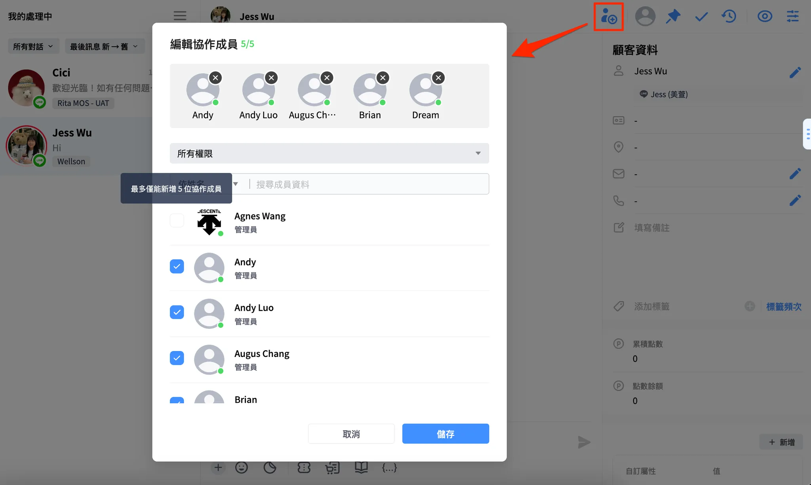

# 協作對話

## 功能說明

經常會需要與多位同事、主管，共同處理客服事件嗎？「協作對話」功能，可以讓你們團隊協作更順利！

對話主要跟進者可以加入多位協作者一起回覆、管理對話；管理員角色也可以於團隊事件中主動加入對話成為協作者。

開通協作對話後，只有對話的跟進者、協作者可以回覆訊息，若主管、同事需要回覆對話，可主動加入協作。


* 網頁後台與 Omnichat App 皆有支援此功能喔！
  * 此項功能會分批開放，可與服務窗口聯繫確認貴團隊此功能的上線時間
  * 使用 OMO 方案的團隊，預計於 Q2 支援此功能
* 適用渠道：WhatsApp、LINE、Facebook、Instagram、Wechat（Webchat預計2025/02上線）
* 每個協作對話中最多只會有 1 位主要跟進者以及最多 5 位協作成員。


## 流程說明

### 1. 新增 / 編輯協作成員

<figure><figcaption>
新增協作者 (Web)
</figcaption></figure> <figure><figcaption>
新增協作者 (App)
</figcaption></figure>

#### 說明

* 在個人對話、協作對話、WhatsApp 群組對話中皆可以新增協作成員。
* 一個對話中最多只能新增 5 位協作人員 (不包含 1 位主要跟進者)。
* 預設狀態 「處理中」：協作對話不會出現在 「待處理」 狀態，即使對話結束後顧客再次發送訊息也會回到跟進者 / 協作者的 「處理中」。


可新增協作者的權限須為對話跟進者或是符合以下其中一個角色的協作：

* 管理員
* 主管
* 客服經理
* 行銷客服


#### 搜尋及篩選

* 支援新增時使用以下 「團隊成員」 資料搜尋：
  * 姓名
  * Email
  * 電話
* 支援新增時依以下 「權限角色」 篩選：
  * 所有權限
  * 管理員
  * 主管
  * 客服經理

#### 紀錄及通知

* &#x20;「對話狀態紀錄」 新增文字，如：Jess 將 Jess A、Jess B 加入了協作對話。

<figure><figcaption>
新增後 「對話狀態紀錄」 新增紀錄
</figcaption></figure>

*   對話中新增 「系統訊息」，如：

    * 新增單人：Jess 加入了協作對話。
    * 單次新增多人：Jess 與其他 4 人加入了協作對話。

    <figure><figcaption>
新增協作者 - 系統通知
</figcaption></figure>
* 被新增的協作者會收到 「即時通知」：Jess (管理員) 將你加入 Jess B 的協作對話。

<figure><figcaption>
新增協作者 - 即時通知
</figcaption></figure>

### 2. 主動加入協作對話

<figure><figcaption>
團隊事件中加入協作對 (Web)
</figcaption></figure> <figure><figcaption>
團隊事件中加入協作對 (App)
</figcaption></figure>

#### 說明

* 未加入協作前，所有角色皆不可回覆訊息。
* 可查看團隊事件的管理員角色可以主動加入協作對話：
  * 管理員
  * 主管
  * 客服經理

#### 紀錄及通知

* &#x20;「對話狀態紀錄」 新增文字，如：Jess 加入了協作對話。
* 對話中新增 「系統訊息」，如：Jess 加入了協作對話。

### 3. 將協作者移出對話

被移出的協作者聊天室畫面會強制關閉 (Ｗeb) 或返回聊天列表 (Mobile)。

<figure><figcaption>
移除協作者 (Web)
</figcaption></figure> <figure><figcaption>
移除協作者 (App)
</figcaption></figure>

#### **說明**

* 對話主要跟進者可以將協作者移出協作對話。
* 管理員角色可以將協作者移出協作對話。
  * 管理員
  * 主管
  * 客服經理
  * 行銷客服

#### 紀錄及通知

* 「對話狀態紀錄」 新增文字，如：
  * 移出單人：Jess 退出了協作對話。
  * 移出多人：Jess 將 Jess A、Jess B 退出了協作對話。
* 對話中新增 「系統訊息」，如：
  * 移出單人：Jess 退出了協作對話。
  * 移出多人：Jess 與其他 4 人退出了協作對話。
* 被移出的協作者會收到 「即時通知」，如：Jess (管理員) 將你退出 customer 的協作對話。

### 4. 主動退出協作對話

<figure><figcaption>
退出協作對話 (Web)
</figcaption></figure> <figure><figcaption>
退出協作對話 (App)
</figcaption></figure>

#### 說明&#x20;

* 協作者可以自行退出協作對話。&#x20;

#### 紀錄及通知&#x20;

* 「對話狀態紀錄」 新增文字，如：：Jess 退出了協作對話。&#x20;
* 對話中新增 「系統訊息」，如：Jess 退出了協作對話。
* 被移出的協作者會收到 「即時通知」，如：已退出 customer 的協作對話。&#x20;

### 5. 跟進協作對話

<figure><figcaption>
跟進協作對話 (Web)
</figcaption></figure> <figure><figcaption>
跟進協作對話 (App)-1
</figcaption></figure> <figure><figcaption>
跟進協作對話 (App)-2
</figcaption></figure>

#### 說明&#x20;

* 需成為協作者且為管理員角色才可以跟進協作對話：
  * 管理員
  * 主管
  * 客服經理
  * 行銷客服
* 跟進後原本的對話主要跟進者會成為協作者。

#### 紀錄及通知&#x20;

* 「對話狀態紀錄」 新增文字，如：Jess 接手跟進了 Jess A 的對話。
* 對話中新增 「系統訊息」，如：Jess 跟進了對話。
* 被移出的協作者會收到 「即時通知」，如：Jess (管理員) 已接手 1 個你的對話。

### 6. 移轉協作對話

#### 移轉協作對話 (Web)

<figure><figcaption>
移轉協作對話
</figcaption></figure> <figure><figcaption>
移轉協作對話-確認提示
</figcaption></figure>

#### 移轉協作對話 (App)

<figure><figcaption>
移轉協作對話
</figcaption></figure> <figure><figcaption>
移轉協作對話-確認提示
</figcaption></figure>

#### 說明&#x20;

* 跟進者：只能移轉給協作成員，無法移轉給其他團隊成員。
* 協作者：不可移轉對話給其他團隊成員。
* 移轉後跟進者會變為協作成員。

#### 紀錄及通知&#x20;

* 「對話狀態紀錄」 新增文字，如：Jess 將對話轉給了 Jess A。
* 對話中新增 「系統訊息」，如：Jess A 跟進了對話。
* 被移出的協作者會收到 「即時通知」，如：Jess (管理員) 已將 1 個對話移轉給你。

#### <mark style="color:red;">不支援</mark>批量動作

<figure><figcaption>
不支援批量動作 (Web)
</figcaption></figure> <figure><figcaption>
不支援批量動作 (App)
</figcaption></figure>

* 因為協作的移轉對象有 僅限協作成員的限制，因此不會有批量移轉功能。
* 進行批量移轉時，會出現提示 「協作對話、群組對話無法批量移轉」。

### 7. 結束協作對話

<figure><figcaption>
結束協作對話 (Web)
</figcaption></figure> <figure><figcaption>
結束協作對話 (App)
</figcaption></figure>

#### 說明&#x20;

* 只有跟進者可以將對話變為已結束，協作者無法結束對話，即使為主管角色。
* 客人再次發送新訊息會到跟進者、協作者的處理中。
* 其他協作者如有同時開啟聊天室會將其關閉。
* 協作對話也可以結束時發送滿意度調查。

#### 紀錄及通知&#x20;

* 「對話狀態紀錄」 新增文字，如：Jess 結束了對話。
* 對話中不會新增 「系統訊息」。
* 被移出的協作者會收到 「即時通知」，如：Jess 已將對話結束。

#### 批量動作

* 協作對話的主要跟進者支援批量結束協作對話。
* 協作者角色因為無法結束對話，因此無法批量結束。會出現提示 「協作者無法結束對話」。

<figure><figcaption>
協作者無法結束對話 (Web)
</figcaption></figure> <figure><figcaption>
協作者無法結束對話 (App)
</figcaption></figure>

### 8. 重啟協作對話

#### 重啟協作對話 (Web)

<figure><figcaption>
直接從對話中重啟
</figcaption></figure> <figure><figcaption>
我的結束事件中重啟
</figcaption></figure>

#### 重啟協作對話 (App)

<figure><figcaption>
直接從對話中重啟
</figcaption></figure> <figure><figcaption>
我的結束事件中重啟
</figcaption></figure>

**說明**

* 對話主要跟進者、協作者皆可以重啟對話。
* 重啟後的對話狀態會到處理中，如果重啟對象是協作者，不會自動由協作者跟進。
* 主管角色可以從團隊已結束中重啟協作對話，但不會自動跟進對話。重啟後需加入協作才可以跟進。

**紀錄及通知**

* 對話狀態新增紀錄：
  * 文字：Jess 重啟了對話。
* 對話中不會顯示系統訊息。

**批量動作**

* 主要跟進者、協作者可以於我的已結束批量重啟對話。
* 單次批量限制：無。

### 9. 搜尋及篩選

<figure><figcaption>
篩選對話類型 (Web)
</figcaption></figure> <figure><figcaption>
篩選對話類型 (App)
</figcaption></figure>

**說明**

* 暫時不支援搜尋。
* 支援使用以下條件篩選：
  * 一般對話
  * 協作對話

**各狀態的篩選條件**

* 待處理：
  * 最後訊息時間排序
  * 超時等候時間排序
* 處理中：
  * 對話類別篩選
  * 最後訊息時間排序
  * 超時等候時間排序
* 已結束：
  * 對話類別篩選

### 10. 對話列表的跟進者、協作者訊息

<figure><figcaption></figcaption></figure>

**說明**

* 對話列表中跟進者頭像新增協作者資訊（游標停在上面顯示）。
* 只支援 Web, Mobile 需點擊進聊天室跟進頭像查看協作名單。

### 11. 未讀訊息

**說明**

* 客人傳送訊息皆會產生一則未讀。
* 跟進者、協作者會有各自的未讀提示。
* 未讀清除邏輯：
  * 管理者、主管、客服經理於 「團隊」 查看協作對話：已讀訊息後不清除其他成員的未讀數。
  * 跟進者、協作者於 「我的」 查看對話：會顯示未讀，已讀後會清除個別未讀數，即使回覆訊息後也只清除個別未讀數，不影響其他人的未讀。


&#x20;1 on 1 對話未讀清除邏輯：

* 我的處理中：查看、回覆會清未讀。
* 團隊處理中：查看不會清未讀，回覆會清除所有人未讀。


### 12. 推播通知

當處理中協作對話中的客人傳送訊息時，主要跟進者、協作者也會收到訊息推播通知。

### 13. 對話釘選

**說明**

* 跟進者與協作者都可以各自釘選 (by 帳號顯示)。
* 跟進者釘選了 A 對話，協作者的 A 對話不會受影響。
* 有釘選的一般對話，變成協作對話依然保留釘選。
* 結束對話之後，釘選會移除。

### 14. 可發送、被動觸發的訊息處理

**說明**

* 比照一般對話、群組對話邏輯處理。
  * 支援（特別列舉較特殊的）：LINE / FB / WhatsApp / IG / Webchat / Wechat
    * 即時/離線訊息（全渠道支援）
    * 滿意度調查（全渠道支援）
    * 全渠道顧客旅程（LINE / FB / WhatsApp / IG）
    * 自動結束對話提醒訊息（LINE / FB / WhatsApp / IG ）
    * 購物車再行銷卡片訊息（LINE / FB / WhatsApp ）
    * LINE LON通知型快捷（限LINE）
    * OMO Live Video（LINE / WhatsApp）
  * 不支援：關鍵字自動指派、歡迎訊息、OMO綁定成功訊息/附加訊息

### 15. 超時等候

* 比照一般對話、群組對話邏輯處理。

### 16. 自動結束協作對話

* 如果店員最後一則回覆時間過了設定的時長時，客人未再回覆，系統會自動結束對話。(現有邏輯)
* 店員最後一則回覆不限於跟進者回，協作者回覆也會計算。

### 17. 設定 > 團隊成員中停用 / 刪除團隊成員

**說明**

* 在設定頁 > 團隊成員，將團隊成員停用後，將其退出身上所有的協作對話。
* 「對話事件狀態」 新增紀錄，如： Jess (停用者) 將 Amy 退出協作對話。

**情境範例**

1. 協作對話只剩一位協作者，停用時，該對話會變為 1 on 1 對話。
2. 協作對話跟進者被停用時，且剩下一名協作者，該對話會變為 1 on 1 對話，會由第一順位協作者作為跟進者。(不一定是最早加入)

### 18. 對話 1.0 顯示協作對話

**說明**

* 在舊版對話中，只要是協作對話就會隱藏，無法查看。
* 管理角色在團隊事件有機會可以點擊到協作對話，點擊後一率會顯示：「舊版對話不支援協作功能，請到對話 2.0 繼續使用。」
