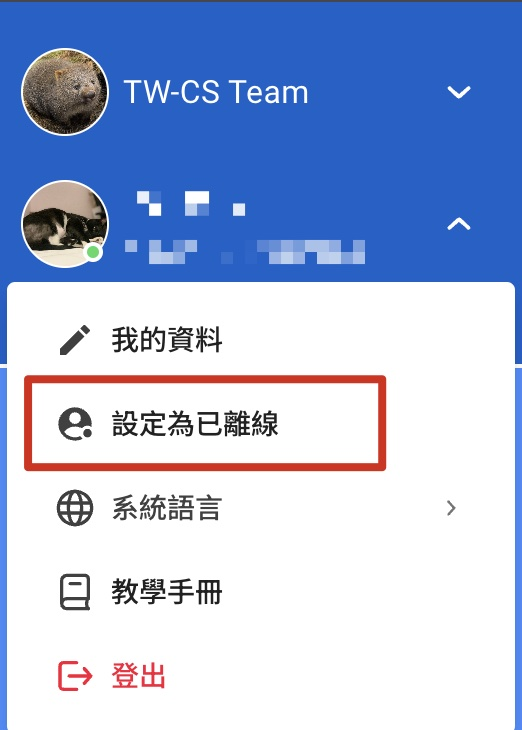
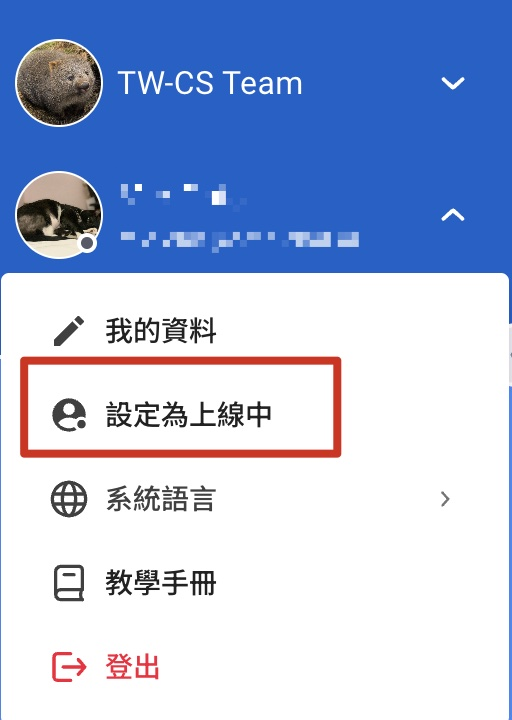
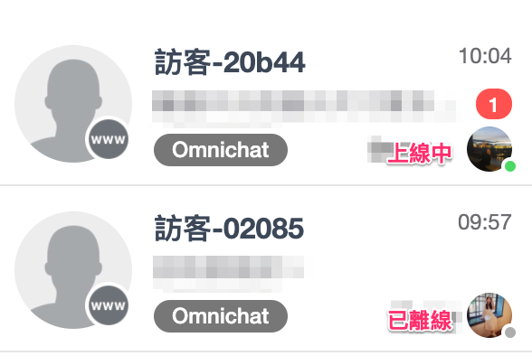
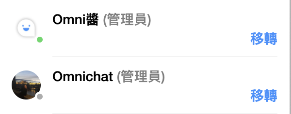

# 上線狀態

## 設定上線狀態

在後台左側選單，可於上方點選頭像後出現個人資料畫面。頭像中綠色點為 「上線中」 狀態；頭像為灰色點為 「已離線」狀態。


**注意：**

* 「上線狀態」是**手動設定**的，**不會**因為團隊成員沒有打開後台或手機APP而自動轉為已離線
* 「上線狀態」只會在後台及手機APP顯示，供團隊內部使用，客人不會看到團隊成員的上線狀態


 <figure><figcaption>
離線狀態顯示為灰色點
</figcaption></figure>

## 上線狀態功用

### 上線狀態顯示

在後台對話頁裡，會有兩個地方顯示團隊成員的上線狀態

1. 「團隊跟進事件」的分頁中，會在團隊成員的大頭貼右下角顯示上線狀態

2\. 在「我的跟進事件」的分頁中，右側的「團隊成員」列表亦會在團隊成員的大頭貼右下角顯示上線狀態；在轉移事件前可以知道團隊成員是否在線上

### 設定為已離線狀態時，將會影響關鍵字自動指派行為

若於 Omnichat 系統後台有使用關鍵字自動指派功能，**於團隊成員狀態設定為已離線時，則關鍵字自動指派功能將會**<mark style="color:red;">**暫停觸發**</mark>，直到該名團隊成員狀態恢復為上線中，才會恢復自動指派運作機制。而在每次手動調整上線狀態，系統也會同步彈出相關顯示提示訊息，團隊可依照成員上、下班時間來做自由運用

<figure><figcaption>
設定狀態為上線中時，彈出的資訊
</figcaption></figure> <figure><figcaption>
設定狀態為已離線時，彈出的資訊
</figcaption></figure>

