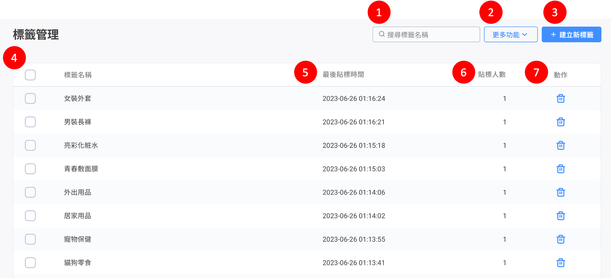
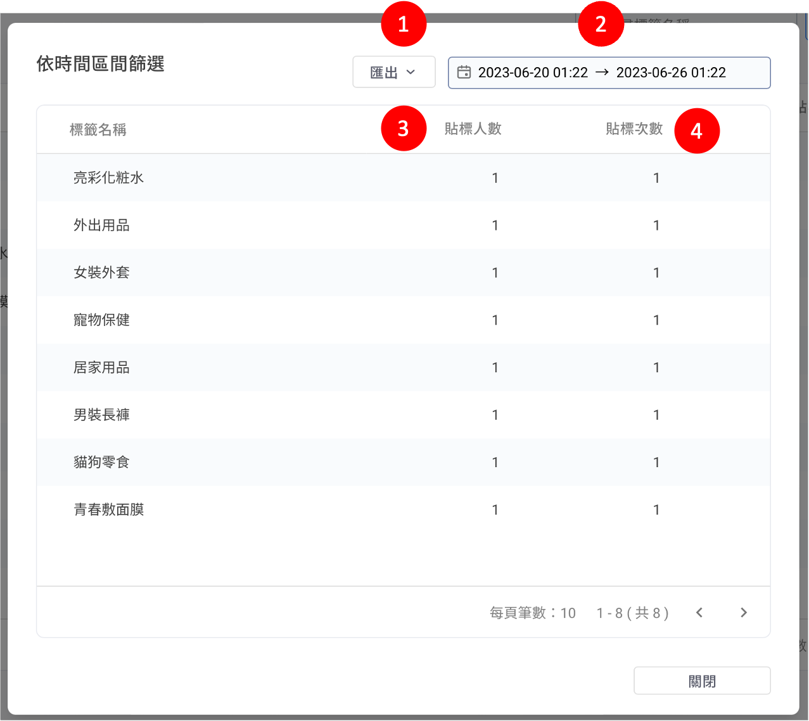
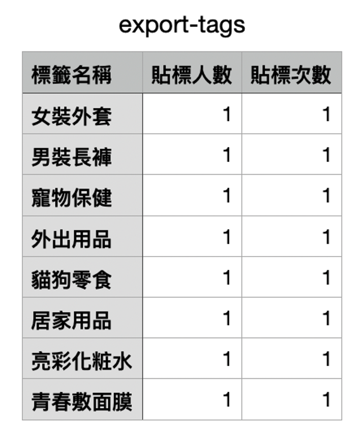
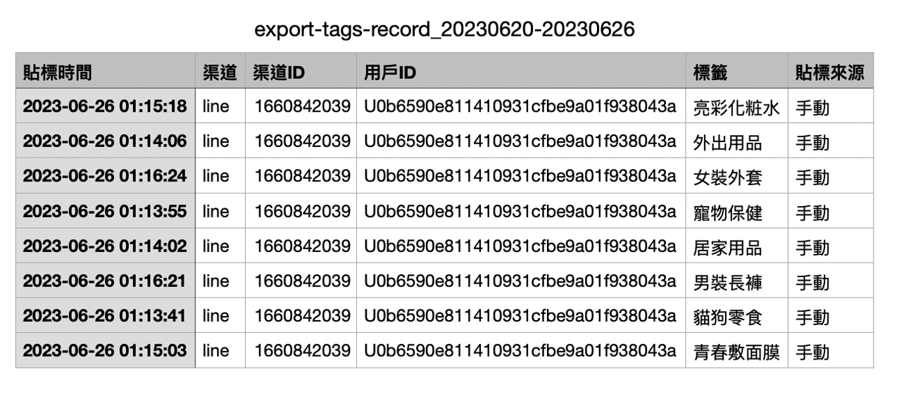

# 標籤管理

## 標籤管理總覽頁面


標籤管理 > 貼標人數，數據每小時更新一次。


<figure><figcaption></figcaption></figure>

1. 搜尋功能：快速尋找已建立的標籤。
2. 更多功能：可執行批量刪除標籤、依照時間區間篩選標籤。
3. 建立新標籤：新增標籤。
4. 勾選特定標籤。
5. 最後貼標時間：最後一次貼上標籤的時間。
6. 貼標人數：被貼上標籤的所有人數（不重複計算）。
7. 動作：刪除已建立的標籤。

## 依時間區間篩選

<figure><figcaption></figcaption></figure>

1. 匯出：可選擇 **貼標統計數據** 或 **貼標逐筆紀錄** 進行資料匯出。
2. 自訂時間區間檢視資料。
3. 貼標人數：被貼上標籤的所有人數（不重複計算）。
4. 貼標次數：被貼上標籤的次數。

### 補充說明：匯出

#### 貼標統計數據


可匯出標籤名稱、貼標人數及貼標次數。（如下圖）


<figure><figcaption></figcaption></figure>

#### 貼標逐筆紀錄


可匯出每筆貼標紀錄，包含：貼標時間、渠道、渠道ID、用戶ID、標籤、貼標來源。（如下圖）


<figure><figcaption></figcaption></figure>
