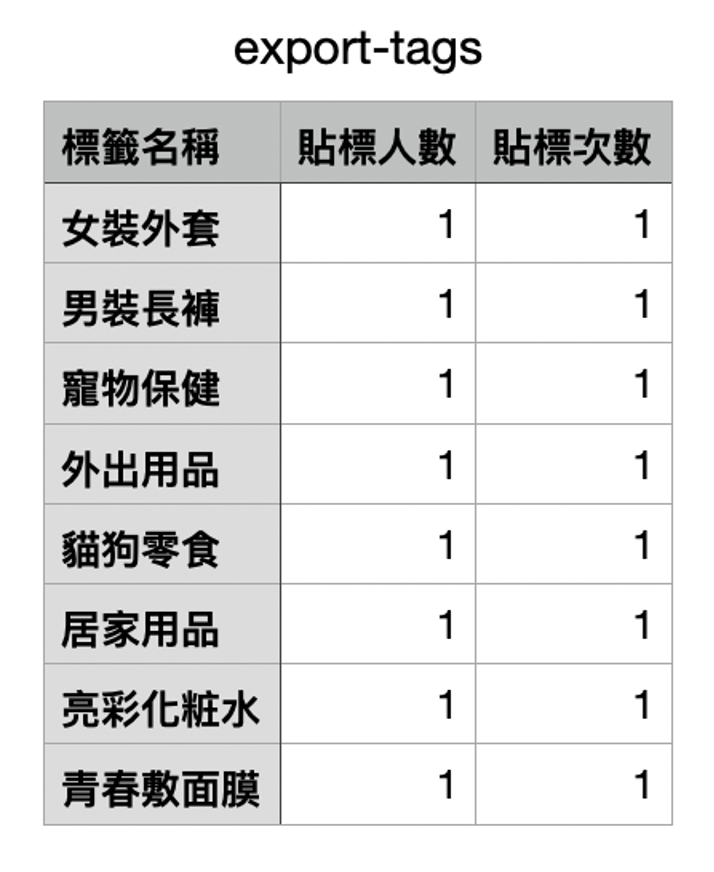
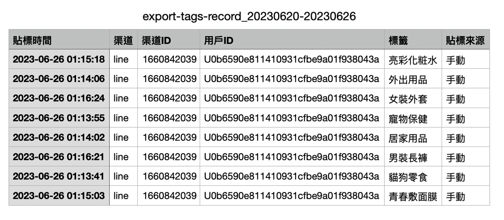

# 標籤


此功能原名稱：標籤管理


## 標籤總覽頁面


標籤 > 貼標人數，數據每小時更新一次。

若在其他行銷功能中新建立標籤（e.g 關鍵字自動回覆、機器人模組、圖文選單等），在建立完畢後，會需要有第一位社群好友被貼標後，才會在標籤頁面出現。


<figure><figcaption></figcaption></figure>

1. 搜尋功能：快速尋找已建立的標籤。
2. 更多功能：可依照時間區間篩選標籤、查詢每日貼標次數、批量刪除標籤。
3. 建立新標籤：新增標籤。
4. 勾選特定標籤。
5. 有效時間：分為「永久」與「限期」兩種，詳細設定請見[下方說明](biao-qian-guan-li.md#biao-qian-de-you-xiao-shi-jian-she-ding)。
6. 最後貼標時間：最後一次貼上標籤的時間。
7. 貼標人數：被貼上標籤的所有人數（不重複計算）。
8. 動作：可編輯標籤的有效時間、刪除已建立的標籤。

## 依時間區間篩選

<figure><figcaption></figcaption></figure>

1.  搜尋標籤名稱：可以輸入字詞搜尋，並從下方清單選擇標籤，也支援同時搜尋最多10筆標籤，輸入完成後需點擊綠色打勾按鈕 ✅。

    <figure><figcaption></figcaption></figure>
2. 自訂時間區間檢視資料。
3. 匯出：可選擇 「**貼標統計數據」** 或 「**貼標逐筆紀錄」** 進行資料匯出，匯出詳細表格資訊請見[下方說明](biao-qian-guan-li.md#hui-chu-de-biao-ge-zi-xun)。
4. 貼標人數：被貼上標籤的所有人數（不重複計算）。
5. 貼標次數：被貼上標籤的次數。

## 每日貼標次數

<figure><figcaption></figcaption></figure>

1. 須先在「搜尋欄位」輸入標籤名稱才會顯示出數據，可以輸入字詞搜尋，並從下方清單選擇標籤，也支援同時搜尋最多10筆標籤，輸入完成後需點擊綠色打勾按鈕 ✅。
2. 可自訂貼標時間區間。

設定好篩選條件後，即可查看數據囉！

<figure><figcaption></figcaption></figure>

## 有效時間設定


訪客貼標不支援標籤時效性的功能

* 訪客定義為：無 社群 / 會員編號 / 電話 / Email 任一資料的 Webchat User


1.  可透過 「新增標籤」 或列表最右側的 「動作」 按鈕編輯標籤的有效時間。

    <figure><figcaption></figcaption></figure>
2.  可設定以下兩種形式：

    * 永久
    * 限期：當聯絡人貼標後到達這個時間點，則會自動刪除這個聯絡人身上的這個標籤的所有貼標紀錄（同樣的標籤被貼上多次，過期時也會全部刪除）。
      * CDP 方案時限最多可設定 365 天
      * 非 CDP 方案時限最多可設定 90 天

    <figure><figcaption></figcaption></figure>
3.  若聯絡人被重複貼上這個標籤，則會重新計算有效時間

    舉例：標籤 Tag\_A 設定有效時間為 30 天

    * 5/20 Mr. Lee 貼了 Tag\_A
      * 此標籤預計於 6/19 UTC+8 23:59 被刪除
    * 6/01 Mr. Lee 再次貼了 Tag\_A
      * 此標籤更新於 7/01 UTC+8 23:59 被刪除
    * 6/28 Mr. Lee 再次貼了 Tag\_A
      * 此標籤更新於 7/28 UTC+8 23:59 被刪除
    * 7/28 UTC+8 23:59 Mr. Lee 身上的 Tag\_A 以及三次的貼標紀錄都移除
4. 支援編輯標籤效期
   * 永久改為限期
     * 須再次貼標才會紀錄預計刪除時間
   * 限期縮短有效時間
     * 若確認時間點 (每天 UTC+8 23:59) 發現此標籤最後貼標時間已超過保留天數，則會進行這個聯絡人身上的這個標籤刪除

### 匯出的表格資訊

#### 貼標統計數據


可匯出標籤名稱、貼標人數及貼標次數。（如下圖）


<figure><figcaption></figcaption></figure>

#### 貼標逐筆紀錄


可匯出每筆貼標紀錄，包含：貼標時間、渠道、渠道ID、用戶ID、標籤、貼標來源。（如下圖）


<figure><figcaption></figcaption></figure>
