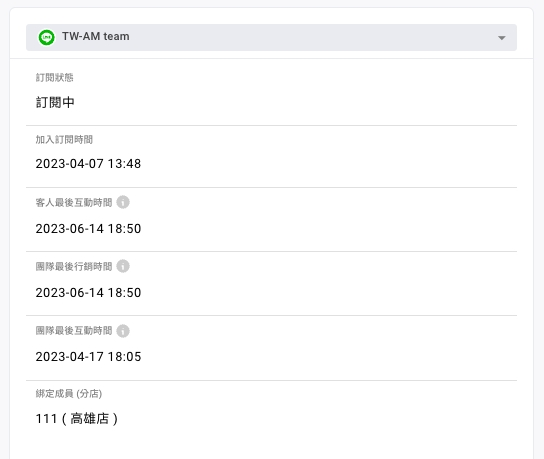
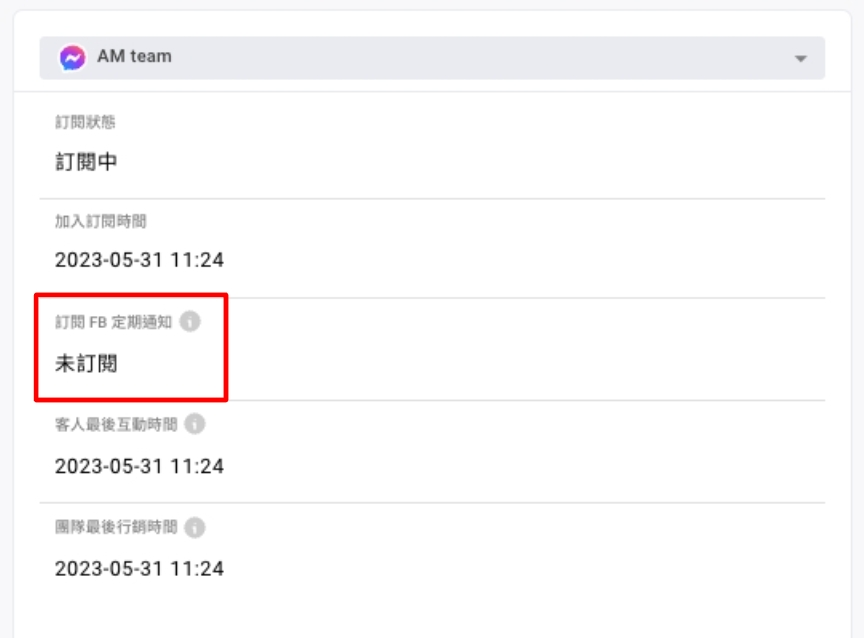
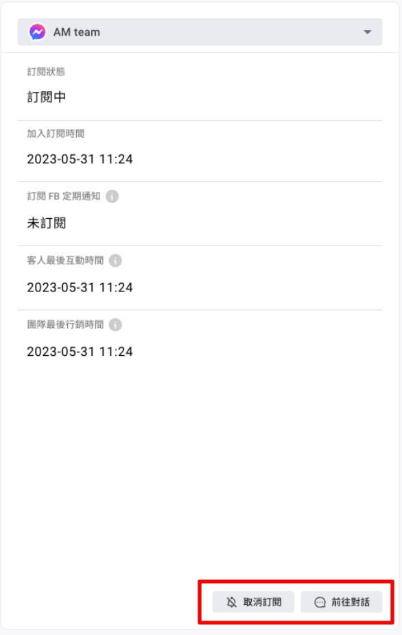

# 顧客管理（Social CDP 方案）

## 顧客介面(1-5)

<figure><figcaption></figcaption></figure>

1. 名單配額使用量：已使用的名單配額量、佔比及剩餘配額數。
2. 整合單一顧客（Omni-customer）的不同渠道，如 Facebook 粉專、LINE 官方帳號、 WhatsApp 號碼、Instagram 帳號、網站。
3. 整合單一顧客（Omni-customer）於不同渠道被貼上的標籤。
4. 整合單一顧客（Omni-customer）於不同渠道蒐集到的自訂屬性。


自訂屬性（Custom Attribute）：為品牌端自定義欄位，可存入資料。


5. 查看詳情：單一顧客（Omni-customer）的360°輪廓。

<figure><figcaption></figcaption></figure>

### （1）基本資料

* 會員編號
* 電話
* Email
* 社群身份綁定：是否有透過「[社群身份綁定按鈕](https://docs.omnichat.ai/features/social-subscriber-integration)」、「[追蹤插件](https://docs.omnichat.ai/features/gou-wu-che-zai-hang-xiao-jia-gou-gong-neng/she-ding-gou-wu-che-zhui-zong-an-niu#she-ding-zhui-zong-an-niu)」或是「[機器人按鈕](https://docs.omnichat.ai/features/marketing/chatbot-builder/ji-qi-ren-bang-ding-zhan-wai-bang-ding)」導回官網完成綁定
* 跨渠道客人最後互動時間：跨渠道客人（Omni-customer）跟您的粉專或官方帳號最後互動時間，例如：發送訊息給您、跟您設計的機器人互動、訂閱您粉專或帳號
* 跨渠道團隊最後行銷時間：購物車再行銷訊息、手動推播皆算在內
* 跨渠道團隊最後互動時間：一對一品牌端客服人員發出

### （2）自訂屬性：單一顧客（Omni-customer）擁有的資料欄位。


將會員相關資料透過 API 整合進入後台 or 機器人互動蒐集。


### （3） 標籤：單一顧客（Omni-customer）擁有的標籤。

### （4）跨渠道聯絡人狀態

#### **介面依篩選渠道呈現**

#### **篩選介面（ LINE ）**

<figure><figcaption></figcaption></figure>

* 訂閱狀態：是否封鎖您的帳號或是粉專&#x20;
* 加入訂閱時間：訂閱或追蹤帳號或是粉專的時間&#x20;
* 客人最後互動時間：聯絡人與您的粉專或官方帳號最後互動時間，例如：發送訊息給您、跟您設計的機器人互動、訂閱您粉專或帳號&#x20;
* 團隊最後行銷時間：購物車再行銷訊息、手動推播皆算在內&#x20;
* 團隊最後互動時間：一對一品牌端客服人員發出&#x20;
* 綁定成員（分店）：聯絡人OMO綁定的成員（分店）

#### **篩選介面（ Facebook ）**&#x20;

<figure><figcaption></figcaption></figure>

訂閱 FB 定期通知：點擊「FB 定期通知按鈕」的聯絡人 （Facebook 限定）

#### 介面右下方

<figure><figcaption></figcaption></figure>

**取消訂閱**：可手動取消該渠道聯絡人以下訂閱

* 推播訊息&#x20;
* 官網顧客行銷推播&#x20;
* 購物車再行銷訊息


不會影響「歡迎訊息」跟「機器人訊息」

取消訂閱也同時會減少「有效聯絡人」的計算


**前往對話**：前往聯絡人的對話事件

## 顧客介面(6-8)

<figure><figcaption></figcaption></figure>

6. 關於匯入聯絡人，請參閱[匯入顧客資料](https://docs.omnichat.ai/features/she-qun-ke-hu-zi-liao-ping-tai/hui-ru-gu-ke-zi-liao)。
7. 匯出：新增不同條件（例如標籤），點選「套用」篩選特定聯絡人，可將 LINE - UID 、 Facebook - PSID、Instagram - IGSID、WhatsApp - 電話號碼匯出為 CSV 檔案。
8. 搜尋：可依照不同條件搜尋出特定單一顧客（Omni-customer）。

<figure><figcaption></figcaption></figure>
