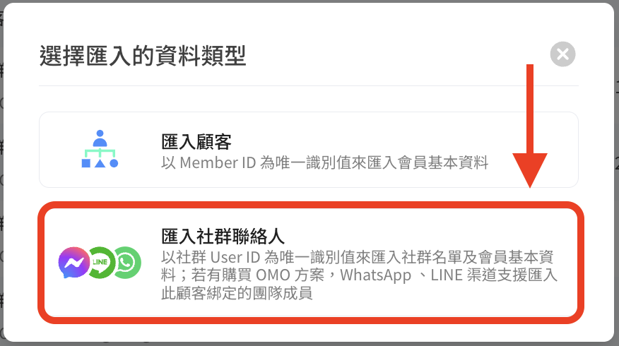
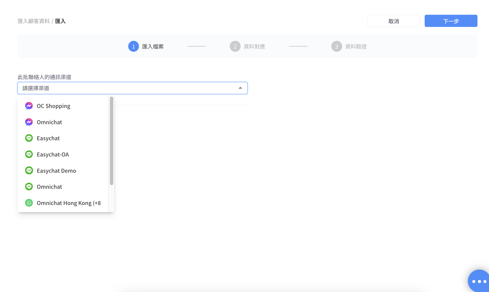
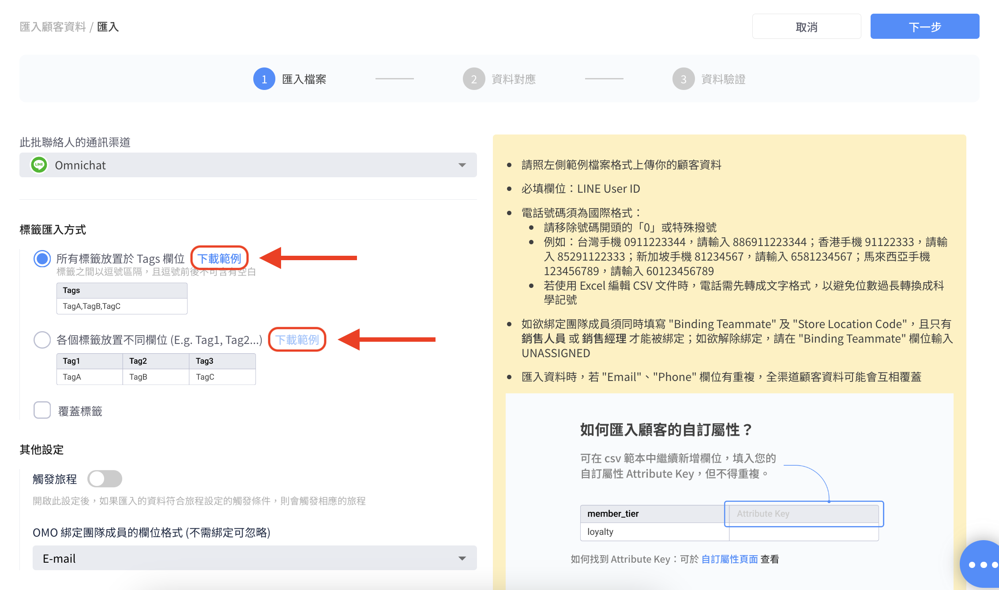
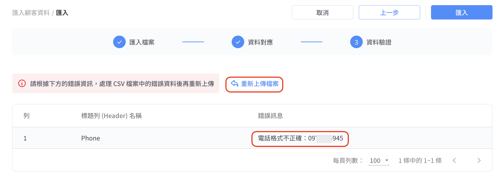

# 匯入社群聯絡人

## 第一步：匯入檔案

**左欄“社群客戶資料平台” > “匯入顧客資料” > 點選右上角的“匯入”**

<figure><figcaption></figcaption></figure>

**選擇“匯入社群聯絡人”**

<figure><figcaption>
選擇匯入社群聯絡人
</figcaption></figure>

先選擇欲匯入的通訊渠道

<figure><figcaption>
先選擇渠道
</figcaption></figure>

**再依照該渠道的標籤匯入方式下載範例檔案**

<figure><figcaption>
<strong>依照該渠道的標籤匯入方式下載範例檔案，需留意覆蓋標籤</strong>
</figcaption></figure>


* CSV 檔案如非為 UTF-8 encoding 版本會呈現亂碼，為避免版本問題，建議您使用 [**Google Sheet**](https://docs.google.com/spreadsheets/) 進行操作。
* **上傳檔案時須留意：**<mark style="color:red;">**勾選「覆蓋標籤」會移除聯絡人原有的所有標籤，並新增匯入的標籤。**</mark>


**如何編輯CSV檔案？**

* <mark style="color:red;">**各渠道的 User ID為必填欄位，以下以Line為例子。**</mark>

<figure><figcaption>
以 LINE 作為範例
</figcaption></figure>

* 電話號碼須為國際格式：
  * 請移除號碼開頭的「0」或特殊撥號
  * 例如：
    * 臺灣手機 0911223344，請輸入 <mark style="color:red;">**886**</mark>911223344；
    * 香港手機 91122333，請輸入 <mark style="color:red;">**852**</mark>91122333；
    * 新加坡手機 81234567，請輸入 <mark style="color:red;">**65**</mark>81234567；
    * 馬來西亞手機 123456789，請輸入 <mark style="color:red;">**60**</mark>123456789
  * 若使用 Excel 編輯 CSV 文件時，電話需先轉成<mark style="color:red;">**文字格式**</mark>，以避免位數過長轉換成科學記號
* 如欲綁定OMO團隊成員須同時填寫 "<mark style="color:blue;">**Binding Teammate**</mark>" 及 "<mark style="color:blue;">**Store Location Code**</mark>"，且只有<mark style="color:blue;">**銷售人員**</mark>或<mark style="color:blue;">**銷售經理**</mark>才能被綁定；如欲解除綁定，請在 "Binding Teammate" 欄位輸入 UNASSIGNED
  * 若需要匯入顧客資料到綁定 OMO 銷售人員或銷售經理，請在 <mark style="color:blue;">**Store Location Code**</mark> 該欄位當中，填入銷售人員或銷售經理的<mark style="color:blue;">**分店編號**</mark>

<figure><figcaption>
OMO綁定成員、分店
</figcaption></figure>

* 匯入資料時，若 "Email", "Phone" 欄位有重複，全渠道顧客資料可能會互相覆蓋

**如何匯入顧客的自訂屬性？**

<figure><figcaption></figcaption></figure>


* 檔案建議小於30MB，超過請分批匯入
* 支援非同步匯入，上傳檔案後，可離開頁面等匯入完成
* 在匯入進行中時，您仍可以上傳其他檔案，並等待排程處理。


## 第二步：資料對應

**將編輯好的CSV檔案拖拉，或者選擇檔案至上傳檔案區，再按下一步**

<figure><figcaption>
上傳檔案後按下一步
</figcaption></figure>

<figure><figcaption>
系統進行資料對應
</figcaption></figure>

## 第三步：資料驗證

**系統進行資料驗證後，如有錯誤資訊則會跳提醒，請求重新上傳檔案**

<figure><figcaption>
如csv檔有錯誤資料，則系統會跳提醒「重新上傳檔案」
</figcaption></figure>

**如果資料正確，即可點選右上角的匯入**

<figure><figcaption>
重新上傳檔案後，如資料皆正確，即可進行匯入
</figcaption></figure>

**資料匯入過程中，若您想要取消匯入，可以在此時取消**

<figure><figcaption>
資料匯入進度
</figcaption></figure>

**您也可以回到列表等待排程，若狀態為「等待中」，可點選動作來取消匯入**

<figure><figcaption>
列表
</figcaption></figure>

<figure><figcaption>
點選動作亦可以取消匯入
</figcaption></figure>

**如果您不打算取消匯入，可繼續等待直至資料匯入完成**

<figure><figcaption>
資料匯入完成
</figcaption></figure>

**以下為成功匯入後的新顧客資料：**

<figure><figcaption>
成功匯入後顧客資料
</figcaption></figure>
