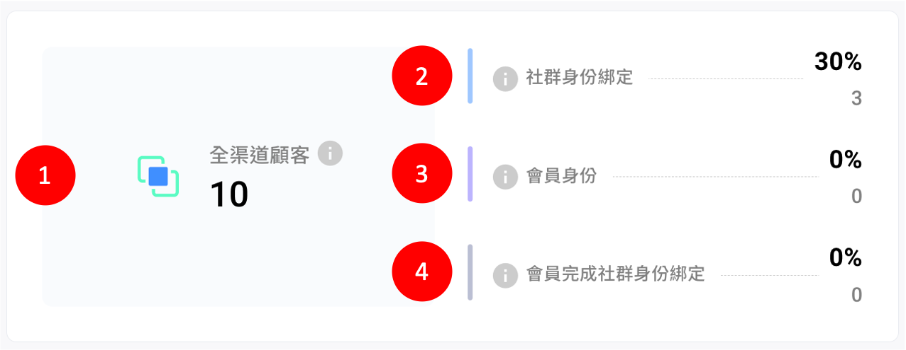
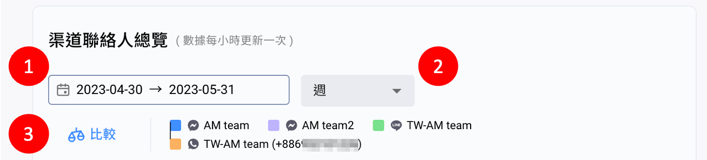
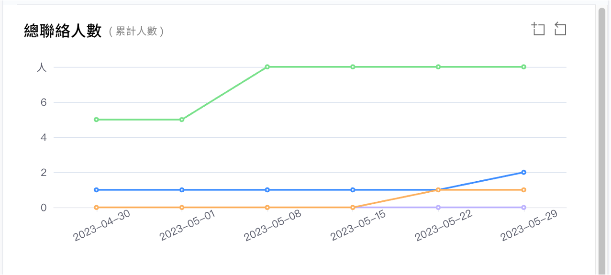
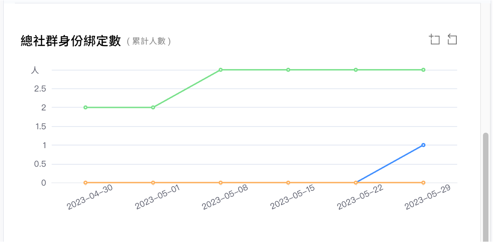
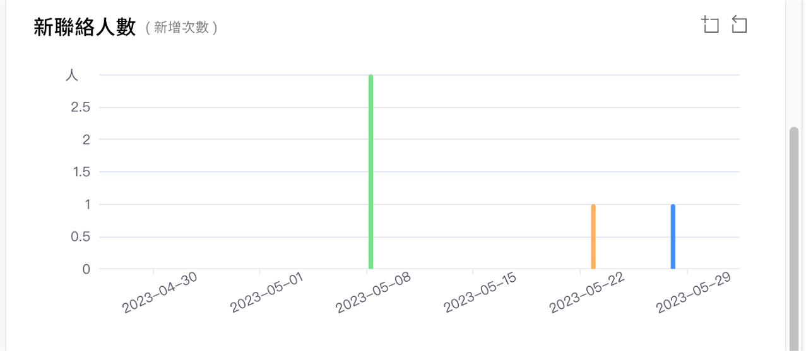
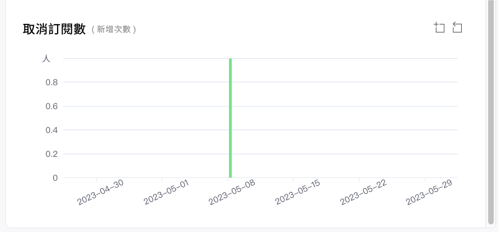
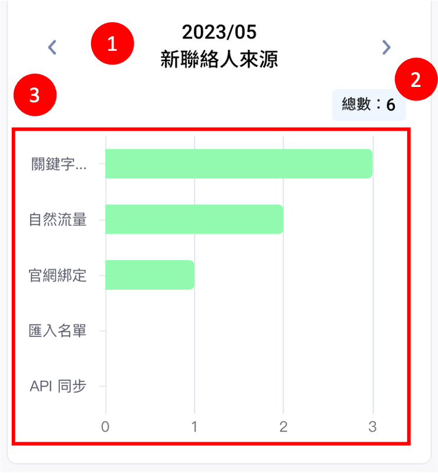
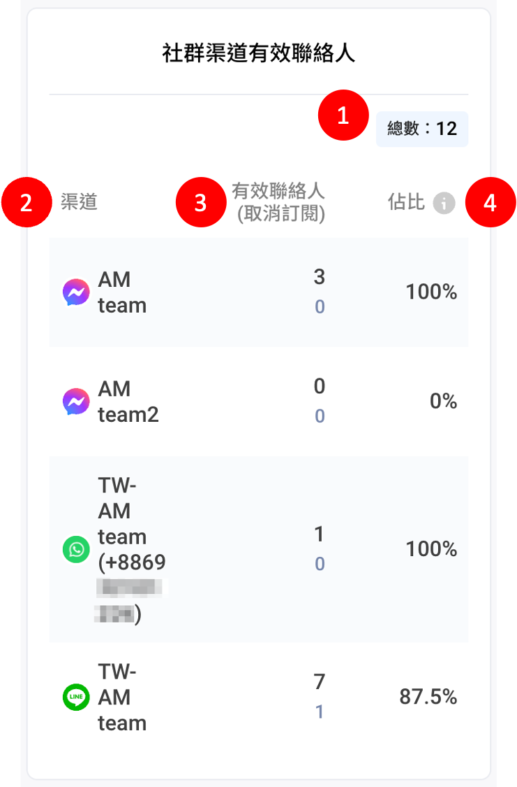

# 全渠道顧客分析（Social CDP 方案）

## 全渠道顧客分析

<figure><figcaption></figcaption></figure>

### 1. 全渠道顧客

定義：整合來自不同渠道相同顧客的數量總計。


全渠道顧客合併時機點：當顧客完成社群身份綁定後，系統將自動合併來自不同渠道的相同顧客身份，合併後的聯絡人總計可視為不重複的顧客數量。


### 2. 社群身份綁定

定義：全渠道顧客中有完成社群身份綁定的顧客數量總計。

佔比公式 ＝ 完成社群身份綁定的顧客數量 / 全渠道顧客數量。


如何完成社群身份綁定？[點擊查看詳細說明](https://docs.omnichat.ai/features/social-subscriber-integration)


### 3. 會員身份

定義：全渠道顧客中有完成官網會員註冊 / 登入的數量總計。

佔比公式 ＝ (完成官網會員註冊 或 登入的顧客數量） / 全渠道顧客數量。

### 4. 會員完成社群身份綁定

定義：顧客註冊/登入官網會員且完成社群身份綁定的數量總計。

佔比公式 ＝ 官網會員完成社群身份綁定數量 / 全渠道顧客數量。

> 同時完成會員註冊以及社群身份綁定的顧客數量越多，除了能夠更精準的辨識顧客跨渠道的身份外，也能更完整的整合顧客線上及線下的購物行為。

## 渠道聯絡人總覽

<figure><figcaption></figcaption></figure>

1. 選擇日期區間。
2. 圖表的時間單位：每週、每月、每年。
3. 比較不同通訊渠道的表現。_（最多同時選取 5 個渠道）_


透過步驟 1 選取想要查看的期間，下方 4 張圖表將會同時調整成選取查看的區間。


### 總聯絡人數

各社群渠道中的聯絡人的數量總計。

<figure><figcaption>
（累計人數）
</figcaption></figure>

### 總社群身份綁定數

各社群渠道中有效聯絡人完成社群身份綁定的人數總計。

<figure><figcaption>
（累計人數）
</figcaption></figure>

### 新聯絡人數

各社群渠道中的新增聯絡人的次數總計。

<figure><figcaption>
（新增次數）
</figcaption></figure>

### 取消訂閱數

各社群渠道中的聯絡人取消訂閱（封鎖）的次數總計。

<figure><figcaption>
（新增次數）
</figcaption></figure>

## 社群身份綁定來源

記錄全渠道顧客完成社群身份綁定的方式與次數。

<figure><figcaption>
（新增次數）
</figcaption></figure>

1. 選擇想要查看的月份。
2. 該月份社群身份綁定新增總次數。
3. 社群綁定插件：透過官網頁面中的社群綁定按鈕完成綁定的顧客數量。
4. 機器人導向官網：透過點擊機器人按鈕完成綁定的顧客數量。
5. 購物車再行銷：透過官網購物車追蹤插件頁面中的按鈕完成綁定的顧客數量。
6. Omnichat Pixel<mark style="color:red;">（WhatsApp 限定）</mark>：當 Pixel 記錄官網有新的會員（電話號碼）時，同時會建立/綁定 WhatsApp 用戶。


1) 如何在官網頁面中設定社群綁定按鈕？\
   [點我看說明](https://docs.omnichat.ai/features/social-subscriber-integration) 👈
2) 如何透過機器人按鈕讓顧客完成社群身份綁定？\
   [點我看說明](https://docs.omnichat.ai/features/marketing/chatbot-builder/ji-qi-ren-bang-ding-zhan-wai-bang-ding) 👈
3) 如何設定官網購物車追蹤插件？\
   [點我看說明](https://docs.omnichat.ai/features/gou-wu-che-zai-hang-xiao-jia-gou-gong-neng/she-ding-gou-wu-che-zhui-zong-an-niu) 👈


## 新聯絡人來源

紀錄顧客透過哪些方式加入社群渠道。

<figure><figcaption>
（新增次數）
</figcaption></figure>

1. 選擇想要查看的月份。
2. 總數：該月份聯絡人新增總次數。
3. 新增來源以及各來源分別的新增聯絡人次數。

<table><thead><tr><th width="298">來源管道類型</th><th>觸發方式</th></tr></thead><tbody><tr><td>匯入名單</td><td><ol><li>聯絡人頁面匯入名單</li><li>CSV 推播</li><li>匯入WhatsApp 對話歷史記錄</li><li>匯入自訂屬性</li><li>91App 匯入 LINE 會員綁定</li></ol></td></tr><tr><td>API 同步</td><td>LINE 好友同步</td></tr><tr><td>手動新增</td><td>手動匯入手機號碼至 WhatsApp 渠道。 <mark style="color:red;">（WhatsApp 渠道限定）</mark></td></tr><tr><td>OMO 綁定</td><td><ol><li>店員 QR Code</li><li>手動新增客戶</li><li>關鍵字自動指派（分店 QR Code / 連結）</li><li>手動移轉</li></ol></td></tr><tr><td>關鍵字自動回覆 / 指派</td><td>透過 關鍵字自動指派/回覆 產出的 QR Code 或連結加入各社群渠道。</td></tr><tr><td>官網綁定</td><td><ol><li>社群綁定按鈕</li><li>機器人按鈕站外綁定</li></ol></td></tr><tr><td>購物車再行銷</td><td>購物車追蹤插件</td></tr><tr><td>IG 貼文回覆</td><td>透過 Instagram 貼文留言自動回覆與品牌進行對話互動。</td></tr><tr><td>FB 貼文回覆</td><td>透過 Facebook 貼文留言自動回覆與品牌進行對話互動。</td></tr><tr><td>FB 定期通知</td><td>透過 Facebook 訂閱定期通知機器人與品牌進行對話互動。</td></tr><tr><td>IG 直播留言回覆</td><td>透過 Instagram 直播留言自動回覆與品牌進行對話互動。</td></tr><tr><td>IG 限動標註</td><td>透過 Instagram 限動標註與品牌進行對話互動。</td></tr><tr><td>IG 限動回覆</td><td>透過 Instagram 限動回覆與品牌進行對話互動。</td></tr><tr><td>FB 廣告（點擊進入 WhatsApp） </td><td>透過 Facebook 發訊廣告加入 WhatsApp 與品牌進行對話互動。</td></tr><tr><td>FB 廣告（點擊進入 Messenger） </td><td>透過 Facebook 發訊廣告進入 Messenger 與品牌進行對話互動。</td></tr><tr><td>優惠券模組</td><td>透過領取優惠券成為新聯絡人。</td></tr><tr><td>遊戲模組</td><td>透過遊戲活動連結成為新聯絡人。</td></tr><tr><td>Pixel</td><td><ol><li>Omnichat pixel 於網站上抓取到 WhatsApp 用戶的電話號碼，自動新增 WhatsApp 用戶。</li><li>將 WhatsApp 串接進 Omnichat 後台，自動將既有 WhatsApp 用戶加入成為新聯絡人。</li></ol>
<mark style="color:red;">（WhatsApp 渠道限定）</mark>
</td></tr><tr><td>91App LINE 會員綁定</td><td>透過 91App LINE 會員綁定加入 LINE 官方帳號的顧客。 <mark style="color:red;">91App 限定）</mark></td></tr><tr><td>自然流量</td><td><ol><li>透過搜尋 LINE 官方帳號加入的好友</li><li>FB 收到新訊息</li><li>WhatsApp 收到新訊息</li><li>IG 收到新訊息</li><li>Wechat 收到新訊息</li></ol></td></tr></tbody></table>

## 社群渠道有效聯絡人

各社群渠道中的有效聯絡人數量與佔比、取消訂閱（封鎖）的人數。

<figure><figcaption>
（社群渠道有效聯絡人數量總覽）
</figcaption></figure>

1. 總數：所有社群渠道的有效聯絡人數量。
2. 渠道：與 Omnichat 後台串接完成的所有社群渠道。
3. 有效聯絡人（取消訂閱）：該社群渠道中的有效聯絡人數量。（該社群渠道中<mark style="color:red;">已封鎖</mark>或<mark style="color:red;">已取消訂閱</mark>的聯絡人數量）
4. 佔比：該社群渠道有效聯絡人數量 / 該社群渠道總聯絡人數量。

