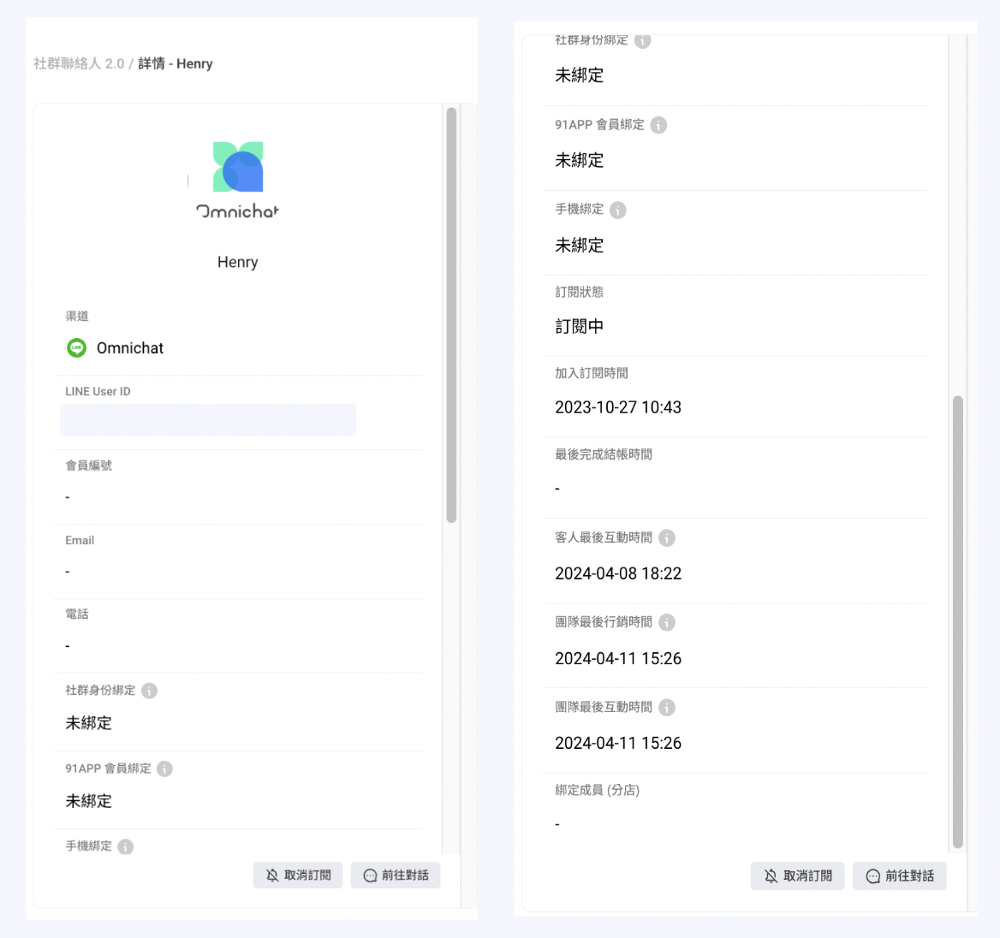

# 社群聯絡人（適用於 Social CDP 方案）

## 社群聯絡人介面介紹（Social CDP 方案限定）

<figure><figcaption></figcaption></figure>

1. 選擇需要檢視或推播的第三方通訊渠道。
2. 各社群渠道有效聯絡人數
3. 社群渠道總人數＝**「訂閱中」** 聯絡人&#x6578;**＋「取消訂閱」** 聯絡人數。
4. 聯絡人資訊
   1. 社群聯絡人頭像
   2. 姓名
   3. 會員編號
   4. Email
   5. 電話
   6. 訂閱狀態／加入訂閱時間
5. 該社群渠道聯絡人被貼上的標籤
6. 自訂屬性：會員相關資料透過 API 整合進入後台 or [機器人互動蒐集](https://docs.omnichat.ai/features/she-qun-ke-hu-zi-liao-ping-tai/zi-ding-shu-xing-jia-gou-gong-neng)料會統一顯示在此欄位
7. 動作
   1. 查看詳情
   2. 前往對話
   3. 取消訂閱
   4. 刪除聯絡人
8. 更多功能

### 關於"動作"

### （1）查看詳情

<figure><figcaption></figcaption></figure>

### 聯絡人資料（LINE）

<figure><figcaption></figcaption></figure>

* 聯絡人所屬社群渠道
* LINE User ID
* 會員編號
* Email
* 電話
* 社群身份綁定：是否有透過「[社群身份綁定按鈕](https://docs.omnichat.ai/features/social-subscriber-integration)」、「[追蹤插件](https://docs.omnichat.ai/features/gou-wu-che-zai-hang-xiao-jia-gou-gong-neng/she-ding-gou-wu-che-zhui-zong-an-niu#she-ding-zhui-zong-an-niu)」或是「[機器人按鈕](https://docs.omnichat.ai/features/marketing/chatbot-builder/ji-qi-ren-bang-ding-zhan-wai-bang-ding)」導回官網完成綁定
* 91 APP 會員綁定：91 APP 開店平台用戶專屬功能
* 手機綁定：客人需完成 「手機綁定[^1]」 後，才能成功於 LINE 上查看個人會員卡資訊。
* 訂閱狀態：會顯示 「訂閱中」 或者 「取消訂閱」
* 加入訂閱時間
* 最後完成結帳時間
* 團隊最後互動時間：由品牌端客服人員發出一對一訊息的最後時間
* 團隊最後行銷時間：購物車再行銷訊息、手動推播的最後時間
* 客人最後互動時間：聯絡人與品牌粉專或官方帳號最後互動時間，例如：客人發送訊息、與品牌設計的機器人互動、訂閱粉專或帳號

### 聯絡人資料（Facebook）

<figure><figcaption></figcaption></figure>

* 聯絡人所屬社群渠道
* FB PSID
* 會員編號
* Email
* 電話
* 社群身份綁定：是否有透過「[社群身份綁定按鈕](https://docs.omnichat.ai/features/social-subscriber-integration)」、「[追蹤插件](https://docs.omnichat.ai/features/gou-wu-che-zai-hang-xiao-jia-gou-gong-neng/she-ding-gou-wu-che-zhui-zong-an-niu#she-ding-zhui-zong-an-niu)」或是「[機器人按鈕](https://docs.omnichat.ai/features/marketing/chatbot-builder/ji-qi-ren-bang-ding-zhan-wai-bang-ding)」導回官網完成綁定
* 訂閱狀態：會顯示 「訂閱中」 或者 「取消訂閱」
* 加入訂閱時間
* 訂閱 FB 定期通知： 關於 [FB 訂閱定期通知](https://docs.omnichat.ai/features/marketing/chatbot-builder/ji-qi-ren-mo-zu-she-ding/facebook-xian-ding-ji-qi-ren#facebook-ding-qi-tong-zhi-ka-pian)
* 最後完成結帳時間
* 團隊最後互動時間：由品牌端客服人員發出一對一訊息的最後時間
* 團隊最後行銷時間：購物車再行銷訊息、手動推播的最後時間
* 客人最後互動時間：聯絡人與品牌粉專或官方帳號最後互動時間，例如：客人發送訊息、與品牌設計的機器人互動、訂閱粉專或帳號

### 聯絡人資料（Instagram）

<figure><figcaption></figcaption></figure>

* 聯絡人所屬社群渠道
* IG SID
* 會員編號
* Email
* 電話
* 社群身份綁定：是否有透過「[社群身份綁定按鈕](https://docs.omnichat.ai/features/social-subscriber-integration)」、「[追蹤插件](https://docs.omnichat.ai/features/gou-wu-che-zai-hang-xiao-jia-gou-gong-neng/she-ding-gou-wu-che-zhui-zong-an-niu#she-ding-zhui-zong-an-niu)」或是「[機器人按鈕](https://docs.omnichat.ai/features/marketing/chatbot-builder/ji-qi-ren-bang-ding-zhan-wai-bang-ding)」導回官網完成綁定
* 訂閱狀態：會顯示 「訂閱中」 或者 「取消訂閱」
* 加入訂閱時間
* 最後完成結帳時間
* 團隊最後互動時間：由品牌端客服人員發出一對一訊息的最後時間
* 團隊最後行銷時間：購物車再行銷訊息、手動推播的最後時間
* 客人最後互動時間：聯絡人與品牌粉專或官方帳號最後互動時間，例如：客人發送訊息、與品牌設計的機器人互動、訂閱粉專或帳號

### 聯絡人資料（WhatsApp）

<figure><figcaption></figcaption></figure>

* 聯絡人所屬社群渠道
* 會員編號
* Email
* 電話
* 社群身份綁定：是否有透過「[社群身份綁定按鈕](https://docs.omnichat.ai/features/social-subscriber-integration)」、「[追蹤插件](https://docs.omnichat.ai/features/gou-wu-che-zai-hang-xiao-jia-gou-gong-neng/she-ding-gou-wu-che-zhui-zong-an-niu#she-ding-zhui-zong-an-niu)」或是「[機器人按鈕](https://docs.omnichat.ai/features/marketing/chatbot-builder/ji-qi-ren-bang-ding-zhan-wai-bang-ding)」導回官網完成綁定
* 訂閱狀態：會顯示 「訂閱中」 或者 「取消訂閱」
* 加入訂閱時間
* 最後完成結帳時間
* 團隊最後互動時間：由品牌端客服人員發出一對一訊息的最後時間
* 團隊最後行銷時間：購物車再行銷訊息、手動推播的最後時間
* 客人最後互動時間：聯絡人與品牌粉專或官方帳號最後互動時間，例如：客人發送訊息、與品牌設計的機器人互動、訂閱粉專或帳號

### 自訂屬性

將會員相關資料透過 API 整合進入後台 or [機器人互動蒐集](https://docs.omnichat.ai/features/she-qun-ke-hu-zi-liao-ping-tai/zi-ding-shu-xing-jia-gou-gong-neng)。

### 標籤

蒐集後的標籤統一顯示在此欄位。

#### 標籤頻次

可在此頁面當中查看自訂區間內，客戶被貼上的標籤次數，並可透過右上角篩選器選擇需要的區間

<figure><figcaption></figcaption></figure>

### （2）前往對話

點撃 “前往對話” 會跳轉到此聯絡人的對話事件。

<figure><figcaption></figcaption></figure>

### （3）取消訂閱

可以手動在後台取消 Facebook、LINE、Instagram 和 WhatsApp 聯絡人的訂閱狀態：

* 推播訊息
* 官網顧客行銷推播
* 購物車再行銷訊息


不會影響 「歡迎訊息」 及 「機器人訊息」 觸發

取消訂閱也同時會減少「有效聯絡人」的計算


<figure><figcaption></figcaption></figure>

### （4） 刪除聯絡人

可以手動在後台，刪除 Facebook、LINE、Instagram、WhatsApp 和網站有效聯絡人。

<figure><figcaption></figcaption></figure>

* 在輸入框輸入大寫英文 「 DELETE 」，然後按下 「確定刪除」 按鈕
* 此動作會永久**刪除聯絡人**在 Omnichat 後台的資料、對話紀錄
* 減少 「有效聯絡人」 的數量
* 請注意這個動作確定送出後，將不可復原

## 關於“更多功能”

<figure><figcaption></figcaption></figure>

### 匯入

關於匯入社群聯絡人，請參閱[匯入社群聯絡人](https://docs.omnichat.ai/features/she-qun-ke-hu-zi-liao-ping-tai/hui-ru-gu-ke-zi-liao/hui-ru-she-qun-lian-luo-ren)或[匯入顧客名單（CDP 方案限定）](https://docs.omnichat.ai/features/she-qun-ke-hu-zi-liao-ping-tai/hui-ru-gu-ke-zi-liao/hui-ru-gu-ke-ming-dan-cdp-fang-an-xian-ding)

### 新增 WhatsApp 聯絡人

1. 選擇需要新增WhatsApp對話的帳號。
2. 輸入姓名。
3. 選擇"國家/地區"，輸入電話號碼後。
4. 新增聯絡人標籤

<figure><figcaption>
新增WhatsApp聯絡人
</figcaption></figure>

### 查看測試名單

<figure><figcaption>
查看測試名單
</figcaption></figure>

您可以先在右上角選擇想要查看的渠道，系統會列出該渠道中的測試名單。

關於要如何新增測試名單，請見下方 「新增至測試名單」 的教學文章。

### 新增至測試名單

新增測試名單教學請點[這裡](https://docs.omnichat.ai/features/tui-bo-2.0/she-ding-xin-tui-bo/testbroadcast#shou-xian-xian-jian-li-ce-shi-ming-dan)。

### 匯出

* 可以將各渠道的用戶 ID 導出為 CSV 檔案
  * LINE - UID
  * Facebook - PSID
  * Instagram - IGSID
  * WhatsApp - 電話號碼
* 若要匯出特定條件的聯絡人，請先使用下方的“[搜尋](she-qun-lian-luo-ren-shi-yong-wu-social-cdp-fang-an.md#guan-wu-sou-xun)”功能，先篩選出特定聯絡人再匯出。
* 若無需篩特定條件的聯絡人，直接選擇"匯出"，即可導出該渠道所有聯絡人資料。


導出資料後續運用可以至 LINE 或 Facebook 成為自訂受眾下廣告。關於 Facebook 後續應用請參考此篇部落格-[【Facebook 廣告受眾設定】鎖定 Messenger 互動粉絲的簡單2方法](https://blog.omnichat.ai/tw/fb-ads-messenger-audience/)


## 關於“搜尋”

可依照不同條件搜尋出特定聯絡人

<figure><figcaption></figcaption></figure>

* **搜尋社群聯絡人姓名：**&#x53EF;用聯絡人的名稱搜尋，須留意，務必輸入**完整姓名**，才可搜尋出來
* 選擇“**新增條件**”來設定篩選條件，**可新增多組條件**篩選特定聯絡人資料。

<figure><figcaption></figcaption></figure>

篩選條件分為[顧客條件](she-qun-lian-luo-ren-shi-yong-wu-social-cdp-fang-an.md#gu-ke-tiao-jian)、[時間相關](she-qun-lian-luo-ren-shi-yong-wu-social-cdp-fang-an.md#shi-jian-xiang-guan)、[互動情形](she-qun-lian-luo-ren-shi-yong-wu-social-cdp-fang-an.md#hu-dong-qing-xing)、[OMO相關](she-qun-lian-luo-ren-shi-yong-wu-social-cdp-fang-an.md#omo-xiang-guan-you-gou-mai-omo-fang-an-cai-hui-xian-shi)（有購買OMO方案才會顯示）。

### 顧客條件

* 標籤：可篩選擁有特定標籤的聯絡人，同時亦可以排除有特定標籤的聯絡人。
* 會員編號（適用於Social CDP 方案）
* 電話（適用於Social CDP 方案）
* Email（適用於Social CDP 方案）
* [自訂屬性](https://docs.omnichat.ai/features/she-qun-ke-hu-zi-liao-ping-tai/zi-ding-shu-xing-jia-gou-gong-neng)
* 超額名單

### 時間相關

* 加入訂閱時間：訂閱或追蹤帳號或是粉專的時間。
* 客人最後互動時間：聯絡人跟您的粉專或官方帳號最後互動時間，例如：發送訊息給您、跟您設計的機器人互動、訂閱您粉專或帳號。
* 團隊最後行銷時間：購物車再行銷訊息、手動推播皆算在內。
* 團隊最後互動時間：一對一品牌端客服人員發出訊息對話。
* 最後完成結帳時間：可設定完成結帳時間之日期區間選擇。

### 互動情形

* 訂閱狀態：是否封鎖您的帳號或是粉專
* 社群身份綁定：是否有透過 「[社群身份綁定按鈕](https://docs.omnichat.ai/features/social-subscriber-integration)」、「[彈出式綁定按鈕](https://docs.omnichat.ai/features/gou-wu-che-zai-hang-xiao-jia-gou-gong-neng/she-ding-gou-wu-che-zhui-zong-an-niu)」 或是 「[機器人按鈕](https://docs.omnichat.ai/features/marketing/chatbot-builder/ji-qi-ren-bang-ding-zhan-wai-bang-ding)」 綁定社群
* 訂閱FB定期通知

### OMO相關（有購買OMO方案才會顯示）

* OMO綁定狀態
* OMO綁定成員
* OMO綁定分店

<figure><figcaption></figcaption></figure>

[^1]: 待 Henry 那part 上線後，會加入 url&#x20;
