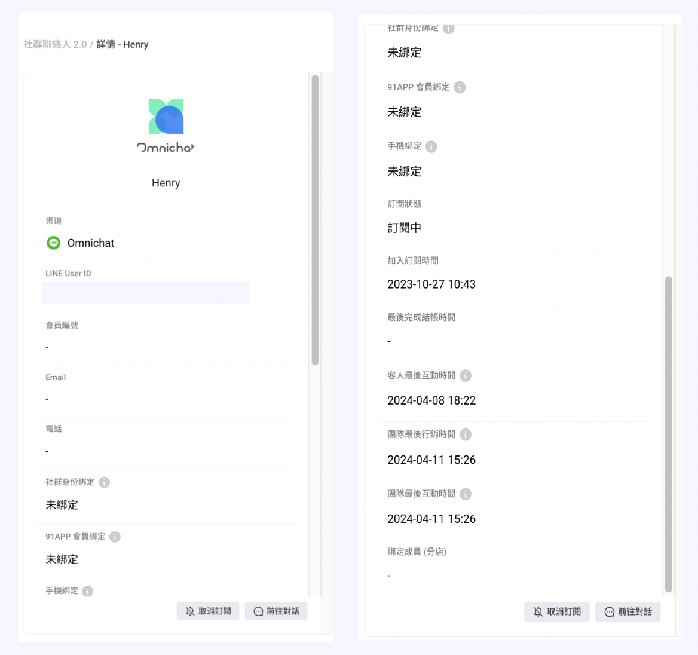
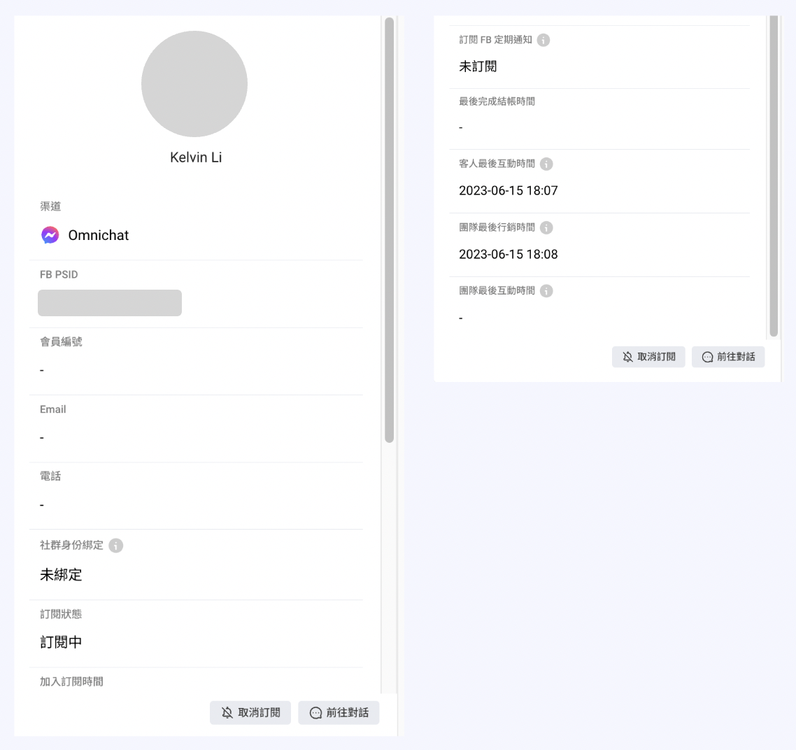
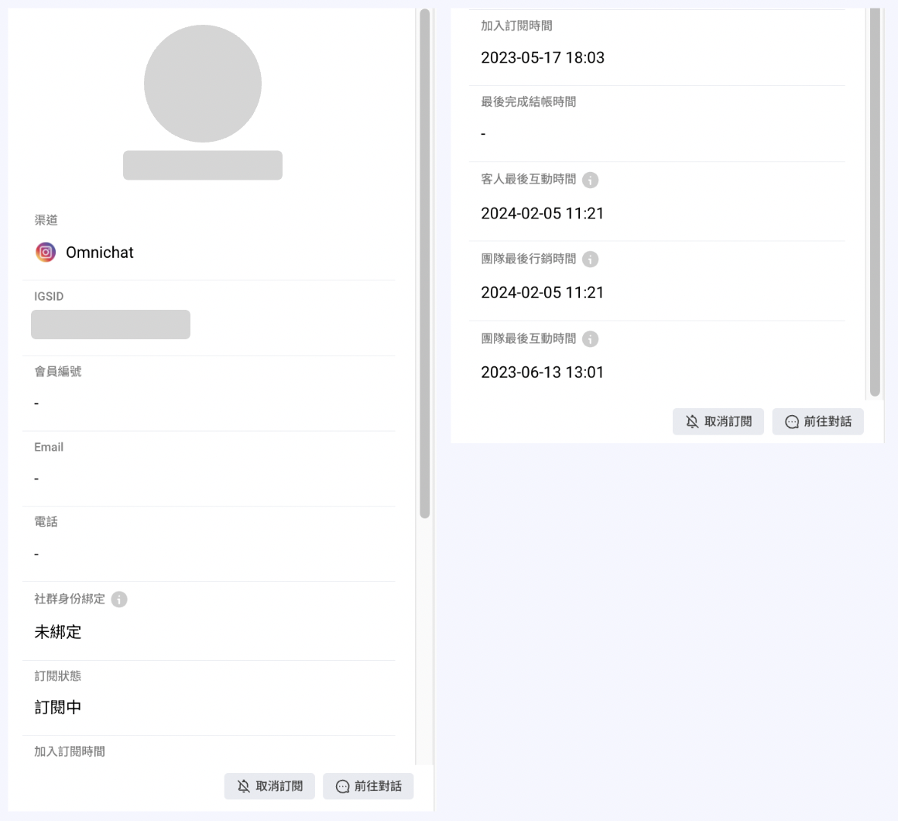
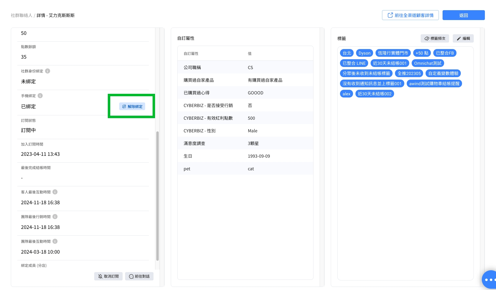

# 渠道聯絡人

此功能原名稱：**社群聯絡人**

## 渠道聯絡人介面介紹(1\~9)

<figure><figcaption></figcaption></figure>

1. 選擇需要檢視的第三方通訊渠道。
2. **各平台人數：**&#x5404;渠道有效聯絡人數，每小時更新。
3. 此渠道人數＝ **「 訂閱中 」** 聯絡人&#x6578;**＋ 「 取消訂閱 」** 聯絡人數。
4. **聯絡人資訊**
   1. 姓名／渠道聯絡人頭像
   2. 會員編號
   3. Email
   4. 電話
   5. 訂閱狀態／加入訂閱時間
5. **標籤：**&#x8A72;渠道聯絡人被貼上的標籤
6. **自訂屬性：**&#x6703;員相關資料透過 API 整合進入後台 or [機器人互動蒐集](https://docs.omnichat.ai/features/she-qun-ke-hu-zi-liao-ping-tai/zi-ding-shu-xing-jia-gou-gong-neng)會統一顯示在此欄位
7. **動作**
   1. **查看詳情**
   2. **前往對話**
   3. **取消訂閱**
   4. **刪除聯絡人：**&#x53EF;以手動在後台，刪除 Facebook、LINE、Instagram、WhatsApp 和網站有效聯絡人。
      1. 在輸入框輸入大寫英文 「 DELETE 」，然後按下 「確定刪除」 按鈕
      2. 此動作會永久**刪除聯絡人**在 Omnichat 後台的資料、對話紀錄
      3. 減少 「有效聯絡人」 的數量
      4. 請注意這個動作確定送出後，將不可復原

<figure><figcaption></figcaption></figure>

8. **搜尋：**&#x53EF;依照不同條件搜尋出特定聯絡人

* **搜尋渠道聯絡人姓名：**&#x53EF;用聯絡人的名稱搜尋，須留意，務必輸入**完整姓名**，才可搜尋出來
*   選擇 「 **新增條件 」** 來設定篩選條件，**可新增多組條件**篩選特定聯絡人資料。

    篩選條件分為[顧客條件](she-qun-lian-luo-ren.md#gu-ke-tiao-jian)、[時間相關](she-qun-lian-luo-ren.md#shi-jian-xiang-guan)、[互動情形](she-qun-lian-luo-ren.md#hu-dong-qing-xing)、[OMO相關](she-qun-lian-luo-ren.md#omo-xiang-guan-you-gou-mai-omo-fang-an-cai-hui-xian-shi)（此功能僅對購買 OMO 方案的用戶顯示）。

    * **顧客條件**
      * 標籤：可篩選擁有特定標籤的聯絡人，同時亦可以排除有特定標籤的聯絡人。
      * 會員編號（適用於Social CDP 方案）
      * 電話（適用於Social CDP 方案）
      * Email（適用於Social CDP 方案）
      * [自訂屬性](https://docs.omnichat.ai/features/she-qun-ke-hu-zi-liao-ping-tai/zi-ding-shu-xing-jia-gou-gong-neng)
      * 超額名單
    * **時間相關**
      * 加入訂閱時間：訂閱或追蹤帳號或是粉專的時間。
      * 客人最後互動時間：聯絡人跟您的粉專或官方帳號最後互動時間，例如：發送訊息給您、跟您設計的機器人互動、訂閱您粉專或帳號。
      * 團隊最後行銷時間：購物車再行銷訊息、手動推播皆算在內。
      * 團隊最後互動時間：一對一品牌端客服人員發出訊息對話。
      * 最後完成結帳時間：可設定完成結帳時間之日期區間選擇。
      * 最後已讀推播時間：已讀／開封推播的時間。
      * 最後點擊推播時間：點擊推播內任一按鈕的時間。
    * **互動情況**
      * 官網綁定
      * 訂閱FB定期通知
      * 已讀推播
      * 點擊推播
    * **OMO相關（此功能僅對購買 OMO 方案的用戶顯示）**
      * OMO綁定狀態
      * OMO綁定成員
      * OMO綁定分店

9. **更多功能**
   1. **匯入：**&#x95DC;於匯入渠道聯絡人，請參閱[匯入渠道聯絡人](https://docs.omnichat.ai/features/she-qun-ke-hu-zi-liao-ping-tai/hui-ru-gu-ke-zi-liao/hui-ru-she-qun-lian-luo-ren)或[匯入顧客名單（CDP 方案限定）](https://docs.omnichat.ai/features/she-qun-ke-hu-zi-liao-ping-tai/hui-ru-gu-ke-zi-liao/hui-ru-gu-ke-ming-dan-cdp-fang-an-xian-ding)
   2.  **新增 WhatsApp 聯絡人：**

       <figure><figcaption>
新增WhatsApp聯絡人
</figcaption></figure>

       1. 選擇需要新增 WhatsApp 對話的帳號
       2. 輸入姓名
       3. 選擇 「 國家/地區 」，輸入電話號碼
       4. 為聯絡人貼上標籤
   3. **查看測試名單：**&#x60A8;可以先在右上角選擇想要查看的渠道，系統會列出該渠道中的測試名單。關於要如何新增測試名單，請見下方 「新增至測試名單」 的教學文章。
   4. **新增至測試名單：**&#x65B0;增測試名單教學請點[這裡](https://docs.omnichat.ai/features/tui-bo-2.0/she-ding-xin-tui-bo/testbroadcast#shou-xian-xian-jian-li-ce-shi-ming-dan)。
   5. **新增／移除標籤**
   6.  **匯出：**

       * 可以將各渠道的用戶 ID 導出為 CSV 檔案
         * LINE - UID
         * Facebook - PSID
         * Instagram - IGSID
         * WhatsApp - 電話號碼
         * 若要匯出特定條件的聯絡人，請先使用下方的 「[搜尋](she-qun-lian-luo-ren.md#guan-wu-sou-xun) 功能，先篩選出特定聯絡人再匯出。
         * 若無需篩特定條件的聯絡人，直接選擇 「匯出」 ，即可導出該渠道所有聯絡人資料。

       #### 匯出資料欄位

       * **預設：**
         * 姓名
         * 該渠道平台的用戶 ID
       * **限定方案或加購將多出：**
         * 標籤
         * 自訂屬性（如有加購該功能即可顯示）
         * 訂閱時間
         * 訂閱狀態
         * 最後互動訊息時間
       * 也支援**匯出會員編號資料（為加購功能）**，在匯出聯絡人時，會同時匯出以下資料：
         * Member ID
         * Email
         * Phone

       
       導出資料後續運用可以至 LINE 或 Facebook 成為自訂受眾下廣告。關於 Facebook 後續應用請參考此篇部落格-[【Facebook 廣告受眾設定】鎖定 Messenger 互動粉絲的簡單2方法](https://blog.omnichat.ai/tw/fb-ads-messenger-audience/)
       

## 動作頁面細節(1\~3)

<figure><figcaption></figcaption></figure>

### 1. 聯絡人資料

*   **聯絡人資料（LINE）**

    
<figure><figcaption></figcaption></figure>

    * 聯絡人所屬渠道
    * LINE User ID
    * 會員編號
    * Email
    * 電話
    * 官網綁定：是否透過 [官網綁定按鈕](https://docs.omnichat.ai/features/social-subscriber-integration) 」、「 [彈出式綁定訊息](https://docs.omnichat.ai/features/gou-wu-che-zai-hang-xiao-jia-gou-gong-neng/she-ding-gou-wu-che-zhui-zong-an-niu#she-ding-zhui-zong-an-niu) 」 或是 「 [機器人按鈕](https://docs.omnichat.ai/features/marketing/chatbot-builder/ji-qi-ren-bang-ding-zhan-wai-bang-ding) 」 導回官網完成綁定
    * 91 APP 會員綁定：91 APP 開店平台用戶專屬功能
    * 手機綁定：客人需完成 「手機綁定[^1]」 後，才能成功於 LINE 上查看個人會員卡資訊。
    * 訂閱狀態：會顯示 「訂閱中」 或者 「取消訂閱」
    * 加入訂閱時間
    * 最後完成結帳時間
    * 團隊最後互動時間：由品牌端客服人員發出一對一訊息的最後時間
    * 團隊最後行銷時間：購物車再行銷訊息、手動推播的最後時間
    * 客人最後互動時間：聯絡人與品牌粉專或官方帳號最後互動時間，例如：客人發送訊息、與品牌設計的機器人互動、訂閱粉專或帳號

*   **聯絡人資料（Facebook）**

    <figure><figcaption></figcaption></figure>

    * 聯絡人所屬渠道
    * FB PSID
    * 會員編號
    * Email
    * 電話
    * 官網綁定：是否透過 「 [官網綁定按鈕](https://docs.omnichat.ai/features/social-subscriber-integration) 」、「 [彈出式綁定訊息](https://docs.omnichat.ai/features/gou-wu-che-zai-hang-xiao-jia-gou-gong-neng/she-ding-gou-wu-che-zhui-zong-an-niu#she-ding-zhui-zong-an-niu) 」 或是 「 [機器人按鈕](https://docs.omnichat.ai/features/marketing/chatbot-builder/ji-qi-ren-bang-ding-zhan-wai-bang-ding) 」 導回官網完成綁定
    * 訂閱狀態：會顯示 「訂閱中」 或者 「取消訂閱」
    * 加入訂閱時間
    * 訂閱 FB 定期通知： 關於 [FB 訂閱定期通知](https://docs.omnichat.ai/features/marketing/chatbot-builder/ji-qi-ren-mo-zu-she-ding/facebook-xian-ding-ji-qi-ren#facebook-ding-qi-tong-zhi-ka-pian)
    * 最後完成結帳時間
    * 團隊最後互動時間：由品牌端客服人員發出一對一訊息的最後時間
    * 團隊最後行銷時間：購物車再行銷訊息、手動推播的最後時間
    * 客人最後互動時間：聯絡人與品牌粉專或官方帳號最後互動時間，例如：客人發送訊息、與品牌設計的機器人互動、訂閱粉專或帳號

*   **聯絡人資料（Instagram）**

    <figure><figcaption></figcaption></figure>

    * 聯絡人所屬渠道
    * IG SID
    * 會員編號
    * Email
    * 電話
    * 官網綁定：是否透過 「 [官網綁定按鈕](https://docs.omnichat.ai/features/social-subscriber-integration) 」、「 [彈出式綁定訊息](https://docs.omnichat.ai/features/gou-wu-che-zai-hang-xiao-jia-gou-gong-neng/she-ding-gou-wu-che-zhui-zong-an-niu#she-ding-zhui-zong-an-niu) 」 或是 「 [機器人按鈕](https://docs.omnichat.ai/features/marketing/chatbot-builder/ji-qi-ren-bang-ding-zhan-wai-bang-ding) 」 導回官網完成綁定
    * 訂閱狀態：會顯示 「訂閱中」 或者 「取消訂閱」
    * 加入訂閱時間
    * 最後完成結帳時間
    * 團隊最後互動時間：由品牌端客服人員發出一對一訊息的最後時間
    * 團隊最後行銷時間：購物車再行銷訊息、手動推播的最後時間
    * 客人最後互動時間：聯絡人與品牌粉專或官方帳號最後互動時間，例如：客人發送訊息、與品牌設計的機器人互動、訂閱粉專或帳號

*   **聯絡人資料（WhatsApp）**

    <figure><figcaption></figcaption></figure>

    * 聯絡人所屬渠道
    * 會員編號
    * Email
    * 電話
    * 官網綁定：是否透過 「 [官網綁定按鈕](https://docs.omnichat.ai/features/social-subscriber-integration) 」、「 [彈出式綁定訊息](https://docs.omnichat.ai/features/gou-wu-che-zai-hang-xiao-jia-gou-gong-neng/she-ding-gou-wu-che-zhui-zong-an-niu#she-ding-zhui-zong-an-niu) 」 或是 「 [機器人按鈕](https://docs.omnichat.ai/features/marketing/chatbot-builder/ji-qi-ren-bang-ding-zhan-wai-bang-ding) 」 導回官網完成綁定
    * 訂閱狀態：會顯示 「訂閱中」 或者 「取消訂閱」
    * 加入訂閱時間
    * 最後完成結帳時間
    * 團隊最後互動時間：由品牌端客服人員發出一對一訊息的最後時間
    * 團隊最後行銷時間：購物車再行銷訊息、手動推播的最後時間
    * 客人最後互動時間：聯絡人與品牌粉專或官方帳號最後互動時間，例如：客人發送訊息、與品牌設計的機器人互動、訂閱粉專或帳號
* **解除手機綁定：**&#x53EF;以手動在渠道聯絡人介面解除聯絡人的手機綁定

<figure><figcaption></figcaption></figure>

<figure><figcaption></figcaption></figure>

* **前往對話：**&#x9EDE;撃 “前往對話” 會跳轉到此聯絡人的對話事件。
*   **取消訂閱：**&#x53EF;以手動在後台取消 Facebook、LINE、Instagram 和 WhatsApp 聯絡人的訂閱狀態：

    * 推播訊息
    * 官網顧客行銷推播
    * 購物車再行銷訊息

    <figure><figcaption></figcaption></figure>


- 取消訂閱不會影響 「 歡迎訊息 」 跟 「 機器人訊息 」 的發送
- 已取消訂閱的聯絡人不屬於 「 有效聯絡人 」&#x20;


### 2. 自訂屬性

會員相關資料透過 API 整合進入後台 or [機器人互動蒐集](https://docs.omnichat.ai/features/she-qun-ke-hu-zi-liao-ping-tai/zi-ding-shu-xing-jia-gou-gong-neng)會統一顯示在此欄位

### 3. 標籤

蒐集後的標籤統一顯示在此欄位。

* **標籤頻次：**&#x53EF;在此頁面當中查看自訂區間內，客戶被貼上的標籤次數，並可透過右上角篩選器選擇需要的區間

<figure><figcaption></figcaption></figure>

[^1]: 待 Henry 那part 上線後，會加入 url&#x20;
