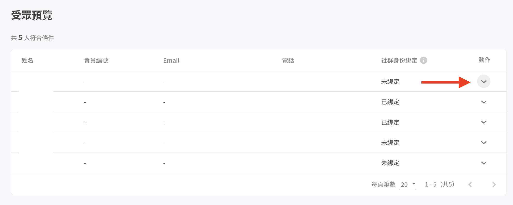

# 受眾管理（加購項目）

* 建立受眾包
* [受眾管理列表](./#shou-zhong-guan-li-lie-biao)
* [如何使用受眾管理功能推播？](./#ru-he-shi-yong-shou-zhong-guan-li-gong-neng-tui-bo)

### 建立受眾包

路徑位於左欄的「社群客戶資料平台」下找到「受眾管理」，在右上角建立受眾包。

<figure><figcaption>
建立受眾包
</figcaption></figure>

#### 設定頁面

<figure><figcaption>
設定頁面
</figcaption></figure>

1. **受眾包名稱：**&#x9810;設格式為「YYYY-MM 新受眾包」，名稱無字數限制，可依照自行需求調整名稱
2. **篩選條件**
   * 通訊渠道，此為必填欄位，請點選需要的社群渠道
   * 新增條件：需至少須設定一個條件
   * 所有條件範圍

<table><thead><tr><th width="239">條件範圍</th><th>條件</th></tr></thead><tbody><tr><td>顧客資料</td><td><ol><li>標籤 </li><li>自訂屬性 </li><li>姓名 </li><li>會員編號 </li><li>電話 </li><li>Email</li></ol></td></tr><tr><td>時間相關</td><td><ol><li>加入訂閱時間</li><li>客人最後互動時間：顧客傳送訊息、與機器人互動、訂閱渠道的互動時間</li><li>團隊最後行銷時間：行銷相關自動推播、群發訊息的時間</li><li>團隊最後互動時間：團隊傳給顧客一對一訊息的時間</li><li>最後完成結帳時間</li></ol></td></tr><tr><td>互動情況</td><td><ol><li>手機綁定</li><li>91APP 會員綁定（使用91App才會顯示）</li><li>社群身份綁定</li><li>訂閱 FB 定期通知</li></ol></td></tr><tr><td>
OMO相關

（使用OMO方案才會顯示）
</td><td><ol><li>OMO 綁定狀態</li><li>OMO 綁定成員</li><li>OMO 綁定分店</li></ol></td></tr></tbody></table>

3. **符合目前條件的顧客數**

* **更新人數**：篩選完條件後系統會重新運算當下符合條件的人數
* **查看名單**：
  * 點擊後預覽受眾名單：顯示對應條件的社群聯絡人資料
  * 名單排序方式：聯絡人最後更新時間由近到遠排序
  * 系統會自動排除超額名單和取消訂閱的聯絡人

點擊「查看名單」或符合條件的人數後，會顯示受眾名單列表，若要查看受眾的詳細資料，可於名單右側欄位點選「動作」。

<figure><figcaption>
點選「動作」即可查看受眾詳細資料
</figcaption></figure>

受眾詳細資料

<figure><figcaption>
受眾詳細資料
</figcaption></figure>

篩選好受眾條件後，點擊右上角的「建立」，接著您可以選擇回到列表頁面，或者以此受眾包立即推播。

<figure><figcaption>
建立成功頁面
</figcaption></figure>

### 受眾管理列表

<figure><figcaption>
列表頁面
</figcaption></figure>

1. 搜尋欄位：可使用關鍵字搜尋受眾包名稱
2. 篩選：篩選各渠道
3. 受眾包名稱：預設排列為由上到下<mark style="color:red;">**依建立時間由近到遠排序**</mark>，再次點擊名稱則會改為由遠到近排序
4. 通訊渠道：Line、Facebook、Instagram、WhatsApp
5. 類型：條件篩選
6. 動作

6.1 **啟用中**

<table><thead><tr><th width="133">渠道</th><th>動作類型</th><th data-hidden></th></tr></thead><tbody><tr><td>Line Facebook WhatsApp</td><td><ol><li>編輯：進入受眾編輯頁</li><li>推播：跳轉至推播設定頁並自動帶入受眾包</li><li>複製：複製受眾包並進入受眾編輯頁</li><li>封存：若受眾包正在使用中將無法封存，若非使用中，將經確認後封存</li></ol></td><td></td></tr><tr><td>Instagram</td><td><ol><li>編輯：進入受眾編輯頁</li><li>複製：複製受眾包並進入受眾編輯頁</li><li>封存：若受眾包正在使用中將無法封存，若非使用中，將經確認後封存</li></ol>
<em><mark style="color:blue;"><strong>＊Instagram 因平台限制故不支援推播功能。未來將有搭配其他行銷情境，請再持續關注 Omnichat 功能更新通知</strong></mark></em>
</td><td></td></tr></tbody></table>

6.2 **封存**

<table><thead><tr><th width="140">渠道</th><th>動作類型</th></tr></thead><tbody><tr><td>Line Facebook WhatsApp Instagram</td><td><ol><li>編輯：進入受眾編輯頁</li><li>啟用：受眾包轉移至「啟用中」</li></ol></td></tr></tbody></table>

7. 建立受眾包：點擊後進入[設定頁面](./#she-ding-ye-mian)

### 如何使用受眾管理功能推播？

教學請見[這裡](https://docs.omnichat.ai/features/tui-bo-2.0/she-ding-xin-tui-bo)。

### 如何將受眾管理的受眾上傳至LINE建立廣告受眾？

[教學請參考下頁說明](jian-li-line-guang-gao-shou-zhong.md)
