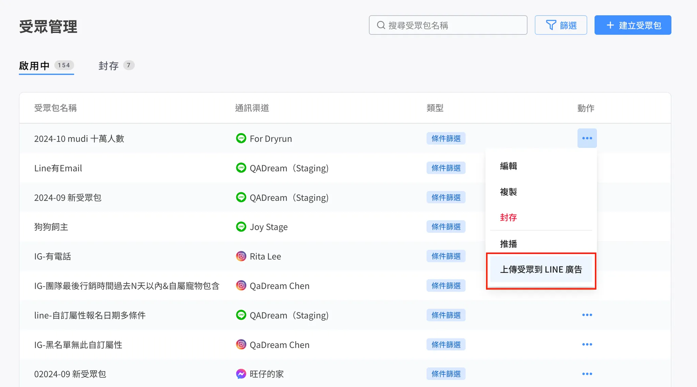

# 建立 LINE 廣告受眾

### **上傳受眾到 LINE 廣告**：

* 上傳限制
  * 受眾包社群渠道須選擇為：LINE
  * 需等待前次受眾上傳完成才可上傳下一個
  * 名單人數最少需有一筆
* 上傳流程：
  1. 點選渠道設定為LINE的受眾包>動作>上傳受眾到LINE廣告
  2. 選擇上傳方式
     * Email
       * 符合目前條件的顧客數 = `Email：有` ＆`訂閱狀態：是` ＆`排除超額名單：是` 的名單
     * 電話
       * 符合目前條件的顧客數：`Phone：有` ＆`訂閱狀態：是` ＆`排除超額名單：是` 的名單
     * LINE User ID
       * 符合目前條件的顧客數：`訂閱狀態：是` ＆`排除超額名單：是` 的名單\

* **設定帳號、受眾名稱**
  * 上傳 Email 或電話號碼
    * 選擇 LINE 廣告帳號
    * 設定 LINE 廣告帳號後台受眾名稱：
      * 預設帶入 Omnichat 受眾包名稱
      * 字數限制 120 字（LINE 後台限制）
  * 上傳 LINE User ID：
    * 顯示 LINE 官方帳號（不可更改）
    * LINE 官方帳號後台受眾名稱：
      * 預設帶入 Omnichat 受眾包名稱
      * 字數限制 120 字（LINE 後台限制）

<figure><figcaption>
上傳受眾到LINE廣告
</figcaption></figure>

<figure><figcaption>
上傳 Email 或電話號碼
</figcaption></figure>

<figure><figcaption>
選擇 LINE 廣告帳號
</figcaption></figure>

<figure><figcaption>
設定 LINE 廣告帳號後台受眾名稱
</figcaption></figure>

LINE 後台顯示該受眾包

* 上傳 Email 或電話號碼
  * 點選路徑：LINE廣告管理員>廣告帳號 > Menu > 受眾

<figure><figcaption>
受眾選擇路徑（推送Email 或 電話）
</figcaption></figure>

上傳 LINE User ID

* 路徑：LINE OA > 資料管理 > 受眾

<figure><figcaption>
受眾選擇路徑（推送LINE User ID）
</figcaption></figure>

