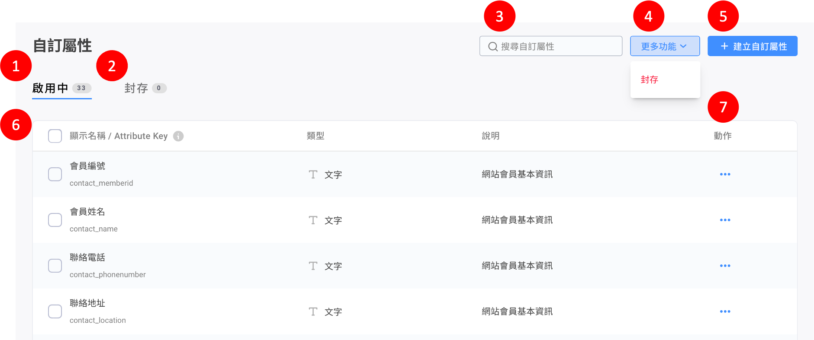
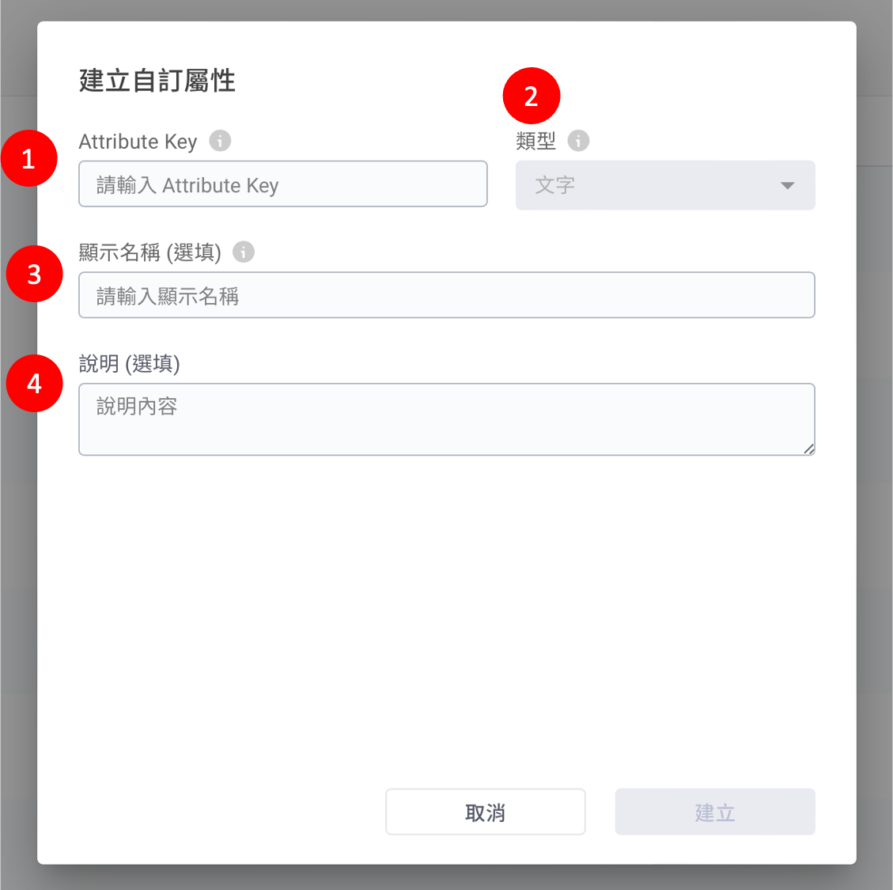

# 自訂屬性（加購功能）

## 自訂屬性總覽頁面

<figure><figcaption></figcaption></figure>

1. 啟用中：正在使用中的自訂屬性列表。
2. 封存：目前已停用的自訂屬性列表。
3. 搜尋功能：輸入顯示名稱或 Attribute Key，快速尋找已建立的自訂屬性。
4. 更多功能：執行批量管理自訂屬性列表，批量動作包含**封存、啟用、刪除**。
5. 建立自訂屬性：新增自訂屬性。
6. 自訂屬性列表。
7. 動作：對該自訂屬性執行不同動作，包含**編輯、封存、啟用、刪除**。

## 建立自訂屬性

<figure><figcaption></figcaption></figure>

1\. Attribute Key：填入會員資料平台的屬性，可能包含英文、數字和底線，不可輸入空格且英文有區分大小寫，例如：member\_points、memberPoints。

2\. 類型：根據要儲存的資料性質而選擇，包含文字、日期、數字、布林值（是與否）。

3\. 顯示名稱：此自訂屬性在 Omnichat 後台的顯示名稱，此為選填欄位，若無填寫則會使用 Attribute Key 顯示。

4\. 說明：可輸入此自訂屬性名稱的用途說明，此為選填欄位，若無填寫則以空白顯示。
