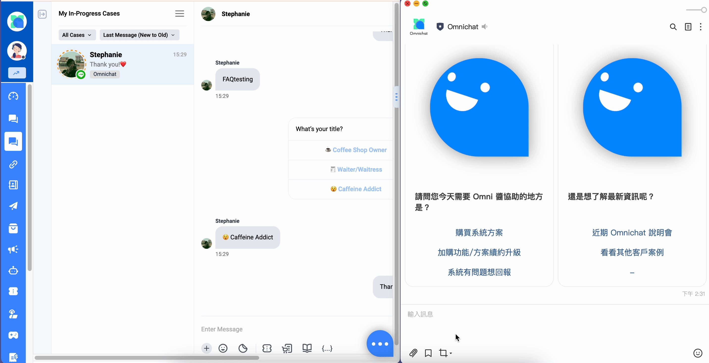

# 自訂屬性（加購功能）

## 用戶輸入建立自訂屬性

<figure><figcaption>
建立自訂屬性
</figcaption></figure>

1. **Attribute Key（必填）：**\
   儲存在社群客戶資料平台的自訂屬性名稱。只可以使用英文、數字和底線，不可輸入空格，且英文有區分大小寫，例如：member\_points、memberPoints。
2. **類型（必選）：**\
   根據要儲存的資料性質而選擇，包含文字、數字、日期、日期與時間、布林值（是與否）。
3. **顯示名稱（選填）：**\
   此自訂屬性在 Omnichat 後台的顯示名稱，此為選填欄位，若沒有填寫則會以 Attribute Key 名稱顯示。
4. **說明（選填）：**\
   可自由輸入此自訂屬性的用途說明，若沒有填寫則以空白顯示。

## 自訂屬性總覽頁面

<figure><figcaption></figcaption></figure>

1. **啟用中：**&#x6B63;在使用中的自訂屬性列表。
2. **封存：**&#x76EE;前已停用的自訂屬性列表。
3. **搜尋功能：**&#x53EF;輸入顯示名稱或 Attribute Key，快速尋找已建立的自訂屬性。
4. **建立自訂屬性：**&#x65B0;增自訂屬性。
5. **動作：**&#x5C0D;該自訂屬性執行不同動作。
   1. 啟用中列表可執行：**編輯、封存**。
   2. 封存列表可執行：**編輯、啟用、刪除**。

## 機器人中的自訂屬性設定

### 網站對話插件、Facebook、LINE 可使用的機器人自訂屬性

* 目前可使用自訂屬性的機器人卡片有以下5種：\
  **文字訊息、輪播訊息、圖片輪播訊息、快速回覆、用入輸入**
* 下圖以**用戶輸入**卡片為例，在卡片按鈕設定中找到 **「 附加動作 」** ，\
  點擊 **「 ＋新增動作 」** → **「 存為自訂屬性 」** ，選擇已建立的自訂屬性，\
  即可紀錄**用戶輸入的內容**到此自訂屬性內。

<figure><figcaption>
舉例：用戶輸入卡片中的自訂屬性設定
</figcaption></figure>

### WhatsApp 可使用的機器人自訂屬性

* 目前可使用自訂屬性的機器人卡片有以下3種：\
  **文字訊息、列表選項、用入輸入**
* 下圖以**選項列表**卡片為例，在卡片按鈕設定中找到 **「 附加動作 」** ，\
  點擊 **「 ＋新增動作 」** → **「 存為自訂屬性 」** ，選擇已建立的自訂屬性，\
  即可紀錄**用戶點選的按鈕**到此自訂屬性內。

<figure><figcaption>
舉例：選項列表卡片中的自訂屬性設定
</figcaption></figure>

***


如客戶重新觸發卡片並填入資料，該資料會覆蓋上一次填寫的資訊儲存到自訂屬性內（以最新填寫的為主）。


## 其他自訂屬性補充

* 自訂屬性也可以在對話右側的顧客資料中查看。

<figure><figcaption>
對話右側顧客資料查看自訂屬性
</figcaption></figure>

* 自訂屬性同步過程（機器人卡片）

<figure><figcaption>
自訂屬性同步過程（機器人卡片）
</figcaption></figure>

* 自訂屬性同步過程（用戶輸入卡片）

<figure><figcaption>
自訂屬性同步過程（用戶輸入卡片）
</figcaption></figure>

***

* 可以使用自訂屬性當作條件來篩選推播受眾進行推播。

<figure><figcaption>
使用自訂屬性條件推播
</figcaption></figure>
