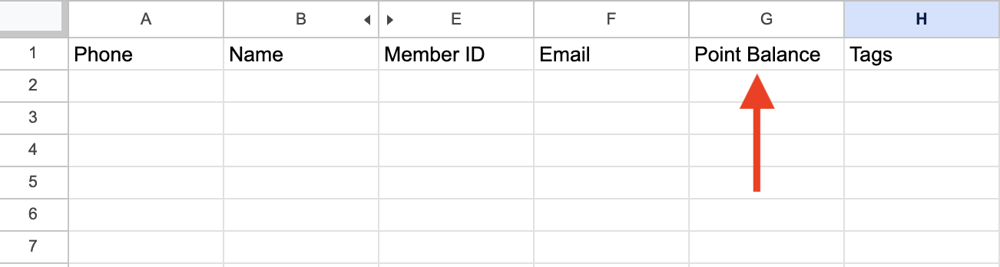

# 點數歷程（加購功能）

* [前置設定：官網消費給點公式](dian-shu-li-cheng-jia-gou-gong-neng.md#qian-zhi-she-ding-guan-wang-xiao-fei-gei-dian-gong-shi)
* [點數定義：點數餘額、累積點數](dian-shu-li-cheng-jia-gou-gong-neng.md#dian-shu-ding-yi-dian-shu-yue-lei-ji-dian-shu)
* [點數增減方式：官網消費、手動匯入名單](dian-shu-li-cheng-jia-gou-gong-neng.md#dian-shu-zeng-jian-fang-shi)
* [應用功能](dian-shu-li-cheng-jia-gou-gong-neng.md#ying-yong-gong-neng)&#x20;

您需要加購點數模組，才能使用點數歷程功能，此功能可以幫助您建立一個跨越官網、門市和社群平台的顧客忠誠度系統。

透過設置點數回饋機制及「點數兌換優惠券」功能，顧客可以在各個渠道累積並兌換點數，進一步鞏固對品牌的忠誠度，並有效提升回購率。


* 顧客資料<mark style="color:red;">**需有電話號碼**</mark>，才可進行集點。
* 目前社群渠道<mark style="color:red;">**僅支援 WhatsApp**</mark>，其他社群開發中，若有興趣使用，請向您的業務窗口聯繫。


### 前置設定：官網消費給點公式

在開啟點數功能前，請先向顧問提供您的點數換算公式：

* 一個團隊僅能提供一種換算方式，例如：$100 = 1 Point 或 $100 = 2 Points。
* 點數會按四捨五入的方式計算，例如：每消費 100 元可以獲得 1 點，若消費 150 元，系統會將 1.5 點四捨五入為 2 點。
* 公式設定後不可更改，且不針對幣別作換算。

### 點數定義：點數餘額、累積點數

* **點數餘額：**&#x6307;顧客目前可以使用的點數，這些點數可能因為兌換優惠券或商品退貨等原因而減少。
* **累積點數：**&#x6307;顧客自第一天以來累積的所有點數總和，不會因為兌換獎勵而減少，可用來評估顧客的價值和忠誠度。

### 點數增減方式

#### 官網消費

透過 Omnichat Pixel 追蹤，依據您提供的[公式](dian-shu-li-cheng-jia-gou-gong-neng.md#qian-zhi-she-ding-guan-wang-xiao-fei-gei-dian-gong-shi)給予點數。

<figure><figcaption>
透過 Pixel 追蹤，根據公式將消費金額換算為點數
</figcaption></figure>

#### 手動匯入名單


僅支援以<mark style="color:red;">**WhatsApp**</mark>為目標渠道<mark style="color:red;">**匯入社群聯絡人**</mark>匯入點數資料。


以下是以[匯入社群聯絡人資料](https://docs.omnichat.ai/features/she-qun-ke-hu-zi-liao-ping-tai/hui-ru-gu-ke-zi-liao/hui-ru-she-qun-lian-luo-ren)進行點數增減的步驟：

1. **匯入檔案**

* 渠道：僅支援透過 WhatsApp 匯入點數，選擇WhatsApp後，才會顯示「一併扣除累積點數」的開關。

<figure><figcaption>
選擇WhatsApp後，才會顯示「一併扣除累積點數」的開關
</figcaption></figure>

* 若有開啟點數功能，下載範例的 CSV 檔會包含「Point Balance」欄位。

<figure><figcaption>
下載範例
</figcaption></figure>

<figure><figcaption>
範例檔會包含「Point Balance」欄位
</figcaption></figure>

2. **資料對應：自動判斷 Point Balance 欄位對應為「增加/扣除點數」：**

* Point Balance 欄位代表此次匯入時要新增或扣除的點數數量。
* 若填寫正數代表新增點數，填寫負數則代表扣除點數，例如，若要增加 5 點，該欄位填寫「5」；若要扣除 5 點，則填寫「-5」。

3. **累積點數變動規則：**

* 新增點數：新增的點數會同時增加於「點數餘額」和「累積點數」。
* 扣除點數：
  * 若開啟「一併扣除累積點數」，扣點時會同時減少「點數餘額」和「累積點數」。
  * 若關閉「一併扣除累積點數」，扣點時只會減少「點數餘額」，不會減少「累積點數」。

### 應用功能

#### 統計表 - 點數歷程

<figure><figcaption></figcaption></figure>

1. 時間搜尋範圍
   * 預設為近 30 天內
   * 最多可搜尋 90 天
2. 關鍵字搜尋範圍
   * 顧客名稱
   * 會員編號
   * Email
   * 電話
3. 異動來源 / 名稱欄位說明：顯示點數更新來源方式有以下四種

| 點數更新來源  | 觸發方式                   |
| ------- | ---------------------- |
| 官網完成訂單  | 官網完成訂單且透過 Pixel 換算點數完成 |
| 兌換優惠券   | 確認扣除點數完成兌換             |
| 全渠道顧客旅程 | 完成觸發點數計算動作節點           |
| 匯入顧客資料  | 成功匯入格式正確之點數資料          |

#### 旅程- 增加/扣除點數餘額節點

<figure><figcaption></figcaption></figure>

* 增加：觸發後增加 **點數餘額**、**累積點數**
* 扣除：觸發後扣除 **點數餘額**（不會扣除累積點數）

#### 優惠券 - 點數兌換功能

<figure><figcaption></figcaption></figure>

1. 須先選擇：行銷類型優惠券
2. 領取設定 - 點數兌換優惠券（Toggle 開啟後展開下方設定）
   1. 兌換後扣除點數：自行輸入任一值
   2. 點數不足訊息：
      * 點數不足時的說明文字
      * 可加入點數餘額變數提供給顧客

#### 機器人卡片 - 條件分流、訊息卡片

1. 條件分流卡片支援根據：**點數餘額**、**累積點數** 分流

<figure><figcaption></figcaption></figure>

2. 訊息卡片支援加入：**點數餘額**、**累積點數** 變數

<figure><figcaption></figcaption></figure>

#### 對話、顧客管理、社群聯絡人查看點數

* 可於以下功能中查詢單一客戶點數餘額、累積點數

<figure><figcaption></figcaption></figure> <figure><figcaption></figcaption></figure> <figure><figcaption></figcaption></figure>

