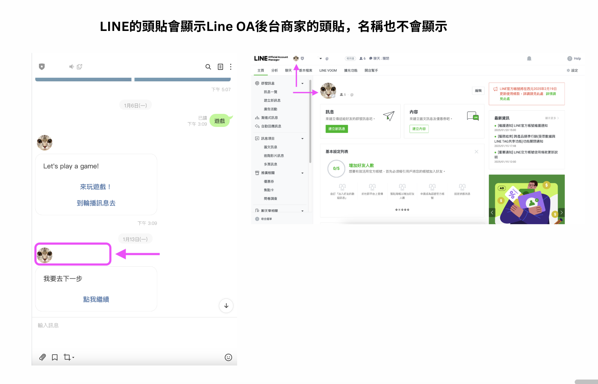
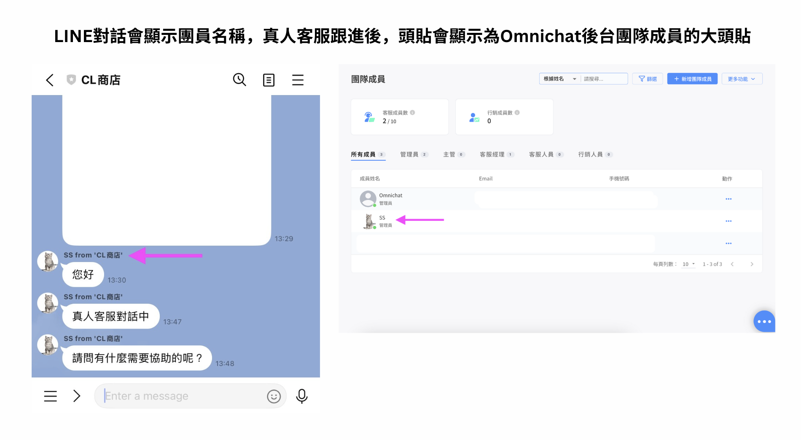

# 顯示團隊成員名稱


LINE 有團隊成員名稱的限制

1. 名稱只能 20 個字
2. 中文 / 英文，每個字都算是一個字

ex. 一二三abc123，這樣是九個字

3. emoji 也會被計算為字元，建議不要放 emoji

ex.   被算成 8 個字

ex.  被算成 2 個字

4. 團隊成員名稱不能包括「LINE」（不區分大小寫）

ex. CS LINE 小編、CS line 小編


<figure><figcaption></figcaption></figure>

<figure><figcaption>
WhatsApp 和 Facebook 畫面
</figcaption></figure>

<figure><figcaption>
LINE ＆ Instagram 畫面
</figcaption></figure>

如果在Omnichat後台選擇不顯示團員名稱，LINE的頭貼會顯示Line OA後台商家的頭貼，名稱也不會顯示。

<figure><figcaption></figcaption></figure>

若在Omnichat後台選擇顯示團員名稱，真人客服跟進對話後，頭貼會顯示為Omnichat後台團隊成員的大頭貼，也會顯示在Omnichat後台設定的名稱。

<figure><figcaption></figcaption></figure>
