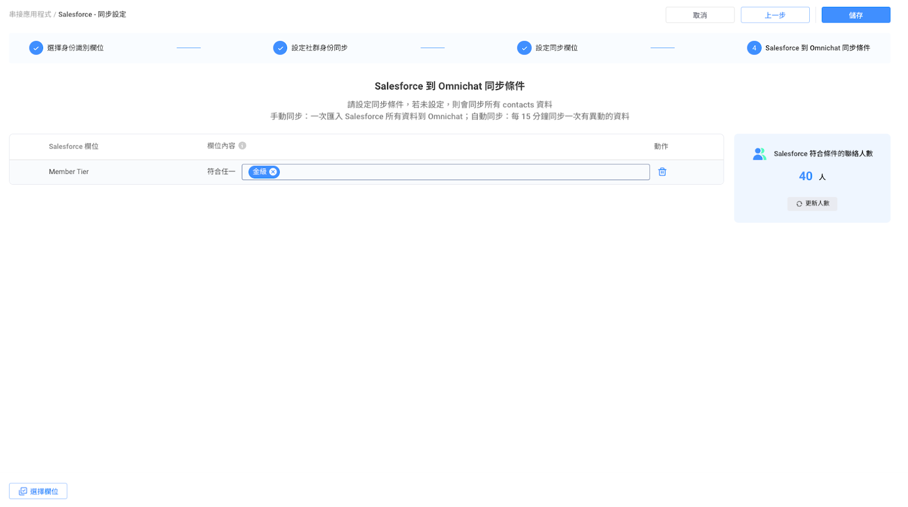

# 串接 Salesforce

需滿足以下方案條件，才可進行 Omnichat 與 Salesforce 聯絡人資料同步。

Omnichat 方案要求：

* 需加購 Salesforce 會員資料整合

Salesforce 方案：

* Professional 須加購 Web Services API 服務
* Enterprise 內含  Web Services API 服務

### 步驟一：開始串接與授權

在 Omnichat 選單中找到串接頁面：「通訊渠道  >  串接應用程式」，並點擊 Salesforce 的串接按鈕。

<figure><figcaption></figcaption></figure>

點選串接後，會跳出說明頁面，可點選下方前往授權開始串接 Salesforce。

<figure><figcaption></figcaption></figure>

點選前往授權後，會開啟 Salesforce 的認證頁面，輸入帳號密碼進行驗證。


```
請使用具備 Salesforce Admin 權限的帳號進行串接
```


<figure><figcaption></figcaption></figure>

授權成功後，回到 Omnichat 後臺繼續後續設定。

<figure><figcaption></figcaption></figure>

### 步驟二、設定身份識別欄位

點擊上個步驟畫面的「開始設定」，後第一步驟是設定身份識別欄位。

#### 選擇身份識別欄位

* 請選擇 Salesforce 資料欄位，並比對到 Omnichat 的會員編號/ 電話/ Email 欄位（擇一）。
* 當 Salesforce 欄位與 Omnichat 欄位資料相符時，視為同一位顧客，可進行資料同步

#### 查無對應聯絡人時的處理方式

Salesforce 同步到 Omnichat 時，若在 Omnichat 查無對應的聯絡人資料，可選擇列下其一處理方式：

* **新增聯絡人**：若選擇此選項，當資料不對應時，系統將自動在 Omnichat 中創建一個新的聯絡人。
* **僅更新現有聯絡人**：選擇此選項將只會更新已經在 Omnichat 中存在的聯絡人資料，而不添加新聯絡人。

Omnichat 同步到 Salesforce 時，若在 Salesforce 查無對應的聯絡人資料，可選擇列下其一處理方式：

* **新增聯絡人**：若選擇此選項，當資料不對應時，系統將自動在 Salesforce 中創建一個新的聯絡人。
* **僅更新現有聯絡人**：選擇此選項將只會更新已經在 Salesforce 中存在的聯絡人資料，而不添加新聯絡人。

<figure><figcaption></figcaption></figure>

### 步驟三、設定社群身份同步

下一步，可以開始設定社群身份同步。若您在 Salesforce 已經儲存顧客的社群 ID（如：Facebook PSID、LINE UID 等），透過社群身份同步，可以在 Omnichat 快速建立社群聯絡人，也可以將透過 Omnichat 管理的社群聯絡人資料，同步至 Salesforce 儲存。&#x20;

<figure><figcaption></figcaption></figure>

Social CDP 方案可設定多組社群身份同步，如需同步多組社群身份，請升級至 Social CDP 方案。

### 步驟四、設定同步欄位

此步驟可設定所有其他欄位的同步，如會員編號和生日等。

前面步驟已經設定的欄位，此步驟不須再設定一次。

同步電話時，Salesforce 的內容須包含國家/地區號碼，如台灣地區須加上 886 在前方，e.g. 886912345678，若格式不正確，將無法進行同步。

<figure><figcaption></figcaption></figure>

### 步驟五、設定同步條件

在此步驟，可以設定要將 Salesforce 聯絡人同步到 Omnichat 的條件，僅對滿足條件的聯絡人進行資料同步。

* 若此頁未設定，則會同步 Salesforce 有身份識別欄位的所有聯絡人
* 若有設定條件，所有條件都符合才會進行同步
* 都設定完成後，可點選右上角的儲存完成同步設定

<figure><figcaption></figcaption></figure>

### 步驟六、設定完成，開始同步

同步設定完成後，若有設定 Salesforce 到 Omnichat 方向的資料同步，會顯示「開始同步」按鈕，按下按鈕可第一次的所有資料同步，後續也會自動每 15 分鐘進行一次異動資料同步。

若僅設定要將 Omnichat 資料同步至 Salesforce，設定完成後就會馬上開始進行異動資料的即時同步。

<figure><figcaption></figcaption></figure>

同步過程中，可關閉視窗背景繼續同步。

<figure><figcaption></figcaption></figure>

### 其他按鈕：查看同步資訊、手動同步、解除串接

* 同步設定完成後，後續可於串接按鈕中，編輯同步資訊、查看同步資訊 及 解除串接
* 同步資訊頁面：
  * Salesforce -> Omnichat 手動同步
  * 可查看同步紀錄（包含 Salesforce -> Omnichat、Omnichat -> Salesforce 與雙向同步） &#x20;

<figure><figcaption></figcaption></figure>
