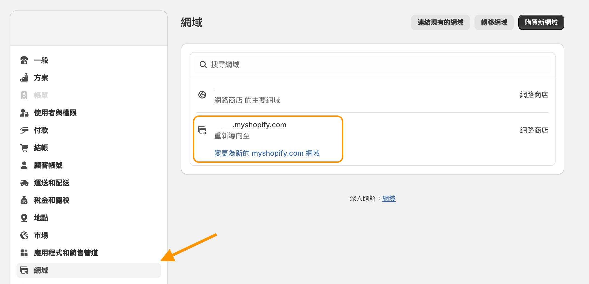

# 串接 Shopify


串接支援情境

* 會員資料同步\
  \- 單次所有會員資料同步\
  \- Webhook 異動即時同步
* 自動新增 WhatsApp 聯絡人


### 步驟一

在 Omnichat 選單中找到串接頁面：「通訊渠道  >  串接應用程式」，並點擊 Shopify 的串接按鈕

<figure><figcaption></figcaption></figure>

### 步驟二


若沒有建立過 shopify app，請繼續往下參考

若已經建立過 shopify app，可以直接前往 [步驟八](chuan-jie-shopify.md#bu-zhou-ba)


回到 Shopify 設定後台，並點擊左下角的 Settings >> Apps and slaes channel&#x20;

<figure><figcaption></figcaption></figure> <figure><figcaption></figcaption></figure>

### 步驟三

點選 Develop apps >> Create an app

<figure><figcaption></figcaption></figure> <figure><figcaption></figcaption></figure>

### 步驟四

替 App 名稱命名，並選擇有權限的帳號後，進入介面點擊 「Configure Admin API scopes」

<figure><figcaption></figcaption></figure>

<figure><figcaption></figcaption></figure>

### 步驟五

授權 API 權限，需要至少授權 「`read_customers」`

Webhook subscriptions 選擇 2024-04 版本

並點擊頁面最下方的 Save 儲存

<figure><figcaption></figcaption></figure>

### 步驟六

點擊 Install app 並同意

<figure><figcaption></figcaption></figure>

### 步驟七

點擊 「Reveal token once」 取得 API access token


此 token 僅可顯示一次，請妥善保存


<figure><figcaption></figcaption></figure>

### 步驟八

複製所有串接資訊至 Omnichat 後台

若需要將 Shopify 的會員手機資料新增為 Omnichat 的 WhatsApp 事件，請將 「自動新增  WhatsApp 聯絡人」 打勾，並選擇要同步的帳號

<figure><figcaption></figcaption></figure>

<figure><figcaption></figcaption></figure>


注意：若您有使用自訂網域，需到 「網域」 頁面，使用預設的商店URL， "必須符合 https://{store\_name}.myshopify.com" 格式，若使用自訂的商店URL，會導致串接失敗。\
\
確認路徑：Shopify設定後台>網域


<figure><figcaption>
確認網域
</figcaption></figure>

### 步驟九

串接成功後，會顯示同步按鈕，點擊 「立即同步」 會立刻執行同步功能

點擊「稍後同步」的話，也可以隨時回來串接應用程式的功能選單再度同步

<figure><figcaption></figcaption></figure>

串接成功後，在應用程式的右側會顯示功能選單

<figure><figcaption>
取得串接資料後的選單畫面
</figcaption></figure>

1. 編輯：可以更改商店的串接資訊
2. 資料同步：除了能再次同步聯絡人資料到最新的狀態外，也可以看到上次同步狀態的資訊
3. 解除串接：若要取得不同商店的聯絡人，可以解除串接後再次串接

### 步驟十

完成同步後，會顯示底下畫面。


同步資訊中，若「新聯絡人同步數量」為 0，代表這次同步的過程中沒有新增加的聯絡人。


<figure><figcaption></figcaption></figure>

### 會員資料同步完成後畫面

若完成同步後，可以到「聯絡人及推播訊息 > 網站」的列表中，找到 Shopify 的客人資料。


會員資料同步包含以下資料

* 姓名、會員編號、Email、電話、標籤
* 自訂屬性：Shopify - 累積訂單數、Shopify - 累積消費金額、Shopify - 備註、Shopify - Email 行銷同意、Shopify - SMS 行銷同意


<figure><figcaption></figcaption></figure>

### 注意事項

1. 若在近期有更新連絡人，但串接後沒有看到聯絡人數量更新，請嘗試解除串接後重新串接。
